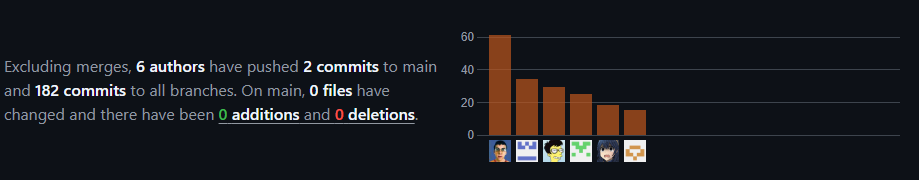



# Universidad Peruana De Ciencias Aplicadas
## 1ASI0572-Desarrollo de Soluciones IOT-2956 - Ingeniería de Software

 </img> 

# "Informe de Trabajo Final"
## Docente: Angel Augusto Velasquez Nuñez
## Startup: CodeMinds
## Producto: EduGo

 

## Relación de integrantes:

* **Angel Antonio Cancho Corilla    U201721995**
* **Juan Diego Cueto Dominguez         U202012207**
* **Xiao Lian Li Zegarra   U202118784**
* **Marcelo Sebastian Ramirez Ramirez    U202210582**
* **Scott Jacobo Huachaca Advincula    U201914294**
* **Paolo Del Carmen Martinez Villanueva    U202010039**

### 2025 - 01

---

 

## Registro de Versiones del Informe

<table>
    <thead>
        <tr>
            <th>Versión</th>
            <th>Fecha</th>
            <th>Autor</th>
            <th>Descripción de Modificación</th>
        </tr>
    </thead>
    <tbody>
        <!-- Fila 1-->
        <tr>
            <td>1.0</td>
            <td>05/04/2025</td>
            <td>Marcelo Ramirez</td>
            <td>Se creó el Repositorio y se añadio archivos para la base del proyecto</td>
        </tr>
         <!-- Fila 2-->
        <tr>
            <td>1.1</td>
            <td>10/04/2025</td>
            <td>Juan Diego Cueto Dominguez</td>
            <td>Se implementó la ramificación del repositorio y adicionó los documentos en su versión inicial previa a la investigación.</td>
        </tr>
         <!-- Fila 3-->
        <tr>
            <td>1.2</td>
            <td>10/04/2025</td>
            <td>Angel</td>
            <td>Se desarrolló el Lean UX Assumptions y Problem Statement.</td>
        </tr>
         <!-- Fila 4-->
        <tr>
            <td>1.3</td>
            <td>10/04/2025</td>
            <td>Juan Diego Cueto Dominguez</td>
            <td>Se realizó la implementación del análisis del problema con 5w2h.</td>
        </tr>
         <!-- Fila 5-->
        <tr>
            <td>1.4</td>
            <td>10/04/2025</td>
            <td>Angel</td>
            <td>Se subió al informe el To-Be Scenario Mapping para los user persona.</td>
        </tr>
         <!-- Fila 6-->
        <tr>
            <td>1.5</td>
            <td>10/04/2025</td>
            <td>Juan Diego Cueto Dominguez</td>
            <td>Se implementaron las tácticas y estrategias frente a competidores.</td>
        </tr>
         <!-- Fila 7-->
        <tr>
            <td>1.6</td>
            <td>10/04/2025</td>
            <td>Paolo</td>
            <td>Se realizó la descripción de la start up y añadió los segmentos objetivos.</td>
        </tr>
         <!-- Fila 8-->
        <tr>
            <td>1.7</td>
            <td>10/04/2025</td>
            <td>Paolo</td>
            <td>Se desarrolló el análisis competitivo.</td>
        </tr>
         <!-- Fila 9-->
        <tr>
            <td>1.8</td>
            <td>11/04/2025</td>
            <td>Marcelo Ramirez</td>
            <td>Se añadio el Lean UX Canvas y el Impact Mapping.</td>
        </tr>
         <!-- Fila 10-->
        <tr>
            <td>1.9</td>
            <td>14/04/2025</td>
            <td>Scott</td>
            <td>Se implementó el as-is scenario mapping y también el user journey mapping.</td>
        </tr>
         <!-- Fila 11-->
        <tr>
            <td>1.10</td>
            <td>14/04/2025</td>
            <td>Lian</td>
            <td>Se añadió los user persona, el lenguaje Ubicuo junto con el task matrix.</td>
        </tr>
         <!-- Fila 12-->
        <tr>
            <td>1.11</td>
            <td>15/04/2025</td>
            <td>Marecelo Ramirez</td>
            <td>Se añadieron los diseños para las entrevistas y el logo de la aplicación.</td>
        </tr>
         <!-- Fila 13-->
        <tr>
            <td>1.12</td>
            <td>19/04/2025</td>
            <td>Juan Diego Cueto Dominguez</td>
            <td>Se implementó la carátula para el reporte, también se añadió user stories junto con sus epics y se organizó el product backlog priorizando las respectivas user stories a implementar.</td>
        </tr>
         <!-- Fila 14-->
        <tr>
            <td>1.13</td>
            <td>23/04/2025</td>
            <td>Angel Cancho</td>
            <td> Se implementó el logo de la aplicación y se añadio todo lo relacionado al event storming con la determinación de los bounded context</td>
        </tr>
         <!-- Fila 15-->
        <tr>
            <td>1.14</td>
            <td>25/04/2025</td>
            <td>Lian</td>
            <td>Se implementó las primeras versiones del diagrama de C4 además de describir y analizar los bounded context del proyecto</td>
        </tr>
         <!-- Fila 16-->
        <tr>
            <td>1.15</td>
            <td>25/04/2025</td>
            <td>Paolo y Lian</td>
            <td> Se añadió el diccionario de clases para las clases de padres y usuarios, también se implementó el diagrama de la base de datos y el identity assignment context</td>
        </tr>
         <!-- Fila 16-->
        <tr>
            <td>1.16</td>
            <td>26/04/2025</td>
            <td>Angel Cancho, Marcelo Ramirez y Scott Huachaca</td>
            <td> Se implementó todo el domain layer y diseños de Analytics, Notification y Vehicle context incluyendo su diccionario de clases y diagrama de base de datos</td>
        </tr>
    </tbody>
</table>

# Project Report Collaboration Insights

 
El presente informe se encuentra guardado en la organización de CodeMinds: [URL del repositorio del informe](https://github.com/Desarrollo-de-Soluciones-IOT-1ASI0572/upc-pre-202510-1asi0572-2510-codeminds-report)  
El landingPage se encuentra guardado en la organización de CodeMinds: [URL del repositorio del LandongPage](https://github.com/Desarrollo-de-Soluciones-IOT-1ASI0572/CodeMinds-LandingPage)  
El FrontEnd informe se encuentra guardado en la organización de CodeMinds: [URL del repositorio del Frontend](https://github.com/Desarrollo-de-Soluciones-IOT-1ASI0572/edugo-web-application)
## Contenido

[Registro de Versiones del Informe](#registro-de-versiones-del-informe)  
[Project Report Collaboration Insights](#project-report-collaboration-insights)  
[Student Outcome 5](#student-outcome-5) 

[Capítulo I: Introducción](#capítulo-i-introducción)

[1.1 Startup Profile](#11-startup-profile)  
[1.1.1. Descripción de la Startup](#111-descripción-de-la-startup)  
[1.1.2. Perfiles de integrantes del equipo](#112-perfiles-de-integrantes-del-equipo)  

[1.2. Solution Profile](#12-solution-profile)  
[1.2.1 Antecedentes y problemática](#121-antecedentes-y-problemática)  
[1.2.2 Lean UX Process.](#122-lean-ux-process)  
[1.2.2.1. Lean UX Problem Statements.](#1221-lean-ux-problem-statements)  
[1.2.2.2. Lean UX Assumptions.](#1222-lean-ux-assumptions)  
[1.2.2.3. Lean UX Hypothesis Statements.](#1223-lean-ux-hypothesis-statements)  
[1.2.2.4. Lean UX Canvas.](#1224-lean-ux-canvas)  

[1.3. Segmentos objetivo.](#13-segmentos-objetivo)  

[Capítulo II: Requirements Elicitation & Analysis](#capítulo-ii-requirements-elicitation--analysis)  

[2.1. Competidores](#21-competidores)  
[2.1.1. Análisis competitivo](#211-análisis-competitivo)  
[2.1.2. Estrategias y tácticas frente a competidores](#211-análisis-competitivo)  

[2.2. Entrevistas](#22-entrevistas)  
[2.2.1. Diseño de entrevistas](#221-diseño-de-entrevistas)  
[2.2.2. Registro de entrevistas](#222-registro-de-entrevistas)  
[2.2.3. Análisis de entrevistas](#223-análisis-de-entrevistas)  

[2.3. Needfinding](#23-needfinding)  
[2.3.1. User Personas](#231-user-personas)  
[2.3.2. User Task Matrix](#232-user-task-matrix)  
[2.3.3. User Journey Mapping](#233-user-journey-mapping)  
[2.3.4. Empathy Mapping](#234-empathy-mapping)  
[2.3.5. As-is Scenario Mapping](#235-as-is-scenario-mapping) 

[2.4. Ubiquitous Language](#24-ubiquitous-language)  

[Capítulo III: Requirements Specification](#capítulo-iii-requirements-specification)  

[3.1. To-Be Scenario Mapping](#31-to-be-scenario-mapping)    
[3.2. User Stories](#32-user-stories)  
[3.3. Impact Mapping](#33-impact-mapping)  
[3.4. Product Backlog](#34-product-backlog)  

[Capítulo IV: Solution Software Design](#capitulo-iv-Solution-Software-Design)

[4.1. Strategic-Level Domain-Driven Design](#41-strategic-level-domain-driven-design)  
[4.1.1. EventStorming](#411-eventstorming)  
[4.1.1.1. Candidate Context Discovery](#4111-candidate-context-discovery)  
[4.1.1.2. Domain Message Flows Modeling](#4112-domain-message-flows-modeling)  
[4.1.1.3. Bounded Context Canvases](#4113-bounded-context-canvases)  
[4.1.2. Context Mapping](#412-context-mapping)  
[4.1.3. Software Architecture](#413-software-architecture)  
[4.1.3.1. Software Architecture System Landscape Diagram](#4131-software-architecture-system-landscape-diagram)  
[4.1.3.2. Software Architecture Context Level Diagrams](#4132-software-architecture-context-level-diagrams)  
[4.1.3.3. Software Architecture Container Level Diagrams](#4133-software-architecture-container-level-diagrams)  
[4.1.3.4. Software Architecture Deployment Diagrams](#4134-software-architecture-deployment-diagrams)  

[4.2. Tactical-Level Domain-Driven Design](#42-tactical-level-domain-driven-design)  
[4.2.X. Bounded Context: <Bounded Context Name>](#42x-bounded-context-bounded-context-name)  
[4.2.X.1. Domain Layer](#42x1-domain-layer)  
[4.2.X.2. Interface Layer](#42x2-interface-layer)  
[4.2.X.3. Application Layer](#42x3-application-layer)  
[4.2.X.4. Infrastructure Layer](#42x4-infrastructure-layer)  
[4.2.X.5. Bounded Context Software Architecture Component Level Diagrams](#42x5-bounded-context-software-architecture-component-level-diagrams)  
[4.2.X.6. Bounded Context Software Architecture Code Level Diagrams](#42x6-bounded-context-software-architecture-code-level-diagrams)  
[4.2.X.6.1. Bounded Context Domain Layer Class Diagrams](#42x61-bounded-context-domain-layer-class-diagrams)  
[4.2.X.6.2. Bounded Context Database Design Diagram](#42x62-bounded-context-database-design-diagram)  

[Capítulo V: Solution UI/UX Design](#capitulo-v-Solution-UI/UX-Design)

[5.1. Style Guidelines](#51-style-guidelines)  
[5.1.1. General Style Guidelines](#511-general-style-guidelines)  
[5.1.2. Web, Mobile and IoT Style Guidelines](#512-web-mobile-and-iot-style-guidelines)  

[5.2. Information Architecture](#52-information-architecture)  
[5.2.1. Organization Systems](#521-organization-systems)  
[5.2.2. Labeling Systems](#522-labeling-systems)  
[5.2.3. SEO Tags and Meta Tags](#523-seo-tags-and-meta-tags)  
[5.2.4. Searching Systems](#524-searching-systems)  
[5.2.5. Navigation Systems](#525-navigation-systems)  

[5.3. Landing Page UI Design](#53-landing-page-ui-design)  
[5.3.1. Landing Page Wireframe](#531-landing-page-wireframe)  
[5.3.2. Landing Page Mock-up](#532-landing-page-mock-up)  

[5.4. Applications UX/UI Design](#54-applications-uxui-design)  
[5.4.1. Applications Wireframes](#541-applications-wireframes)  
[5.4.2. Applications Wireflow Diagrams](#542-applications-wireflow-diagrams)  
[5.4.3. Applications Mock-ups](#543-applications-mock-ups)  
[5.4.4. Applications User Flow Diagrams](#544-applications-user-flow-diagrams)  

[5.5. Applications Prototyping](#55-applications-prototyping)

[Capítulo VI: Product Implementation, Validation & Deployment](#capitulo-vi-Product-Implementation,-Validation-&-Deployment)

[6.1. Software Configuration Management](#61-software-configuration-management)  
[6.1.1. Software Development Environment Configuration](#611-software-development-environment-configuration)  
[6.1.2. Source Code Management](#612-source-code-management)  
[6.1.3. Source Code Style Guide & Conventions](#613-source-code-style-guide--conventions)  
[6.1.4. Software Deployment Configuration](#614-software-deployment-configuration)  

[6.2. Landing Page, Services & Applications Implementation](#62-landing-page-services--applications-implementation)  
[6.2.X. Sprint n](#62x-sprint-n)  
[6.2.X.1. Sprint Planning n](#62x1-sprint-planning-n)  
[6.2.X.2. Aspect Leaders and Collaborators](#62x2-aspect-leaders-and-collaborators)  
[6.2.X.3. Sprint Backlog n](#62x3-sprint-backlog-n)  
[6.2.X.4. Development Evidence for Sprint Review](#62x4-development-evidence-for-sprint-review)  
[6.2.X.5. Testing Suite Evidence for Sprint Review](#62x5-testing-suite-evidence-for-sprint-review)  
[6.2.X.6. Execution Evidence for Sprint Review](#62x6-execution-evidence-for-sprint-review)  
[6.2.X.7. Services Documentation Evidence for Sprint Review](#62x7-services-documentation-evidence-for-sprint-review)  
[6.2.X.8. Software Deployment Evidence for Sprint Review](#62x8-software-deployment-evidence-for-sprint-review)  
[6.2.X.9. Team Collaboration Insights during Sprint](#62x9-team-collaboration-insights-during-sprint)  

[6.3. Validation Interviews](#63-validation-interviews)  
[6.3.1. Diseño de Entrevistas](#631-diseño-de-entrevistas)  
[6.3.2. Registro de Entrevistas](#632-registro-de-entrevistas)  
[6.3.3. Evaluaciones según heurísticas](#633-evaluaciones-según-heurísticas)  

[6.4. Video About-the-Product](#64-video-about-the-product) 

[Conclusiones](#conclusiones)  
[Conclusiones y recomendaciones](#conclusiones-y-recomendaciones)  
[Video About-the-Team](#video-about-the-team)  
[Bibliografía](#bibliografía)  
[Anexos](#anexos) 

# Student Outcome 5

|Criterio Especifico| Acciones Realizadas                                                                                                                                                                                                                                                                                                                                                                                                                                                                                                                                                                                                                                                                                                                                                                                                                                                                                                                                                                                                                                                                                                                                                                                                                                                                                                                                                                                                                                                                                                                                                                                                                                                                                                                                                                                                                                                                                                                                                                                                                                                                                                                                                                                                                                                                                                                                                                                                                                                                                                                                                                                                                                                                                                                                    |Conclusiones|
|-|--------------------------------------------------------------------------------------------------------------------------------------------------------------------------------------------------------------------------------------------------------------------------------------------------------------------------------------------------------------------------------------------------------------------------------------------------------------------------------------------------------------------------------------------------------------------------------------------------------------------------------------------------------------------------------------------------------------------------------------------------------------------------------------------------------------------------------------------------------------------------------------------------------------------------------------------------------------------------------------------------------------------------------------------------------------------------------------------------------------------------------------------------------------------------------------------------------------------------------------------------------------------------------------------------------------------------------------------------------------------------------------------------------------------------------------------------------------------------------------------------------------------------------------------------------------------------------------------------------------------------------------------------------------------------------------------------------------------------------------------------------------------------------------------------------------------------------------------------------------------------------------------------------------------------------------------------------------------------------------------------------------------------------------------------------------------------------------------------------------------------------------------------------------------------------------------------------------------------------------------------------------------------------------------------------------------------------------------------------------------------------------------------------------------------------------------------------------------------------------------------------------------------------------------------------------------------------------------------------------------------------------------------------------------------------------------------------------------------------------------------------|-|
|Trabaja en equipo paraproporcionar liderazgo en forma conjunta.| Marcelo Ramirez:  **TB1:** Durante esta entrega, puedo decir que trabajar en equipo fue clave para proporcionar un liderazgo compartido y efectivo en el proyecto. A lo largo de la planificación, pudimos colaborar estrechamente, aportar nuestras ideas y organizar los "bounded contexts" de manera eficiente, lo que permitió establecer una base sólida para el desarrollo. Este proceso fue fundamental para avanzar de manera conjunta, asegurando que todos los aspectos necesarios estuvieran cubiertos para este primer hito del proyecto final. La experiencia de colaborar de forma conjunta fortaleció nuestras habilidades de trabajo en equipo y comunicación.    Angel Antonio Cancho Corilla: **TB1**: Durante esta entrega, trabajé de manera colaborativa con el equipo, contribuyendo en la organización de tareas y en la toma de decisiones. La comunicación constante y el apoyo mutuo permitieron ejercer un liderazgo compartido y avanzar de forma coordinada en el proyecto.  Juan Diego Cueto Dominguez: **TB1**: Trabajó activamente en equipo proporcionando liderazgo conjunto, apoyando en la organización del repositorio utilizando Git y Gitflow para mantener un flujo de trabajo ordenado y eficiente. Además, colaboró en la gestión del backlog y las user stories, promoviendo la participación de todos los miembros del grupo. Aportó en la toma de decisiones técnicas y en la resolución de dudas, fomentando un ambiente de apoyo y liderazgo compartido.   Xiao Lian Li Zegarra: **TB1**: Durante esta entrega, me enfoqué en colaborar activamente con el equipo, participando en la planificación de tareas. Mi participación se centró en mantener una comunicación clara y proactiva, lo que permitió que las decisiones se tomaran de forma conjunta y que el trabajo avanzara de manera fluida.   Scott Jacobo Huachaca Advincula: **TB1**: Durante esta entrega, trabajé en colaboración con el equipo, contribuyendo en la planificación y desarrollo de diversas actividades. Mi enfoque estuvo en asegurar que las soluciones propuestas fueran coherentes con los objetivos del proyecto, mejorando mis habilidades en análisis y diseño.  Paolo Del Carmen Martinez Villanueva: **TB1:** Durante el desarrollo del proyecto, he investigado y aplicado principios éticos y profesionales, asegurando que el software respete la privacidad de los usuarios, promueva la equidad en el acceso y minimice riesgos potenciales derivados de su uso.                                                                                                                                                                                            |**TB1:** En esta primera entrega del proyecto, el trabajo en equipo y la colaboración fueron fundamentales para avanzar de manera eficiente. La comunicación constante y el liderazgo compartido permitieron una organización adecuada de las tareas y la toma de decisiones de forma coordinada. Además, se puso énfasis en establecer una base sólida desde la planificación, abordando los "bounded contexts" de manera eficiente para garantizar que todos los aspectos del proyecto fueran cubiertos. La participación activa de todos los miembros fortaleció tanto las habilidades de trabajo en equipo como la toma de decisiones conjunta. Además, se priorizó la aplicación de principios éticos y profesionales, garantizando que el desarrollo del software fuera responsable y respetuoso con la privacidad y equidad de los usuarios. En resumen, esta fase del proyecto ha sido clave para sentar las bases de un desarrollo colaborativo y ético.|
|Crea un entorno colaborativo einclusivo, establece metas,planifica tareas y cumple objetivos.| Marcelo Ramirez:  **TB1:** Durante el proyecto, he comprendido la importancia de crear un entorno colaborativo e inclusivo dentro del equipo. Establecer metas claras y planificar las tareas de manera efectiva ha sido esencial para asegurar el cumplimiento de los objetivos. Durante el proyecto, me di cuenta de que la comunicación abierta y el respeto por las ideas de todos son claves para un trabajo exitoso. Esta experiencia me ha permitido mejorar mi capacidad para planificar, coordinar tareas y asegurar que todos los miembros del equipo estén alineados y motivados para alcanzar las metas propuestas..    Angel Antonio Cancho Corilla: **TB1**: En esta etapa, me enfoqué en fomentar un entorno de colaboración dentro del equipo, asegurando que todos los miembros pudieran aportar sus ideas. Establecimos metas claras y planificamos nuestras tareas de forma ordenada, lo que nos permitió avanzar hacia el cumplimiento de los objetivos del proyecto.   Juan Diego Cueto Dominguez: **TB1**: Contribuyó a la creación de un entorno colaborativo e inclusivo al ayudar en la definición de los bounded contexts del proyecto, asegurando que todos los miembros comprendieran su rol dentro de la arquitectura. Participó en la planificación de tareas mediante el manejo de user stories y backlog, estableciendo metas claras y apoyando el cumplimiento de los objetivos del equipo. También brindó asistencia constante para resolver dudas técnicas, promoviendo la inclusión y el aprendizaje colectivo.   Xiao Lian Li Zegarra: **TB1**:  Durante esta etapa del proyecto, me enfoqué en fomentar una comunicación constante entre los miembros del equipo. Además, propuse establecer tiempos de entrega basados en iteraciones cortas, lo que nos permitió organizar mejor las tareas, ajustar nuestros avances de manera flexible y mantener un ritmo de trabajo sostenido.   Scott Jacobo Huachaca Advincula: **TB1**: En esta etapa del proyecto, me enfoqué en crear un ambiente colaborativo e inclusivo, asegurando que cada miembro del equipo tuviera voz y contribuyera con ideas valiosas. Trabajamos juntos para establecer metas claras, planificar las tareas de manera efectiva y garantizar que todos los objetivos fueran alcanzados a tiempo, lo que fortaleció mi capacidad para coordinar y ejecutar actividades en equipo.  Paolo Del Carmen Martinez Villanueva: **TB1:** He evaluado junto al equipo los posibles impactos sociales, económicos y ambientales de nuestra solución, priorizando decisiones de diseño que favorezcan la sostenibilidad, accesibilidad y adaptabilidad del software a diferentes realidades globales. |**TB1:** Durante esta etapa, se creó un entorno colaborativo e inclusivo donde todos los miembros del equipo pudieron aportar ideas. Se establecieron metas claras y se planificaron tareas de manera efectiva, lo que permitió avanzar hacia el cumplimiento de los objetivos. La comunicación constante y la organización mediante iteraciones cortas facilitaron el ajuste de avances de forma flexible. Además, se priorizó la sostenibilidad y la accesibilidad en el diseño de la solución, considerando su impacto social, económico y ambiental.|

