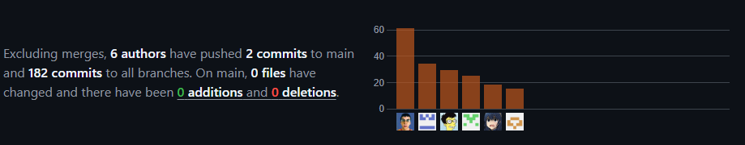
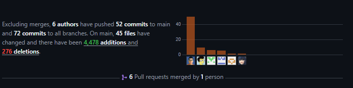



# Universidad Peruana De Ciencias Aplicadas

## 1ASI0572-Desarrollo de Soluciones IOT-2956 - Ingeniería de Software

 </img> 

# "Informe de Trabajo Final"

## Docente: Angel Augusto Velasquez Nuñez

## Startup: CodeMinds

## Producto: EduGo

## Relación de integrantes:

- **Angel Antonio Cancho Corilla U201721995**
- **Juan Diego Cueto Dominguez U202012207**
- **Xiao Lian Li Zegarra U202118784**
- **Marcelo Sebastian Ramirez Ramirez U202210582**
- **Scott Jacobo Huachaca Advincula U201914294**
- **Paolo Del Carmen Martinez Villanueva U202010039**

### 2025 - 01

---

 

## Registro de Versiones del Informe

El registro de versiones del informe se encuentra a continuación, donde se detalla la versión, fecha, autor y una breve descripción de las modificaciones realizadas en cada versión.

<table>
    <thead>
        <tr>
            <th>Versión</th>
            <th>Fecha</th>
            <th>Autor</th>
            <th>Descripción de Modificación</th>
        </tr>
    </thead>
    <tbody>
        <!-- Fila 1-->
        <tr>
            <td>1.0</td>
            <td>05/04/2025</td>
            <td>Marcelo Ramirez</td>
            <td>Se creó el Repositorio y se añadió archivos para la base del proyecto</td>
        </tr>
        <!-- Fila 2-->
        <tr>
            <td>1.1</td>
            <td>10/04/2025</td>
            <td>Juan Diego Cueto Dominguez</td>
            <td>Se implementó la ramificación del repositorio y adicionó los documentos en su versión inicial previa a la investigación.</td>
        </tr>
        <!-- Fila 3-->
        <tr>
            <td>1.2</td>
            <td>10/04/2025</td>
            <td>Angel</td>
            <td>Se desarrolló el Lean UX Assumptions y Problem Statement.</td>
        </tr>
        <!-- Fila 4-->
        <tr>
            <td>1.3</td>
            <td>10/04/2025</td>
            <td>Juan Diego Cueto Dominguez</td>
            <td>Se realizó la implementación del análisis del problema con 5w2h.</td>
        </tr>
        <!-- Fila 5-->
        <tr>
            <td>1.4</td>
            <td>10/04/2025</td>
            <td>Angel</td>
            <td>Se subió al informe el To-Be Scenario Mapping para los user persona.</td>
        </tr>
        <!-- Fila 6-->
        <tr>
            <td>1.5</td>
            <td>10/04/2025</td>
            <td>Juan Diego Cueto Dominguez</td>
            <td>Se implementaron las tácticas y estrategias frente a competidores.</td>
        </tr>
        <!-- Fila 7-->
        <tr>
            <td>1.6</td>
            <td>10/04/2025</td>
            <td>Paolo</td>
            <td>Se realizó la descripción de la start up y añadió los segmentos objetivos.</td>
        </tr>
        <!-- Fila 8-->
        <tr>
            <td>1.7</td>
            <td>10/04/2025</td>
            <td>Paolo</td>
            <td>Se desarrolló el análisis competitivo.</td>
        </tr>
        <!-- Fila 9-->
        <tr>
            <td>1.8</td>
            <td>11/04/2025</td>
            <td>Marcelo Ramirez</td>
            <td>Se añadió el Lean UX Canvas y el Impact Mapping.</td>
        </tr>
        <!-- Fila 10-->
        <tr>
            <td>1.9</td>
            <td>14/04/2025</td>
            <td>Scott</td>
            <td>Se implementó el as-is scenario mapping y también el user journey mapping.</td>
        </tr>
        <!-- Fila 11-->
        <tr>
            <td>1.10</td>
            <td>14/04/2025</td>
            <td>Lian</td>
            <td>Se añadió los user persona, el lenguaje Ubicuo junto con el task matrix.</td>
        </tr>
        <!-- Fila 12-->
        <tr>
            <td>1.11</td>
            <td>15/04/2025</td>
            <td>Marcelo Ramirez</td>
            <td>Se añadieron los diseños para las entrevistas y el logo de la aplicación.</td>
        </tr>
        <!-- Fila 13-->
        <tr>
            <td>1.12</td>
            <td>19/04/2025</td>
            <td>Juan Diego Cueto Dominguez</td>
            <td>Se implementó la carátula para el reporte, también se añadió user stories junto con sus epics y se organizó el product backlog priorizando las respectivas user stories a implementar.</td>
        </tr>
        <!-- Fila 14-->
        <tr>
            <td>1.13</td>
            <td>23/04/2025</td>
            <td>Angel Cancho</td>
            <td>Se implementó el logo de la aplicación y se añadió todo lo relacionado al event storming con la determinación de los bounded context.</td>
        </tr>
        <!-- Fila 15-->
        <tr>
            <td>1.14</td>
            <td>25/04/2025</td>
            <td>Lian</td>
            <td>Se implementaron las primeras versiones del diagrama de C4 además de describir y analizar los bounded context del proyecto.</td>
        </tr>
        <!-- Fila 16-->
        <tr>
            <td>1.15</td>
            <td>25/04/2025</td>
            <td>Paolo y Lian</td>
            <td>Se añadió el diccionario de clases para las clases de padres y usuarios, también se implementó el diagrama de la base de datos y el identity assignment context.</td>
        </tr>
        <!-- Fila 17-->
        <tr>
            <td>1.16</td>
            <td>26/04/2025</td>
            <td>Angel Cancho, Marcelo Ramirez y Scott Huachaca</td>
            <td>Se implementó todo el domain layer y diseños de Analytics, Notification y Vehicle context incluyendo su diccionario de clases y diagrama de base de datos.</td>
        </tr>
        <tr>
            <td>1.17</td>
            <td>05/05/2025</td>
            <td>Lian</td>
            <td>Se desarrolló el Event Storming completo del Capítulo IV, identificando eventos clave y estructuras de comandos.</td>
        </tr>
        <tr>
            <td>1.18</td>
            <td>06/05/2025</td>
            <td>Paolo</td>
            <td>Se documentaron los pasos del Event Storming con imágenes de cada etapa y explicación detallada de Timelines, Pain Points y Pivotal Points.</td>
        </tr>
        <tr>
            <td>1.19</td>
            <td>07/05/2025</td>
            <td>Angel Cancho</td>
            <td>Se añadió la sesión de Candidate Context Discovery y la definición de los 6 bounded contexts del sistema.</td>
        </tr>
        <tr>
            <td>1.20</td>
            <td>09/05/2025</td>
            <td>Scott Huachaca</td>
            <td>Se creó el Context Mapping y se describieron las relaciones Partnership y Customer/Supplier entre los bounded contexts.</td>
        </tr>
        <tr>
            <td>1.21</td>
            <td>10/05/2025</td>
            <td>Juan Diego Cueto Dominguez</td>
            <td>Se elaboraron los Diagramas de Arquitectura de Software: Landscape, Context Level, Container Level y Deployment.</td>
        </tr>
        <tr>
            <td>1.22</td>
            <td>11/05/2025</td>
            <td>Lian</td>
            <td>Se implementaron los Domain Message Flows Modeling para escenarios clave del sistema.</td>
        </tr>
        <tr>
            <td>1.23</td>
            <td>12/05/2025</td>
            <td>Paolo</td>
            <td>Se diseñaron los Bounded Context Canvases de Identity, IAM, Tracking, Notification, Analytics y Profile.</td>
        </tr>
        <tr>
            <td>1.24</td>
            <td>13/05/2025</td>
            <td>Marcelo Ramirez</td>
            <td>Se desarrollaron los diagramas de Software Architecture Component Level y Code Level para Identity And Access Management.</td>
        </tr>
        <tr>
            <td>1.25</td>
            <td>15/05/2025</td>
            <td>Scott Huachaca</td>
            <td>Se añadió la descripción detallada de la arquitectura en capas para cada Bounded Context: Domain, Interface, Application e Infrastructure.</td>
        </tr>
        <tr>
            <td>1.26</td>
            <td>18/05/2025</td>
            <td>Juan Diego Cueto Dominguez</td>
            <td>Se documentaron los Diagramas de Base de Datos y Diagramas de Clases por cada Bounded Context.</td>
        </tr>
        <tr>
            <td>1.27</td>
            <td>19/05/2025</td>
            <td>Angel Cancho</td>
            <td>Se crearon los Component Diagrams de las aplicaciones Web y Mobile, mostrando su arquitectura y organización interna.</td>
        </tr>
        <tr>
            <td>1.28</td>
            <td>21/05/2025</td>
            <td>Lian</td>
            <td>Se desarrollaron las Style Guidelines generales: lenguaje, colores, tipografía, espaciado y branding de EduGo.</td>
        </tr>
        <tr>
            <td>1.29</td>
            <td>22/05/2025</td>
            <td>Paolo</td>
            <td>Se añadieron las Style Guidelines específicas para plataformas web, móvil e IoT, detallando iconos, formularios y navegación.</td>
        </tr>
        <tr>
            <td>1.30</td>
            <td>23/05/2025</td>
            <td>Scott Huachaca</td>
            <td>Se completó la arquitectura de la información: sistemas de organización, esquemas de categorización y etiquetado.</td>
        </tr>
        <tr>
            <td>1.31</td>
            <td>24/05/2025</td>
            <td>Juan Diego Cueto Dominguez</td>
            <td>Se documentaron los sistemas de SEO Tags, Meta Tags y sistemas de búsqueda para la aplicación web.</td>
        </tr>
        <tr>
            <td>1.32</td>
            <td>26/05/2025</td>
            <td>Angel Cancho</td>
            <td>Se definieron los sistemas de navegación de la Landing Page, Aplicación Web y Aplicación Móvil.</td>
        </tr>
        <tr>
            <td>1.33</td>
            <td>28/05/2025</td>
            <td>Marcelo Ramirez</td>
            <td>Se elaboraron los wireframes de la Landing Page, incluyendo mock-ups aplicando la guía de estilos definida.</td>
        </tr>
        <tr>
            <td>1.34</td>
            <td>30/05/2025</td>
            <td>Lian</td>
            <td>Se desarrollaron los wireframes para la Aplicación Web y Aplicación Móvil, organizando pantallas clave y flujos base.</td>
        </tr>
        <tr>
            <td>1.35</td>
            <td>31/05/2025</td>
            <td>Paolo</td>
            <td>Se realizaron los wireflow diagrams para la navegación de usuarios en aplicaciones web y móviles.</td>
        </tr>
        <tr>
            <td>1.36</td>
            <td>02/06/2025</td>
            <td>Scott Huachaca</td>
            <td>Se documentaron los User Flow Diagrams para casos de uso clave tanto en web como en móvil.</td>
        </tr>
        <tr>
            <td>1.37</td>
            <td>03/06/2025</td>
            <td>Juan Diego Cueto Dominguez</td>
            <td>Se crearon los mock-ups detallados de las pantallas finales para la Aplicación Web y Aplicación Móvil.</td>
        </tr>
        <tr>
            <td>1.38</td>
            <td>05/06/2025</td>
            <td>Angel Cancho</td>
            <td>Se añadieron los prototipos interactivos de la Aplicación Web y Aplicación Móvil con sus enlaces navegables.</td>
        </tr>
        <!-- Fila 39 -->
        <tr>
            <td>1.39</td>
            <td>12/06/2025</td>
            <td>Lian, Paolo, Juan Diego Cueto Dominguez</td>
            <td>Se iniciaron y documentaron los trabajos del Sprint 1; definición de objetivos, tareas, y prioridades iniciales.</td>
        </tr>
        <!-- Fila 40 -->
        <tr>
            <td>1.40</td>
            <td>19/06/2025</td>
            <td>Marcelo Ramirez, Angel Cancho, Scott Huachaca</td>
            <td>Se desarrollaron los primeros endpoints del backend, se documentaron los avances y ajustes realizados.</td>
        </tr>
        <!-- Fila 41 -->
        <tr>
            <td>1.41</td>
            <td>26/06/2025</td>
            <td>Lian, Paolo, Juan Diego Cueto Dominguez, Angel Cancho</td>
            <td>Se avanzó con Sprint 2, incluyendo documentación de despliegue de base de datos, backend y mobile.</td>
        </tr>
        <!-- Fila 42 -->
        <tr>
            <td>1.42</td>
            <td>03/07/2025</td>
            <td>Marcelo Ramirez, Scott Huachaca, Lian</td>
            <td>Se llevaron a cabo entrevistas de validación con usuarios y se corrigieron imágenes de los Bounded Context Canvas.</td>
        </tr>
        <!-- Fila 43 -->
        <tr>
            <td>1.43</td>
            <td>10/07/2025</td>
            <td>Juan Diego Cueto Dominguez, Paolo, Angel Cancho, Lian, Marcelo, Scott</td>
            <td>Se realizó el cierre del Sprint 3; actualización del informe final: corrección de puntuación, títulos, anexos.</td>
        </tr>
        <!-- Fila 44 -->
        <tr>
            <td>2.0</td>
            <td>11/07/2025</td>
            <td>Marcelo Ramirez, Juan Diego Cueto Dominguez, Angel Cancho, Paolo, Lian, Scott Huachaca</td>
            <td>Versión final del informe: se añadieron videos de exposición y demo del prototipo IoT, y la presentación final del proyecto.</td>
        </tr>
    </tbody>
</table>

# Project Report Collaboration Insights
El informe del proyecto se encuentra disponible en el repositorio de GitHub, donde se ha implementado un sistema de control de versiones para gestionar las diferentes versiones del documento. El repositorio incluye un registro detallado de las modificaciones realizadas, lo que permite rastrear la evolución del informe a lo largo del tiempo.

URL del repositorio para el reporte del proyecto: https://rb.gy/8yqo9x

Github Collaboration Insights proporciona un cronograma que muestra las principales ramas y los procesos de fusión que han ocurrido. Todas las ramas se han generado siguiendo los principios de GitFlow, lo que garantiza una organización efectiva al utilizar un sistema de control de versiones.

- Juan Diego Cueto Dominguez (JDu202012207)  
- Angel Antonio Cancho Corilla (angerlessdev)  
- Paolo Del Carmen Martinez Villanueva (paolomv02)  
- Xiao Lian Li Zegarra (XLianLZ)  
- Marcelo Sebastian Ramirez Ramirez (MRamirez202210582)  
- Scott Jacobo Huachaca Advincula (Scott-Huachaca)    

#### **Entregable TB1 y TP1**  

- A continuación se presentan los gráficos de colaboración de los integrantes del equipo en el repositorio de nuestro primer sprint. Estos gráficos ofrecen una representación visual de la cantidad de contribuciones realizadas por cada miembro del equipo, junto con la fecha en que se llevaron a cabo. Además, se presenta información sobre la cantidad de líneas de código que se han modificado en cada uno de los commits.
  
   
  El presente informe se encuentra guardado en la organización de CodeMinds: [URL del repositorio del informe](https://github.com/Desarrollo-de-Soluciones-IOT-1ASI0572/upc-pre-202510-1asi0572-2510-codeminds-report)  
  El landingPage se encuentra guardado en la organización de CodeMinds: [URL del repositorio del LandongPage](https://github.com/Desarrollo-de-Soluciones-IOT-1ASI0572/CodeMinds-LandingPage)  
  El FrontEnd informe se encuentra guardado en la organización de CodeMinds: [URL del repositorio del Frontend](https://github.com/Desarrollo-de-Soluciones-IOT-1ASI0572/edugo-web-application)

  <h4><strong>Entregable TB1 y TP1</strong></h4>

A continuación se presentan los gráficos de colaboración de los integrantes del equipo en el repositorio de nuestro primer sprint. Estos gráficos ofrecen una representación visual de la cantidad de contribuciones realizadas por cada miembro del equipo, junto con la fecha en que se llevaron a cabo. Además, se presenta información sobre la cantidad de líneas de código que se han modificado en cada uno de los commits.

 

El presente informe se encuentra guardado en la organización de CodeMinds: 
<a href="https://github.com/Desarrollo-de-Soluciones-IOT-1ASI0572/upc-pre-202510-1asi0572-2510-codeminds-report">URL del repositorio del informe</a>  
El landingPage se encuentra guardado en la organización de CodeMinds: 
<a href="https://github.com/Desarrollo-de-Soluciones-IOT-1ASI0572/CodeMinds-LandingPage">URL del repositorio del LandingPage</a>  
El FrontEnd informe se encuentra guardado en la organización de CodeMinds: 
<a href="https://github.com/Desarrollo-de-Soluciones-IOT-1ASI0572/edugo-web-application">URL del repositorio del Frontend</a>

<!-- Ramas por entregables -->
<h4><strong>Ramas por entregable</strong></h4>
<ul>
  <li><strong>Entregable TB1</strong>
    <ul>
      <li>feature/tb1/chapter01</li>
      <li>feature/tb1/chapter02</li>
      <li>feature/tb1/chapter03</li>
      <li>feature/tb1/chapter04</li>
    </ul>
  </li>
  <li><strong>Entregable TP1</strong>
    <ul>
      <li>feature/tp1/chapter05</li>
      <li>feature/tp1/chapter06</li>
    </ul>
  </li>
</ul>

<!-- Ramas principales -->
<h4><strong>Ramas Principales del Repositorio</strong></h4>
<table>
  <thead>
    <tr>
      <th>Nombre de la Rama</th>
      <th>Descripción</th>
    </tr>
  </thead>
  <tbody>
    <tr>
      <td><code>main</code></td>
      <td>Rama principal de producción; contiene la versión más estable del proyecto.</td>
    </tr>
    <tr>
      <td><code>develop</code></td>
      <td>Rama de integración y desarrollo; se fusionan aquí las nuevas funcionalidades antes de pasar a producción.</td>
    </tr>
  </tbody>
</table>

<!-- Entregable TB2 -->
<h4><strong>Entregable TB2</strong></h4>

A continuación se presentan los gráficos de colaboración de los integrantes del equipo en el repositorio de nuestro segundo sprint. Estos gráficos ofrecen una representación visual de la cantidad de contribuciones realizadas por cada miembro del equipo, junto con la fecha en que se llevaron a cabo. Además, se presenta información sobre la cantidad de líneas de código que se han modificado en cada uno de los commits.

<!-- Entregable TF1 -->
<h4><strong>Entregable TF1</strong></h4>

A continuación se presentan los gráficos de colaboración de los integrantes del equipo en el repositorio de nuestro último sprint. Este gráfico ofrece una representación visual de la cantidad de contribuciones realizadas por cada miembro del equipo, junto con la fecha en que se llevaron a cabo. Además, se presenta información sobre la cantidad de líneas de código que se han modificado en cada uno de los commits.

 

El presente informe se encuentra guardado en la organización de CodeMinds: 
<a href="https://github.com/Desarrollo-de-Soluciones-IOT-1ASI0572/upc-pre-202510-1asi0572-2510-codeminds-report">URL del repositorio del informe</a>  
El landingPage se encuentra guardado en la organización de CodeMinds: 
<a href="https://github.com/Desarrollo-de-Soluciones-IOT-1ASI0572/CodeMinds-LandingPage">URL del repositorio del LandingPage</a>  
El FrontEnd informe se encuentra guardado en la organización de CodeMinds: 
<a href="https://github.com/Desarrollo-de-Soluciones-IOT-1ASI0572/edugo-web-application">URL del repositorio del Frontend</a>  
La aplicación móvil se encuentra guardada en la organización de CodeMinds: 
<a href="https://github.com/Desarrollo-de-Soluciones-IOT-1ASI0572/CodeMinds-Mobile-App">URL del repositorio de la aplicación móvil</a>  
La aplicación embedded se encuentra guardada en la organización de CodeMinds: 
<a href="https://github.com/Desarrollo-de-Soluciones-IOT-1ASI0572/CodeMinds-Embedded">URL del repositorio del embedded</a>  
La aplicación edge se encuentra guardada en la organización de CodeMinds: 
<a href="https://github.com/Desarrollo-de-Soluciones-IOT-1ASI0572/CodeMinds-EdgeServer">URL del repositorio del edge</a>  
La aplicación backend se encuentra guardada en la organización de CodeMinds: 
<a href="https://github.com/Desarrollo-de-Soluciones-IOT-1ASI0572/CodeMinds-BackEnd">URL del repositorio del backend</a>

## Contenido

[Registro de Versiones del Informe](#registro-de-versiones-del-informe)  
[Project Report Collaboration Insights](#project-report-collaboration-insights)  
[Student Outcome 5](#student-outcome-5)

[Capítulo I: Introducción](#capítulo-i-introducción)

[1.1 Startup Profile](#11-startup-profile)  
[1.1.1. Descripción de la Startup](#111-descripción-de-la-startup)  
[1.1.2. Perfiles de integrantes del equipo](#112-perfiles-de-integrantes-del-equipo)

[1.2. Solution Profile](#12-solution-profile)  
[1.2.1 Antecedentes y problemática](#121-antecedentes-y-problemática)  
[1.2.2 Lean UX Process.](#122-lean-ux-process)  
[1.2.2.1. Lean UX Problem Statements.](#1221-lean-ux-problem-statements)  
[1.2.2.2. Lean UX Assumptions.](#1222-lean-ux-assumptions)  
[1.2.2.3. Lean UX Hypothesis Statements.](#1223-lean-ux-hypothesis-statements)  
[1.2.2.4. Lean UX Canvas.](#1224-lean-ux-canvas)

[1.3. Segmentos objetivo.](#13-segmentos-objetivo)

[Capítulo II: Requirements Elicitation & Analysis](#capítulo-ii-requirements-elicitation--analysis)

[2.1. Competidores](#21-competidores)  
[2.1.1. Análisis competitivo](#211-análisis-competitivo)  
[2.1.2. Estrategias y tácticas frente a competidores](#211-análisis-competitivo)

[2.2. Entrevistas](#22-entrevistas)  
[2.2.1. Diseño de entrevistas](#221-diseño-de-entrevistas)  
[2.2.2. Registro de entrevistas](#222-registro-de-entrevistas)  
[2.2.3. Análisis de entrevistas](#223-análisis-de-entrevistas)

[2.3. Needfinding](#23-needfinding)  
[2.3.1. User Personas](#231-user-personas)  
[2.3.2. User Task Matrix](#232-user-task-matrix)  
[2.3.3. User Journey Mapping](#233-user-journey-mapping)  
[2.3.4. Empathy Mapping](#234-empathy-mapping)  
[2.3.5. As-is Scenario Mapping](#235-as-is-scenario-mapping)

[2.4. Ubiquitous Language](#24-ubiquitous-language)

[Capítulo III: Requirements Specification](#capítulo-iii-requirements-specification)

[3.1. To-Be Scenario Mapping](#31-to-be-scenario-mapping)  
[3.2. User Stories](#32-user-stories)  
[3.3. Impact Mapping](#33-impact-mapping)  
[3.4. Product Backlog](#34-product-backlog)

[Capítulo IV: Solution Software Design](#capitulo-iv-Solution-Software-Design)

[4.1. Strategic-Level Domain-Driven Design](#41-strategic-level-domain-driven-design)  
[4.1.1. EventStorming](#411-eventstorming)  
[4.1.1.1. Candidate Context Discovery](#4111-candidate-context-discovery)  
[4.1.1.2. Domain Message Flows Modeling](#4112-domain-message-flows-modeling)  
[4.1.1.3. Bounded Context Canvases](#4113-bounded-context-canvases)  
[4.1.2. Context Mapping](#412-context-mapping)  
[4.1.3. Software Architecture](#413-software-architecture)  
[4.1.3.1. Software Architecture System Landscape Diagram](#4131-software-architecture-system-landscape-diagram)  
[4.1.3.2. Software Architecture Context Level Diagrams](#4132-software-architecture-context-level-diagrams)  
[4.1.3.3. Software Architecture Container Level Diagrams](#4133-software-architecture-container-level-diagrams)  
[4.1.3.4. Software Architecture Deployment Diagrams](#4134-software-architecture-deployment-diagrams)

[4.2. Tactical-Level Domain-Driven Design](#42-tactical-level-domain-driven-design)  
[4.2.X. Bounded Context: <Bounded Context Name>](#42x-bounded-context-bounded-context-name)  
[4.2.X.1. Domain Layer](#42x1-domain-layer)  
[4.2.X.2. Interface Layer](#42x2-interface-layer)  
[4.2.X.3. Application Layer](#42x3-application-layer)  
[4.2.X.4. Infrastructure Layer](#42x4-infrastructure-layer)  
[4.2.X.5. Bounded Context Software Architecture Component Level Diagrams](#42x5-bounded-context-software-architecture-component-level-diagrams)  
[4.2.X.6. Bounded Context Software Architecture Code Level Diagrams](#42x6-bounded-context-software-architecture-code-level-diagrams)  
[4.2.X.6.1. Bounded Context Domain Layer Class Diagrams](#42x61-bounded-context-domain-layer-class-diagrams)  
[4.2.X.6.2. Bounded Context Database Design Diagram](#42x62-bounded-context-database-design-diagram)

[Capítulo V: Solution UI/UX Design](#capitulo-v-Solution-UI/UX-Design)

[5.1. Style Guidelines](#51-style-guidelines)  
[5.1.1. General Style Guidelines](#511-general-style-guidelines)  
[5.1.2. Web, Mobile and IoT Style Guidelines](#512-web-mobile-and-iot-style-guidelines)

[5.2. Information Architecture](#52-information-architecture)  
[5.2.1. Organization Systems](#521-organization-systems)  
[5.2.2. Labeling Systems](#522-labeling-systems)  
[5.2.3. SEO Tags and Meta Tags](#523-seo-tags-and-meta-tags)  
[5.2.4. Searching Systems](#524-searching-systems)  
[5.2.5. Navigation Systems](#525-navigation-systems)

[5.3. Landing Page UI Design](#53-landing-page-ui-design)  
[5.3.1. Landing Page Wireframe](#531-landing-page-wireframe)  
[5.3.2. Landing Page Mock-up](#532-landing-page-mock-up)

[5.4. Applications UX/UI Design](#54-applications-uxui-design)  
[5.4.1. Applications Wireframes](#541-applications-wireframes)  
[5.4.2. Applications Wireflow Diagrams](#542-applications-wireflow-diagrams)  
[5.4.3. Applications Mock-ups](#543-applications-mock-ups)  
[5.4.4. Applications User Flow Diagrams](#544-applications-user-flow-diagrams)

[5.5. Applications Prototyping](#55-applications-prototyping)

[Capítulo VI: Product Implementation, Validation & Deployment](#capitulo-vi-Product-Implementation,-Validation-&-Deployment)

[6.1. Software Configuration Management](#61-software-configuration-management)  
[6.1.1. Software Development Environment Configuration](#611-software-development-environment-configuration)  
[6.1.2. Source Code Management](#612-source-code-management)  
[6.1.3. Source Code Style Guide & Conventions](#613-source-code-style-guide--conventions)  
[6.1.4. Software Deployment Configuration](#614-software-deployment-configuration)

[6.2. Landing Page, Services & Applications Implementation](#62-landing-page-services--applications-implementation)  
[6.2.X. Sprint n](#62x-sprint-n)  
[6.2.X.1. Sprint Planning n](#62x1-sprint-planning-n)  
[6.2.X.2. Aspect Leaders and Collaborators](#62x2-aspect-leaders-and-collaborators)  
[6.2.X.3. Sprint Backlog n](#62x3-sprint-backlog-n)  
[6.2.X.4. Development Evidence for Sprint Review](#62x4-development-evidence-for-sprint-review)  
[6.2.X.5. Testing Suite Evidence for Sprint Review](#62x5-testing-suite-evidence-for-sprint-review)  
[6.2.X.6. Execution Evidence for Sprint Review](#62x6-execution-evidence-for-sprint-review)  
[6.2.X.7. Services Documentation Evidence for Sprint Review](#62x7-services-documentation-evidence-for-sprint-review)  
[6.2.X.8. Software Deployment Evidence for Sprint Review](#62x8-software-deployment-evidence-for-sprint-review)  
[6.2.X.9. Team Collaboration Insights during Sprint](#62x9-team-collaboration-insights-during-sprint)

[6.3. Validation Interviews](#63-validation-interviews)  
[6.3.1. Diseño de Entrevistas](#631-diseño-de-entrevistas)  
[6.3.2. Registro de Entrevistas](#632-registro-de-entrevistas)  
[6.3.3. Evaluaciones según heurísticas](#633-evaluaciones-según-heurísticas)

[6.4. Video About-the-Product](#64-video-about-the-product)

[Conclusiones](#conclusiones)  
[Conclusiones y recomendaciones](#conclusiones-y-recomendaciones)  
[Video About-the-Team](#video-about-the-team)  
[Bibliografía](#bibliografía)  
[Anexos](#anexos)

# Student Outcome 5
El siguiente cuadro resume las acciones realizadas por cada integrante del equipo en relación con el Criterio Específico, que se centra en trabajar en equipo para proporcionar liderazgo en forma conjunta. Cada acción está vinculada a un entregable específico y se incluyen las conclusiones obtenidas de cada uno de ellos.

| Criterio Especifico                                                                            | Acciones Realizadas                                                                                                                                                                                                                                                                                                                                                                                                                                                                                                                                                                                                                                                                                                                                                                                                                                                                                                                                                                                                                                                                                                                                                                                                                                                                                                                                                                                                                                                                                                                                                                                                                                                                                                                                                                                                                                                                                                                                                                                                                                                                                                                                                                                                                                                                                                                                                                                                                                                                                                                                                                                                                                                                                                                                                                                                                                                                                                                                                                                                                                                                                                                                                                                                                                                                                                                                                                                                                                                                                                                                                                                                                                                                                                                                                                                                                                                                                                                                                                                                                                                                                                                                                                                                                                                                                                                                                                                                                                                                                                                                                                                                                                                                                                                                                                                                                                                                                                                                                                                                                                                                                                                                                                                                                                                                                                                                                                                                                                                                                                                                                                                                                                                                                                                                                                                                                                                                                                                                                                                                                                                                                                                                                                                                                                                                                                                                                                                                                                                                                                                                                                                                                                                                                                                                                                                                                                                                                                                                                                                                                                                                                                                                                                                                                                                                                                                                                                                                                                                                                                                                                                                                                                                                                                                                                                                                                                                                                                                                                                                                                                                                                                                                                                                                                                                                                                                                                                                                                                                                                                                                                                                                                                                                                                                                                                                                                                                                                                                                                                                                                                                                                                                                                                                                                                                                                                                                                                                                                                                                                                                                                                                                                                                                                                                                                                                                                                                                                                                                                                                                                                                                                                                                                                                                                                                                                                                                                                                                                                                                                                                                                                                                                                                                                                                                                                                                                                                                                                                                                                                                                                                                                                                                                                                                                                    | Conclusiones                                                                                                                                                                                                                                                                                                                                                                                                                                                                                                                                                                                                                                                                                                                                                                                                                                                                                                                                                                                                                                                                                                                                                                                                                                                                                                                                                                                                                                                                                                                                                                                                                                                                                                                                                                                                                                                                                                                                                                                                                                                                                                                                                                                                                                                                                                                                                                                                                                                                                                                                                                                                                                                                                                                                                                                                                                                                                                                                                                                   |
| ---------------------------------------------------------------------------------------------- | ------------------------------------------------------------------------------------------------------------------------------------------------------------------------------------------------------------------------------------------------------------------------------------------------------------------------------------------------------------------------------------------------------------------------------------------------------------------------------------------------------------------------------------------------------------------------------------------------------------------------------------------------------------------------------------------------------------------------------------------------------------------------------------------------------------------------------------------------------------------------------------------------------------------------------------------------------------------------------------------------------------------------------------------------------------------------------------------------------------------------------------------------------------------------------------------------------------------------------------------------------------------------------------------------------------------------------------------------------------------------------------------------------------------------------------------------------------------------------------------------------------------------------------------------------------------------------------------------------------------------------------------------------------------------------------------------------------------------------------------------------------------------------------------------------------------------------------------------------------------------------------------------------------------------------------------------------------------------------------------------------------------------------------------------------------------------------------------------------------------------------------------------------------------------------------------------------------------------------------------------------------------------------------------------------------------------------------------------------------------------------------------------------------------------------------------------------------------------------------------------------------------------------------------------------------------------------------------------------------------------------------------------------------------------------------------------------------------------------------------------------------------------------------------------------------------------------------------------------------------------------------------------------------------------------------------------------------------------------------------------------------------------------------------------------------------------------------------------------------------------------------------------------------------------------------------------------------------------------------------------------------------------------------------------------------------------------------------------------------------------------------------------------------------------------------------------------------------------------------------------------------------------------------------------------------------------------------------------------------------------------------------------------------------------------------------------------------------------------------------------------------------------------------------------------------------------------------------------------------------------------------------------------------------------------------------------------------------------------------------------------------------------------------------------------------------------------------------------------------------------------------------------------------------------------------------------------------------------------------------------------------------------------------------------------------------------------------------------------------------------------------------------------------------------------------------------------------------------------------------------------------------------------------------------------------------------------------------------------------------------------------------------------------------------------------------------------------------------------------------------------------------------------------------------------------------------------------------------------------------------------------------------------------------------------------------------------------------------------------------------------------------------------------------------------------------------------------------------------------------------------------------------------------------------------------------------------------------------------------------------------------------------------------------------------------------------------------------------------------------------------------------------------------------------------------------------------------------------------------------------------------------------------------------------------------------------------------------------------------------------------------------------------------------------------------------------------------------------------------------------------------------------------------------------------------------------------------------------------------------------------------------------------------------------------------------------------------------------------------------------------------------------------------------------------------------------------------------------------------------------------------------------------------------------------------------------------------------------------------------------------------------------------------------------------------------------------------------------------------------------------------------------------------------------------------------------------------------------------------------------------------------------------------------------------------------------------------------------------------------------------------------------------------------------------------------------------------------------------------------------------------------------------------------------------------------------------------------------------------------------------------------------------------------------------------------------------------------------------------------------------------------------------------------------------------------------------------------------------------------------------------------------------------------------------------------------------------------------------------------------------------------------------------------------------------------------------------------------------------------------------------------------------------------------------------------------------------------------------------------------------------------------------------------------------------------------------------------------------------------------------------------------------------------------------------------------------------------------------------------------------------------------------------------------------------------------------------------------------------------------------------------------------------------------------------------------------------------------------------------------------------------------------------------------------------------------------------------------------------------------------------------------------------------------------------------------------------------------------------------------------------------------------------------------------------------------------------------------------------------------------------------------------------------------------------------------------------------------------------------------------------------------------------------------------------------------------------------------------------------------------------------------------------------------------------------------------------------------------------------------------------------------------------------------------------------------------------------------------------------------------------------------------------------------------------------------------------------------------------------------------------------------------------------------------------------------------------------------------------------------------------------------------------------------------------------------------------------------------------------------------------------------------------------------------------------------------------------------------------------------------------------------------------------------------------------------------------------------------------------------------------------------------------------------------------------------------------------------------------------------------------------------------------------------------------------------------------------------------------------------------------------------------------------------------------------------------------------------------------------------------------------------------------------------------------------------------------------------------------------------------------------------------------------------------------------------------------------------------------------------------------------------------------------------------------------------------------------------------------------------------------------------------------------------------------------------------------------------------------------------------------------------------------------------------------------------------------------------------------------------------------------------------------------------------------------------------------------------------------------------------------------------------------------------------------------------------------------------------------------------------------------------------------------------------------------------------------------------------------------------------------------------------------------------------------------------------------------------------------------------------------------------------------------------------------------------------------------------------------------------------------------------------------------------------------------------------------------------------------------------------ | ---------------------------------------------------------------------------------------------------------------------------------------------------------------------------------------------------------------------------------------------------------------------------------------------------------------------------------------------------------------------------------------------------------------------------------------------------------------------------------------------------------------------------------------------------------------------------------------------------------------------------------------------------------------------------------------------------------------------------------------------------------------------------------------------------------------------------------------------------------------------------------------------------------------------------------------------------------------------------------------------------------------------------------------------------------------------------------------------------------------------------------------------------------------------------------------------------------------------------------------------------------------------------------------------------------------------------------------------------------------------------------------------------------------------------------------------------------------------------------------------------------------------------------------------------------------------------------------------------------------------------------------------------------------------------------------------------------------------------------------------------------------------------------------------------------------------------------------------------------------------------------------------------------------------------------------------------------------------------------------------------------------------------------------------------------------------------------------------------------------------------------------------------------------------------------------------------------------------------------------------------------------------------------------------------------------------------------------------------------------------------------------------------------------------------------------------------------------------------------------------------------------------------------------------------------------------------------------------------------------------------------------------------------------------------------------------------------------------------------------------------------------------------------------------------------------------------------------------------------------------------------------------------------------------------------------------------------------------------------------------- |
| Trabaja en equipo para proporcionar liderazgo en forma conjunta.                               | Marcelo Ramirez:  **TB1:** Durante esta entrega, puedo decir que trabajar en equipo fue clave para proporcionar un liderazgo compartido y efectivo en el proyecto. A lo largo de la planificación, pudimos colaborar estrechamente, aportar nuestras ideas y organizar los "bounded contexts" de manera eficiente, lo que permitió establecer una base sólida para el desarrollo. Este proceso fue fundamental para avanzar de manera conjunta, asegurando que todos los aspectos necesarios estuvieran cubiertos para este primer hito del proyecto final. La experiencia de colaborar de forma conjunta fortaleció nuestras habilidades de trabajo en equipo y comunicación. Marcelo Ramirez:  **TP1:** Durante esta entrega, trabajar en equipo fue esencial para proporcionar un liderazgo compartido en el desarrollo del proyecto. Colaboramos de manera activa en la creación de la landing page y la primera versión del frontend, tomando decisiones conjuntas sobre el diseño, la estructura y las tecnologías a utilizar. Esta coordinación nos permitió distribuir tareas de forma eficiente y avanzar con una visión clara. El liderazgo colaborativo se reflejó en la capacidad de escucharnos mutuamente, dar retroalimentación constante y ajustar nuestro trabajo para lograr una primera versión funcional y coherente con los objetivos del proyecto. Esta experiencia fortaleció nuestra organización y compromiso grupal de cara a los siguientes hitos. Marcelo Ramirez:  **TB2:** Durante esta etapa del proyecto, participé activamente en el desarrollo del backend, la aplicación móvil, el Edge Server y los sistemas embebidos. Asumí un rol de liderazgo compartido al proponer soluciones técnicas durante las reuniones del equipo y coordinar tareas que requerían integración entre diferentes componentes. Colaboré estrechamente con mis compañeros, fomentando un ambiente de confianza y toma de decisiones conjunta. Esta experiencia me permitió fortalecer mis habilidades de liderazgo colaborativo y trabajo en equipo.  **TF1:** Durante la fase final del proyecto, mantuvo una participación activa en la supervisión e integración de los componentes desarrollados. Aportó propuestas para la mejora de productos existentes y colaboró estrechamente con distintos miembros del equipo, facilitando la toma de decisiones conjuntas. Su disposición para asumir tareas críticas y coordinar la revisión de entregables fortaleció el liderazgo compartido y contribuyó a la consolidación de una versión final del sistema sólida y funcional.    Angel Antonio Cancho Corilla: **TB1**: Durante esta entrega, tomé la iniciativa en la organización y asignación de tareas, asegurando que cada miembro del equipo tuviera un área clara de responsabilidad. Fomenté un ambiente de comunicación constante y coordinada, lo que permitió una colaboración efectiva. Al promover una toma de decisiones conjunta y mantener el enfoque en los objetivos del proyecto, ejercí un liderazgo compartido que permitió al equipo avanzar de manera organizada y cumplir con los entregables del Sprint. **TP1**: Durante esta etapa, asumí un rol de liderazgo al coordinar la planificación del Sprint y asegurarme de que cada miembro tuviera metas claras. Mi enfoque estuvo en mantener la comunicación fluida entre todos los miembros, alentando su participación activa y asegurando que las tareas se distribuyeran de manera justa. Gracias a este enfoque colaborativo, el equipo logró avanzar de forma eficiente hacia el cumplimiento de los objetivos del Sprint, con un seguimiento constante de los resultados.   **TB2:** En esta etapa, coordinó tareas críticas del backend y la integración con sistemas embebidos, facilitando reuniones técnicas para alinear soluciones y resolver bloqueos. Lideró manteniendo comunicación fluida, cumplimiento de plazos y colaboración en desafíos como la conexión Edge Server-app móvil, reforzando su enfoque en resultados técnicos y trabajo en equipo.  **TF1:** En esta última entrega, asumió un rol de liderazgo técnico compartido al coordinar las acciones necesarias para finalizar los entregables pendientes. Participó en sesiones de revisión, organizó tareas clave del equipo y promovió decisiones grupales orientadas al cumplimiento de los objetivos generales. Su enfoque proactivo fue fundamental para mantener el orden y avanzar de manera conjunta hacia el cierre del proyecto.  Juan Diego Cueto Dominguez: **TB1**: Trabajó activamente en equipo proporcionando liderazgo conjunto, apoyando en la organización del repositorio utilizando Git y Gitflow para mantener un flujo de trabajo ordenado y eficiente. Además, colaboró en la gestión del backlog y las user stories, promoviendo la participación de todos los miembros del grupo. Aportó en la toma de decisiones técnicas y en la resolución de dudas, fomentando un ambiente de apoyo y liderazgo compartido.   **TP1**: Sentó las bases para trabajar en conjunto con el desarrollo de la aplicación web e implementó la creación de la fake API pra la prueba y obtencion de datos en la aplicación. Además de colaborar continuamente con el equipo para solucionar problemas y dudas para las definiciones importantes de los dominios del proyecto.  TB2: Participo activamente en el desarrallo de las aplicaciones y servicios comunicando efectivamente las caractaristicas de la aplicación movil e implementaciones del bounded context asignado a todos los productos. Ademas colaboro en otras asignaciones junto con el despliegue de los productos asigandos en el sprint 2.   **TF1:** A lo largo de esta etapa, mantuvo un liderazgo colaborativo enfocado en el seguimiento de las tareas asignadas y el soporte a otros integrantes del equipo. Propuso soluciones para el control de versiones y la integración de componentes, participando activamente en reuniones de cierre. Su compromiso fue clave para resolver pendientes técnicos y alinear los esfuerzos del equipo hacia una entrega final coherente.   Xiao Lian Li Zegarra: **TB1**: Durante esta entrega, se enfocó en colaborar activamente con el equipo, participando en la planificación de tareas. Su participación se centró en mantener una comunicación clara y proactiva, lo que permitió que las decisiones se tomaran de forma conjunta y que el trabajo avanzara de manera fluida.  Xiao Lian Li Zegarra: **TP1**: Durante esta entrega, continuó promoviendo el trabajo en equipo mediante una participación activa en el desarrollo del frontend inicial. Colaboró en la toma de decisiones sobre la estructura y la experiencia de usuario de la aplicación web. Asimismo, participó en reuniones de planificación, manteniendo una comunicación constante. Este liderazgo compartido facilitó la ejecución de las tareas asignadas y contribuyó a que el equipo avanzara de manera organizada.   **TB2**: Participo activamente en el desarrollo y mejoras establecidas para esta iteracion en distintos productos, comunicando efectivamente las caractaristicas de la aplicación backend e implementaciones del bounded context identity assignment a todos los productos.   **TF1:** En la etapa final del proyecto, mostró una actitud de liderazgo compartido al colaborar activamente en los ajustes técnicos requeridos y coordinar mejoras junto con el equipo. Aportó en la organización de entregables, participó en la toma de decisiones finales y facilitó la integración de componentes, fortaleciendo la eficiencia del trabajo conjunto.   Scott Jacobo Huachaca Advincula: **TB1**: Durante esta entrega, trabajé en colaboración con el equipo, contribuyendo en la planificación y desarrollo de diversas actividades. Mi enfoque estuvo en asegurar que las soluciones propuestas fueran coherentes con los objetivos del proyecto, mejorando mis habilidades en análisis y diseño.   **TP1**: Durante esta entrega, se asumió un rol activo en el trabajo en equipo, contribuyendo al liderazgo compartido dentro del grupo. Participó en la planificación y ejecución de tareas del desarrollo web, fomentando una comunicación constante y una toma de decisiones consensuada. Además, colaboró en la revisión de código y solución de problemas técnicos, fortaleciendo la cohesión y organización del equipo para avanzar hacia los objetivos del proyecto.    **TB2:** Participó en la planificación y seguimiento de tareas relacionadas con su bounded context, asegurando que las decisiones técnicas se alinearan con los objetivos generales del proyecto. Colaboró en la integración con otros contextos, brindando apoyo en la resolución de problemas y en la coordinación de entregables del sprint 2, lo que fortaleció la organización y el compromiso del equipo.    **TF1:** Durante la culminación del proyecto, ejerció un liderazgo colaborativo al supervisar tareas dentro de su contexto asignado y brindar apoyo en la solución de problemas técnicos. Coordinó con otros integrantes para asegurar la correcta integración entre módulos y contribuyó a mantener un ritmo de trabajo estable, aportando claridad en la ejecución conjunta del equipo.   Paolo Del Carmen Martinez Villanueva: **TB1:** Durante el desarrollo del proyecto, he investigado y aplicado principios éticos y profesionales, asegurando que el software respete la privacidad de los usuarios, promueva la equidad en el acceso y minimice riesgos potenciales derivados de su uso.   **TP1:** Durante esta entrega, el estudiante demostró su capacidad de trabajar en equipo proporcionando liderazgo compartido. Participó activamente en la planificación y desarrollo del proyecto, promoviendo una toma de decisiones consensuada y una comunicación fluida entre los miembros. Su disposición para colaborar, escuchar aportes del grupo y adaptarse a las necesidades del equipo fue clave para mantener una organización eficiente y avanzar con una visión común hacia los objetivos planteados.  **TB2:** En el transcurso del segundo sprint, mostró un compromiso constante con el avance del proyecto, supervisando el desarrollo de los entregables y velando por el cumplimiento de los objetivos establecidos. Mantuvo una dirección clara del trabajo del equipo y propuso metas futuras orientadas a completar los componentes esenciales del sistema. Además, promovió un ambiente colaborativo, brindando apoyo en otras tareas asignadas fuera de su responsabilidad directa, demostrando apertura y adaptabilidad frente a las necesidades del grupo.   **TF1:** En esta última etapa, mostró liderazgo compartido al organizar actividades de cierre, plantear mejoras finales y coordinar con el equipo para asegurar que todos los productos cumplieran con los requisitos funcionales. Su disposición a colaborar más allá de sus asignaciones iniciales fortaleció la cohesión grupal y facilitó una ejecución ordenada y efectiva. | **TB1:** En esta primera entrega del proyecto, el trabajo en equipo y la colaboración fueron fundamentales para avanzar de manera eficiente. La comunicación constante y el liderazgo compartido permitieron una organización adecuada de las tareas y la toma de decisiones de forma coordinada. Además, se puso énfasis en establecer una base sólida desde la planificación, abordando los "bounded contexts" de manera eficiente para garantizar que todos los aspectos del proyecto fueran cubiertos. La participación activa de todos los miembros fortaleció tanto las habilidades de trabajo en equipo como la toma de decisiones conjunta. Además, se priorizó la aplicación de principios éticos y profesionales, garantizando que el desarrollo del software fuera responsable y respetuoso con la privacidad y equidad de los usuarios. En resumen, esta fase del proyecto ha sido clave para sentar las bases de un desarrollo colaborativo y ético.     **TP1:** Durante esta entrega, el equipo demostró una coordinación sólida al trabajar conjuntamente en el desarrollo de la landing page y el frontend inicial. Se compartieron responsabilidades de liderazgo a través de la planificación del sprint, la asignación equitativa de tareas y la toma de decisiones colaborativa. La participación activa de todos los integrantes permitió avanzar con una visión común, fomentando un liderazgo horizontal donde cada aporte fue valorado. La experiencia fortaleció la comunicación, el compromiso y la capacidad de actuar como un equipo cohesionado.     **TB2:** Durante esta etapa, se consolidó un liderazgo compartido al abordar simultáneamente el desarrollo del backend, la app móvil, el Edge Server y los sistemas embebidos. Los integrantes propusieron soluciones técnicas, lideraron integraciones críticas y se apoyaron mutuamente en tareas transversales. Se promovió un entorno de toma de decisiones conjunta, distribución eficiente de tareas e integración constante, lo que fortaleció las habilidades de liderazgo colaborativo y evidenció una madurez grupal en la ejecución técnica y organizativa del sprint.     **TF1:** Durante la etapa final del proyecto, el equipo demostró un liderazgo compartido sólido y efectivo. Cada integrante asumió un rol activo en la toma de decisiones, participando en la organización, validación e integración de los productos desarrollados. La disposición a colaborar en distintas áreas, más allá de las asignaciones originales, permitió afrontar los ajustes finales con eficiencia. A través de reuniones técnicas, revisión de entregables y coordinación constante, se logró consolidar una versión funcional y coherente del sistema. Este enfoque conjunto fortaleció la cohesión del equipo y aseguró que el liderazgo no recayera en una sola persona, sino que fuera una responsabilidad distribuida basada en la confianza, el compromiso y la colaboración. |
| Crea un entorno colaborativo e inclusivo, establece metas,planifica tareas y cumple objetivos. | Marcelo Ramirez:  **TB1:** Durante el proyecto, he comprendido la importancia de crear un entorno colaborativo e inclusivo dentro del equipo. Establecer metas claras y planificar las tareas de manera efectiva ha sido esencial para asegurar el cumplimiento de los objetivos. Durante el proyecto, me di cuenta de que la comunicación abierta y el respeto por las ideas de todos son claves para un trabajo exitoso. Esta experiencia me ha permitido mejorar mi capacidad para planificar, coordinar tareas y asegurar que todos los miembros del equipo estén alineados y motivados para alcanzar las metas propuestas. Marcelo Ramirez:  **TP1:** En esta etapa del proyecto, trabajé activamente para fomentar un entorno colaborativo e inclusivo dentro del equipo. Desde el inicio, propuse reuniones breves para escuchar ideas de todos y asegurar que cada integrante tuviera un espacio para aportar. En conjunto, establecimos metas claras relacionadas con el desarrollo de la landing page y la primera versión del frontend, definiendo tareas específicas para cada miembro del grupo. Me aseguré de que todos comprendieran su rol y tuvieran acceso a los recursos necesarios para avanzar. Gracias a esta organización, logramos cumplir con los objetivos planteados en los plazos acordados. La planificación y el compromiso colectivo fueron claves para lograr un resultado funcional, visualmente atractivo y alineado con los requerimientos del proyecto. Marcelo Ramirez:  **TB2:** En esta fase del proyecto, contribuí a crear un entorno colaborativo e inclusivo al apoyar constantemente a mis compañeros, compartir conocimientos y estar abierto a diferentes puntos de vista. Participé en la planificación de tareas, ayudé a definir metas claras y me aseguré de cumplir con los plazos asignados. Esta forma de trabajo me permitió mantener el enfoque en los objetivos del proyecto, al mismo tiempo que reforzaba mis habilidades de organización y comunicación efectiva dentro del equipo.   **TF1:** Contribuyó activamente a la creación de un entorno colaborativo e inclusivo, facilitando espacios de retroalimentación y comunicación constante durante las tareas de cierre. Ayudó a definir metas realistas para concluir los productos pendientes y mantuvo una organización clara del trabajo grupal. Su compromiso con la planificación permitió que el equipo cumpliera los objetivos propuestos en los plazos establecidos.    Angel Antonio Cancho Corilla: **TB1**: En esta etapa, me enfoqué en fomentar un entorno de colaboración dentro del equipo, asegurando que todos los miembros pudieran aportar sus ideas. Establecimos metas claras y planificamos nuestras tareas de forma ordenada, lo que nos permitió avanzar hacia el cumplimiento de los objetivos del proyecto.    Angel Antonio Cancho Corilla **TP1**: Planifiqué tareas y establecí metas claras para el Sprint, fomentando un entorno colaborativo e inclusivo, asegurando el cumplimiento de los objetivos propuestos.    **TB2:** En esta etapa, organizó reuniones técnicas y distribuyó equitativamente tareas clave como la integración backend-sistemas embebidos. Estableció metas claras, monitoreó progresos y fomentó participación activa, logrando entregar funcionalidades críticas (Edge Server-app móvil) mientras mantenía la cohesión del equipo.   **TF1:** En esta etapa, promovió un ambiente de trabajo colaborativo mediante la planificación estructurada de tareas y la definición de prioridades claras para el equipo. Fomentó la participación activa de todos los integrantes, organizó sesiones de avance y monitoreó el progreso, lo que permitió mantener la coordinación y cumplir con los objetivos del cierre del proyecto.   Juan Diego Cueto Dominguez: **TB1**: Contribuyó a la creación de un entorno colaborativo e inclusivo al ayudar en la definición de los bounded contexts del proyecto, asegurando que todos los miembros comprendieran su rol dentro de la arquitectura. Participó en la planificación de tareas mediante el manejo de user stories y backlog, estableciendo metas claras y apoyando el cumplimiento de los objetivos del equipo. También brindó asistencia constante para resolver dudas técnicas, promoviendo la inclusión y el aprendizaje colectivo.    **TP1**: Sugirió y establecio reglas para una mejor organización en el control de versiones y lograr de mejor manera los objetivos establecidos en el sprint 1, adenás apoyó e incentivó a aplicar las convenciones necesarias para un mejor entendimiento de los features manejados.   **TB2:** Durante el segundo sprint, fue constante la participacion y control sobre el desarrollo de todos los productos, mantuvo clara las metas y objetivos del sprint y planifico futuros objetivos para terminar el desarrollo de los productos importantes del proyecto. Ademas de mantener flexible el ambiente del trabajo apoyando u ofrenciendose a colaborar activamente en otras areas designadas del proyecto.   **TF1:** Participó activamente en la planificación de tareas pendientes, manteniendo siempre una actitud inclusiva y flexible. Se ofreció para colaborar en diversas áreas del proyecto y propuso ajustes en las metas grupales para asegurar una entrega efectiva. Su apoyo en la organización y cumplimiento de objetivos fue clave para mantener el ritmo del equipo.   Xiao Lian Li Zegarra: **TB1**: Durante esta etapa del proyecto, se enfocó en fomentar una comunicación constante entre los miembros del equipo. Además, propuso establecer tiempos de entrega basados en iteraciones cortas, lo que permitió organizar mejor las tareas, ajustar los avances de manera flexible y mantener un ritmo de trabajo sostenido.   Xiao Lian Li Zegarra: **TP1**:Durante esta etapa del proyecto, trabajó para fomentar un entorno colaborativo dentro del equipo. Propuso dividir el trabajo en iteraciones periódicas para facilitar la planificación de tareas y permitir un mejor seguimiento del avance. En conjunto, se definieron metas relacionadas con el diseño y desarrollo inicial del frontend, lo que permitió una organización eficiente y el cumplimiento de los objetivos planteados en los tiempos establecidos. Esta experiencia fortaleció la cohesión del equipo y su capacidad para trabajar de forma coordinada.   **TB2**: Durante el segundo sprint, participo en la definicion del alcance en el desarrollo y mejoras de los productos, contribuyo con el establecimiento de plazos fijos para el cumplimiento de objetivos. Ademas, fomento un entorno de comunicacion flexible y efectiva.    **TF1:** Fomentó la colaboración continua entre los miembros del equipo, promoviendo reuniones para definir los objetivos finales y organizar las tareas restantes. Contribuyó a mantener un ambiente de comunicación fluida y planificación estructurada, asegurando que cada integrante comprendiera sus responsabilidades dentro del sprint final.   Scott Jacobo Huachaca Advincula: **TB1**: En esta etapa del proyecto, me enfoqué en crear un ambiente colaborativo e inclusivo, asegurando que cada miembro del equipo tuviera voz y contribuyera con ideas valiosas. Trabajamos juntos para establecer metas claras, planificar las tareas de manera efectiva y garantizar que todos los objetivos fueran alcanzados a tiempo, lo que fortaleció mi capacidad para coordinar y ejecutar actividades en equipo.  **TP1**: Contribuyó activamente a crear un entorno colaborativo e inclusivo dentro del equipo. Participó en la planificación del Sprint, ayudando a establecer metas claras y a organizar las tareas de forma eficiente. Fomentó la participación equitativa entre los integrantes, promoviendo una comunicación constante y un ambiente donde todas las ideas fueran consideradas. Gracias a esta coordinación y compromiso, el equipo logró cumplir con los objetivos planteados dentro de los tiempos establecidos, avanzando de manera ordenada en el desarrollo del proyecto    **TB2:** Durante esta entrega, fomentó un entorno de trabajo colaborativo e inclusivo, promoviendo la participación activa de todos los integrantes del equipo. Contribuyó en la definición de metas claras para el sprint 2, apoyando la planificación y distribución de tareas de manera equitativa y organizada. Su compromiso con el cumplimiento de los objetivos permitió mantener el ritmo del desarrollo dentro de su bounded context, así como facilitar la integración con otros equipos, asegurando una ejecución coordinada y efectiva.   **TF1:** Mantuvo un entorno de trabajo inclusivo al participar en la distribución equitativa de tareas y apoyar a sus compañeros en el cierre de sus responsabilidades. Contribuyó a la planificación de las actividades finales, priorizando objetivos críticos y asegurando una ejecución ordenada de las tareas grupales.   Paolo Del Carmen Martinez Villanueva: **TB1:** He evaluado junto al equipo los posibles impactos sociales, económicos y ambientales de nuestra solución, priorizando decisiones de diseño que favorezcan la sostenibilidad, accesibilidad y adaptabilidad del software a diferentes realidades globales.   **TP1:** Durante esta entrega, el estudiante contribuyó activamente a la creación de un entorno colaborativo e inclusivo dentro del equipo. Promovió espacios de participación equitativa, impulsando la planificación conjunta de tareas y la definición de metas claras a alcanzar durante la realización del proyecto. Su capacidad para organizar el trabajo y mantener una comunicación constante permitió al grupo avanzar de manera ordenada y cumplir con los objetivos establecidos en los plazos acordados.    **TB2:** A lo largo del segundo sprint, mantuvo una participación activa y un seguimiento riguroso del progreso de los distintos entregables del proyecto. Mostró claridad en cuanto a los objetivos del sprint y planteó acciones orientadas a completar las funcionalidades más relevantes. Asimismo, contribuyó a un entorno de trabajo dinámico, ofreciendo su colaboración en tareas de otras áreas, lo que fortaleció la cohesión del equipo y facilitó la adaptación a posibles cambios durante el desarrollo.   **TF1:** Impulsó un entorno colaborativo al proponer una revisión sistemática de los entregables y apoyar activamente en tareas fuera de su responsabilidad directa. Estableció metas claras con el equipo, contribuyó a la reorganización de tareas de última hora y promovió una comunicación constante que favoreció la coordinación eficiente hasta la finalización del proyecto.                                                                                                                                                                                                                                                                                                          | **TB1:** Durante esta etapa, se creó un entorno colaborativo e inclusivo donde todos los miembros del equipo pudieron aportar ideas. Se establecieron metas claras y se planificaron tareas de manera efectiva, lo que permitió avanzar hacia el cumplimiento de los objetivos. La comunicación constante y la organización mediante iteraciones cortas facilitaron el ajuste de avances de forma flexible. Además, se priorizó la sostenibilidad y la accesibilidad en el diseño de la solución, considerando su impacto social, económico y ambiental.     **TP1:** En esta entrega, el grupo se enfocó en construir un entorno colaborativo donde todos los miembros pudieran expresar ideas y asumir responsabilidades claras. Se establecieron metas específicas relacionadas con la creación del frontend y se planificaron tareas de manera estructurada, lo que permitió avanzar dentro de los plazos definidos. La inclusión de todos los integrantes en las decisiones y el seguimiento de actividades permitió que el equipo se mantuviera organizado y motivado, cumpliendo con los objetivos establecidos en el sprint 1.     **TB2:** Durante el segundo sprint, se reforzó un entorno de trabajo inclusivo y colaborativo, basado en la planificación conjunta y el seguimiento continuo de objetivos. Los miembros del equipo participaron activamente en reuniones técnicas, definieron metas claras y distribuyeron tareas de forma equitativa. Se brindó apoyo entre áreas y se mantuvo una actitud abierta a la colaboración fuera de los roles designados. Esta dinámica permitió avanzar de manera efectiva, facilitando la integración de componentes clave del proyecto y fortaleciendo el enfoque grupal hacia resultados comunes.     **TF1:** El equipo mantuvo un entorno de trabajo colaborativo e inclusivo durante toda la fase de cierre del proyecto. Se establecieron metas claras a corto plazo para abordar los pendientes restantes, y se planificaron las tareas de manera organizada y equitativa. La comunicación constante, el respeto por los aportes de cada integrante y la disposición para apoyar en diferentes frentes fueron elementos clave que favorecieron la adaptabilidad frente a imprevistos. Gracias a esta coordinación y compromiso colectivo, fue posible cumplir con los objetivos definidos para la entrega final, asegurando un producto robusto y alineado con los requerimientos del sistema.                                                                                                                                                                                                                                                                                                                                                                                                                                                                                                                |
