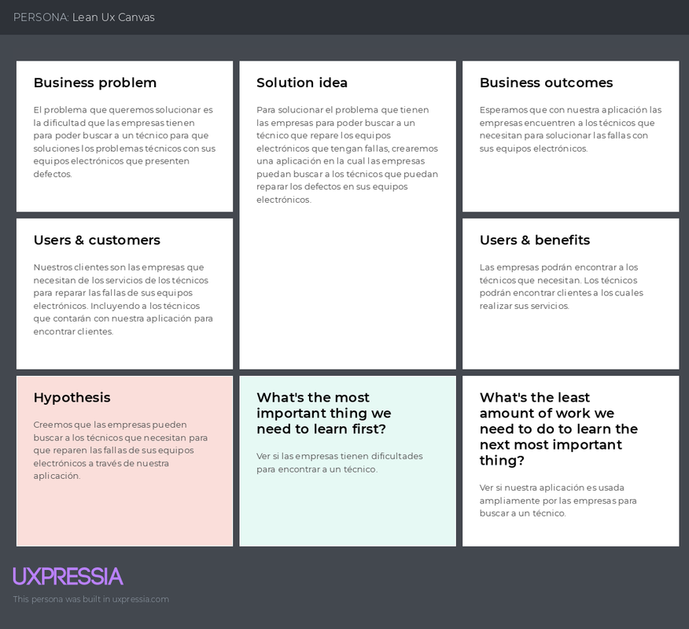
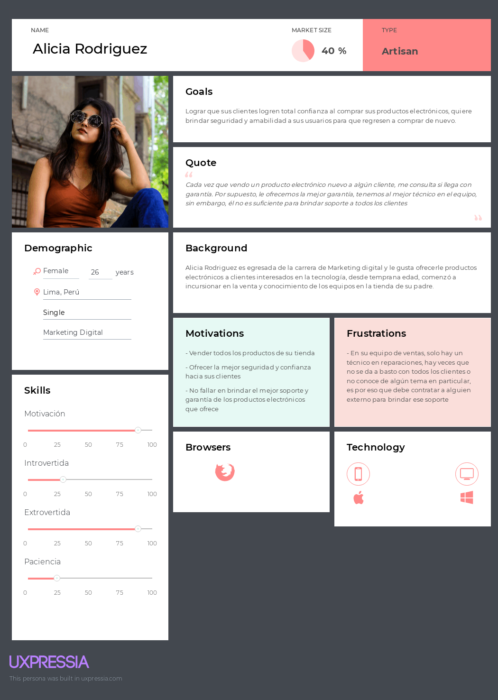
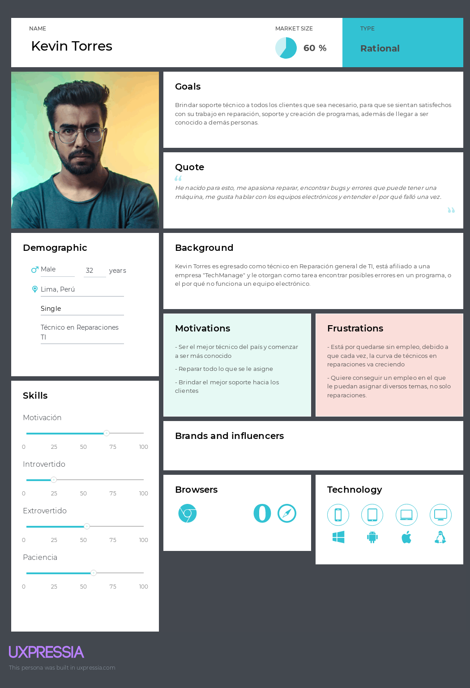

    <strong>Universidad Peruana de Ciencias Aplicadas</strong> 
    </img> 
    <strong>INGENIERÍA DE SISTEMAS DE SOFTWARE</strong> 
    <strong> SI729 - Desarrollo de Aplicacion Open Source SW53</strong> 
    <strong>Profesor: Elio Jefferrson Navarrete Vilca </strong> 
     INFORME  
    "TechConnect Solutions" | "OfficeTech"

### Integrantes:
-   
- 
- 
- Ramirez Ramirez,Marcelo Sebastian - U202210582
- 
- 

---
# Registro de Versiones del Informe
| Version | Fecha | Autor | Descripcion de Modificacion                                                   |
| ----------- | ----------- | ----------- |-------------------------------------------------------------------------------|
| 0.0 | 24/03/2024 | Arian Rodriguez | Se crea el documento                                                          |
| 1.0 | 24/03/2024 | Zaid Ramirez | Se crean las ramas correspondientes                                           |
| 1.1 | 25/03/2024 | Fabia Herrera | Se aplican mejoras en los capitulos 1 y 2                                     |
| 1.2 | 25/03/2024 | Vladimir Jara | Se realizan los user diagrams y Lean UX                                       |
| 1.3 | 27/03/2024 | Adrian Rubio | Se colocan las user stories                                                   |
| 1.4 | 29/03/2024 | Marcelo Ramirez | Se implementa el product backlog y las épicas correspondientes a story points |
| 1.5 | 04/04/2024 | Arian Rodriguez | Se revisan las entrevistas                                                    |
| 1.6 | 05/04/2024 | Zaid Ramirez | Actualizaciones en los diagramas C4 DDD                                       |
| 1.7 | 06/04/2024 | Fabia Herrera | Se actualiza el capitulo de colaboracion                                      |
| 1.8 | 12/04/2024 | Vladimir Jara | Se actualiza los Impact Mappings de los Users                                 |
| 1.9 | 20/04/2024 | Adrian Rubio | Arreglo de los User Stories                                                   |
| 2.0 | 26/04/2024 | Marcelo Ramirez | Finaliza cambios en HU y Product Backlog                                      |
| 2.1 | 30/04/2024 | Arian Rodriguez | Arreglos generales, HU, Lean UX, C4 Diagrams                                  |
|2.2|20/04/2024|Jara Benites, Quique Vladimir| Correcion HU, desarrollo de las evidencias del sprint                         |
|2.3|20/05/2024|Jara Benites, Quique Vladimir| Correción de las branch names                        |
|2.5|24/05/2024|Rodriguez Vargas, Arian Martin| Implementación de las evidencias Back-end                        |
|2.6|30/05/2024|Herrera Aguirre, Fabia Alejandra| Arreglo de las evidencias de la Landing Page                        |
|2.7|06/06/2024|Ramirez Ramirez,Marcelo Sebastian| Evidencias de la Aplicación Web                        |
|3.0|18/06/2024|Marcelo Ramirez| Corrección de errores y actualización de la información                        |
|3.1|20/06/2024|Zaid Ramirez| Corrección de errores y actualización de la información                        |
|3.2|22/06/2024|Fabia Herrera| Corrección de errores y actualización de la información                        |

# Project Report Collaboration Insights
El presente informe se encuentra guardado en la organización de OfficeTech: [URL del repositorio de la Landing Page](https://github.com/OpenSourceSW53/-upc-pre-202401-si729-SW53-officetech-report.git)

Se consideró la Landing Page en otro repositorio de la misma organización: [URL Landing page](https://github.com/OpenSourceSW53/officetech-landing-page)

Se consideró la Aplicación Web (FrontEnd) en un tercer repositorio de la misma organización: [URL Repositorio FRONTEND](https://github.com/OpenSourceSW53/officetech-frontend.git)

Se consideró la lógica de la aplicación (BackEnd) en un cuarto repositorio de la misma organización: [URL Repositorio BACKEND](https://github.com/OpenSourceSW53/officetech-backend.git)

# Student Outcome 3

|Criterio Especifico| Acciones Realizadas   |Conclusiones|
|-|-----------------------------------------------------------------------------------------------------------------------------------------------------------------------------------------------------------------------------------------------------------------------------------------------------------------------------------------------------------------------------------------------------------------------------------------------------------------------------------------------------------------------------------------------------------------------------------------------------------------------------------------------------------------------------------------------------------------------------------------------------------------------------------------------------------------------------------------------------------------------------------------------------------------------------------------------------------------------------------------------------------------------------------------------------------------------------------------------------------------------------------------------------------------------------------------------------------------------------------------------------------------------------------------------------------------------------------------------------------------------------------------------------------------------------------------------------------------------------------------------------------------------------------------------------------------------------------------------------------------------------------------------------------------------------------------------------------------------------------------------------------------------------------------------------------------------------------------------------------------------------------------------------------------------------------------------------------------------------------------------------------------------------------------------------------------------------------------------------------------------------------------------------------------------------------------------------------------------------------------------------------------------------------------------------------------------------------------------------------------------------------------------------------------------------------------------------------------------------------------------------------------------------------------------------------------------------------------------------------------------------------------------------------------------------------------------------------------------------------------------------------------------------------------------------------------------------------------------------------------------------------------------------------------------------------------------------------------------------------------------------------------------------------------------------------------------------------------------------------------------------------------------------------------------------------------------------------------------------------------------------------------------------------------------------------------------------------------------------------------------------------------------------------------------------------------------------------------------------------------------------------------------------------------------------------------------------------------------------------------------------------------------------------------------------------------------------------------------------------------------------------------------------------------------------------------------------------------------------------------------------------------------------------------------------------------------------------------------------------------------------------------------------------------------------------------------------------------------------------------------------------------------------------------------------------------------------------------------------------------------------------------------------------------------------------------------------------------------------------------------------------------------------------------------------------------------------------------------------------------------------------------------------------------------------------------------------------------------------------------------------------------------------------------------------------------------------------------------------------------------------------------------------------------------------------------------------------------------------------------------------------------------------------------------------------------------------------------------------------------------------------------------------------------------------------------------------------------------------------------------------------------------------------------------------------------------------------------------------------------------------------------------------------------------------------------------------------------------------------------------------------------------------------------------------------------------------------------------------------------------------------|-|
|Comunica oralmente sus ideas y/o resultados con objetividad a público de diferentes especialidades y niveles jerarquicos, en el marco del desarrollo de un proyecto en ingeniería.| Marcelo Ramirez:  **TB1:** Durante el proyecto, aprendí a comunicar ideas complejas de forma clara y sencilla a distintas audiencias, lo que mejoró significativamente la colaboración y el interés en nuestro trabajo. Realicé presentaciones periódicas para actualizar al equipo sobre los avances, utilizando herramientas visuales para simplificar conceptos técnicos. Esta experiencia reforzó la importancia de adaptar mi comunicación a diferentes contextos, un aprendizaje valioso para mi futuro profesional. Además, participé en reuniones con stakeholders de diversos niveles jerárquicos, asegurándome de ajustar el nivel de detalle y tecnicismos según el público.    Zaid Ramirez: **TB1**: Durante la elaboración del proyecto, logré comunicar de manera efectiva los resultados y el proceso de nuestro proyecto, utilizando Lean UX como marco principal. También compartí los hallazgos esenciales obtenidos a través de nuestra investigación de UX, que permitió comprender a fondo las necesidades de los usuarios, identificar las tareas críticas y visualizar la experiencia completa del usuario con la aplicación.  Adrian Rubio: **TB1**: Me desarrollé eficazmente en mis tareas designadas, apegándome a los horarios, reglas y plazos establecidos por el equipo. Además, utilicé herramientas colaborativas online para aumentar mi capacidad de comunicación y trabajo en equipo.   Quique Jara: **TB1**: Durante la elaboración del proyecto logré comunicar todas mis ideas en las reuniones de equipo de manera clara. Asimismo, entrevisté a un usuario potencial, al cual expliqué el motivo de la entrevista y la información que necesitaba recopilar.   Arian Rodriguez: **TB1**: Me desarrollé adecuadamente en las tareas asignadas y mejoré algunas habilidades blandas como la comunicación con el equipo. Esta experiencia me permitió comprender mejor el proceso a desarrollar para posicionarlo desde diferentes perspectivas.  Fabia Herrera: **TB1:** Se realizaron varias reuniones grupales a fin de intercambiar propuestas para el óptimo desarrollo de nuestro proyecto. Asimismo, realizamos entrevistas mediante las cuales conseguimos insights valiosos para la creación de nuestra aplicación web. Documenté estos hallazgos para compartirlos con el equipo.   Marcelo Ramirez: **TP:** En la entrega actual del proyecto, me enfoqué exclusivamente en el desarrollo del frontend utilizando Angular. Implementé mis componentes con los requisitos funcionales y documenté cada uno de ellos. Esta documentación facilitó la comunicación y colaboración con el equipo.    Zaid Ramirez: **TP:** En este entregable del trabajo parcial, me enfoque plantear las funciones de los componentes para que la aplicación realice las tareas propuestas. A su vez, me encargue de revisar los componentes y comunicar de manera efectiva con el equipo para cualquier cambio o corrección que se tuvieran que hacer en estos.   Adrián Rubio: **TP:**  En este entregable del trabajo parcial, me enfoque en realizar mis componentes con las funciones para que la aplicación realice las tareas propuestas. A su vez, me encargue de probar el ruteo entre componentes y ayudar en el deployment del front-end   Vladimir Jara:  **TP:** En esta entrega puli conocimientos en el desarrollo productos web en angular de forma colaborativa utilizando componentes y angular material   Arian Rodriguez: **TP:** En esta entrega, documenté los avances en el desarrollo del frontend y las pruebas de ruteo entre componentes. Compartí esta documentación con el equipo para asegurar una comprensión clara y un desarrollo cohesivo.  Fabia Herrera: **TP:** Para esta entrega se realizaron reuniones en equipo para poder llegar a un consenso en el desarrollo de la aplicación web, así como plazos de entrega.   Adrián Rubio: **TB2:** En esta entrega pude aplicar lo aprendido en clase en el diseño del backend con la estructura del domain driver desing, ya que este nos da orden y escalabilidad en el proyecto para que se pueda a completar todos los requerimientos para sastifacer las necesidades del cliente.  Vladimir Jara: **TB2:** En este tercer entregable aplique lo aprendio sobre la creacion de un proyecto backend para obtner los endpoints que se implementaran en el front mas adelante   Zaid Ramirez: **TB2:** En esta entrega pude aprender acerca de el comportamiento del backend en la aplicación y como se conecta con los requerimientos específicos del cliente.   Arian Rodriguez: **TB2:** En este entregable pude aprender la elaboración del backend y la creación de una RESTful API, pudiendo complacer los requerimientos de datos en el frontend. Documenté estos avances y compartí los detalles técnicos con el equipo.   Fabia Herrera **TB2:** Gracias a las entrevistas con personas que pertenecen a nuestro público objetivo, pudimos recibir retroalimentación en cuanto a cómo y en qué mejorar del proyecto    Marcelo Ramirez: **TB2:** En este tercer entregable aplique lo aprendio sobre la creacion de un proyecto backend para obtner los endpoints que se implementaran en el front mas adelante   Adrián Rubio: **TF:** En este último entregable, he integrado las habilidades y conocimientos adquiridos a lo largo del curso para utilizarlas y aplicarlas en nuestra solución eficaz al desafío planteado.     Vladimir Jara **TF** Para esta última entrega pude incorporar todos los conocimientos adquiridos durante el curso en nuestro proyecto de forma satisfactoria. Documenté cada paso realizado para asegurar una comunicación clara y efectiva del progreso y los resultados alcanzados.  Zaid Ramirez: **TF** En este entregable final utilicé todo lo aprendido durante el proyecto de manera integral para poder abordar la solución al problema propuesto al inicio del proyecto   Arian Rodriguez: **TF** En este último entregable apliqué el criterio del outcome de tal manera que supe evidenciar lo aprendido en los diferentes sprints que tuvimos a lo largo del semestre.   Fabia Herrera: **TF**: Para esta última entrega pude incorporar todos los conocimientos adquiridos durante el curso en nuestro proyecto de forma satisfactoria.    Marcelo Ramirez: **TF** Aplique todo el outcome principal que se establacio para la aplaicion del backend y union del front lo que me servira mucha para el futuro |Mediante la eficiencia, organización y el marco de trabajo establecido dentro del grupo logramos desarrollar nuestro primer entregable de manera correcta.|
|Comunica en forma escrita ideas y/o resultados con objetividad a público de diferentes especialidades y niveles jerarquicos, en el marco del desarrollo de un proyecto en ingeniería.| Marcelo Ramirez:  **TB1:** En mi rol dentro del proyecto, me esforcé por comunicar ideas y resultados de manera clara y objetiva. Mis contribuciones, desde informes hasta presentaciones, buscaban ser accesibles y comprensibles para todos, un desafío que me enseñó el valor de una comunicación efectiva en el ámbito académico.    Zaid Ramirez **TB1:** Durante este proyecto, he  documentado adecuadamente el emprendimiento utilizando las herramientas apropiadas, con las convenciones de idioma, la estructura de nombres y prácticas de programación establecidos en los aspectos de la solución. Además, he llevado a cabo y documentado adecuadamente los procesos Lean UX, Design, Prototyping, etc., para la comunicación efectiva con diferentes rangos de audiencia.  Adrian Rubio: **TB1**: Por medio de las herramientas colaborativas online logre aumentar mi capacidad de comunicación y trabajo en equipo.   Quique Jara: **TB1**: Para el desarrollo de esta entega, redacte de manera el analisis de requerimientos para luego elaborar la base de datos del sietema y el diagrama de clases.  **TP:** En la entrega actual del proyecto, me enfoqué exclusivamente en el desarrollo del frontend utilizando Angular. Implementé mis componentes con los requisitos funcionales y documenté cada uno de ellos. Esta documentación facilitó la comunicación y colaboración con el equipo.    Arian Rodriguez: **TB1**: Elaboré mis propuestas planteadas para el proyecto siguiendo el marco de la ingeniería de software, aplicando y viendo a futuro cómo se desenvolvería el proceso  Fabia Herrera: **TB1:** La indagación realizada para este proyecto fue documentada y de gran ayuda para el modelado de nuestra solución, para esta entrega, me encargué de investigar sobre potenciales competidores, lo que nos resultó útil para aprender tanto de errores como de aciertos.   Marcelo Ramirez: **TP:** En esta parte del trabajo, aprendí el uso de los componentes en Angular y cómo usarlos a través de un router. Expliqué estos conceptos en reuniones de equipo, lo que facilitó la implementación colaborativa y permitió que otros miembros del equipo se familiarizaran con estas técnicas.    Zaid Ramirez: **TP:** En la entrega del trabajo parcial, después de realizar correcciones, mejoras y analisis de los componentes a hacer para el proyecto, mantuve un enfoque en la creación de componentes con angular material. De la misma forma, investigue acerca de la api fake y enrutamiento para poder llevar a cabo el despliegue correcto de la aplicación.   Adrián Rubio: **TP:** En la entrega actual del proyecto, me enfoqué exclusivamente en el desarrollo del frontend utilizando Angular. Implementé mis componentes copn los requisitos funcionales. Además, integré componentes de Angular Material para mejorar la estética y la funcionalidad de la aplicación, facilitando así la interacción del usuario final con nuestra plataforma.   Vladimir Jara: **TP:** Para la entrega se realizaron correcciones y se implemento el apartado de editar perfil.Asimismo, para cada uno de los componentes utilizados se realizo su respectiva documentacion    Arian Rodriguez: **TP:** Investigué las diferentes soluciones que se iba a plantear en el front-end como asi mismo la elaboración de diferentes features   Fabia Herrera: **TP:** Para esta entrega se aplicaron cambios menores al diseño de la aplicación que posteriormente implementé para el front-end de nuestra app.    Adrián Rubio: **TB2:** Para esta entrega, se desarrolló el sprint 3 de OfficeTech, lo cual consistio en la elaboracionde nuevas HU Para el desarrollo de la primera version del backend, se pusieron en práctica los conocimientos adquiridos en las clases.  Vladimir Jara: **TB2:** En este tercer entregabla aplique lo aprendio sobre la creacion de un proyecto backend para obtener los endpoints que se implementaran en el front mas adelante   Zaid Ramirez: **TB2:**   En este entregable pude aprender la elaboración del backend y la creación de una RESTful API. Pudiendo complacer los requerimientos de datos en el front   Arian Rodriguez: **TB2:** En este tercer entregable, apliqué lo aprendido sobre la creación de un proyecto backend para obtener los endpoints que se implementarían en el front más adelante. Realicé una presentación técnica para explicar la arquitectura del backend y su integración con el frontend, asegurándome de que todos los miembros del equipo entendieran su funcionamiento y pudieran contribuir eficazmente.  Fabia Herrera **TB2:** Para esta entrega, se desarrolló el backend de OfficeTech, para lo cual se pusieron en práctica los conocimientos adquiridos durante la unidad.   Marcelo Ramirez:  **TB2:** En este tercer entregable, apliqué lo aprendido sobre la creación de un proyecto backend para obtener los endpoints que se implementarán en el frontend más adelante. Comunicar estos avances y desafíos técnicos en nuestras reuniones permitió una mejor integración y colaboración entre los desarrolladores de frontend y backend.       Adrián Rubio: **TF:**  En este último entregable, documenté cada paso del desarrollo del backend y su integración con el frontend. Esta documentación clara y detallada aseguró una comunicación efectiva y facilitó la comprensión de los procesos y resultados por parte del equipo.   Vladimir Jara **TF** Para esta última entrega, documenté todo el proceso de desarrollo y los aprendizajes obtenidos. Aseguré que la documentación fuera clara y accesible, facilitando la comunicación de los resultados y los próximos pasos a seguir con el equipo.  Zaid Ramirez: **TF:** En este útlimo entregable del proyecto cumplí con os outcomes establecidos por lo que pude expresarme correctamente con el equipo para comunicar de manera efectiva detalles sobre el proyecto    Arian Rodriguez: **TF:** En este entregable apliqué el criterio del outcome de manera que supe expresarme mejor mediante las soluciones que brindaba al equipo y poder concluir con el proyecto     Fabia Herrera: **TF**: Para esta última entrega, documenté todo el proceso de desarrollo y los aprendizajes obtenidos. Aseguré que la documentación fuera clara y accesible, facilitando la comunicación de los resultados y los próximos pasos a seguir con el equipo.    Marcelo Ramirez: **TF** En este último entregable, documenté cada paso del desarrollo y la integración del backend y el frontend. Esta documentación clara y detallada aseguró una comunicación efectiva y facilitó la comprensión de los procesos y resultados por parte del equipo. |Gracias a las herramientas colaborativas brindadas y las aplicaciones de comunicación logramos establecer fechas y límites para nuestros trabajos.|

# Capítulo I: Introducción
## 1.1. Startup Profile
### 1.1.1. Descripción de la Startup
#### TechConnect Solutions
Somos un equipo de desarrolladores de plataformas web con experiencia en servicio técnico, cuyo objetivo es brindar soporte y soluciones a los clientes para satisfacer sus requerimientos y necesidades así como asegurar su completa satisfacción.
Además, utilizamos una variedad de métodos innovadores para resolver los problemas que enfrentan nuestros clientes. Nuestro enfoque principal es garantizar la calidad y eficiencia de nuestros servicios, lo que nos permite ofrecer una experiencia óptima al cliente. 

- **Misión:** Nuestra misión es garantizar una experiencia óptima y agradable al usar la aplicación, garantizando la seguridad, confianza y preferencia del cliente.
- **Visión:** Nos esforzamos por penetrar, establecernos y diferenciarnos en el mercado de soporte tecnológico dedicado, ganarnos la confianza del cliente y asegurar una posición sólida en el sector.
#### 1.1.2. Perfiles de integrantes del equipo
| Miembros del equipo                                                                                                                    | Codigo Estudiante | Carrera | Conocimientos / Habilidades                                                                                                                                                                                                                                                                                                                                                                                                                                                                   |
|----------------------------------------------------------------------------------------------------------------------------------------|-------------------|-|-----------------------------------------------------------------------------------------------------------------------------------------------------------------------------------------------------------------------------------------------------------------------------------------------------------------------------------------------------------------------------------------------------------------------------------------------------------------------------------------------| 
| Jara Benites, Quique Vladimir       | U202022365        |Ingenieria de software| Estudiante de la carrera de ingenieria de software con conocimientos tecnicos en javascript, Vue, php y SQ. Asimismo, para el desarrollo en equipo cuento con habilidades como participacion comunicativa, creatividad, resolucion de problemas, adaptavilidad y toma de decisiones.                                                                                                                                                                                                          |
| Rodriguez Vargas, Arian Martin   | U202212096        |Ingenieria de software| Actualmente me encuentro aprendiendo las tecnologías de Angular, Vue para el desarrollo web, llevo un gran interés en el desarrollo del backend, creación de APIs, persona con bastante ganas de seguir aprendiendo y no quedarse con la duda. Los lenguajes de programación con las que más me relaciono son C++ y Python, me gusta la optimización y eficiencia en el código                                                                                                                |
| Ramirez Contreras, Zaid Valentino         | U202218472        |Ingenieria de software| Me encuentro cursando el quinto ciclo de la carrera de Ingeniería de Software. Tengo familiaridad con los lenguajes de C++, Python y un poco de Javascript. Me interesa la implementación de los datos en el comportamiento del frontend de la  aplicación. Me considero responsable, comunicativo y dispuesto a aprender                                                                                                                                                                     |
| Herrera Aguirre, Fabia Alejandra     | U202219422        |Ingenieria de software| Soy estudiante de ingeniería de Software en el quinto ciclo de mi carrera. Tengo interés en el manejo de datos a través del lenguaje SQL y tengo experiencia en programación con C++, Python y JavaScript. Me considero una persona creativa y responsable, valores que considero serán útiles para garantizar entregas óptimas para este proyecto.                                                                                                                                           |
| Ramirez Ramirez, Marcelo Sebstian    | U202210582        |Ingenieria de software| Estudiante de ingenieria de software que esta aprendiendo el uso de Angular y Vue decidido a dar lo mejor que pueda incluso si las cosas no me salen como esperaba                                                                                                                                                                                                                                                                                                                            |
| Rubio Calixto, Adrian Gustavo          | U202017622        |Ingenieria de software| Soy Adrian, tengo 20 años. Elegí esta carrera ya que siempre se me dieron bien los cursos de computación y robótica en la primaria y secundaria. Creo que puedo aportar a mi grupo la confianza de siempre dar mi mejor esfuerzo para las tareas académicas. Creo que mis principales cualidades son la resiliencia, la empatía y los conocimientos en los lenguajes de C++,C#, Java, JavaScript, TypeScript python y en frameworks como vue y angular; así como el manejo de Android Studio. |

## 1.2. Solution Profile
### 1.2.1 Antecedentes y problemática
Nuestra plataforma ofrecerá un servicio de suscripción dirigido a empresas que comercializan productos electrónicos. A través de esta suscripción, las empresas tendrán acceso a un plan que incluye una cantidad específica de garantías mediante servicios técnicos. El objetivo es proporcionar un acceso confiable y seguro a estos servicios para empresas, tiendas o profesionales independientes que los requieran.

Además, esta iniciativa creará oportunidades laborales para técnicos especializados en dispositivos electrónicos. Al mismo tiempo, las empresas podrán reducir costos al optar por suscribirse a **OfficeTech** en lugar de mantener su propio equipo de soporte técnico, ya que solo pagarán por el plan seleccionado y los servicios utilizados.
- **¿Qué?**
La problematica se presenta cuando los técnicos especializados en dispositivos electrónicos y tecnología enfrentan dificultades para encontrar empleo debido a la falta de medios para promocionarse en el mercado, lo que resulta en una falta de desarrollo económico sostenible.
- **¿Quién?**
Los técnicos que enfrentan desafíos al no tener una presencia efectiva en las redes sociales para atraer nuevos clientes. Además, algunos técnicos carecen de contactos que puedan recomendar su trabajo, lo que puede llevar a la pérdida de clientes potenciales.
- **¿Por qué?**
La falta de publicidad o recomendaciones por parte de los técnicos limita su capacidad para obtener más trabajo. Además, los clientes a menudo intentan resolver sus problemas técnicos por sí mismos, consultando a amigos o buscando información en redes sociales.
- **¿Dónde?**
En sus hogares, esperando una respuesta o contacto telefónico a través de llamadas o mensajes de WhatsApp. El problema radica en que la espera puede ser prolongada.
- **¿Cuándo?**
Este problema suele manifestarse principalmente por la mañana y por la tarde, momentos en los que los técnicos reciben pocas llamadas.
- **¿Cómo?**
La calidad del servicio y el tiempo de respuesta son los aspectos más importantes para los clientes a la hora de evaluar un trabajo. La frecuencia del problema sigue un patrón en el que los clientes prefieren a técnicos o empresas que les brinden mayor seguridad y confianza, lo que puede demostrarse mediante un historial de proyectos o referencias positivas.
- **¿Cuánto?**
Los problemas surgen en días en los que no hay o hay poco contacto con los clientes, lo que afecta los ingresos y el tiempo perdido. Los ingresos de los técnicos varían según las circunstancias de cada cliente, pudiendo limitarse a una simple revisión técnica.
### 1.2.2 Lean UX Process.
#### 1.2.2.1. Lean UX Problem Statements.
##### **Empresa:**
Según una investigación realizada por ManpowerGroup en 2017, se encontró que el 46% de los empleadores enfrentan dificultades para llenar sus vacantes. Esta dificultad radica en la escasez de técnicos de calidad, cuya especialización requiere evaluar tanto habilidades técnicas como habilidades blandas en un corto período de tiempo para satisfacer las demandas de los usuarios.

Nos hemos dado cuenta de las limitaciones de las empresas para ofrecer garantías a sus clientes debido a la falta de técnicos especializados en equipos electrónicos y tecnología, lo cual resulta en dificultades para cubrir vacantes.

Además de la falta de técnicos especializados, las empresas enfrentan desafíos para atraer nuevos clientes, lo que provoca retrasos en sus ingresos y pérdida de tiempo. Se encuentran con obstáculos al intentar destacar en redes sociales que no están específicamente diseñadas para su sector, especialmente cuando existen empresas bien establecidas que transmiten mayor seguridad al cliente en cuanto a la calidad del servicio.

Hemos identificado la necesidad de un intermediario que pueda comunicar el desempeño laboral de los técnicos a sus clientes para aumentar su base de clientes.

¿Cómo podemos mejorar la eficiencia en el proceso de búsqueda de técnicos de equipos electrónicos y tecnología?

##### **Técnico**:
Los profesionales en tecnología enfrentan desafíos para atraer nuevos clientes, lo que provoca retrasos en sus ingresos y pérdida de tiempo. Se encuentran con obstáculos al intentar destacar en redes sociales que no están específicamente diseñadas para su sector, especialmente cuando existen empresas bien establecidas que transmiten mayor seguridad al cliente en cuanto a la calidad del servicio.

##### **Compañía**:
Las empresas enfrentan dificultades para ofrecer garantías a sus clientes debido a la falta de técnicos especializados en equipos electrónicos y tecnología, lo cual resulta en dificultades para cubrir vacantes.

Nuestro producto, **OfficeTech**, busca resolver estos problemas al proporcionar una plataforma que conecta a empresas con técnicos especializados en equipos electrónicos y tecnología, permitiendo a las empresas ofrecer garantías a sus clientes y a los técnicos encontrar empleo de manera eficiente y segura.

Sabremos que tuvimos éxito cuando las empresas puedan ofrecer garantías a sus clientes de manera eficiente y los técnicos puedan encontrar empleo de manera segura y eficiente.

#### 1.2.2.2. Lean UX Assumptions.
**Business Outcome**
En esta seccion vamos a usar las metricas de Montaña que ha conceptualizada por Jeff Gothelf y Josh Seiden en su libro Lean UX. Estas metricas nos ayudaran a entender el comportamiento de los usuarios y a medir el éxito de nuestro producto.

Acquisition: (Base): [1000 visitantes] En esta sección se espera que 1000 visitantes ingresen a nuestra plataforma para buscar un tecnico que pueda solucionar su problema tecnico. De los visitantes esperamos que el 80% de estos se registren en nuestra plataforma.

Activacion: (Plateau):[450 users : 100% users] En esta sección el usuario se registra en nuestra plataforma y comienza a utilizarla para buscar un tecnico que pueda solucionar su problema tecnico. De los usuarios que se registran esperamos que el 45% de estos comiencen a utilizar nuestra plataforma para buscar un tecnico que pueda solucionar su problema tecnico.

Retention: (Plateau + 1 level):[50% users] De los usuarios que se animarán a utilizarlo esperamos que un 50% de estos continuen utilizando nuestra plataforma para buscar un tecnico que pueda solucionar sus diferentes problemas.

Revenue: (Plateau + 2 levels):[20% users] Los usuarios que utilizan nuestro producto esperamos que un 20% de estos decidan pagar por el servicio que ofrecemos para poder solucionar sus problemas técnicos.

Referral:(top) [15% users] Finalmente de los usuarios que retenimos esperamos que un 15% de estos recomienden nuestro producto a otros usuarios que puedan necesitar de nuestro servicio.

**Business Assumptions**
En esta sección se presentan las suposiciones de negocio que se han identificado para el proyecto **OfficeTech**:

- Creemos que nuestros clientes necesitan una aplicacion que les facilite buscar un trabajador capacitado que se encargue adecuadamente de los equipos electrónicos.
- El trabajador recibe una notificación cuando alguien requiere un servicio.
- Mis clientes son capaces de utilizar plataformas móviles
- El cliente es atendido en brevedad
- El cliente puede contactar con los tecnicos mediante una llamada telefonica
- Nuestros clientes inicales son contactados por medio de redes sociales, mientras que las empresas por reuniones pactadas.
- Generamos ingresos mediante suscripciones con las empresas por garantia.
- Nuestra principal competecia son las aplicaiones web que funcionan como intermediarios entre trabajadores y clientes
- Ganaremos a la competencia al contar con la supervicion del rendimiento que dan los tecnicos
- Nuestro mayor riesgo es que los clientes busquen un tecnico por su cuenta

**User Assumptions**
- ¿Quién es el usuario?
  Las empresas que solicitan servicio tecnico mediante nuestra aplicacion y los técnicos que brindan el servicio
- ¿Dónde encaja nuestro producto en su trabajo
  En cualquier momento que tenga dificultad con su equipo y quiera una solucion rapida
- ¿Qué problemas tiene nuestro producto? ¿Resolver?
  El algoritmo para que todos las personas que brindan servicio tecnico puedan generar ingresos. Se podria resolver a traves de filtros y comentarios
- ¿Cuándo y cómo es nuestro producto? ¿Usado?
  El producto es utilizado cuando se tiene una necesidad o deseo de reparar algún equipo
  electrónico para que no le interrumpa su trabajo. Asimismo, establecer comunicaciones
  con las personas que puedan brindar el servicio. Por otro lado, el producto debe verse
  confiable y formal para brindarle seguridad al cliente
- ¿Qué características son importantes?
  La comunicacion sencilla entre cliente y trabajador. Asimisnmo, el acceso a una gran variedad de tecnicos
- ¿Cómo debe verse y comportarse nuestro producto?
  Nuestro producto debe verse confiable y funcional diariamente. Este debe comportarse
  de forma amigable con una funcionalidad ágil, para que los usuarios no tengan
  problemas para usarlo

**User Outcomes & Benefits**
En esta sección se busca el lado más empático con los usuarios para ofrecerles el outcome más correcto

- **Empresa:**
  - **Outcome:** Las empresas podrán encontrar técnicos especializados en equipos electrónicos y tecnología de manera rápida y eficiente.
  - **Beneficio:** Las empresas podrán ofrecer garantías a sus clientes y asegurar la calidad de los servicios técnicos que brindan.

- **Técnico:**
  - **Outcome:** Los técnicos podrán encontrar empleo de manera segura y eficiente.
  - **Beneficio:** Los técnicos podrán aumentar su base de clientes y mejorar su reputación en el mercado.

**Solutions**
Jeff Gothelf menciona en su libro Lean UX que las soluciones son las ideas que se proponen para resolver los problemas de los usuarios. En este caso, las soluciones propuestas para el proyecto **OfficeTech**, tomando en cuenta las restricciones anteriores, son las siguientes:

- Desarrollar una aplicación web que conecte a empresas con técnicos especializados en equipos electrónicos y tecnología.
- Crear un algoritmo que permita a los técnicos recibir notificaciones cuando alguien requiera un servicio.
- Diseñar una interfaz amigable para los usuarios que les permita buscar y contactar a los técnicos de manera rápida y sencilla.
- Implementar un sistema de calificaciones y comentarios para que los usuarios puedan evaluar la calidad del servicio de los técnicos.
- Establecer un modelo de suscripción para las empresas que deseen ofrecer garantías a sus clientes a través de la plataforma.  

#### 1.2.2.3. Lean UX Hypothesis Statements.
**Hipótesis**

| Business Outcome | Persona | User Outcome | Feature/Solution |
|------------------|---------|--------------|------------------|
| Creemos que nuestros clientes necesitan una aplicación que les facilite buscar un trabajador capacitado que se encargue adecuadamente de los equipos electrónicos. | Empresa | Las empresas podrán encontrar técnicos especializados en equipos electrónicos y tecnología de manera rápida y eficiente. | Desarrollar una aplicación web que conecte a empresas con técnicos especializados en equipos electrónicos y tecnología. |
| Creemos que los técnicos necesitan una plataforma que les permita recibir notificaciones cuando alguien requiera un servicio. | Técnico | Los técnicos podrán encontrar empleo de manera segura y eficiente. | Crear un algoritmo que permita a los técnicos recibir notificaciones cuando alguien requiera un servicio. |
| Creemos que nuestros clientes podrán comunicarse con los técnicos de manera rápida y sencilla. | Empresa | Las empresas podrán ofrecer garantías a sus clientes y asegurar la calidad de los servicios técnicos que brindan. | Diseñar una interfaz amigable para los usuarios que les permita buscar y contactar a los técnicos de manera rápida y sencilla. |
| Creemos que los técnicos podrán mejorar su reputación en el mercado. | Técnico | Los técnicos podrán aumentar su base de clientes y mejorar su reputación en el mercado. | Implementar un sistema de calificaciones y comentarios para que los usuarios puedan evaluar la calidad del servicio de los técnicos. |
| Creemos que las empresas podrán ofrecer garantías a sus clientes. | Empresa | Las empresas podrán ofrecer garantías a sus clientes y asegurar la calidad de los servicios técnicos que brindan. | Establecer un modelo de suscripción para las empresas que deseen ofrecer garantías a sus clientes a través de la plataforma. |

#### 1.2.2.4. Lean UX Canvas.

## 1.3. Segmentos objetivo.
| | Segmento 1 | Segmento 2 |
|-----------|--------------------------------------------------------------------------------------|-----------------------------------------------------------------------------------------|
| **Variables** | Empresas, organizaciones, tiendas o vendedores independientes de aparatos electrónicos | Técnicos especializados en el servicio de reparación de distintos artefactos eletrónicos |
| **Geográfica** | Ubicación cercana a tiendas o empresas que requieran soporte técnico | Misma región o ciudad donde se encuentran las empresas o tiendas que requieren soporte técnico |
| **Demográfica** | Edad: 25-50 años Sexo: Ambos Nivel educativo: Universitario | Edad: 20-40 años Sexo: Ambos Nivel educativo: Técnico o universitario |
| **Psicográfica** | Intereses: Tecnología, innovación, calidad de servicio | Intereses: Tecnología, reparación de equipos, calidad de servicio |
| **Función de comportamiento** | Frecuencia de uso: Diario Lealtad: Alta Conocimiento del producto: Medio | Frecuencia de uso: Diario Lealtad: Alta Conocimiento del producto: Medio |

# Capítulo II: Requirements Elicitation & Analysis
## 2.1. Competidores.
### 2.1.1. Análisis competitivo.

| Competitive Analysis Landscape                          |  |
| ------------------------------------------------------- | -|
| ¿Por qué llevar a cabo este análisis?                   | Llevamos a cabo este análisis inicial para comprender el mercado en el que ingresamos, lo que nos permite evaluar las estrategias implementadas por plataformas ya establecidas. De esta manera, buscamos aprender tanto de sus éxitos como de sus fracasos. |

| |  | OfficeTech | JustAnswer  | Compupalace |
|-|-|-|-|-|
| PERFIL| Overview | OfficeTech proporciona acceso rápido y confiable a servicios técnicos, permitiendo a las empresas reducir costos al evitar la necesidad de mantener un equipo interno de soporte. | Plataforma en línea que conecta a usuarios con expertos verificados en una variedad de campos, incluyendo tecnología y electrónica. | Empresa peruana que ofrece servicios integrales de soporte técnico y soluciones informáticas para empresas y usuarios individuales. |
|| Ventaja competitiva ¿Qué valor ofrece a los clientes? |  - Reducción de costos para las empresas que contraten nuestros servicios. - Garantizamos servicios técnicos de calidad confiable. | - Facilita el acceso a expertos verificados. - Cuenta con una gran variedad temas en los que brindan asistencia, desde asistencia legal hasta tecnología.  | - Reputación como proveedor confiable de servicios informáticos. - Amplia gama de servicios, incluyendo reparación y mantenimiento de equipos.|
|| Mercado Objetivo                                        | - Empresas que necesitan un soporte técnico confiable para satisfacer las necesidades de sus clientes. - Profesionales en tecnología enfrentan desafíos para atraer nuevos clientes | Usuarios individuales y empresas que buscan respuestas especializadas en una gran variedad de campos. | Usuarios individuales en Perú que requieren servicios de reparación, mantenimiento y asistencia técnica para sus equipos. |
| Perfil de marketing                                     | Estrategia de Marketing | - Campañas dirigidas a gerentes de empresas de tecnología y electrónica. - Participación en ferias comerciales y eventos. - Publicidad en línea | - Publicidad en línea y en redes sociales. - Colaboraciones con sitios web y blogs relevantes. | - Publicidad en medios de comunicación tradicionales. |
| Perfil del producto                                     | Productos y servicios | Plataforma de suscripción para servicios técnicos.  | Plataforma en línea de preguntas y respuestas con expertos.| Servicio presencial de venta de productos electrónicos y soporte técnico. |
|| Precios y costos                                        | Variable según la complejidad del servicio y el técnico. | Costo mensual por suscripción. | Variable según la complejidad del servicio y el técnico. |
|| Canales de distribución (Web y/o Móvil)                 | Web y Móvil Web | Web y Móvil Web | Servicio presencial |

### 2.1.2. Estrategias y tácticas frente a competidores.

|Competidores ->|  | OfficeTech |JustAnswer| Compupalace|
|-|-|-|-|-|
| Análisis SWOT | Fortalezas | - Reduce costos a las empresas al evitarles mantener un equipo interno de soporte técnico. - Garantizamos servicios técnicos confiables y de alta calidad. | - Cuenta con una red de expertos verificados en una amplia gama de campos. - Permite obtener asesoramiento experto de manera rápida y conveniente. | - Ofrece una amplia variedad de servicios informáticos integrales. - Cuenta con una reputación como un proveedor confiable de servicios informáticos. |
|| Debilidades   | - Competencia en el mercado al tener que enfrentarse a empresas similares sedimentadas. - Garantizar la fiabilidad de los proveedores de servicios técnicos. | - Calidad variable según el experto que responda la pregunta. - Dependencia de la disponibilidad de expertos en línea para absolver dudas. | Al ofrecer un servicio exclusivamente presencial su alcance de mercado está limitado por su geografía. | lorem | 
|| Oportunidades | Expansión del alcance para atender en otras áreas que requieren soporte técnico especializado. | Expansión de su plataforma a nuevos mercados internacionales. | Diversificar sus servicios para incluir soluciones adicionales, como seguridad cibernética o desarrollo de software. | lorem | 
|| Amenazas      | La captación y retención de clientes podría llegar a ser dificultosa y competitiva debido a la presencia de grandes empresas establecidas. | La calidad variable de las respuestas proporcionadas por los expertos podría generar desconfianza entre los usuarios. | La rápida evolución de la tecnología podría hacer que sus servicios se vuelvan obsoletos si no se mantienen al día con las últimas tendencias. | lorem |

## 2.2. Entrevistas.
### 2.2.1. Diseño de entrevistas.
**Preguntas generales:**

1. ¿Cuál es su nombre? 
2. ¿Qué edad tiene? 
3. ¿A qué se dedica? 

**Preguntas a empresas que necesitan soporte técnico:**
1.	¿Cuáles son los principales desafíos que enfrenta su empresa en términos de soporte técnico?
2.	¿Con qué frecuencia experimenta problemas técnicos que afectan la operación de su empresa?
3.	¿Qué tipo de servicios técnicos considera más críticos para su negocio?
4.	¿Qué criterios utiliza para evaluar y seleccionar proveedores de soporte técnico?
5.	¿Ha considerado la posibilidad de externalizar el soporte técnico en lugar de mantener un equipo interno?
6.	¿Qué métodos ha utilizado al buscar profesionales para reparar sus dispositivos (páginas web, referencias, anuncios físicos, etc.)?
7.	¿Qué experiencias positivas o negativas ha tenido con proveedores de soporte técnico en el pasado?
8.	¿Qué tipo de tecnologías o equipos utilizan en su empresa que requieren soporte técnico regular?
9.	¿Qué tan crítico es el tiempo de respuesta para resolver problemas técnicos en su negocio?

   
**Preguntas a profesionales en tecnología:**
1.	¿Cuáles son los mayores desafíos que enfrenta al intentar atraer nuevos clientes a su negocio?
2.	¿Qué canales de comunicación prefiere utilizar para llegar a sus clientes potenciales? (Redes sociales, correo electrónico, eventos de networking, etc.)
3.	¿Qué tipo de servicios o soluciones tecnológicas ofrece a sus clientes potenciales?
4.	¿Qué métodos utiliza habitualmente para abordar los problemas técnicos planteados por sus clientes? (en línea, asesoramiento telefónico, visitas presenciales, acceso remoto a los dispositivos, etc.) 
5.	¿Cómo describiría un día típico en su trabajo?
6.	¿Cuál es un desafío habitual que enfrenta al tratar con sus clientes? ¿Cómo suele manejar esta situación cuando surge?

### 2.2.2. Registro de entrevistas.
**Segmento 1: Clientes que requieren de un plan para soporte técnico que brinde garantía y soluciones a sus productos electrónicos** 
**Entrevista 1 (realizada por Marcelo Ramirez):** 
**Nombre:** Rusbel Bargas
**Edad:** 37 años
**Ocupación:** Ing. Informático a cargo de negocio de venta de dispositivos

[Vídeo de entrevista](https://youtu.be/V9tZ0fQIMkE)
Rusbel Bargas es un ingeniero informático que se encarga de un negocio de venta de dispositivos electrónicos. Nos comenta que uno de los mayores desafíos que enfrenta es el soporte técnico que debe brindar a sus clientes. Asegura que la mayoría de los problemas técnicos que enfrentan sus clientes son de naturaleza simple, pero que requieren de un técnico especializado para ser resueltos. Nos comenta que la mayoría de los clientes buscan una solución rápida y efectiva a sus problemas, por lo que es importante contar con un servicio de soporte técnico confiable y eficiente. Además, nos comenta que la mayoría de los clientes buscan una garantía en los productos que adquieren, por lo que es importante contar con un plan de soporte técnico que brinde garantía y soluciones a sus productos electrónicos vendidos. Rusbel nos comenta que estaría interesado en contratar un servicio como el de OfficeTech para garantizar la satisfacción de sus clientes y asegurar la calidad de los productos que vende. 

  

**Entrevista 2 (realizada por Arian Rodriguez):** 
**Nombre:** Diego Hernandez
**Edad:** 21 años
**Ocupación:** Estudiante de Ingeniería de Sistemas, asistente de negocio a cargo de la venta de dispositivos electrónicos

[Vídeo de entrevista](https://youtu.be/fbYutiYTEv4)  
Diego Hernandez nos cuenta a detalle lo que él y su equipo debe enfrentar en su negocio de venta de dispositivos electrónicos. Nos comenta que uno de los mayores desafíos es el soporte técnico que se debe brindar a aquellos productos que son adquiridos por los clientes. Muchas veces el equipo de Diego no se da a basto con la cantidad de peticiones que llegan a diario para la reparación, soporte técnico. Asegura que una propuesta como la de OfficeTech sería lo ideal para contratar y asegurar la satisfacción de sus clientes, y así poder garantizar una buena garantía a sus productos.

  

**Entrevista 3 (realizada por Adrian Rubio):** 
**Nombre:** Eduardo Sanandres
**Edad:** 27 años
**Ocupación:** Lider de soporte tecnico en Constructora 

[Vídeo de entrevista](https://upcedupe-my.sharepoint.com/:v:/g/personal/u202017622_upc_edu_pe/ETHUOnQL2zdCuxO9S4zB-W8B-ZMBnI3KvxzpmKd7Akiv0w?e=jrmaBo&nav=eyJyZWZlcnJhbEluZm8iOnsicmVmZXJyYWxBcHAiOiJTdHJlYW1XZWJBcHAiLCJyZWZlcnJhbFZpZXciOiJTaGFyZURpYWxvZy1MaW5rIiwicmVmZXJyYWxBcHBQbGF0Zm9ybSI6IldlYiIsInJlZmVycmFsTW9kZSI6InZpZXcifX0%3D)  
Eduardo Sanandres, líder de soporte técnico, describe su trabajo diario y los retos que enfrenta al gestionar las demandas de servicio técnico de su empresa. Explica que los problemas varían significativamente, desde cuestiones menores hasta "super problemas" que requieren más tiempo del planificado para su resolución. Esta variabilidad provoca retrasos en los tiempos programados para solucionar las incidencias, afectando la efectividad del equipo.

Ante esta situación, Eduardo está considerando la posibilidad de tercerizar el servicio de soporte técnico. Su objetivo es aliviar la carga de trabajo de su personal y aumentar la eficiencia en la resolución de problemas. Para ello, busca técnicos de alta calidad que ofrezcan un mantenimiento o reparación eficaces de los equipos de la empresa.

Actualmente, Eduardo realiza búsquedas activas en redes sociales y sitios web especializados para encontrar estos profesionales. Su criterio principal es la efectividad y la calidad en la reparación de los productos, esenciales para mejorar el rendimiento general del servicio técnico.

En resumen, Eduardo necesita encontrar técnicos competentes que puedan garantizar un servicio de alta calidad y contribuir significativamente a la optimización de los procesos de soporte técnico de la empresa.

   

**Segmento 2: Técnicos especializados en reparación, mantenimiento y soporte técnico de productos electrónicos.**  
**Entrevista 1 (realizada por Quique Jara):** 
**Nombre:** David Beltran Burgos
**Edad:** 23 años 
**Ocupación:** Soporte TI

[Vídeo de entrevista](https://upcedupe-my.sharepoint.com/:v:/g/personal/u202022365_upc_edu_pe/EY7BRcQrx45Mrb2tRIkgrysBhy1ufFoVMwb0PVwGjewMyQ?e=ZQK2eK&nav=eyJyZWZlcnJhbEluZm8iOnsicmVmZXJyYWxBcHAiOiJTdHJlYW1XZWJBcHAiLCJyZWZlcnJhbFZpZXciOiJTaGFyZURpYWxvZy1MaW5rIiwicmVmZXJyYWxBcHBQbGF0Zm9ybSI6IldlYiIsInJlZmVycmFsTW9kZSI6InZpZXcifX0%3D) 
La entrevista fue realizada a David Beltrán, un técnico de reparación en el área de TI, que se encarga de dar soporte y mantenimiento a dispositivos de empresas. Beltrán menciona que uno de los mayores desafíos es atraer nuevos clientes, dada la competencia y la variedad de servicios que ofrecen empresas mas grandes y consolidadas. Utiliza principalmente LinkedIn, Instagram y Facebook como canales de comunicación para llegar a sus clientes potenciales. Sus servicios incluyen actualización de equipos de cómputo, reparaciones y soporte para sistemas remotos como Azure y AWS. Para abordar los problemas técnicos, Beltrán puede ofrecer servicios de manera remota o presencial dependiendo del problema. Varias veces tiene que trabajar bajo presion, pues las empresas le exigen que termine rapido. Maneja estas situaciones explicando el tiempo estimado que llevará resolver el problema y brindando justificaciones si es necesario. La entrevista concluyó con la posibilidad de requerir feedback en el futuro y agradecimientos mutuos. 

  

**Entrevista 2 (realizada por Zaid Ramirez):** 
**Nombre:** Victor Gutierrez Huaman
**Edad:** 56 años 
**Ocupación:** Ingeniero en sistemas

[Vídeo de entrevista](https://youtu.be/zB6xWwz-veI)
Victor es un ingeniero de sistemas que trabaja como tecnico tecnológico de dispositivos de uso personal. Nos comenta que su principal forma de alcanzar a nuevos clientes es a través del boca a boca, además que los principales desafíos son los costos de los programas para realizar su trabajo, como programas de control remoto, pueden ser caras y restringidas por pago. Generalmente para trabajar utiliza una plataforma propia de Windows, en su día a día los servicios que ofrece son mantenimiento de software y resolución de problemas del mismo como problemas con el sistema operativo o con aplicaciones como Office.

  

**Entrevista 3 (realizada por Fabia Herrera):** 
**Nombre:** Daniel J. Mejía
**Edad:** 27 años 
**Ocupación:** Técnico en computación

[Vídeo de entrevista](https://youtu.be/9nTfJSeX9UY)

Daniel es un técnico en computación que trabaja en Compupalace, nos comenta que su mayor desafío en este oficio es siempre mantenerse a la vanguardia de las nuevas tecnologías emergentes. Asimismo, reconoce que hay bastante competencia, por lo que es complicado que un cliente llegue a fidelizar con el servicio que ofrece. Normalmente atiende a sus clientes de forma presencial, pero según lo requiera, accede de forma remota a los dispositivos de estos. Sus principales medios de comunicación son las redes sociales, mediante las cuales también se promociona, así como por WhatsApp, por donde principalmente lo contactan sus clientes habituales. 

### 2.2.3. Análisis de entrevistas.
**Segmento 1:**
Con respecto a nuestro primer segmento como público objetivo de OfficeTech, los clientes que requieren de un plan para soporte técnico que brinde garantía y soluciones a sus productos electrónicos vendidos, se pudo observar que la mayoría de los entrevistados coinciden en que uno de los mayores desafíos que enfrentan es el soporte técnico que deben brindar a sus clientes. Aseguran que la mayoría de los problemas técnicos que enfrentan sus clientes son de naturaleza simple, pero que requieren de un técnico especializado para ser resueltos. Además, la mayoría de los clientes buscan una solución rápida y efectiva a sus problemas, por lo que es importante contar con un servicio de soporte técnico confiable y eficiente. Por otro lado, la mayoría de los clientes buscan una garantía en los productos que adquieren, por lo que es importante contar con un plan de soporte técnico que brinde garantía y soluciones a sus productos electrónicos vendidos. En este sentido, la propuesta de OfficeTech de brindar un servicio de suscripción para servicios técnicos que garantice la satisfacción de los clientes y asegure la calidad de los productos vendidos, sería una solución ideal para los clientes entrevistados.

Fue a través de las entrevistas realizadas que se obtuvieron datos ilustrativos. A continuación, se presentan gráficas realizadas a partir de los datos obtenidos.

**Segmento 2:**
Con respecto a nuestro segmento 2 como nuestro público objetivo de OfficeTech, los técnicos especializados en reparación, mantenimiento y soporte técnico de productos electrónicos, se pudo observar que uno de los mayores desafíos que enfrentan es atraer nuevos clientes, dada la competencia y la variedad de servicios que ofrecen empresas más grandes y consolidadas. Utilizan principalmente LinkedIn, Instagram y Facebook como canales de comunicación para llegar a sus clientes potenciales. Sus servicios incluyen actualización de equipos de cómputo, reparaciones y soporte para sistemas remotos como Azure y AWS. Para abordar los problemas técnicos, pueden ofrecer servicios de manera remota o presencial dependiendo del problema. Varias veces tienen que trabajar bajo presión, pues las empresas les exigen que terminen rápido. Manejan estas situaciones explicando el tiempo estimado que llevará resolver el problema y brindando justificaciones si es necesario. En este sentido, la propuesta de OfficeTech de brindar un servicio de suscripción para servicios técnicos que garantice la satisfacción de los clientes y asegure la calidad de los productos vendidos, sería una solución ideal para los técnicos entrevistados.

A través de las entrevistas realizadas que se obtuvieron datos ilustrativos. A continuación, se presentan gráficas realizadas a partir de los datos obtenidos:

## 2.3. Needfinding.
### 2.3.1. User Personas.
**Segmento 1:** Clientes que requieren de un plan para soporte técnico que brinde garantía y soluciones a sus productos electrónicos vendidos.  

**Segmento 2:** Técnicos especializados en reparación, mantenimiento y soporte técnico de productos electrónicos.

### 2.3.2. User Task Matrix.
**Segmento 1:** 

|  |  User 1  | User 2 | User 3  | User 4 |
| --- | ----------- | ------------ | ----------- | ---------- |
| Es dueño o vende productos electrónicos  | SI   | POCO| SI   | SI |
| Cuenta con un equipo de soporte técnico para brindar garantía | POCO | NO        | POCO         | NO       |
| Contrata a técnicos externos para temas en específico | SI | SI        | POCO         | SI       | 
| Brinda soporte técnico a sus clientes como parte de garantía a sus productos vendidos | POCO | POCO        | POCO         | NO       |

**Segmento 2:** 

|  |  User 1  | User 2 | User 3  | User 4 |
| --- | ----------- | ------------ | ----------- | ---------- |
| Es técnico de especialidad  | SI   | SI| SI   | SI |
| Cuenta con un empleo seguro y rentable | NO | NO        | POCO         | NO       |
| Conoce de todos los temas para reparar y dar soporte | SI | SI        | POCO         | SI       | 
| Le gusta brindar soporte técnico | SI | SI        | SI         | SI       |
### 2.3.3. User Journey Mapping.
**Cliente:**

**Técnico:**  

### 2.3.4. Empathy Mapping.
**Cliente:**

**Técnico:**  

### 2.3.5. As-is Scenario Mapping.

**Cliente:**  

| **Phases**    | Busco Servicio Técnico| Contacto con la persona que me hara el servicio | Contrato y pago el producto | Recibo mi producto reparado |
|----------|--------|--------|--------|--------|
| **Doing**    | -Navego en la web buscando soporte técnico.   -Consulto a amigos o familiares por algún técnico conocido. |  -Le explico el problema que presento.   -Llamo y pregunto si me puede realizar el trabajo. | -Llego a un acuerdo con el técnico y lo contrato.   -Cancelo el pago del servicio.| -Recibo mi producto ya reparado.   Reviso si mi producto se encuentra correctamente. |
| **Thinking** | -Espero poder encontrar un buen técnico.   -Pienso que ojalá el servicio no cueste mucho dinero. | Pienso que ojalá el servicio no cueste mucho dinero. | -Si realizo un buen trabajo, el costo valdrá la pena.   -Espero que no sea una estafa. | -Pienso que se hizo un buen trabajo.   -Espero que no presente más fallas. |
| **Feeling**  | -Siento estresado porque debo pasar mucho tiempo buscando soporte confiable por internet. | -Angustia porque no conozco a la persona y necesito que repare mi producto. | -Temor por ser estafado, ya que soy un vendedor nuevo.   -Esperanza porque el trabajo sea correcto. | -Alegre, ya que resolvieron mi problema.   -Felicidad porque todo salió bien. |

**Técnico:**  
            

| **Phase**     | Busca un cliente con problemas | Analiza el producto a realizar el servicio | Realizo el presupuesto | Realiza el servicio lo mejor posible |
|---------------|--------------------------------|-------------------------------------------|------------------------|------------------------------------|
| **Doing**     | Hablo con el cliente sobre su caso | Coordinamos un precio accesible          | Realizo el mantenimiento | Se realiza el pago del servicio    |
| **Thinking**  | Espero poder encontrar nuevos clientes | Espero que mis capacidades sean suficientes | Espero poder ser mas conocido por mi servicio | Espero que me valoren bien mis clientes |
| **Feeling**   | Siento que no soy muy popular   | Siento que no tengo muchos clientes       | Siento que no valoran mis capacidades | Siento que tengo mucho tiempo sin   clientes |

## 2.4. Ubiquitous Language.

| **Terms and Definitions** | **Términos y Definiciones** |
|---------------------------|-----------------------------|
| Technical Support         | Servicio ofrecido para solucionar problemas relacionados con el hardware o software de dispositivos electrónicos. |
| Service Request           | Petición realizada por un usuario o empresa para recibir asistencia técnica. |
| Technician                | Profesional especializado en el mantenimiento y reparación de dispositivos electrónicos. |
| User                      | Cualquier persona o entidad que utiliza la plataforma para solicitar o proveer servicios técnicos. |
| Device                    | Cualquier pieza de equipo electrónico que requiera mantenimiento o reparación. |
| Subscription Plan         | Modelo de pago que permite a los usuarios acceder a servicios específicos durante un periodo determinado. |
| Service History           | Registro de todas las solicitudes de servicio y asistencias técnicas realizadas a través de la plataforma. |
| Feedback                  | Opiniones o comentarios proporcionados por los usuarios sobre la calidad del servicio recibido. |
| Issue                     | Descripción de la falla o mal funcionamiento que un dispositivo está experimentando. |
| Warranty                  | Compromiso de reparar o reemplazar un dispositivo dentro de un período específico, sin costo adicional. |

---

# Capítulo III: Requirements Specification
## 3.1. To-Be Scenario Mapping.

**Cliente:** 

| Fases | Busco un servicio tecnico | Me pongo en contacto con el | Lo contrato y realizo pago  | Espero y su llega para la reparacion | El tecnico llega y soluciona mi problema|
|----------|-------------------------------------------------------|---------------------------------------------------|-------------------------------------------------|---------------------------------------------------|--------------------------------------------------|
| Doing    | Decirle al tecnico sobre la situacion | Consultar al técnico sobre mantenimiento o cuidados posteriores | Programar servicios futuros basados en necesidades recurrentes | Recomendar el técnico a otros usuarios dentro de la plataforma. | Compartir mi experiencia con el servicio en redes sociales o con amigos. |
| Thinking | Espero que el trabajo se realize con exito | Espero que phaber pagado demas por la subcripcion valga la pena  | Espero que el problema no sea nada grave | Pienso que el tecnico debe ser bueno e su trabajo | Pienso que es un alivo haber encontrado esta plataforma |
| Feeling  | Feliz de poder aver arreglado el problema | Confiado en que lo va a solucionar | Esperanzado de que el problema no sea grave | Aliviado de que la plataforma es confiable. | Contento de que todo haya salido bien.    |

**Técnico:** 

| Fases | Espero notificacion de servicio | Recibo un reporte de servicio tecnico y acepto| Realizo y resuelvo el problema del cliente  | El cleinte realiza el pago del servico por medio de un pago | El cliente valora mi servicio atraves de reseña |
|----------|-------------------------------------------------------|---------------------------------------------------|-------------------------------------------------|---------------------------------------------------|--------------------------------------------------|
| Doing    | Realizo el servicio adecuardo a las indicaciones del cliente | Responder a solicitudes de servicio, enviar cotizaciones. | Acordar detalles del servicio, comenzar el trabajo técnico. | Hago  un seguimiento post-servicio | Explorar nuevas áreas de servicio, actualizar el perfil con nuevos skills. |
| Thinking | Esto podría expandir mi alcance a más clientes.    | Dejo a clientes satisfechos  | Subi mi calificacion como tecnico. | Conocer la opinión del cliente para mejorar. | Puedo aumentar mi oferta de servicios para atraer a más clientes |
| Feeling  | Optimista y curioso por mi potencial crecimiento. | Motivado ante la posibilidad de nuevos trabajos. | Responsabilidad y compromiso con la calidad.   | Satisfecho por el trabajo bien hecho y deseo de mejorar . | Ambición y deseo de crecimiento profesional.    |

## 3.2. User Stories.
**Epics**

| Epic ID | Título | Descripción de Historias de Usuario Asociadas  |
|---------|--------|------------------------------------------------|
| EP01    | Registro y Gestión de Usuario          | Como usuario, quiero un proceso de registro y gestión de mi perfil simple y directo, para utilizar la plataforma sin complicaciones y mantener actualizada mi información. |
| EP02    | Planificación y Gestión de Servicios   | Como usuario, quiero poder acceder a planes, programar servicios de forma anticipada y revisar mi historial e informes de uso, para gestionar eficientemente mis actividades y recursos en la plataforma. |
| EP03    | Comunicación y Notificaciones          | Como usuario, quiero recibir notificaciones oportunas y comunicarme de manera segura, para estar al tanto de oportunidades relevantes y poder intercambiar información de forma confiable. |
| EP04    | Experiencia de Usuario en la Plataforma| Como usuario, quiero conocer las características y ventajas de OfficeTech mediante una guía introductoria y una presentación clara de la información, para sentirme confiado y entender rápidamente lo que ofrece la plataforma. |
| EP05    | Acceso y Contacto Móvil                | Como usuario, quiero poder acceder a la plataforma y contactar a la empresa fácilmente desde mi dispositivo móvil, para hacer uso de los servicios en cualquier lugar y momento. |
| EP06    | Fundamentos del Backend  | Como equipo de desarrollo, queremos establecer una base sólida para el backend, para asegurar la escalabilidad, seguridad, y eficiencia desde el principio. |
**Historias de Usuario**

| USER STORY ID | TITULO                                                                                | DESCRIPCION                                                                                                                                                                                                                                                                | CRITERIOS DE ACEPTACIÓN                                                                                                                                                                                                                                                                                                                                                                                                                                                                                                                                                                                                                                                                                                                                                                                                                                                                                                                                                                                                                                                                                                                                                                                                                                                                                                                                                                                                                                                                                                                                                                          | EPIC RELACIONADO |
|---------------|---------------------------------------------------------------------------------------|----------------------------------------------------------------------------------------------------------------------------------------------------------------------------------------------------------------------------------------------------------------------------|--------------------------------------------------------------------------------------------------------------------------------------------------------------------------------------------------------------------------------------------------------------------------------------------------------------------------------------------------------------------------------------------------------------------------------------------------------------------------------------------------------------------------------------------------------------------------------------------------------------------------------------------------------------------------------------------------------------------------------------------------------------------------------------------------------------------------------------------------------------------------------------------------------------------------------------------------------------------------------------------------------------------------------------------------------------------------------------------------------------------------------------------------------------------------------------------------------------------------------------------------------------------------------------------------------------------------------------------------------------------------------------------------------------------------------------------------------------------------------------------------------------------------------------------------------------------------------------------------|------------------|
| HU01          | Registro fácil en la plataforma                                                       | "Como usuario, deseo registrarme fácilmente en la plataforma para evitar procesos complicados y comenzar rápidamente."                                                                                                                                                     | **Escenario 1: Registro exitoso usando una dirección de correo electrónico**   Dado que un nuevo usuario accede a la página de registro, Cuando el usuario introduce su dirección de correo electrónico, contraseña y confirma la contraseña, Y eligue su categoria, Entonces el usuario debe ser registrado exitosamente, Y puede ingresar a su cuenta.   **Escenario 2: Intento de registro con correo electrónico ya registrado**   Dado que un nuevo usuario intenta registrarse, Cuando el usuario introduce un correo electrónico que ya está registrado en la plataforma, Entonces el sistema debe mostrar un mensaje de error indicando que el correo electrónico ya está en uso.   **Escenario 3: Intento de registro con información incompleta**   Dado que un nuevo usuario accede a la página de registro, Cuando el usuario omite ingresar uno de los campos requeridos (como correo electrónico o contraseña), Entonces el sistema debe mostrar un mensaje de error indicando que todos los campos son obligatorios.                                                                                                                                                                                                                                                                                                                                                                                                                                                                                                                                               | EP01             |
| HU02          | Destacar habilidades en el perfil                                                     | "Como usuario, deseo destacar mis habilidades en mi perfil para atraer a usuarios que busquen esos servicios específicos."                                                                                                                                                 | **Escenario 1: Añadir habilidades al perfil**   Dado que el usuario ha accedido a su perfil, Cuando añade habilidades, Entonces puede seleccionar hasta 5 y estas deben ser visibles claramente en su perfil.   **Escenario 2: Intento de agregar más de 5 habilidades**   Dado que el usuario ha accedido a su perfil, Cuando intenta añadir más de 5 habilidades, Entonces el sistema debe mostrar un mensaje de error que no se pueden añadir más de 10 habilidades.   **Escenario 3: Visualización clara de las habilidades en el perfil**   Dado que el usuario ha añadido habilidades a su perfil, Cuando otros usuarios o él mismo visualizan su perfil, Entonces las habilidades deben estar destacadas y visibles claramente.   **Escenario 4: Verificación de habilidades no repetidas al añadir**   Dado que el usuario está editando su perfil para añadir habilidades, Cuando selecciona habilidades que ya están listadas en su perfil, Entonces el sistema debe evitar la duplicación y no añadir la habilidad nuevamente.   **Escenario 5:  Edición de habilidades existentes en el perfil**   Dado que el usuario desea actualizar su perfil, Cuando decide editar las habilidades ya listadas, Entonces debe poder modificar o eliminar cualquiera de las habilidades existentes y estas actualizaciones deben reflejarse correctamente en el perfil.                                                                                                                                                                                               | EP01             |
| HU03          | Acceso a planes de servicios                                                          | "Como usuario, deseo suscribirme a un plan que se ajuste a mis necesidades para gestionar mejor mis gastos."                                                                                                                                                               | **Escenario 1:  Selección de plan de servicio**   Dado que el usuario desea controlar sus gastos, Cuando elige un plan,Entonces debe haber al menos tres opciones claras de lo que cada plan incluye.    **Escenario 2: Visualización detallada de los planes de servicio**   Dado que el usuario accede a la sección de planes de servicios, Cuando navega entre las diferentes opciones, Entonces cada plan debe mostrar claramente los beneficios y costos.   **Escenario 3: Información insuficiente en la descripción del plan**   Dado que el usuario ya está suscrito a un plan, Cuando decide cambiar a otro plan, Entonces el proceso debe ser claro y permitir cambiar sin problemas, mostrando una confirmación del cambio.   **Escenario 4: Cambio de plan de servicios**   Dado que el usuario ya está suscrito a un plan, Cuando decide cambiar a otro plan, Entonces el proceso debe ser claro y permitir cambiar sin problemas, mostrando una confirmación del cambio.   **Escenario 5: Información insuficiente en la descripción del plan**   Dado que el usuario está revisando las opciones de planes, Cuando encuentra que la descripción de un plan es insuficiente o poco clara, Entonces debe haber una opción para contactar al servicio al cliente o obtener más información en línea.   **Escenario 6: Suscripción exitosa a un plan**   Dado que el usuario elige un plan que se ajusta a sus necesidades, Cuando completa el proceso de suscripción, Entonces podra entrar a su cuenta y verificar las caracteristicas de su plan. | EP02             |
| HU04          | Notificaciones de oportunidades                                                       | "Como usuario, deseo recibir notificaciones de nuevas oportunidades que coincidan con mis intereses."                                                                                                                                                                      | **Escenario 1: Configuración de intereses**   Dado que el usuario desea recibir notificaciones personalizadas.Cuando el usuario configura o actualiza sus intereses en su perfil.Entonces el sistema guarda estas preferencias para futuras notificaciones.   **Escenario 2: Recepción de notificaciones en tiempo real**   Dado que el usuario ha configurado sus intereses y hay nuevas oportunidades disponibles.Cuando estas oportunidades coinciden con los intereses del usuario.Entonces el usuario recibe notificaciones en tiempo real sobre estas oportunidades. **Escenario 3: Personalización de la frecuencia de notificaciones**   Dado que el usuario desea controlar la cantidad de notificaciones recibidas.Cuando accede a la configuración de notificaciones.Entonces puede seleccionar la frecuencia con la que desea recibir actualizaciones.                                                                                                                                                                                                                                                                                                                                                                                                                                                                                                                                                                                                                                                                                                                | EP03             |
| HU05          | Comunicación segura con usuarios                                                      | "Como usuario, necesito comunicarme de manera segura con otros usuarios para intercambiar detalles de manera confiable."                                                                                                                                                   | **Escenario 1: Establecimiento de conexión segura**  Dado que la seguridad en la comunicación es prioritaria.Cuando dos usuarios inician un chat o intercambio de mensajes.Entonces la conexión entre ellos está cifrada de extremo a extremo para garantizar la confidencialidad.  **Escenario 2: Verificación de identidad**   Dado que los usuarios necesitan confirmar la identidad del otro para prevenir fraudes.Cuando un usuario inicia una comunicación con otro por primera vez.Entonces tienen la opción de verificar la identidad mediante un proceso seguro.  **Escenario 3: Acceso seguro a mensajes anteriores**   Dado que los usuarios quieren acceder a su historial de mensajes.Cuando un usuario consulta mensajes antiguos con otro usuario.Entonces el acceso a estos mensajes está protegido y solo es visible para los usuarios que participaron en la conversación.                                                                                                                                                                                                                                                                                                                                                                                                                                                                                                                                                                                                                                                                                      | EP03             |
| HU06          | Historial de servicios                                                                | "Como usuario, quiero tener acceso a un historial de mis servicios para rastrear garantías y trabajos anteriores."                                                                                                                                                         | **Escenario 1: Historial de servicios contratados**   Dado que el usuario es una compañía  Cuando el usuario ingresa al panel de servicios actuales   Entonces desplegará una lista de los servicios contratados a lo largo del tiempo  **Escenario 2: Historial de servicios brindados**  Dado que el usuario es un técnico   Cuando el usuario ingresa al panel de servicios actuales   Entonces desplegará una lista de los servicios brindados                                                                                                                                                                                                                                                                                                                                                                                                                                                                                                                                                                                                                                                                                                                                                                                                                                                                                                                                                                                                                                                                                                                          | EP02             |
| HU07          | Programación anticipada de servicios                                                  | "Como usuario, quiero programar servicios con anticipación para asegurar disponibilidad del técnico"                                                                                                                                                                       | **Escenario 1: Reserva de cita con el técnico**  Dado que el usuario de compañía ingresa al panel de servicios actuales   Cuando el usuario complete el formulario de nuevo Tech Requirement   Entonces el usuario registrará una nueva cita con el técnico  **Escenario 2: Cancelación de la cita con el técnico**  Dado que el usuario de compañía ingresa al panel de servicios actuales   Cuando el usuario seleccione un registro   Entonces aparecerá un menú en el que puede eliminar o cancelar esa cita.                                                                                                                                                                                                                                                                                                                                                                                                                                                                                                                                                                                                                                                                                                                                                                                                                                                                                                                                                                                                                                                           | EP02             |
| HU08          | Publicación de comentario sobre servicio consumido                                    | "Como usuario cliente, deseo poder realizar una retroalimentación al técnico que resuelva mi petición para dar a conocer de forma pública la calidad de servicio brindada."                                                                                                | **Escenario 1: Comentario de servicio recibido** Dado que el usuario cliente desea realizar un comentario de forma pública en cuanto al servicio recibido Cuando ingrese al apartado de historial de servicios contratados y seleccione el servicio a retroalimentar Entonces le aparecerá una opción para añadir un comentario y seleccionar la cantidad de estrellas a otorgar. **Escenario 2: Comentario de servicio brindado** Dado que el técnico desea conocer el nivel de satisfacción de sus clientes Cuando ingrese al apartado “servicios brindados” y seleccione el servicio que desea consultar Entonces le aparecerá el comentario publicado por el cliente.                                                                                                                                                                                                                                                                                                                                                                                                                                                                                                                                                                                                                                                                                                                                                                                                                                                                                                   | EP02             |
| HU09          | Listado de características OfficeTech                                                 | "Como potencial cliente de OfficeTech, deseo conocer más sobre sus características y beneficios para poder decidir si optar por utilizar la aplicación."                                                                                                                   | **Escenario 1:  Mostrar beneficios que brinda OfficeTech para compañías** Dado que una compañía visita por primera vez la landing page de Officetech y desea conocer los beneficios de esta Cuando ingrese al apartado “Features” Entonces podrá ver una lista de las características que ofrece la aplicación para las compañías. **Escenario 2: Mostrar beneficios que brinda OfficeTech para técnicos** Dado que un técnico en tecnología visita la landing page de Officetech y desea conocer los beneficios de esta. Cuando ingrese al apartado “Features” Entonces podrá ver una lista de las características que ofrece la aplicación para los técnicos.                                                                                                                                                                                                                                                                                                                                                                                                                                                                                                                                                                                                                                                                                                                                                                                                                                                                                                             | EP04             |
| HU10          | Introducción sencilla                                                                 | "Como usuario, deseo conocer el funcionamiento de la página a través de una pequeña guía para saber qué hacer al comenzar."                                                                                                                                                | **Escenario 1: Mostrar guía introductoria** Dado que el usuario visita la página principal. Entonces se muestra una guía introductoria breve y clara sobre cómo usar la plataforma. Y la guía contiene información sobre las principales funcionalidades y cómo acceder a ellas   **Escenario 2: Omitir guía introductoria** Dado que el usuario ya está familiarizado con la plataforma. Cuando se muestra la guía introductoria y el usuario haya decidido que no la necesita o ya conoce la información Entonces el usuario puede omitir la guía                                                                                                                                                                                                                                                                                                                                                                                                                                                                                                                                                                                                                                                                                                                                                                                                                                                                                                                                                                                                                                           | EP04             |
| HU11          | Vista móvil                                                                           | "Como usuario, deseo visualizar la landing page desde mi dispositivo móvil para visitar la página mientras uso mi teléfono."                                                                                                                                               | **Escenario 1: Visualización optimizada para dispositivos móviles:** Dado que el usuario accede a la plataforma desde un dispositivo móvil. Cuando se carga la landing page. Entonces el diseño y layout se adaptan automáticamente al tamaño de pantalla del dispositivo móvil. Y todos los elementos de la página, como texto, imágenes y botones, se muestran correctamente sin necesidad de hacer zoom o desplazamiento horizontal   **Escenario 2: Rendimiento óptimo en dispositivos móviles** Dado que el usuario está utilizando la plataforma desde un dispositivo móvil. Cuando el usuario navega por diferentes secciones de la plataforma. Entonces los tiempos de carga y respuesta son rápidos y optimizados para dispositivos móviles. Y no se experimentan retrasos o congelaciones significativas en el rendimiento de la plataforma                                                                                                                                                                                                                                                                                                                                                                                                                                                                                                                                                                                                                                                                                                                                         | EP05             |
| HU12          | Cliente interesado                                                                    | "Como usuario, quiero tener un formulario de contacto simple para enviar mis preguntas directamente a la empresa."                                                                                                                                                         | **Escenario 1: Acceso al formulario de contacto**. Dado que el usuario necesita contactar a la empresa. Cuando busca el formulario de contacto en la plataforma, el formulario de contacto es fácilmente accesible y visible. Entonces el usuario puede encontrarlo sin dificultad en un lugar intuitivo de la interfaz   **Escenario 2: Campos del formulario de contacto** Dado que el usuario ha encontrado el formulario de contacto. Cuando comienza a completar los campos del formulario. Entonces el usuario puede enviar su consulta completando los campos necesarios                                                                                                                                                                                                                                                                                                                                                                                                                                                                                                                                                                                                                                                                                                                                                                                                                                                                                                                                                                                                               | EP05             |
| HU13          | Facilidad de Información                                                              | "Como usuario, quiero ver una introducción clara y concisa de lo que ofrece la página para entender rápidamente si el servicio/producto es lo que busco."                                                                                                                  | **Escenario 1: Informacion Resumida en la Pagina Principal**,  Dado que el usario necesita conocer de manera rapida sobre el servicio, Cuando visite la pagina de inicio del sitio web y deslice hacia abajo entonces encontrara resumidos los servicios que se ofrecen de manera grafica y escrita.  **Escenario 2: Acceso directo desde el Menu de Navegacion**,  Dado que el usuario busca informacion especifica, Cuando interactue con la barra de navegacion y pueda ir directo al aparatado que quiere conocer, Entonces podrá desplazarse sin esfuerzo por las diferentes secciones del sitio web, optimizando así su tiempo y experiencia de navegación.                                                                                                                                                                                                                                                                                                                                                                                                                                                                                                                                                                                                                                                                                                                                                                                                                                                                                                                       | EP04             |
| HU14          | Informacion Esencial de la empresa y                                                  | "Como usuario interesado en conocer mas sobre la empresa y su reputacion, quiero poder acceder facilmente a la informacion acerca de la empresa y experiencias de otras personas con ella, para asi poder tomar una decision sobre si sus servicios son adecuados para mi" | **Escenario 1: Peril de la empresa**  Dado que el usuario desea conocer mas sobre la empresa, Cuando navegue por la seccion "About Us" en el sitio web, Entonces encotrara informacion detallada sobre la historia de la empresa, mision, vision, valores y el equipo de desarrollo   **Escenario 2: Reputacion de la empresa** Dado que el usuario esta interesasdo en la experiencia de otros clientes, cuando acceda a la seccion de testimonios podra visualizar experiencias de otras personas con la empresa, Entonces tendra una vision mas realista sobre la calidad del servicio y podra tomar una decision mas informada                                                                                                                                                                                                                                                                                                                                                                                                                                                                                                                                                                                                                                                                                                                                                                                                                                                                                                                                                      | EP05             |
| HU15          | Editar Perfil                                                                         | "Como usuario, quiero poder modificar algunos datos de mi perfil para actualizar mis datos actuales en caso que cambie algo como mi número telefónico o correo."                                                                                                           | **Escenario 1: campos incompletos**,  Dado que el usuario intenta modificar su perfil dejando campos incompletos, Cuando de al boton guarda y el sistema le arrojara un mensaje de error, Entonces el usuario debera volver a introducir los datos con la correccion indicada  **Escenario 2: Cambio exitoso**,  Dado que el usuario ingreso correctamente los datos solicitados, Cuando presione el boton de guardar y aparezca el mensaje de cambios realizados, Entonces podra validar desde su perfil los cambios realizados   **Escenario 3: archivo no admitido**, Dado que el usuario intenta cambiar su foto de perfil, Cuando seleccione otro archivo que no sea el indicado y le salga el mensaje de error especifico, Entonces el usuario tendra que volver a subir su imagen con la correccion solicitada                                                                                                                                                                                                                                                                                                                                                                                                                                                                                                                                                                                                                                                                                                                                                                | EP01             |
| HU16          | Registro rápido para clientes potenciales                                             | "Como cliente potencial de OfficeTech, quiero registrarme rápidamente en la plataforma para acceder a los servicios y beneficios ofrecidos."                                                                                                                               | **Escenario 1: Cliente potencial accede a la página de registro** Dado que: El cliente está en la página y no tiene una cuenta existente en OfficeTech Cuando hace clic en el botón "Sign up" Entonces debe ser redirigido a un formulario de registro. **Escenario 2: Cliente potencial selecciona su tipo de usuario** Dado que el cliente está en el formulario de registro y no ha completado el registro Cuando selecciona si es una compañía que busca servicio técnico, un técnico o un usuario individual Entonces debe poder continuar con el proceso de registro.                                                                                                                                                                                                                                                                                                                                                                                                                                                                                                                                                                                                                                                                                                                                                                                                                                                                                                                                                                                                 | EP01             |
| HU17          | Proceso de pago seguro y rápido para los clientes                                     | "Como cliente registrándose en OfficeTech, quiero rellenar un formulario sencillo para pagar la suscripción, para acceder rápidamente a los servicios."                                                                                                                    | **Escenario 1: Cliente realiza el pago de la suscripción**  Dado que el cliente está en el proceso de registro en OfficeTech y ha completado el formulario de registro Cuando rellena los datos de su tarjeta de crédito Entonces debe recibir una confirmación de pago exitoso y acceso a la plataforma.                                                                                                                                                                                                                                                                                                                                                                                                                                                                                                                                                                                                                                                                                                                                                                                                                                                                                                                                                                                                                                                                                                                                                                                                                                                                               | EP01             |
| HU18          | Acceso fácil para usuarios existentes                                                 | "Como gerente en una empresa quiero ingresar fácilmente a la plataforma de OfficeTech para acceder a los servicios y gestionar las solicitudes."                                                                                                                           | **Escenario1: Usuario existente accede a la página de inicio de sesión** Dado que el usuario está en la página principal de OfficeTech y tiene una cuenta existente en OfficeTech Cuando hace clic en el botón "Sign in" Entonces debe ser redirigido al formulario de inicio de sesión. **Escenario 2: Usuario existente olvida su contraseña** Dado que el usuario está en el formulario de inicio de sesión y ha olvidado su contraseña Cuando hace clic en el botón "¿Has olvidado tu contraseña?" Entonces debe recibir instrucciones para restablecer su contraseña                                                                                                                                                                                                                                                                                                                                                                                                                                                                                                                                                                                                                                                                                                                                                                                                                                                                                                                                                                                                   | EP01             |
| HU19          | Visualización de servicios en uso para empresas                                       | “Como gerente en una empresa quiero ver los servicios en uso actualmente y detalles asociados para tener un registro de las operaciones en curso.”                                                                                                                         | **Escenario 1: Usuario accede a la sección de servicios en uso** Dado que el usuario está en la página principal de OfficeTech y ha iniciado sesión en su cuenta Cuando navega a la sección de servicios en uso Entonces debe ver una lista de servicios activos con detalles como técnico encargado y fecha de finalización.                                                                                                                                                                                                                                                                                                                                                                                                                                                                                                                                                                                                                                                                                                                                                                                                                                                                                                                                                                                                                                                                                                                                                                                                                                                        | EP02             |
| HU20          | Acceso rápido a consultas técnicas para empresas                                      | "Como gerente en una empresa quiero acceder a un foro para realizar consultas técnicas para obtener respuestas rápidas y confiables a preguntas de tecnología."                                                                                                            | 	**Escenario 1: Usuario accede al foro de consultas técnicas** Dado que el usuario está en la página principal de OfficeTech y ha iniciado sesión en su cuenta Cuando hace clic en el botón "Foro" Entonces debe ser redirigido a una página donde pueda realizar consultas técnicas y recibir respuestas de la comunidad de técnicos.                                                                                                                                                                                                                                                                                                                                                                                                                                                                                                                                                                                                                                                                                                                                                                                                                                                                                                                                                                                                                                                                                                                                                                                                                                                  | EP03             |
| HU21          | Visualización de servicios anteriores y capacidad de añadir comentarios para empresas | "Como gerente en una empresa quiero ver servicios previos con detalles y añadir comentarios para Tener un registro completo y la capacidad de retroalimentar."                                                                                                             | **Escenario 1: Usuario accede a la sección de servicios anteriores** Dado que el usuario está en la página principal de OfficeTech y ha iniciado sesión en su cuenta Cuando navega a la sección de servicios anteriores  Entonces debe ver una lista de servicios anteriores con detalles y la capacidad de añadir comentarios.                                                                                                                                                                                                                                                                                                                                                                                                                                                                                                                                                                                                                                                                                                                                                                                                                                                                                                                                                                                                                                                                                                                                                                                                                                                         | EP02             |
| HU22          | Creación de nuevas solicitudes de servicio técnico para empresas                      | "Como gerente en una empresa quiero crear nuevas solicitudes de servicio técnico para recibir asistencia técnica de los profesionales de OfficeTech."                                                                                                                      | **Escenario 1: Usuario crea una nueva solicitud de servicio técnico** Dado que el usuario está en la página principal de OfficeTech y ha iniciado sesión en su cuenta Cuando hace clic en el botón "Request a new tech service" Entonces debe ser dirigido a un formulario para crear una nueva solicitud de servicio técnico.                                                                                                                                                                                                                                                                                                                                                                                                                                                                                                                                                                                                                                                                                                                                                                                                                                                                                                                                                                                                                                                                                                                                                                                                                                                          | EP02             |
| HU23          | Gestión de perfil para la compañía                                                    | "Como gerente en una compañía quiero acceder y modificar mi perfil, para mantener actualizada mi información personal."                                                                                                                                                    | **Escenario 1: Usuario accede a la sección de perfil** Dado que el usuario está en la página principal de OfficeTech y ha iniciado sesión en su cuenta Cuando hace clic en el apartado "profile" Entonces debe ver su información personal y un botón para editar el perfil.                                                                                                                                                                                                                                                                                                                                                                                                                                                                                                                                                                                                                                                                                                                                                                                                                                                                                                                                                                                                                                                                                                                                                                                                                                                                                                            | EP01             |
| HU24          | Visualización de servicios en curso para técnicos                                     | "Como técnico registrado en la aplicación quiero ver los servicios en los que estoy trabajando actualmente para mantener un registro de mis pendientes."                                                                                                                   | **Escenario 1: Técnico accede a la lista de servicios en curso** Dado que el técnico está en la página principal de OfficeTech y ha iniciado sesión en su cuenta Cuando navega a la sección de servicios en curso Entonces debe ver una lista de servicios activos con detalles como empresa, servicio y fecha límite.                                                                                                                                                                                                                                                                                                                                                                                                                                                                                                                                                                                                                                                                                                                                                                                                                                                                                                                                                                                                                                                                                                                                                                                                                                                                  | EP02             |
| HU25          | Participación en el foro de consultas técnicas para técnicos                          | "Como técnico registrado en la comunidad de OfficeTech quiero responder preguntas en el foro de consultas técnicas para contribuir y darme a conocer en la comunidad."                                                                                                     | **Escenario 1: Técnico accede al foro de consultas técnicas** Dado que el técnico está en la página principal de OfficeTech y ha iniciado sesión en su cuenta Cuando hace clic en el botón "Foro" Entonces debe ser redirigido a una página donde pueda responder preguntas y participar en la comunidad técnica.                                                                                                                                                                                                                                                                                                                                                                                                                                                                                                                                                                                                                                                                                                                                                                                                                                                                                                                                                                                                                                                                                                                                                                                                                                                                       | EP03             |
| HU26          | Registro de servicios brindados para técnicos                                         | "Como técnico registrado en la comunidad de OfficeTech quiero ver una lista de servicios brindados con detalles y calificaciones para mantener un registro y recibir retroalimentación."                                                                                   | **Escenario 1: Técnico accede a la sección de servicios brindados** Dado que el técnico está en la página principal de OfficeTech y ha iniciado sesión en su cuenta Cuando navega a la sección de servicios brindados Entonces debe ver una lista de servicios anteriores con detalles y calificaciones recibidas.                                                                                                                                                                                                                                                                                                                                                                                                                                                                                                                                                                                                                                                                                                                                                                                                                                                                                                                                                                                                                                                                                                                                                                                                                                                                      | EP02             |
| HU27          | Gestión de perfil para técnicos                                                       | "Como técnico registrado en OfficeTech quiero acceder y modificar mi perfil para mantener actualizada mi información personal y profesional."                                                                                                                              | **Escenario 1: Técnico accede a la sección de perfil** Dado que el técnico está en la página principal de OfficeTech y ha iniciado sesión en su cuenta Cuando hace clic en el apartado "profile" Entonces debe ver su información personal y un botón para editar el perfil                                                                                                                                                                                                                                                                                                                                                                                                                                                                                                                                                                                                                                                                                                                                                                                                                                                                                                                                                                                                                                                                                                                                                                                                                                                                                                             | EP01             |
| HU28          | Configuración Inicial del Servidor  | "Como desarrollador, quiero configurar el servidor backend para soportar todas las operaciones iniciales de la aplicación." | **Escenario 1:** Dado que el servidor backend es necesario para el inicio de operaciones, cuando el sistema es inicializado, entonces debe responder a solicitudes HTTP básicas sin errores.   **Escenario 2:** Dado que se requiere un servidor funcional, cuando el servidor falla en iniciar, entonces debe registrar el error adecuadamente y notificar al equipo de operaciones. | EP06             |
| HU29          | Definición de Endpoints de API Básicos | "Como desarrollador, necesito definir endpoints de API iniciales que permitan operaciones CRUD básicas para usuarios y técnicos." | **Escenario 1:** Dado que los endpoints de API son esenciales para interactuar con la base de datos, cuando un cliente envía una solicitud CRUD, entonces el servidor debe procesarla y responder adecuadamente según la operación solicitada.   **Escenario 2:** Dado que es importante manejar errores, cuando una solicitud a un endpoint resulta en un error, entonces el servidor debe devolver un mensaje de error claro y registrar el incidente. | EP06             |
| HU30          | Integración de Base de Datos        | "Como desarrollador, quiero integrar una base de datos con el backend para almacenar y recuperar datos de forma segura y eficiente." | **Escenario 1:** Dado que una base de datos operativa es crucial, cuando el backend intenta acceder a la base de datos para realizar una operación CRUD, entonces la operación debe completarse sin errores y los datos deben ser correctos y consistentes.   **Escenario 2:** Dado que la integridad de los datos es crítica, cuando hay una falla en la conexión con la base de datos, entonces el sistema debe intentar reconectar y alertar al administrador de la base de datos. | EP06             |
| HU31          | Autenticación y Seguridad Básica    | "Como desarrollador, necesito implementar medidas de seguridad básicas para proteger los datos y las operaciones del backend." | **Escenario 1:** Dado que la seguridad de los datos es prioritaria, cuando un usuario intenta acceder al sistema, entonces debe autenticarse usando credenciales válidas, y sus datos deben estar cifrados durante la transmisión.   **Escenario 2:** Dado que la validación de la seguridad es esencial, cuando un ataque potencial es detectado, entonces el sistema debe bloquear el acceso del usuario sospechoso y alertar al equipo de seguridad. | EP06             |
| HU32          | Configuración de Logging y Monitoreo | "Como desarrollador, quiero configurar sistemas de logging y monitoreo para el backend." | **Escenario 1:** Dado que la supervisión del sistema es esencial para su mantenimiento, cuando ocurre un evento significativo en el backend, entonces debe ser registrado adecuadamente y visible para el monitoreo en tiempo real.   **Escenario 2:** Dado que los problemas a menudo necesitan diagnósticos rápidos, cuando un problema de rendimiento es detectado, entonces el sistema debe ofrecer herramientas para identificar rápidamente la causa raíz y facilitar la resolución. | EP06             |

## 3.3. Impact Mapping.

## 3.4. Product Backlog.

| #Orden | User Story ID | Título | Descripción  | Story Points (1/2/3/5/8) |
|--------|---------------|--------|--------------|--------------------------|
| 1      | HU01          | Registro fácil en la plataforma | "Como usuario, deseo registrarme fácilmente en la plataforma para empezar a ofrecer o buscar servicios, para evitar procesos complicados y comenzar rápidamente." | 3 |
| 2      | HU02          | Destacar habilidades en el perfil | "Como usuario, deseo una forma de destacar mis habilidades especiales en mi perfil, para atraer a otros usuarios que busquen esos servicios específicos." | 5                       |
| 3      | HU03          | Acceso a planes de servicios    | "Como usuario, deseo suscribirme a un plan que se ajuste a mis necesidades de servicios técnicos, para gestionar mejor mis gastos mensuales en la plataforma." | 5                       |
| 4      | HU04          | Notificaciones de oportunidades | "Como usuario, deseo recibir notificaciones de oportunidades nuevas que coincidan con mis intereses, para poder responder rápidamente." | 2                       |
| 5      | HU05          | Comunicación segura con usuarios | "Como usuario, necesito una forma de comunicarme de manera segura y eficaz con otros usuarios, para intercambiar detalles sobre los servicios de manera confiable." | 3                       |
| 6      | HU06          | Historial de servicios          | "Como usuario, deseo tener acceso a un historial de mis servicios para poder rastrear garantías y trabajos anteriores, para una mejor gestión personal." | 2                       |
| 7      | HU07          | Programación anticipada de servicios | "Como usuario, deseo programar servicios con anticipación, para asegurar la disponibilidad cuando los necesite." | 3                       |
| 8      | HU08          | Informes de uso de servicios     | "Como usuario, deseo recibir informes detallados sobre mi uso de servicios en la plataforma, para optimizar mi selección y gastos en servicios futuros." | 5                       |
| 9      | HU09          | Conocer características principales de OfficeTech | "Como usuario, deseo conocer más sobre OfficeTech mostrando algunas de sus características y ventajas, para poder sentirme confiada del servicio que voy a adquirir." | 5    |
| 10     | HU10          | Introducción sencilla            | "Como usuario, deseo conocer el funcionamiento de la página a través de una pequeña guía, para poder saber bien qué hacer al momento de comenzar." | 5                       |
| 11     | HU11          | Vista móvil                      | "Como usuario, deseo visualizar la landing page desde mi dispositivo móvil, para visitar la página mientras uso mi teléfono." | 5                       |
| 12     | HU12          | Cliente interesado               | "Como usuario, quiero tener un formulario de contacto simple para enviar mis preguntas directamente a la empresa." | 5                       |
| 13     | HU13          | Facilidad de Información         | "Como usuario, quiero ver una introducción clara y concisa en la página de inicio para entender rápidamente si el servicio/producto es lo que estoy buscando" | 5 |
| 14     | HU14          | Informacion Esencial de la empresa | "Como usuario, quiero poder acceder a información esencial sobre la empresa, como su historia, valores y equipo de dirección, para tomar decisiones informadas." | 5  |
| 15     | HU15          | Editar Perfil                    | "Como usuario, quiero poder modificar ciertos datos de mi perfil, como número telefónico, correo electrónico y dirección, para mantener mi información actualizada." | 3  |
| 16     | HU16          | Registro rápido para clientes potenciales | "Como cliente potencial de OfficeTech, deseo registrarme rápidamente en la plataforma para acceder a los servicios y beneficios ofrecidos." | 3  |
| 17     | HU17          | Proceso de pago seguro y rápido para los clientes | "Como cliente registrándose en OfficeTech, quiero rellenar un formulario sencillo para pagar la suscripción, para acceder rápidamente a los servicios." | 3  |
| 18     | HU18          | Acceso fácil para usuarios existentes | "Como gerente en una empresa quiero ingresar fácilmente a la plataforma de OfficeTech para acceder a los servicios y gestionar las solicitudes." | 3  |
| 19     | HU19          | Visualización de servicios en uso para empresas | "Como gerente en una empresa quiero ver los servicios en uso actualmente y detalles asociados para tener un registro de las operaciones en curso." | 5  |
| 20     | HU20          | Acceso rápido a consultas técnicas para empresas | "Como gerente en una empresa quiero acceder a un foro para realizar consultas técnicas para obtener respuestas rápidas y confiables a preguntas de tecnología." | 5  |
| 21     | HU21          | Visualización de servicios anteriores y capacidad de añadir comentarios para empresas | "Como gerente en una empresa quiero ver servicios previos con detalles y añadir comentarios para tener un registro completo y la capacidad de retroalimentar." | 5  |
| 22     | HU22          | Creación de nuevas solicitudes de servicio técnico para empresas | "Como gerente en una empresa quiero crear nuevas solicitudes de servicio técnico para recibir asistencia técnica de los profesionales de OfficeTech." | 5  |
| 23     | HU23          | Gestión de perfil para la compañía | "Como gerente en una compañía quiero acceder y modificar mi perfil, para mantener actualizada mi información personal." | 3  |
| 24     | HU24          | Visualización de servicios en curso para técnicos | "Como técnico registrado en la aplicación quiero ver los servicios en los que estoy trabajando actualmente para mantener un registro de mis pendientes." | 5  |
| 25     | HU25          | Participación en el foro de consultas técnicas para técnicos | "Como técnico registrado en la comunidad de OfficeTech quiero responder preguntas en el foro de consultas técnicas para contribuir y darme a conocer en la comunidad." | 5  |
| 26     | HU26          | Registro de servicios brindados para técnicos | "Como técnico registrado en la comunidad de OfficeTech quiero ver una lista de servicios brindados con detalles y calificaciones para mantener un registro y recibir retroalimentación." | 5  |
| 27     | HU27          | Gestión de perfil para técnicos | "Como técnico registrado en OfficeTech quiero acceder y modificar mi perfil para mantener actualizada mi información personal y profesional." | 3  |
| 28     | HU28          | Configuración Inicial del Servidor | "Como desarrollador, quiero configurar el servidor backend para soportar todas las operaciones iniciales de la aplicación." | 3 |
| 29     | HU29          | Definición de Endpoints de API Básicos | "Como desarrollador, necesito definir endpoints de API iniciales que permitan operaciones CRUD básicas para usuarios y técnicos." | 5 |
| 30     | HU30          | Integración de Base de Datos | "Como desarrollador, quiero integrar una base de datos con el backend para almacenar y recuperar datos de forma segura y eficiente." | 8 |
| 31     | HU31          | Autenticación y Seguridad Básica | "Como desarrollador, necesito implementar medidas de seguridad básicas para proteger los datos y las operaciones del backend." | 5 |
| 32     | HU32          | Configuración de Logging y Monitoreo | "Como desarrollador, quiero configurar sistemas de logging y monitoreo para el backend." | 3 |
