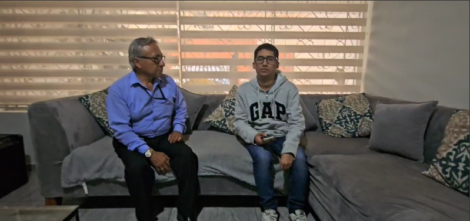
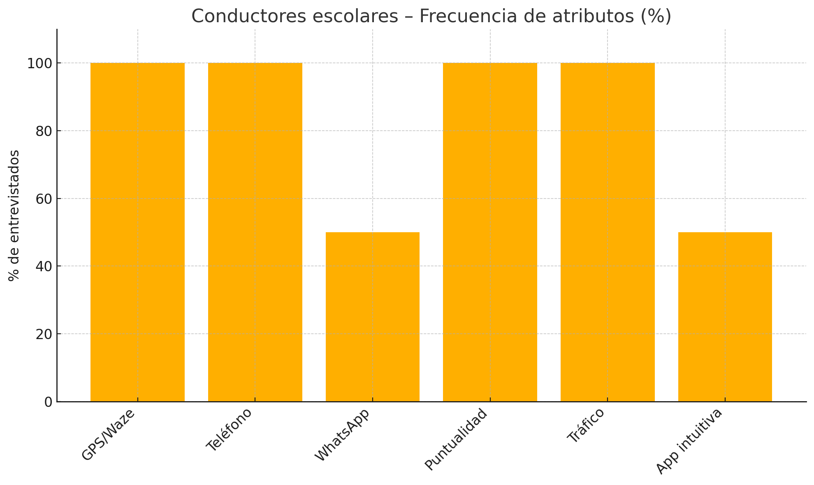
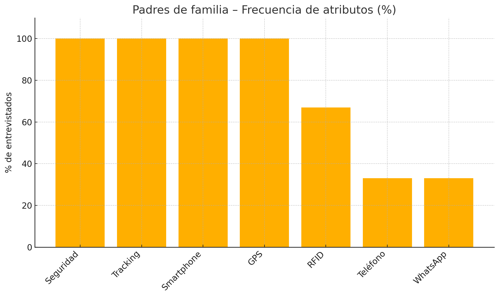
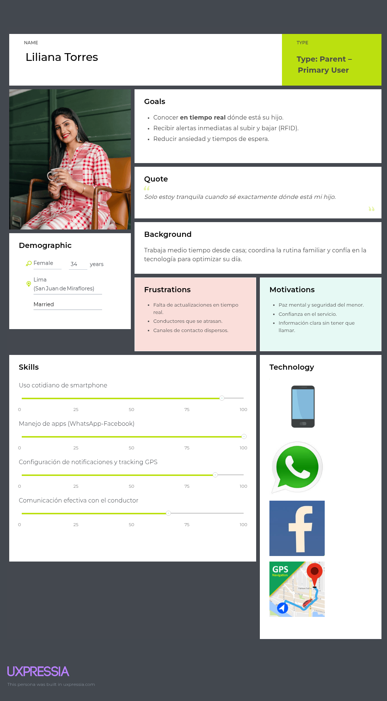
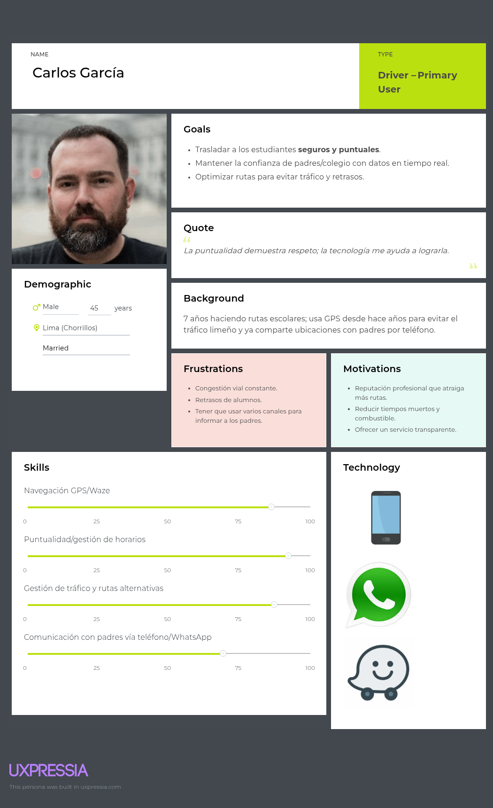

# Capítulo II: Requirements Elicitation & Analysis

## 2.1. Competidores.

A continuación se presentan los competidores principales en el mercado de aplicaciones para transporte escolar, destacando sus características y funcionalidades clave:

| Nombre del Competidor | Descripción de la Aplicación                                                                                                                             |
| --------------------- | -------------------------------------------------------------------------------------------------------------------------------------------------------- |
| titiGO                | Plataforma de movilidad segura para escolares que permite rastreo GPS en tiempo real y comunicación entre padres y transportistas.                       |
| EduTransport          | Sistema digital integral de gestión de transporte escolar enfocado en colegios privados, con apps para padres y choferes, control de rutas y asistencia. |
| Buseta Segura         | Aplicación enfocada en ofrecer seguimiento básico de rutas escolares mediante geolocalización, pensada para padres que priorizan seguridad y control.    |

### 2.1.1. Análisis competitivo.

¿Por qué llevar a cabo este análisis? Necesitamos conocer las estrategias de nuestros
competidores para tener un lugar en el mercado y ganar fidelización de sus clientes.

| Competitive Analysis Landscape        |                                                                                                                                                                                                                                                              |
| ------------------------------------- | ------------------------------------------------------------------------------------------------------------------------------------------------------------------------------------------------------------------------------------------------------------ |
| ¿Por qué llevar a cabo este análisis? | Llevamos a cabo este análisis inicial para comprender el mercado en el que ingresamos, lo que nos permite evaluar las estrategias implementadas por plataformas ya establecidas. De esta manera, buscamos aprender tanto de sus éxitos como de sus fracasos. |

| **Nombre**              |                          |                                                                                                                                                                                                                                                                                                              | **titiGO**                                                                                                                                                                                                                       | **EduTransport**                                                                                                                                                                                          | **Buseta Segura**                                                                                                                                                                                                              |
| ----------------------- | ------------------------ | ------------------------------------------------------------------------------------------------------------------------------------------------------------------------------------------------------------------------------------------------------------------------------------------------------------ | -------------------------------------------------------------------------------------------------------------------------------------------------------------------------------------------------------------------------------- | --------------------------------------------------------------------------------------------------------------------------------------------------------------------------------------------------------- | ------------------------------------------------------------------------------------------------------------------------------------------------------------------------------------------------------------------------------ |
| **Logo**                |                          |                                                                                                                                                                                                                                                                  |                                                                                                                                         |                                                                                                                  |                                                                                                                                       |
| **Perfil**              | Overview                 | Plataforma tecnológica integral para la gestión segura del transporte escolar. Combina hardware (RFID, GPS, sensores de velocidad) y software (app móvil y web) para monitorear en tiempo real el recorrido, aforo, seguridad y asistencia de los estudiantes. Dirigida a padres, colegios y transportistas. | App enfocada en conectar a padres y transportistas escolares, permitiendo monitoreo en tiempo real, alertas y validación del traslado de los niños mediante códigos QR.                                                          | Aplicación móvil diseñada para facilitar la gestión de rutas, horarios y asistencia por parte de los conductores de transporte escolar. Enfocada principalmente en el aspecto operativo del servicio.     | Aplicación móvil centrada en la tranquilidad de los padres. Permite ver en tiempo real la ubicación del bus escolar, enviar notificaciones al inicio y fin del recorrido, y asegurar que los niños estén siendo transportados. |
|                         | Ventaja competitiva      | Solución **“todo en uno”** con monitoreo integral en tiempo real, identificación con pulseras RFID, control de aforo, alertas de velocidad y geolocalización. Alta seguridad, transparencia y confianza para padres, colegios y transportistas.                                                              | Facilidad de conexión entre padres y transportistas con **verificación rápida** del traslado mediante QR. Fuerte enfoque en simplicidad y trazabilidad.                                                                          | Optimiza la operación logística del transporte escolar, brindando **herramientas de gestión** a conductores y empresas, con interfaz sencilla para programación de rutas y horarios.                      | Experiencia centrada en padres, con **notificaciones automáticas y localización en vivo** del bus escolar. Apuesta por la tranquilidad emocional de los padres sin complicaciones técnicas.                                    |
| **Plan de Marketing**   | Mercado objetivo         | Padres de familia con hijos en etapa escolar (principalmente inicial y primaria), instituciones educativas privadas y empresas de transporte escolar en zonas urbanas con alta demanda de seguridad y control.                                                                                               | Familias con hijos en edad escolar que contratan servicios de movilidad privada o escolar, así como transportistas independientes que buscan mejorar su reputación.                                                              | Empresas de transporte escolar, colegios con flota propia, y transportistas que requieren **gestión logística** de rutas, horarios y pasajeros. Mayor enfoque en **el operador del servicio**.            | Padres de niños entre 4 y 12 años que utilizan transporte escolar, enfocados en zonas urbanas de nivel socioeconómico medio y medio-alto, preocupados por la **seguridad emocional y el seguimiento del viaje**.               |
|                         | Estrategias de marketing | -Campañas educativas en redes sociales  -Alianzas con colegios  -Planes piloto gratuitos  -Participación en ferias y programas estatales  -Testimonios y casos reales en video  -Encuestas para innovación constante                                                                          | -Publicidad en redes sociales dirigida a padres  -Alianzas con transportistas independientes  -Promoción boca a boca con código de referidos  -Marketing emocional centrado en el niño                                  | -Promociones B2B a instituciones educativas  -Demostraciones en colegios  -Publicidad dirigida en LinkedIn y Facebook Ads  -Participación en eventos de tecnología educativa                     | -Publicidad emocional dirigida a madres  -Influencers mamás y blogs familiares  -Estrategia freemium con funcionalidades limitadas  -Videos cortos mostrando cómo funciona la app                                     |
| **Perfil del producto** | Productos y servicios    | Ofrece una solución integral que incluye identificación con pulseras RFID, control de aforo, monitoreo de velocidad, rastreo GPS en tiempo real y una plataforma web y móvil para padres y conductores, todo enfocado en la seguridad y eficiencia del transporte escolar.                                   | Brinda una app móvil para seguimiento GPS del transporte escolar, con funciones de check-in manual, calificación del conductor y chat directo entre padres y transportistas.                                                     | Aplicación móvil para colegios que gestiona rutas, horarios y asistencia, con notificaciones básicas a padres y control de aforo desde el panel del conductor.                                            | Aplicación móvil para padres que permite ver la ubicación del bus en tiempo real, recibir alertas de llegada y salida, y contactar al conductor directamente.                                                                  |
|                         | Precios y costos         | Se proyecta un modelo de suscripción mensual para colegios desde S/250 por unidad de transporte, con descuentos por volumen. Incluye el acceso a la plataforma, pulseras RFID, instalación de sensores y mantenimiento básico. También se evalúa una versión gratuita limitada para pruebas piloto.          | Ofrece planes freemium con funciones básicas gratuitas y suscripción premium desde S/29.90 mensuales por familia para acceder a todas las funciones. Cobra comisiones a transportistas registrados que desean mayor visibilidad. | Aplica tarifas planas para instituciones educativas desde S/500 mensuales por gestión de flota, con costo adicional por personalización y soporte técnico. No cobra directamente a padres ni conductores. | Maneja un modelo B2C con pago único por descarga (aproximadamente S/15) y opción premium mensual desde S/12 para funciones avanzadas como alertas en tiempo real y mensajería.                                                 |
|                         | Canales de distribución  | Website y aplicación en iOS y Android.                                                                                                                                                                                                                                                                       | App Store, Google Play, redes sociales, campañas con transportistas.                                                                                                                                                             | Sitio web y aplicación móvil.                                                                                                                                                                             | Sitio web y aplicación móvil.                                                                                                                                                                                                  |
| **Análisis SWOT**       | Fortalezas               | Sistema integral con múltiples funcionalidades (RFID, sensores, GPS), enfoque en seguridad familiar, modelo escalable.                                                                                                                                                                                       | Interfaz amigable, buena adopción en el mercado, presencia en tiendas digitales, funcionalidades útiles para padres.                                                                                                             | Enfoque empresarial sólido, integración con sistemas escolares, soporte técnico personalizado.                                                                                                            | Accesibilidad económica, fácil descarga, enfoque directo en la experiencia del usuario final (padres).                                                                                                                         |
|                         | Oportunidades            | Alianzas con colegios y municipalidades, participación en ferias tecnológicas, acceso a programas de financiamiento estatal.                                                                                                                                                                                 | Expansión a más ciudades, inclusión de nuevas funcionalidades, alianzas con empresas de transporte escolar.                                                                                                                      | Crecimiento del interés en soluciones de gestión escolar, posibilidad de internacionalización.                                                                                                            | Aumento del uso de apps móviles por parte de padres, expansión a colegios de zonas urbanas.                                                                                                                                    |
|                         | Debilidades              | Proyecto en fase temprana, aún sin posicionamiento de marca ni base de usuarios consolidada.                                                                                                                                                                                                                 | Limitada personalización del sistema, dependencia de GPS sin otras tecnologías complementarias.                                                                                                                                  | Costo elevado para instituciones pequeñas, curva de aprendizaje moderada para usuarios nuevos.                                                                                                            | Funcionalidades básicas, no incluye monitoreo de aforo ni integración con instituciones educativas.                                                                                                                            |
|                         | Amenazas                 | Competencia con empresas ya posicionadas, resistencia al cambio por parte de transportistas tradicionales, dependencia de dispositivos tecnológicos (RFID, sensores)..                                                                                                                                       | Aparición de soluciones más completas, problemas de conectividad en zonas alejadas.                                                                                                                                              | Entrada de nuevos competidores con precios más accesibles, cambios en normativas educativas.                                                                                                              | Limitada capacidad para escalar el modelo, baja diferenciación frente a otras apps.                                                                                                                                            |

### 2.1.2. Estrategias y tácticas frente a competidores.

Con base en el análisis competitivo efectuado anticipadamente, se logró identificar con exactitud las fortalezas, debilidades, oportunidades y amenazas destacadas de los
competidores. Dicha información resulta relevante para plasmar estrategias y tácticas de superación hacia la competencia:
 

1.  **Desarrollar una Propuesta de Valor Única:**
    - Estrategia: Ofrecer un sistema integral que combina identificación con pulseras RFID, monitoreo de aforo, control de velocidad y geolocalización en tiempo real, orientado a la tranquilidad de los padres y la seguridad de los escolares.
    - Táctica: Resaltar nuestra solución como una plataforma “todo en uno” que no solo informa, sino que también previene incidentes y permite una gestión transparente y en tiempo real del transporte escolar.   
2.  **Enfoque en la Confianza y Seguridad Familiar:**
    - Estrategia: Construir confianza entre los padres mediante funcionalidades tecnológicas que respalden la seguridad del menor desde que sube hasta que baja del vehículo.
    - Táctica: Notificaciones automáticas al celular de los padres cuando sus hijos abordan o descienden del vehículo, alertas de exceso de velocidad y acceso visual en tiempo real al recorrido vía app.   
3.  **Ampliar la Base de Usuarios mediante alianzas con colegios:**
    - Estrategia: Establecer convenios con instituciones educativas para facilitar la adopción del sistema por parte de transportistas asociados y padres de familia.
    - Táctica: Ofrecer planes piloto gratuitos en colegios estratégicos, con capacitación a transportistas y charlas informativas para padres.   
4.  **Marketing Digital con Enfoque Educativo:**
    - Estrategia: Educar a los padres y conductores sobre los riesgos del transporte informal y los beneficios del uso de tecnología en la gestión escolar.
    - Táctica: Campañas en redes sociales con testimonios, estadísticas, casos reales y videos demostrativos mostrando el funcionamiento del sistema.   
5.  **Innovación Continua y Escalabilidad:**

    - Estrategia: Adaptar y mejorar el sistema según feedback de usuarios para responder a las necesidades reales del entorno escolar.
    - Táctica: Implementar encuestas de satisfacción dentro de las apps, crear un sistema modular para integrar nuevas funciones como reconocimiento facial o sensores de temperatura si el contexto lo requiere.   

6.  **Marketing Digital con Enfoque Educativo:**
    - Estrategia: Formar alianzas con empresas tecnológicas, municipalidades o el MTC para escalar el modelo e integrarlo en políticas de movilidad segura.
    - Táctica: Participar en ferias de innovación educativa, presentar el proyecto a programas de financiamiento estatal (como ProInnóvate o Startup Perú) y vincularse con ONG que promuevan la seguridad vial infantil.

## 2.2. Entrevistas.

### 2.2.1. Diseño de entrevistas.

**Preguntas generales**

1. ¿Cuál es su nombre?
2. ¿Qué edad tiene?
3. ¿En qué distrito reside?
4. ¿Cuál es su ocupación actual?
5. ¿Cuántos hijos tiene y en qué nivel escolar están? (Solo para padres)

**Preguntas para los padres**

1. ¿Cómo trasladan sus hijos al colegio actualmente?
2. ¿Ha tenido alguna preocupación relacionada con la seguridad durante el transporte escolar?
3. ¿Qué tipo de información le gustaría recibir en tiempo real sobre el transporte de sus hijos?
4. ¿Cómo suele comunicarse con el conductor o con la empresa de transporte?
5. ¿Está familiarizado/a con el uso de tecnología como GPS o pulseras RFID?
6. ¿Qué lo motivaría a cambiar de proveedor de transporte escolar?
7. ¿Qué aplicaciones o redes sociales utiliza con mayor frecuencia para mantenerse informado?

**Preguntas para los conductores**

1. ¿Cuántos años tiene de experiencia en transporte escolar?
2. ¿Cómo organiza sus rutas y controla la cantidad de estudiantes en la unidad?
3. ¿Se ha comunicado con los padres durante el servicio? ¿Cómo suele hacerlo?
4. ¿Está familiarizado con el uso de GPS, sensores u otras tecnologías para el monitoreo de rutas?
5. ¿Qué problemas comunes enfrenta en su trabajo diario?
6. ¿Qué tan importante considera la puntualidad y seguridad en su trabajo?
7. ¿Qué necesitaría para adaptarse fácilmente a un sistema tecnológico como el que ofrece CodeMinds?

### 2.2.2. Registro de entrevistas.

A continuación, se presentan las entrevistas de Needfinding:

### Segmento 1 - Conductores escolares

#### Entrevista 1

**Identificación del entrevistado**

- **Nombre completo:** Víctor Gonzáles Cabell
- **Edad:** 69 años
- **Distrito de residencia:** Chorrillos
- **Ocupación:** Taxista y transportista escolar

**Referencia audiovisual**

- **Screenshot:**

- **Timecode inicio / duración:** `00:00:39 / 08:02`

Víctor transporta hasta **7 estudiantes** de distintos grados (inicial, primaria y secundaria) hacia dos colegios, adaptándose a horarios variados. Se comunica con los padres por **teléfono** o **cedulación** al recoger a los alumnos. Es **estricto con la puntualidad** y siempre dispuesto a ayudar. Sus desafíos principales son el **tráfico** y los retrasos de los alumnos, por lo que utiliza el **aplicativo del GPS** para monitorear sus rutas y mejorar la experiencia de servicio.

_Estos hallazgos refuerzan los atributos de puntualidad, uso de tecnología GPS y gestión de múltiples rutas del arquetipo «Conductor escolar responsable»._

---

#### Entrevista 2

**Identificación del entrevistado**

- **Nombre completo:** Eduardo Araujo
- **Edad:** 27 años
- **Distrito de residencia:** Villa María (Lima)
- **Ocupación:** Taxista y transportista escolar

**Referencia audiovisual**

- **Screenshot:**

- **Timecode inicio / duración:** `00:08:15 / 02:08`

Eduardo realiza **rutas de movilidad escolar** en Villa María. Se comunica con los padres mediante **llamadas telefónicas** y **WhatsApp**. Valora la **puntualidad** y la **seguridad** de los viajes. Entre sus desafíos menciona el **tráfico**, el **mal estado de las pistas** y la **desconfianza de los padres**. Utiliza **Waze** y considera que una aplicación **sencilla e intuitiva** sería beneficiosa para su trabajo diario.

_Estos hallazgos respaldan los atributos de enfoque en seguridad, uso de navegación Waze y necesidad de una app intuitiva del arquetipo «Conductor escolar responsable»._

| Pregunta                                                                                          | Timestamp | Respuesta                                                                                                                                                                                |
| ------------------------------------------------------------------------------------------------- | --------- | ---------------------------------------------------------------------------------------------------------------------------------------------------------------------------------------- |
| ¿Cuál es su nombre?                                                                               | 08:16     | Eduardo Araujo                                                                                                                                                                           |
| ¿Qué edad tiene?                                                                                  | 08:21     | Tengo 27 años.                                                                                                                                                                           |
| ¿En qué distrito reside?                                                                          | 08:26     | Villa Maria del Triunfo.                                                                                                                                                                 |
| ¿Cuál es su ocupación actual?                                                                     | 08:31     | Actualmente me dedico a lo que es el chofer y bueno conductor de movilidad escolar                                                                                                       |
| ¿Cuántos años tiene de experiencia en transporte escolar?                                         | 08:41     | En el transporte escolar llevo ya ejerciendo los 3 años                                                                                                                                  |
| ¿Cómo organiza sus rutas y controla la cantidad de estudiantes en la unidad?                      | 08:52     | En mi caso, lo hago de forma empírica mediante el aplicativo del Waze y el contacto directo con los padres.                                                                              |
| ¿Se ha comunicado con los padres durante el servicio? ¿Cómo suele hacerlo?                        | 09:08     | frecuentemente si lo hago mediante llamadas por mensajes o también por Whatsapp.                                                                                                         |
| ¿Está familiarizado con el uso de GPS, sensores u otras tecnologías para el monitoreo de rutas?   | 09:26     | Sensores no, de por sí no, pero con el tema del GPS sí. Con respecto al uso del aplicativo del Waze                                                                                      |
| ¿Qué problemas comunes enfrenta en su trabajo diario?                                             | 09:47     | De por sí el tráfico, las pistas en mal estado, la falta de comunicación y confianza por parte también del padre de familia.                                                             |
| ¿Qué tan importante considera la puntualidad y seguridad en su trabajo?                           | 10:09     | astante importante, porque como estoy ligado bajo el horario de entrada y salida de los colegios tenemos que estar, digamos, en hora exacto                                              |
| ¿Qué necesitaría para adaptarse fácilmente a un sistema tecnológico como el que ofrece CodeMinds? | 10:31     | Primero, que sea intuitivo, que tenga funciones precisas,Que no sea tampoco tan saturado, porque sino me voy a estar distrayendo al momento de manejar y eso es lo que se quiere evitar. |

---

### Segmento 2 - Padres de Familia

#### Entrevista 1

**Identificación del entrevistado**

- **Nombre completo:** Sebastian Campero Fernandez
- **Edad:** 27
- **Distrito de residencia:** Chorrillos
- **Ocupación:** Operario de picking en centro de distribución
- **Hijo(s):** 1 hijo de 5 años (nivel inicial)

**Referencia audiovisual**

- **Screenshot:** 

- **Timecode inicio / duración:** `00:20:28 / 04:35`

Sebastián es un padre **precavido y orientado a la seguridad**. Maneja tecnología con soltura: usa a diario su **smartphone Android con GPS** y entiende el funcionamiento de las **pulseras RFID**. Se comunica principalmente por **WhatsApp**, complementándolo con llamadas y SMS; para noticias revisa **Facebook** y **Twitter**.  
Su **objetivo principal** es garantizar que su hijo de 5 años llegue seguro al colegio y recibir **notificaciones en tiempo real** sobre la ruta, paradas y velocidad del bus. Sus **frustraciones** incluyen la falta de monitoreo adecuado y no saber si el conductor respeta las normas de tránsito. Valora proveedores que integren **GPS y RFID** con alertas push y que certifiquen la capacitación de los conductores. Está dispuesto a **cambiar de servicio** si le ofrecen mayor control y transparencia en la operación.

_Estos hallazgos sustentan los atributos de seguridad, monitoreo en tiempo real y canal preferido WhatsApp del arquetipo «Padre preocupado por la seguridad»._

| Pregunta                                                                                                                | Timestamp | Respuesta                                                                                                                                                                                                                                                                                                                                                                 |
| ----------------------------------------------------------------------------------------------------------------------- | --------- | ------------------------------------------------------------------------------------------------------------------------------------------------------------------------------------------------------------------------------------------------------------------------------------------------------------------------------------------------------------------------- |
| ¿Cuál es su nombre?                                                                                                     | 20:29     | Sebastián Campero.                                                                                                                                                                                                                                                                                                                                                        |
| ¿Qué edad tiene?                                                                                                        | 20:32     | 27 años.                                                                                                                                                                                                                                                                                                                                                                  |
| ¿En qué distrito reside?                                                                                                | 20:39     | Vivo en el distrito de Chorrillos.                                                                                                                                                                                                                                                                                                                                        |
| ¿Cuál es su ocupación actual?                                                                                           | 20:40     | Trabajo como operario en un centro de distribución, encargado del picking y manejo de inventarios.                                                                                                                                                                                                                                                                        |
| ¿Cuántos hijos tiene y en qué nivel escolar están?                                                                      | 20:52     | Tengo un hijo de 5 años, está en inicial.                                                                                                                                                                                                                                                                                                                                 |
| ¿Cómo trasladan sus hijos al colegio actualmente?                                                                       | 21:06     | Mi hijo viaja en transporte escolar. Una empresa local lo recoge en casa todas las mañanas y lo deja en la puerta del colegio.                                                                                                                                                                                                                                            |
| ¿Ha tenido alguna preocupación relacionada con la seguridad durante el transporte escolar?                              | 21:28     | Sí, especialmente por saber si mi hijo llega seguro y si el conductor está respetando las reglas de tránsito. A veces me preocupa que el transporte no esté siendo monitoreado adecuadamente.                                                                                                                                                                             |
| ¿Qué tipo de información le gustaría recibir en tiempo real sobre el transporte de sus hijos?                           | 21:52     | Me gustaría saber la ubicación exacta del bus, si mi hijo ya ha subido al transporte, si hay algún retraso y si el bus está respetando el límite de velocidad. También, sería ideal recibir notificaciones si mi hijo ha llegado a la escuela o si se está retrasando.                                                                                                    |
| ¿Le gustaría tener la opción de realizar seguimiento de la ubicación en tiempo real del bus desde una aplicación móvil? | 22:26     | Sí, me gustaría mucho poder saber en todo momento dónde está el bus, así puedo estar tranquilo sabiendo cuándo llegará o si hay algún retraso.                                                                                                                                                                                                                            |
| ¿Cómo suele comunicarse con el conductor o con la empresa de transporte?                                                | 22:56     | Normalmente me comunico con el conductor a través de llamadas o mensajes de texto. Si hay algún problema, contacto a la empresa por medio de su número de atención al cliente.                                                                                                                                                                                            |
| ¿Está familiarizado/a con el uso de tecnología como GPS o pulseras RFID?                                                | 23:16     | Sí, estoy familiarizado. Utilizo el GPS en mi teléfono a diario y sé cómo funcionan las pulseras RFID. Me parece que esta tecnología podría ayudar mucho para mantener el control del transporte escolar.                                                                                                                                                                 |
| ¿Qué lo motivaría a cambiar de proveedor de transporte escolar?                                                         | 23:39     | La principal motivación sería la seguridad. Si otro proveedor me garantiza que mi hijo estará más monitoreado y que recibiría notificaciones en tiempo real sobre su estado durante el transporte, lo consideraría. También, me gustaría si tuvieran alguna forma de verificar que los conductores están capacitados y que cumplen con todas las normativas de seguridad. |
| ¿Qué aplicaciones o redes sociales utiliza con mayor frecuencia para mantenerse informado?                              | 24:12     | Uso bastante WhatsApp para comunicación rápida. También, reviso Facebook y Twitter para estar al tanto de noticias y novedades. Además, tengo algunas apps de seguimiento de rutas y transporte, pero no me convencen del todo.                                                                                                                                           |

---

#### Entrevista 2

**Identificación del entrevistado**

- **Nombre completo:** Liliana Ramírez
- **Edad:** 56 años
- **Distrito de residencia:** San Juan de Miraflores
- **Ocupación:** Ama de casa
- **Hijo(s):** 1 hijo de 14 años (secundaria)

**Referencia audiovisual**

- **Screenshot:** 

- **Timecode inicio / duración:** `00:11:10 / 04:54`

Liliana siente una **preocupación constante por la falta de información en tiempo real** sobre el transporte escolar. Quiere recibir notificaciones claras de la **ubicación del bus** y confirmaciones cuando su hijo sube o baja. Conoce el uso de **GPS** y, aunque no maneja la tecnología **RFID**, muestra interés en aprender. Consideraría **cambiar de proveedor** si percibe fallas en la seguridad o en la comunicación con los padres.

_Estos hallazgos refuerzan los atributos de necesidad de rastreo en tiempo real y comunicación efectiva del arquetipo «Padre preocupado por la seguridad»._

| Pregunta                                                                                      | Timestamp | Respuesta                                                                                                                                                          |
| --------------------------------------------------------------------------------------------- | --------- | ------------------------------------------------------------------------------------------------------------------------------------------------------------------ |
| ¿Cuál es su nombre?                                                                           | 11:13     | Liliana Ramirez.                                                                                                                                                   |
| ¿Qué edad tiene?                                                                              | 11:17     | 56 años.                                                                                                                                                           |
| ¿En qué distrito reside?                                                                      | 11:22     | Vivo en San Juan de Miraflores.                                                                                                                                    |
| ¿Cuál es su ocupación actual?                                                                 | 11:30     | Soy ama de casa.                                                                                                                                                   |
| ¿Cuántos hijos tiene y en qué nivel escolar están?                                            | 11:34     | Tengo un hijo de 14 años y está en secundaria.                                                                                                                     |
| ¿Cómo trasladan sus hijos al colegio actualmente?                                             | 11:57     | Actualmente traslado a mi hijo en el servicio de movilidad privada brindado por el colegio.                                                                        |
| ¿Ha tenido alguna preocupación relacionada con la seguridad durante el transporte escolar?    | 12:35     | Sí, me preocupa no saber si mi hijo ya llegó al colegio o si la movilidad ha tenido algun accidente en la ruta.                                                    |
| ¿Qué tipo de información le gustaría recibir en tiempo real sobre el transporte de sus hijos? | 12:55     | Me gustaría recibir la ubicación en tiempo real del vehículo, alertas cuando mi hijo sube o baja de la movilidad, y notificaciones si hay algún cambio en la ruta. |
| ¿Cómo suele comunicarse con el conductor o con la empresa de transporte?                      | 13:42     | Usualmente por Whatsapp mediante el grupo de padres donde también se encuentra el conductor de la movilidad.                                                       |
| ¿Está familiarizado/a con el uso de tecnología como GPS o pulseras RFID?                      | 14:19     | Sí, he usado aplicaciones que muestran ubicación en el tiempo real de vehículos como Uber, pero no he escuchado acerca de las pulseras RFID.                       |
| ¿Qué lo motivaría a cambiar de proveedor de transporte escolar?                               | 14:55     | Principalmente la falta de comunicación o algún accidente que involucre al conductor.                                                                              |
| ¿Qué aplicaciones o redes sociales utiliza con mayor frecuencia para mantenerse informado?    | 15:29     | Principalmente WhatsApp para mensajería y Facebook para enterarme de novedades relacionadas a la institución.                                                      |

---

#### Entrevista 3

**Identificación del entrevistado**

- **Nombre completo:** Janetlis Colón
- **Edad:** 29 años
- **Distrito de residencia:** Miraflores
- **Ocupación:** Diseñadora gráfica
- **Hijo(s):** 1 hijo pequeño (inicial / primaria)

**Referencia audiovisual**

- **Screenshot:**

- **Timecode inicio / duración:** `24:47 / 27:12`

Janetlis valora la **seguridad durante el traslado escolar** y desea **información en tiempo real**. Quiere alertas sobre la ubicación del vehículo y cuando su hijo suba o baje. Está familiarizada con **GPS** y aplicaciones móviles; aunque no ha usado **RFID**, está dispuesta a conocer su aplicación en el transporte escolar. Cambiaría de proveedor si detecta **deficiencias en seguridad** o en la **comunicación directa** con los padres.

_Estos hallazgos respaldan los atributos de seguridad, monitoreo en tiempo real y apertura a nuevas tecnologías del arquetipo «Padre preocupado por la seguridad»._

| Pregunta                                                                                      | Timestamp | Respuesta                                                                                                                                                    |
| --------------------------------------------------------------------------------------------- | --------- | ------------------------------------------------------------------------------------------------------------------------------------------------------------ |
| ¿Cuál es su nombre?                                                                           | 24:47     | Janetlis.                                                                                                                                                    |
| ¿Qué edad tiene?                                                                              | 24:50     | 27 años.                                                                                                                                                     |
| ¿En qué distrito reside?                                                                      | 24:53     | Vivo en Lima, Miraflores.                                                                                                                                    |
| ¿Cuál es su ocupación actual?                                                                 | 24:58     | Diseño gráfico.                                                                                                                                              |
| ¿Cuántos hijos tiene y en qué nivel escolar están?                                            | 25:02     | Tengo un hijo y está en la primaria.                                                                                                                         |
| ¿Cómo trasladan sus hijos al colegio actualmente?                                             | 25:15     | Actualmente traslado a mi hijo en la movilidad escolar privada, contratada directamente con el conductor que no recomendado.                                 |
| ¿Ha tenido alguna preocupación relacionada con la seguridad durante el transporte escolar?    | 25:31     | Sí, siempre está la preocupación de no saber exactamente dónde está el vehículo, si se traza o si hubo algún inconveniente en el camino.                     |
| ¿Qué tipo de información le gustaría recibir en tiempo real sobre el transporte de sus hijos? | 25:50     | Me gustaría recibir la ubicación en tiempo real del vehículo, alertas cuando mi hijo sube o baja de la movilidad, y notificaciones si hay retrasos.          |
| ¿Cómo suele comunicarse con el conductor o con la empresa de transporte?                      | 26:15     | Usualmente por Whatsapp o llamada telefónica directamente al conductor.                                                                                      |
| ¿Está familiarizado/a con el uso de tecnología como GPS o pulseras RFID?                      | 26:30     | Sí, he usado aplicaciones que muestran ubicación en el tiempo real y también he escuchado del uso de la pulsera RFID para registrar asistencia.              |
| ¿Qué lo motivaría a cambiar de proveedor de transporte escolar?                               | 26:50     | Principalmente la seguridad, la puntualidad y la calidad de la comunicación con los padres. Si el servicio ofreciera mejor control y seguimiento, cambiaría. |
| ¿Qué aplicaciones o redes sociales utiliza con mayor frecuencia para mantenerse informado?    | 27:12     | Principalmente WhatsApp, Facebook y algunas veces Instagram. También reviso noticias locales a través de aplicaciones móviles.                               |

---

**URL Microsoft Stream:** https://shorturl.at/dG1cx

### 2.2.3. Análisis de entrevistas

> Fuente de datos: resúmenes de las entrevistas registradas en  
> **2 conductores escolares (E‑C1, E‑C2)** y **3 padres de familia (E‑P1, E‑P2, E‑P3)**.  
> Para cada segmento se cuantificaron las respuestas y se calculó el  
> **porcentaje (%) = (frecuencia / n del segmento × 100)** de las
> características que se repiten con mayor fuerza y que serán la base de los
> arquetipos.

---

### 1. Frecuencias cuantitativas

#### Segmento 1 – Conductores escolares (n = 2)

| Característica                                    | Evidencia  | % (n)         |
| ------------------------------------------------- | ---------- | ------------- |
| **Uso de navegación GPS / Waze**                  | E‑C1, E‑C2 | **100 % (2)** |
| **Comunicación con padres por teléfono**          | E‑C1, E‑C2 | **100 % (2)** |
| Comunicación adicional por **WhatsApp**           | E‑C2       | 50 % (1)      |
| **Puntualidad** mencionada como valor central     | E‑C1, E‑C2 | **100 % (2)** |
| **Tráfico** citado como principal desafío         | E‑C1, E‑C2 | **100 % (2)** |
| **Deseo de app intuitiva** que mejore el servicio | E‑C2       | 50 % (1)      |

#### Segmento 2 – Padres de familia (n = 3)

| Característica                               | Evidencia          | % (n)         |
| -------------------------------------------- | ------------------ | ------------- |
| **Preocupación por la seguridad del hijo**   | E‑P1, E‑P2, E‑P3   | **100 % (3)** |
| **Notificaciones / tracking en tiempo real** | E‑P1, E‑P2, E‑P3   | **100 % (3)** |
| **Uso habitual de smartphone**               | E‑P1, E‑P2\*, E‑P3 | **100 % (3)** |
| Familiaridad con **GPS**                     | E‑P1, E‑P2, E‑P3   | **100 % (3)** |
| Conocimiento / apertura a **RFID**           | E‑P1, E‑P3         | 67 % (2)      |
| Comunicación con transporte por **teléfono** | E‑P2               | 33 % (1)      |
| Comunicación con transporte por **WhatsApp** | E‑P1               | 33 % (1)      |

\*E‑P2 usa GPS vía móvil aunque no menciona explícitamente “smartphone”.

---

### 2. Visualización de frecuencias

  
_Fig. 1  Atributos con mayor repetición en conductores escolares_

  
_Fig. 2  Atributos con mayor repetición en padres de familia_

_(Los gráficos de barras muestran el mismo % que las tablas, facilitando la
comprensión visual de la dominancia de cada rasgo.)_

---

### 3. Matriz de trazabilidad → User Personas

| Atributo (≥ 67 %) | %     | Campo en **Conductor** Persona                           |
| ----------------- | ----- | -------------------------------------------------------- |
| GPS/Waze          | 100 % | **Skill** “Navegación GPS/Waze”; **Technology** icon     |
| Puntualidad       | 100 % | **Skill** + **Goal** “Puntualidad / gestión de horarios” |
| Tráfico como reto | 100 % | **Frustration**                                          |
| Teléfono          | 100 % | **Skill** + **Technology** “Comunicación teléfono”       |
| WhatsApp          | 50 %  | **Skill** + **Technology** “WhatsApp” (slider 70 %)      |

| Atributo (≥ 67 %)       | %        | Campo en **Padre** Persona                                          |
| ----------------------- | -------- | ------------------------------------------------------------------- |
| Seguridad               | 100 %    | **Goal** + **Motivation**                                           |
| Tracking en tiempo real | 100 %    | **Goal**, **Technology** (GPS)                                      |
| Smartphone & GPS        | 100 %    | **Skills** “Uso de smartphone”, “Tracking GPS”; **Technology** icon |
| RFID (apertura)         | 67 %     | **Technology** (RFID tag)                                           |
| WhatsApp / Teléfono     | 33 % c/u | **Skill** “Comunicación con conductor”; slider ajustado a ~60 %     |

> **Interpretación:** Cada campo incluido en las fichas de User Persona se
> apoya en un atributo que alcanza al menos 50 % de frecuencia; los atributos
> ≥ 67 % se consideran representativos del segmento y, por tanto, definen Skills,
> Goals, Motivations, Frustrations y Technology en la plantilla de Uxpressia.

---

### 4. Conclusión

Los porcentajes y gráficas confirman que:

- Conductores → dominan GPS/Waze, puntualidad y lidian con el tráfico.
- Padres → priorizan seguridad y tracking en tiempo real vía smartphone + GPS.

Por ello, los arquetipos **«Conductor escolar responsable»** y
**«Padre preocupado por la seguridad»** reflejan fielmente la evidencia
recogida en las entrevistas.

## 2.3. Needfinding.

En esta sección, se buscarán las necesidades implícitas y explícitas de las personas o
segmentos para poder diseñar y adaptar el producto solución de manera apropiada.

### 2.3.1. User Personas.

A continuación, se presentan los User Persona para ambos segmentos objetivo: Padre de Familia
y Conductores de unidades de transporte. Se están tomando todas las características recolectadas de las entrevistas
y de esta manera se elaboraron las fichas de nuestros arquetipos.

**Padre de Familia**

**Conductores de unidades de transporte**

### 2.3.2. User Task Matrix.

Se consideraron los **dos segmentos objetivo** identificados en las entrevistas y formalizados como User Personas:

1. **Padre/Madre preocupado(a) por la seguridad** (PP)
2. **Conductor escolar responsable** (CE)

Las tareas listadas son aquellas que **ambos segmentos realizan en la vida real para cumplir sus objetivos**, independientemente de que exista la solución propuesta.  
Escala utilizada:

| Valor | Frecuencia         | Importancia |
| ----- | ------------------ | ----------- |
| 1     | Muy rara vez       | Muy baja    |
| 2     | Ocasionalmente     | Baja        |
| 3     | A veces            | Media       |
| 4     | Frecuentemente     | Alta        |
| 5     | Siempre / a diario | Muy alta    |

### Matriz de tareas

| Tarea clave                                     | PP Freq | PP Imp | CE Freq | CE Imp |
| ----------------------------------------------- | :-----: | :----: | :-----: | :----: |
| Preparar al niño para abordar a hora fija       |    5    |   5    |    –    |   –    |
| Verificar que el niño suba al vehículo (bordo)  |    4    |   5    |    5    |   5    |
| Verificar que el niño baje en destino           |    4    |   5    |    5    |   5    |
| Consultar ubicación del vehículo en ruta        |    5    |   5    |    –    |   –    |
| Revisar velocidad / conducción segura           |    3    |   4    |    5    |   5    |
| Comunicarse con el conductor ante incidencias   |    3    |   5    |    4    |   5    |
| Evaluar / elegir proveedor de transporte seguro |    2    |   4    |    –    |   –    |
| Navegar la ruta evitando tráfico (GPS/Waze)     |    –    |   –    |    5    |   5    |
| Planificar rutas y horarios múltiples escuelas  |    –    |   –    |    4    |   5    |
| Verificar identidad del alumno (RFC / lista)    |    –    |   –    |    5    |   5    |
| Registrar aforo y cumplir normativa             |    –    |   –    |    5    |   4    |
| Manejar retrasos o tráfico imprevisto           |    –    |   –    |    4    |   5    |
| Informar retrasos a padres / colegio            |    –    |   –    |    4    |   5    |

_(“–” indica que la tarea no corresponde al segmento.)_

### Observaciones

- **Tareas críticas y compartidas**

  - _Verificar abordo / descenso_ y _comunicación ante incidencias_ alcanzan **frecuencia ≥ 4** e **importancia = 5** para ambos segmentos — son el núcleo de la interacción y deben quedar totalmente cubiertas por la solución.

- **Diferencias notables**

  - **Padres** concentran su esfuerzo en _monitorizar_ (ubicación, seguridad) y _preparar_ al niño; no navegan rutas.
  - **Conductores** se enfocan en _navegación_, _puntualidad_, _verificación de identidad_ y _gestión de tráfico_; no evalúan proveedores.

- **Coincidencias**
  - Ambos valoran la **comunicación eficaz** — aunque la frecuencia varía (PP = 3, CE = 4), la importancia es máxima (5).
  - **Seguridad** subyace a cada tarea: para padres en forma de tracking/velocidad; para conductores en control de aforo y conducción responsable.

Estos hallazgos confirmaron las funcionalidades prioritarias de la solución (notificaciones RFID, rastreo GPS, canal de mensajería integrado y panel de control de aforo/velocidad).

### 2.3.3. User Journey Mapping.

En esta sección se presenta el mapeo de la experiencia actual de los distintos usuarios involucrados en el sistema de transporte escolar, antes de la implementación de la solución tecnológica propuesta por CodeMinds. El objetivo es entender el recorrido que realizan los usuarios desde que surge la necesidad de asegurar un traslado escolar eficiente y seguro, hasta la ejecución diaria del servicio de transporte, identificando sus frustraciones, emociones, tareas y canales utilizados.
Se han identificado distintos segmentos como padres de familia y conductores de movilidad escolar, y para cada uno se ha trazado su journey en el contexto real, evidenciando los principales puntos de dolor y oportunidades de mejora en el proceso actual.

- User Journey Mapping (Padre de familia)
  .png>)
- User Journey Mapping (Conductor)
  .png>)

### 2.3.4. Empathy Mapping.

En este apartado se presenta el Empathy Mapping, una herramienta que utilizamos para comprender mejor al usuario desde una perspectiva más humana. A través de este mapa, identificamos lo que el usuario piensa, siente, dice y hace, lo cual nos permite tener una visión más completa de sus necesidades, motivaciones y posibles frustraciones.

Segmento: Padre

.png>)

Segmento: Conductor
.png>)

### 2.3.5. As-is Scenario Mapping.

Para desarrollar el As-Is Scenario Mapping, se llevó a cabo un análisis detallado de los escenarios actuales de los User Personas previamente definidos, complementado con una lluvia de ideas que consideró su contexto actual, necesidades, preferencias y las condiciones del mercado. A continuación, se presentan los escenarios actuales (As-Is) correspondientes a cada User Persona identificado.

- As-Is Scenario Mapping (Conductor)
  .jpg>)
- As-Is Scenario Mapping (Padre de familia)
  .jpg>)

## 2.4. Ubiquitous Language.

En el contexto de la solucion, se ha definido un lenguaje compartido que permite una mejor comunicación entre
desarrolladores y usuarios. Estos son algunos de los términos clave:

- **Pulsera RFID (RFID Wristband):** Pulsera que lleva el estudiante, que contiene un identificador único utilizado para el registro automático al abordar o descender del transporte.

- **Identificación de estudiantes (Student Identification):** Proceso de verificar la presencia de un estudiante mediante el escaneo de su pulsera RFID al subir o bajar del vehículo.

- **Aforo (Passenger Count):** Número total de estudiantes dentro de la unidad de transporte en un momento dado, calculado a través del sistema de identificación RFID.

- **Sistema de rastreo en tiempo real (Real-time Tracking System):** Tecnología que transmite en tiempo real la ubicación y velocidad de la unidad de transporte, proporcionando datos actualizados para su monitoreo y control.

- **Notificación (Notification):** Alerta enviada a los padres cuando el estudiante sube o baja del transporte, proporcionando actualizaciones en tiempo real sobre su seguridad.

- **Monitoreo de velocidad (Speed Monitoring):** Supervisión de la velocidad del transporte escolar para garantizar el cumplimiento de los límites de velocidad y mantener la seguridad.

- **Unidad de transporte (Transport Unit):** El vehículo utilizado para trasladar a los estudiantes, equipado con tecnología de monitoreo como sistemas de identificación RFID y seguimiento en tiempo real.

- **Sistema de identificación RFID (RFID Identification System):** Dispositivo que lee la pulsera RFID del estudiante cuando sube o baja del transporte, registrando su presencia en el vehículo.

- **Ruta escolar (School Route):** Recorrido asignado para recoger y dejar a los estudiantes en puntos específicos, como su casa o la escuela.

- **Parada (Stop):** Punto de recogida o bajada de estudiantes en la ruta escolar.

- **Seguimiento en tiempo real (Real-time Tracking):** Monitoreo continuo de la ubicación y velocidad de la unidad de transporte, accesible para los padres y administradores a través de la aplicación móvil o web.
