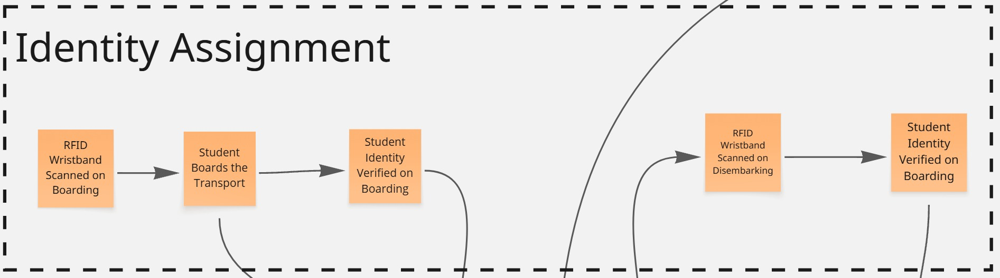
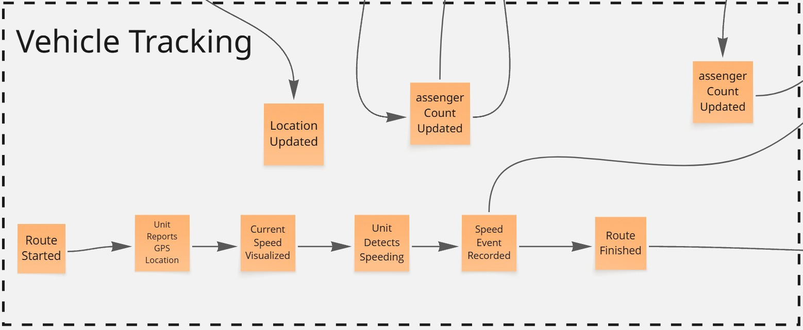
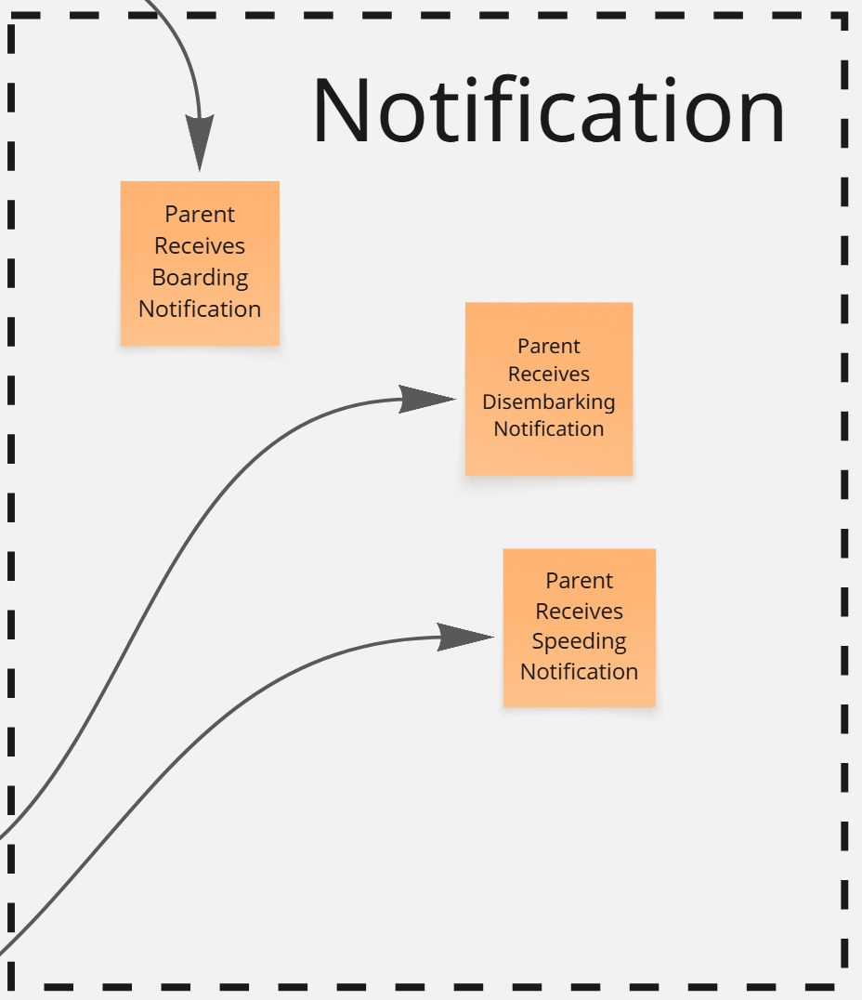
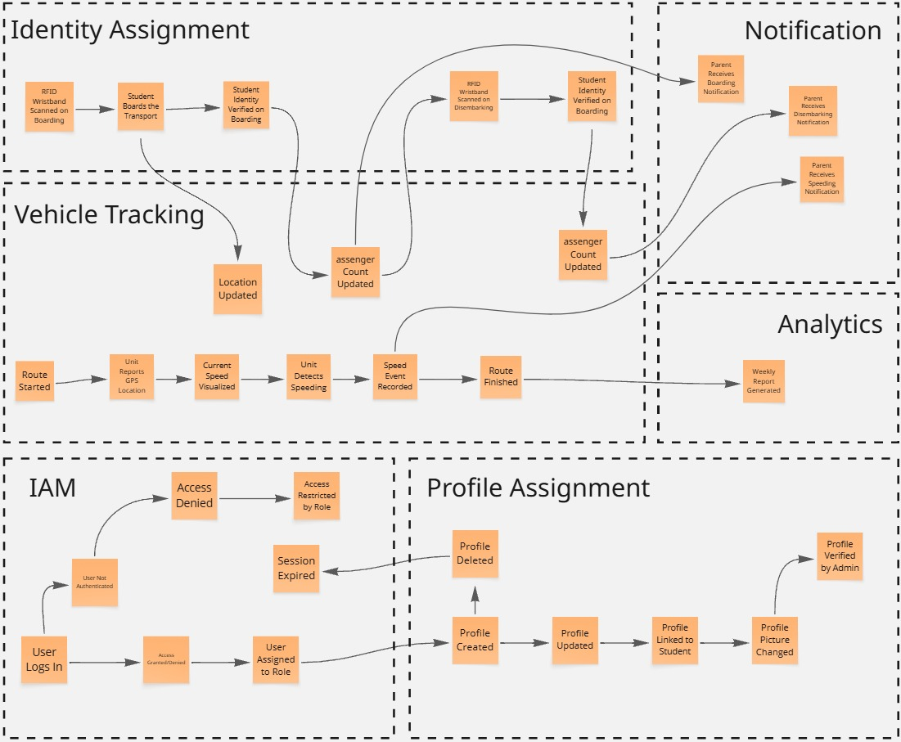
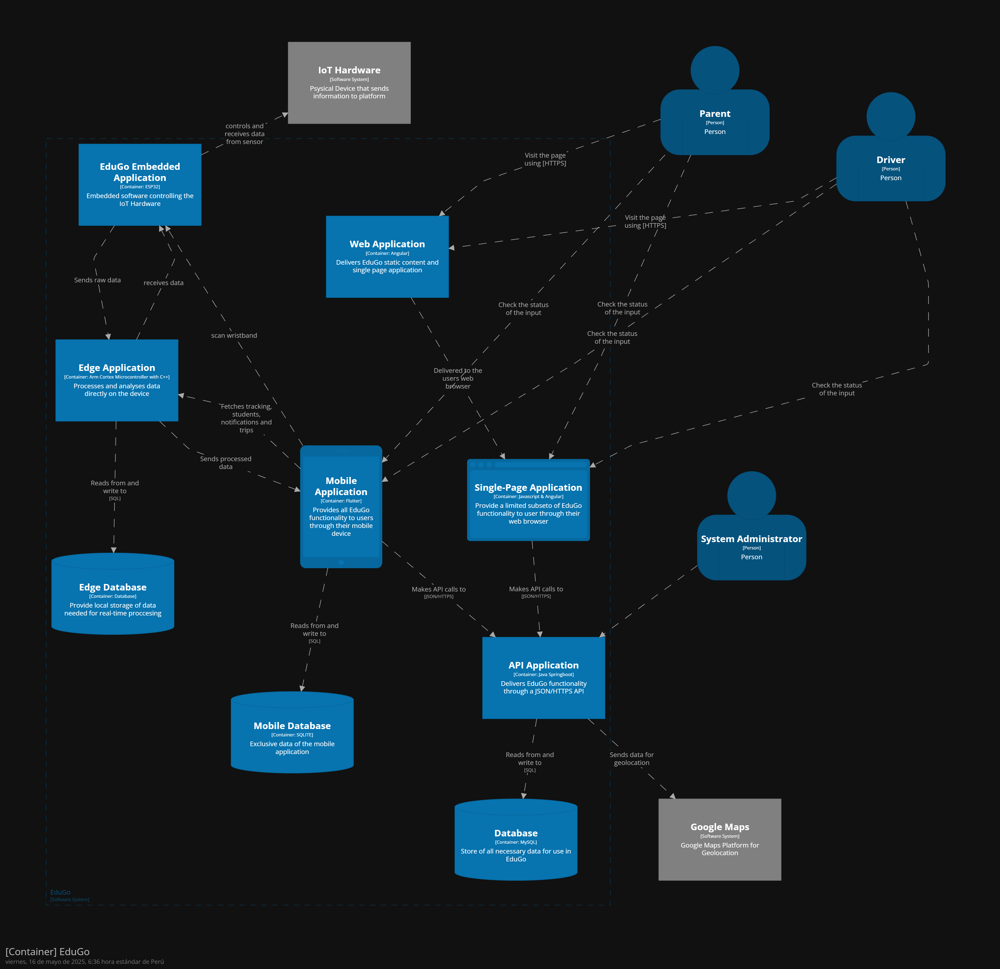

# Capítulo IV: Solution Software Design

## 4.1. Strategic-Level Domain-Driven Design.

### 4.1.1. EventStorming.

Durante la sesión de event storming, llevamos a cabo una reunión en la que compartimos nuestras ideas sobre este segmento del proyecto. A lo largo de la sesión, logramos identificar conceptos clave que resultan fundamentales para nuestra aplicación, además de esbozar las primeras versiones de los bounded contexts.
En esta sección, presentaremos cómo fue el desarrollo del event storming utilizando la herramienta Miro.

**Step 1: Unstructured Exploration**

En esta etapa, se identificaron los eventos clave que representan las acciones
significativas dentro del sistema.

**Step 2: Timelines**

En esta etapa, los eventos previamente identificados fueron organizados en subgrupos, cada uno encabezado por un evento principal que resume la función principal del grupo. Dentro de cada subgrupo se contemplaron tanto los happy paths, que describen los escenarios ideales de ejecución, como los unhappy paths, que reflejan posibles fallos o situaciones no deseadas. Esta organización permitió estructurar los eventos de forma lógica y facilitó una mejor comprensión de las distintas secuencias de acciones en el sistema.

**Step 3: Pain Points**

A lo largo del proceso, se detectaron ciertos puntos críticos o problemáticos dentro del flujo. Estos elementos resultan fundamentales para identificar oportunidades de mejora en la experiencia del usuario y en la eficiencia del diseño del sistema.

**Step 4: Pivotal Points**

Se identificaron los puntos clave del sistema, es decir, aquellos eventos críticos que representan hitos importantes dentro del flujo de trabajo. Estos momentos tienen un efecto considerable tanto en el funcionamiento del sistema como en la experiencia del usuario.

**Step 5: Commands**

Se asignó un comando a cada evento, junto con el actor responsable de ejecutarlo. Esto permitió definir con claridad quién inicia cada acción y cómo los distintos usuarios interactúan con el sistema.

**Step 6: Policies**

Durante esta etapa, se identifican los escenarios en el que un evento desencadena la
ejecución de un comando

**Step 7: Read Models**

En esta etapa se definen y construyen los modelos de lectura correspondientes a cada contexto del sistema. El objetivo es garantizar que estos modelos presenten la información requerida de forma clara, eficiente y alineada con las necesidades específicas de cada usuario o funcionalidad.

**Step 8: External Systems**

Durante esta etapa, se identifican los sistemas externos relevantes.

**Step 9: Aggregates**

En esta fase se identifican y estructuran los agregados dentro de cada contexto del sistema. Estos agregados agrupan entidades y operaciones relacionadas que deben mantenerse consistentes, garantizando la integridad de las transacciones y el comportamiento coherente del sistema.

#### 4.1.1.1 Candidate Context Discovery.

En esta parte, se describe cómo, a partir del modelo generado mediante EventStorming, se llevó a cabo la sesión de descubrimiento de contextos candidatos (Candidate Context Discovery). El objetivo de esta sesión fue identificar los bounded contexts del sistema. Para ello, se utilizó la técnica Start-with-Simple, que consiste en descomponer el modelo en pasos secuenciales y mantener un enfoque simple que permita ir refinando los contextos a medida que surjan nuevas necesidades.

Al final, obtuvimos 5 bounded context, que son:

Lo que queda de la siguiente manera:

Link al miro:

https://miro.com/app/board/uXjVI_ESDBw=/?share_link_id=91933122181

#### 4.1.1.2 Domain Message Flows Modeling.

#### 4.1.1.3 Bounded Context Canvases.
Se crearon los Canvases en base a los Bounded Context definidos anteriormente
###### Identity and Access Management Canvas

###### Identity Assignment Canvas

###### Vehicle Tracking Canvas

###### Notification Canvas
###### Analytics Canvas

### 4.1.2. Context Mapping.

 
El mapa de contexto ilustra las relaciones clave entre los diferentes contextos de nuestro sistema. Se identifican dos tipos principales de interacciones:

- **Partnership:** Representada por una flecha bidireccional, esta relación indica una colaboración estrecha y objetivos compartidos entre los contextos de "Identity Assignment" y "Vehicle Tracking". Los cambios en cualquiera de estos contextos tienen un impacto significativo en el otro debido a su naturaleza colaborativa.

- **Customer/Supplier:** Indicada por una flecha unidireccional, esta relación describe una dependencia donde un contexto actúa como proveedor de servicios para otro. La flecha apunta desde el proveedor hacia el cliente. Si bien existe una dependencia funcional, estos contextos no colaboran directamente en el diseño o la estrategia. Las relaciones de Customer/Supplier identificadas son:
    - "IAM Commodity" provee servicios a "Vehicle Tracking".
    - "Identity Assignment" provee servicios a "Notification Soporte".
    - "Vehicle Tracking" provee servicios a "Analytics Soporte".
    - "Notification Soporte" provee servicios a "Analytics Soporte".

### 4.1.3. Software Architecture.

#### 4.1.3.1. Software Architecture System Landscape Diagram.
Diagrama en el que se visualiza la estructura general del sistema

#### 4.1.3.2. Software Architecture Context Level Diagrams.
En esta sección se presenta el context diagram, el cual muestra el sistema 
“EduGo” como un recuadro en el centro, rodeado por sus usuarios y otros 
sistemas con los que interactúa. Este diagrama ayuda a entender cómo cada 
componente del sistema se interrelaciona.

#### 4.1.3.2. Software Architecture Container Level Diagrams.
En esta sección se presenta el container diagram, el cual muestra cómo los diferentes contenedores del sistema interactúan entre sí y con los usuarios finales.

#### 4.1.3.3. Software Architecture Deployment Diagrams.

## 4.2. Tactical-Level Domain-Driven Design

### 4.2.1. Bounded Context: Identity and Access Management
El dominio de Identity and Access Management representa en detalle las funciones y procesos necesarios para la gestión de cuentas de usuario dentro de nuestra plataforma. Este dominio es responsable de gestionar las operaciones relacionadas con el registro, actualización y eliminación de cuentas.
###### Diccionario de Clases

El Diccionario de Clases es una herramienta clave en el proceso de diseño y desarrollo del sistema de gestión de usuarios y perfiles. Proporciona una descripción detallada de las clases fundamentales que forman la base del modelo de dominio. Este diccionario documenta las entidades, sus atributos, métodos y relaciones, lo que facilita la comprensión y colaboración entre los desarrolladores, garantizando una base sólida para la solución implementada en el proyecto de User & Profile Management.

#### 4.2.1.1. Domain Layer.

Dentro del dominio de Identity And Access Management, se encuentran entidades clave como lo escrito anteriormente. Estas entidades desempeñan un papel fundamental en los procesos necesarios para gestionar a los usuarios y sus perfiles, permitiendo a la plataforma administrar la información personal de los usuarios, así como los y roles asignados a cada perfil. Este dominio también garantiza que las interacciones entre los usuarios y el sistema se realicen de manera segura y eficiente, proporcionando acceso controlado a las distintas funcionalidades y recursos disponibles en la plataforma.

A continuación, se muestran todos los objetos relacionados con el dominio.

#### 4.2.1.2. Interface Layer.

En esta sección, presentamos la Capa de Interfaz para el Identity And Access Management, que actúa como el punto de entrada para las interacciones de los usuarios con el sistema. La Capa de Interfaz incluye controladores que procesan las solicitudes entrantes relacionadas con usuarios y perfiles, gestionando las respuestas del sistema y permitiendo una comunicación efectiva entre la plataforma y los usuarios.

Este contexto incluye los siguientes controladores:

UserController
ProfileController

#### 4.2.1.3. Application Layer.

En esta sección, presentamos la Capa de Aplicación (Application Layer) dentro del contexto de Identity And Access Management siguiendo el enfoque de diseño Domain-Driven Design (DDD). La Capa de Aplicación es responsable de coordinar las acciones y el flujo de datos entre la Capa de Dominio y la Capa de Infraestructura, actuando como intermediario y gestionando las interacciones entre estas capas. Esta capa asegura que la lógica de negocio, representada por la Capa de Dominio, se ejecute de manera eficiente y coherente.

#### 4.2.1.4. Infrastructure Layer.

En esta sección, presentamos la Capa de Infraestructura (Infrastructure Layer) dentro del contexto de Identity And Access Management. Esta capa es crucial para proporcionar los componentes técnicos y de soporte necesarios para que las otras capas del sistema funcionen correctamente.

Los repositorios en la Capa de Infraestructura implementan las interfaces definidas en la Capa de Dominio y se encargan de la persistencia y gestión de datos.

#### 4.2.1.5. Bounded Context Software Architecture Component Level Diagrams.

#### 4.2.1.6. Bounded Context Software Architecture Code Level Diagrams.

#### 4.2.1.6.1. Bounded Context Domain Layer Class Diagrams.

#### 4.2.1.6.2. Bounded Context Database Design Diagram.

### 4.2.2. Bounded Context: Identity Assignment
El dominio de Identity Assignment representa una abstracción de los procesos y funciones involucrados en la asignación de identidad de los estudiantes dentro de la plataforma. Este dominio es responsable de la vinculación del código único en la pulsera RFID y el escaneo de la pulsera RFID para la verificación de identidad del estudiante al momento de subir y bajar de la unidad.
###### Diccionario de Clases
El Diccionario de Clases es una herramienta clave en el diseño y desarrollo del sistema de Identity Assignment. En este diccionario se documentan las entidades, sus atributos, métodos y relaciones, lo que facilita la comprensión y garantiza una base sólida para el desarrollo e implementación de Identity Assignment.
#### Student

#### Parent

#### Wristband

#### Sensor

#### SensorScan

#### 4.2.2.1. Domain Layer.
Dentro de la capa de dominio de Identity Assignment, encontramos las entidades clave que permiten la gestión de los procesos de vinculación de la pulsera RFID con el alumno y el escaneo de la pulsera al momento de abordar y bajar de la unidad.

#### 4.2.2.2. Interface Layer.
En esta sección, se presenta la Capa de Interfaz para el Identity Assignment, que actúa como el punto de entrada para las interacciones de los usuarios con el sistema. La Capa de Interfaz incluye controladores que procesan tanto la vinculacion como los escaneos de la pulsera RFID.

#### 4.2.2.3. Application Layer.
En esta sección, se presenta la Capa de Aplicación (Application Layer) dentro del contexto de Identity Assignment siguiendo el enfoque de diseño Domain-Driven Design (DDD). La Capa de Aplicación es responsable de coordinar las acciones y el flujo de datos entre la Capa de Dominio y la Capa de Infraestructura, actuando como intermediario y gestionando las interacciones entre estas capas. Esta capa asegura que la lógica de negocio, representada por la Capa de Dominio, se ejecute de manera eficiente y coherente.

#### 4.2.2.4. Infrastructure Layer.

#### 4.2.2.5. Bounded Context Software Architecture Component Level Diagrams.

#### 4.2.2.6. Bounded Context Software Architecture Code Level Diagrams.

#### 4.2.2.6.1. Bounded Context Domain Layer Class Diagrams.

#### 4.2.2.6.2. Bounded Context Database Design Diagram.

### 4.2.3. Bounded Context: Vehicle Tracking

###### Diccionario de Clases

#### 4.2.3.1. Domain Layer.

#### 4.2.3.2. Interface Layer.

#### 4.2.3.3. Application Layer.

#### 4.2.3.4. Infrastructure Layer.

#### 4.2.3.5. Bounded Context Software Architecture Component Level Diagrams.

#### 4.2.3.6. Bounded Context Software Architecture Code Level Diagrams.

#### 4.2.3.6.1. Bounded Context Domain Layer Class Diagrams.

#### 4.2.3.6.2. Bounded Context Database Design Diagram.

### 4.2.4. Bounded Context: Notification

###### Diccionario de Clases

#### 4.2.4.1. Domain Layer.

#### 4.2.4.2. Interface Layer.

#### 4.2.4.3. Application Layer.

#### 4.2.4.4. Infrastructure Layer.

#### 4.2.4.5. Bounded Context Software Architecture Component Level Diagrams.

#### 4.2.4.6. Bounded Context Software Architecture Code Level Diagrams.

#### 4.2.4.6.1. Bounded Context Domain Layer Class Diagrams.

#### 4.2.4.6.2. Bounded Context Database Design Diagram.

### 4.2.5. Bounded Context: Analytics

###### Diccionario de Clases

#### 4.2.5.1. Domain Layer.

#### 4.2.5.2. Interface Layer.

#### 4.2.5.3. Application Layer.

#### 4.2.5.4. Infrastructure Layer.

#### 4.2.5.5. Bounded Context Software Architecture Component Level Diagrams.

#### 4.2.5.6. Bounded Context Software Architecture Code Level Diagrams.

#### 4.2.5.6.1. Bounded Context Domain Layer Class Diagrams.

#### 4.2.5.6.2. Bounded Context Database Design Diagram.
