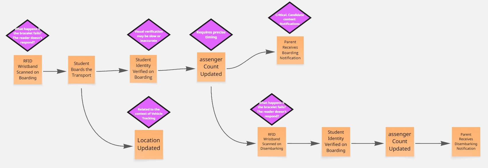
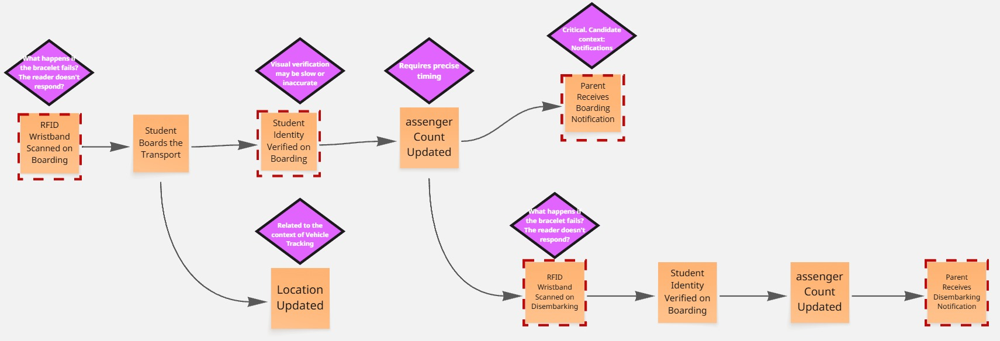

# Capítulo IV: Solution Software Design

## 4.1. Strategic-Level Domain-Driven Design.

### 4.1.1. EventStorming.

Durante la sesión de event storming, llevamos a cabo una reunión en la que compartimos nuestras ideas sobre este segmento del proyecto. A lo largo de la sesión, logramos identificar conceptos clave que resultan fundamentales para nuestra aplicación, además de esbozar las primeras versiones de los bounded contexts.
En esta sección, presentaremos cómo fue el desarrollo del event storming utilizando la herramienta Miro.

**Step 1: Unstructured Exploration**

En esta etapa, se identificaron los eventos clave que representan las acciones
significativas dentro del sistema.

**Step 2: Timelines**

En esta etapa, los eventos previamente identificados fueron organizados en subgrupos, cada uno encabezado por un evento principal que resume la función principal del grupo. Dentro de cada subgrupo se contemplaron tanto los happy paths, que describen los escenarios ideales de ejecución, como los unhappy paths, que reflejan posibles fallos o situaciones no deseadas. Esta organización permitió estructurar los eventos de forma lógica y facilitó una mejor comprensión de las distintas secuencias de acciones en el sistema.

**Step 3: Pain Points**

A lo largo del proceso, se detectaron ciertos puntos críticos o problemáticos dentro del flujo. Estos elementos resultan fundamentales para identificar oportunidades de mejora en la experiencia del usuario y en la eficiencia del diseño del sistema.

**Step 4: Pivotal Points**

Se identificaron los puntos clave del sistema, es decir, aquellos eventos críticos que representan hitos importantes dentro del flujo de trabajo. Estos momentos tienen un efecto considerable tanto en el funcionamiento del sistema como en la experiencia del usuario.

**Step 5: Commands**

Se asignó un comando a cada evento, junto con el actor responsable de ejecutarlo. Esto permitió definir con claridad quién inicia cada acción y cómo los distintos usuarios interactúan con el sistema.

**Step 6: Policies**

Durante esta etapa, se identifican los escenarios en el que un evento desencadena la
ejecución de un comando

#### 4.1.1.1 Candidate Context Discovery.

#### 4.1.1.2 Domain Message Flows Modeling.

#### 4.1.1.3 Bounded Context Canvases.

### 4.1.2. Context Mapping.

### 4.1.3. Software Architecture.

#### 4.1.3.1. Software Architecture System Landscape Diagram.

#### 4.1.3.2. Software Architecture Context Level Diagrams.

#### 4.1.3.2. Software Architecture Container Level Diagrams.

#### 4.1.3.3. Software Architecture Deployment Diagrams.

## 4.2. Tactical-Level Domain-Driven Design

### 4.2.X. Bounded Context: <Bounded Context Name>

#### 4.2.X.1. Domain Layer.

#### 4.2.X.2. Interface Layer.

#### 4.2.X.3. Application Layer.

#### 4.2.X.4. Infrastructure Layer.

#### 4.2.X.5. Bounded Context Software Architecture Component Level Diagrams.

#### 4.2.X.6. Bounded Context Software Architecture Code Level Diagrams.

#### 4.2.X.6.1. Bounded Context Domain Layer Class Diagrams.

#### 4.2.X.6.2. Bounded Context Database Design Diagram.
