# Capítulo IV: Solution Software Design

## 4.1. Strategic-Level Domain-Driven Design.

### 4.1.1. EventStorming.

Durante la sesión de event storming, llevamos a cabo una reunión en la que compartimos nuestras ideas sobre este segmento del proyecto. A lo largo de la sesión, logramos identificar conceptos clave que resultan fundamentales para nuestra aplicación, además de esbozar las primeras versiones de los bounded contexts.
En esta sección, presentaremos cómo fue el desarrollo del event storming utilizando la herramienta Miro.

**Step 1: Unstructured Exploration**

En esta etapa, se identificaron los eventos clave que representan las acciones
significativas dentro del sistema.

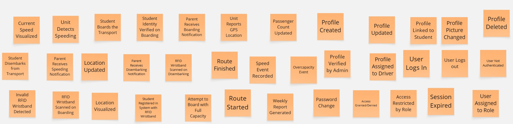

**Step 2: Timelines**

En esta etapa, los eventos previamente identificados fueron organizados en subgrupos, cada uno encabezado por un evento principal que resume la función principal del grupo. Dentro de cada subgrupo se contemplaron tanto los happy paths, que describen los escenarios ideales de ejecución, como los unhappy paths, que reflejan posibles fallos o situaciones no deseadas. Esta organización permitió estructurar los eventos de forma lógica y facilitó una mejor comprensión de las distintas secuencias de acciones en el sistema.

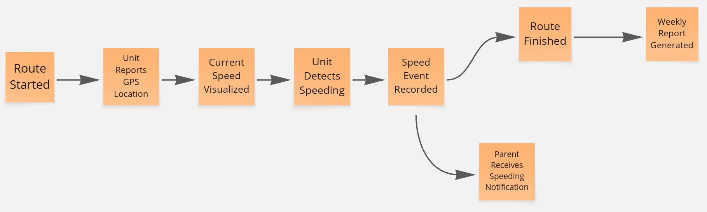

**Step 3: Pain Points**

A lo largo del proceso, se detectaron ciertos puntos críticos o problemáticos dentro del flujo. Estos elementos resultan fundamentales para identificar oportunidades de mejora en la experiencia del usuario y en la eficiencia del diseño del sistema.

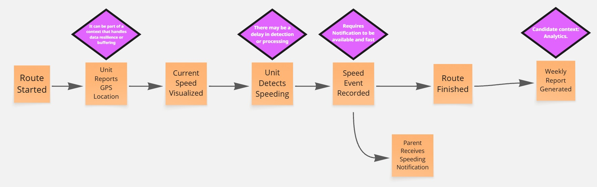

**Step 4: Pivotal Points**

Se identificaron los puntos clave del sistema, es decir, aquellos eventos críticos que representan hitos importantes dentro del flujo de trabajo. Estos momentos tienen un efecto considerable tanto en el funcionamiento del sistema como en la experiencia del usuario.

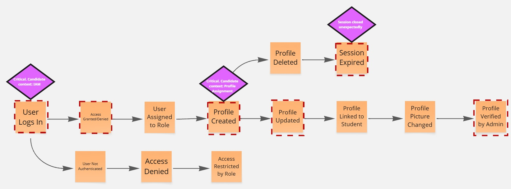

**Step 5: Commands**

Se asignó un comando a cada evento, junto con el actor responsable de ejecutarlo. Esto permitió definir con claridad quién inicia cada acción y cómo los distintos usuarios interactúan con el sistema.

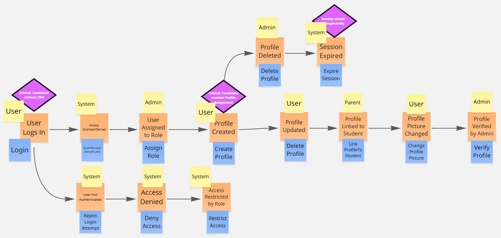

**Step 6: Policies**

Durante esta etapa, se identifican los escenarios en el que un evento desencadena la
ejecución de un comando

**Step 7: Read Models**

En esta etapa se definen y construyen los modelos de lectura correspondientes a cada contexto del sistema. El objetivo es garantizar que estos modelos presenten la información requerida de forma clara, eficiente y alineada con las necesidades específicas de cada usuario o funcionalidad.

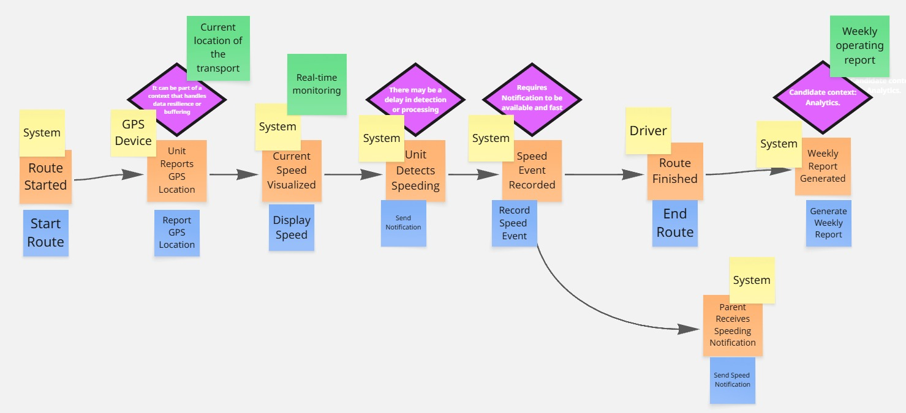

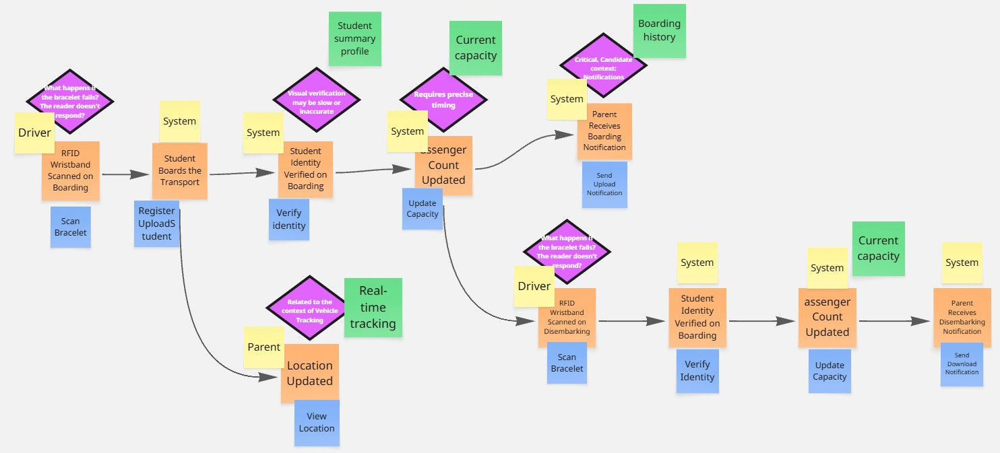

**Step 8: External Systems**

Durante esta etapa, se identifican los sistemas externos relevantes.

**Step 9: Aggregates**

En esta fase se identifican y estructuran los agregados dentro de cada contexto del sistema. Estos agregados agrupan entidades y operaciones relacionadas que deben mantenerse consistentes, garantizando la integridad de las transacciones y el comportamiento coherente del sistema.

#### 4.1.1.1 Candidate Context Discovery.

En esta parte, se describe cómo, a partir del modelo generado mediante EventStorming, se llevó a cabo la sesión de descubrimiento de contextos candidatos (Candidate Context Discovery). El objetivo de esta sesión fue identificar los bounded contexts del sistema. Para ello, se utilizó la técnica Start-with-Simple, que consiste en descomponer el modelo en pasos secuenciales y mantener un enfoque simple que permita ir refinando los contextos a medida que surjan nuevas necesidades.

Al final, obtuvimos 5 bounded context, que son:

Lo que queda de la siguiente manera:

Link al miro: https://miro.com/app/board/uXjVI1_yeP0=/?share_link_id=516096367099

#### 4.1.1.2 Domain Message Flows Modeling.

Se empleó una técnica de modelado colaborativo para identificar los eventos principales y las interacciones relevantes dentro del dominio. A partir de estos eventos, se elaboraron diagramas que describen el flujo de mensajes entre los distintos componentes del sistema, reflejando cómo se coordinan para cumplir con los objetivos del negocio. A continuación, se presentan los diagramas correspondientes a los contextos definidos previamente

Scenario: Abordaje del estudiante y notificación a los padres

Scenario: El chofer inicia la ruta y comienza el seguimiento GPS

Scenario: Fin de ruta y generación de reporte

#### 4.1.1.3 Bounded Context Canvases.

Se crearon los Canvases en base a los Bounded Context definidos anteriormente

###### Identity and Access Management Canvas

###### Identity Assignment Canvas

###### Vehicle Tracking Canvas

###### Notification Canvas

###### Analytics Canvas

###### Profile Assignment Canvas

### 4.1.2. Context Mapping.

 
El mapa de contexto ilustra las relaciones clave entre los diferentes contextos de nuestro sistema. Se identifican dos tipos principales de interacciones:

- **Partnership:** Representada por una flecha bidireccional, esta relación indica una colaboración estrecha y objetivos compartidos entre los contextos de "Identity Assignment" y "Vehicle Tracking". Los cambios en cualquiera de estos contextos tienen un impacto significativo en el otro debido a su naturaleza colaborativa.

- **Customer/Supplier:** Indicada por una flecha unidireccional, esta relación describe una dependencia donde un contexto actúa como proveedor de servicios para otro. La flecha apunta desde el proveedor hacia el cliente. Si bien existe una dependencia funcional, estos contextos no colaboran directamente en el diseño o la estrategia. Las relaciones de Customer/Supplier identificadas son:
  - "IAM Commodity" provee servicios a "Vehicle Tracking".
  - "Identity Assignment" provee servicios a "Notification Soporte".
  - "Vehicle Tracking" provee servicios a "Analytics Soporte".
  - "Notification Soporte" provee servicios a "Analytics Soporte".

### 4.1.3. Software Architecture.

#### 4.1.3.1. Software Architecture System Landscape Diagram.

Diagrama en el que se visualiza la estructura general del sistema

#### 4.1.3.2. Software Architecture Context Level Diagrams.

En esta sección se presenta el context diagram, el cual muestra el sistema
“EduGo” como un recuadro en el centro, rodeado por sus usuarios y otros
sistemas con los que interactúa. Este diagrama ayuda a entender cómo cada
componente del sistema se interrelaciona.

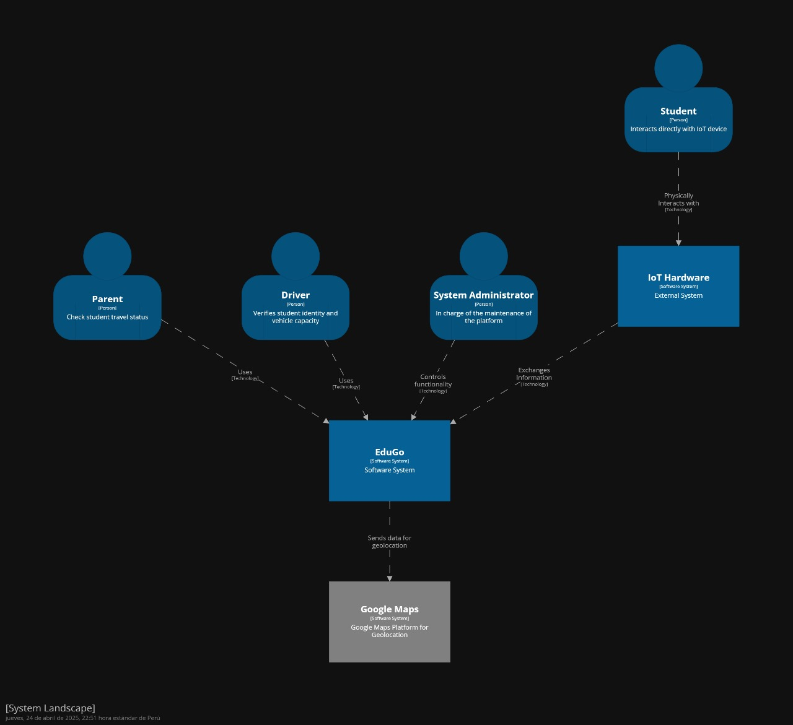

#### 4.1.3.2. Software Architecture Container Level Diagrams.

En esta sección se presenta el container diagram, el cual muestra cómo los diferentes contenedores del sistema interactúan entre sí y con los usuarios finales.

#### 4.1.3.3. Software Architecture Deployment Diagrams.

## 4.2. Tactical-Level Domain-Driven Design

### 4.2.1. Bounded Context: Identity and Access Management

El dominio de Identity and Access Management representa en detalle las funciones y procesos necesarios para la verificacion de credenciales de acceso. Este dominio es responsable de gestionar las operaciones relacionadas con la autenticacion.

###### Diccionario de Clases

El Diccionario de Clases es una herramienta clave en el proceso de diseño y desarrollo del sistema de gestión de usuarios y perfiles. Proporciona una descripción detallada de las clases fundamentales que forman la base del modelo de dominio. Este diccionario documenta las entidades, sus atributos, métodos y relaciones, lo que facilita la comprensión y colaboración entre los desarrolladores, garantizando una base sólida para la solución implementada.

#### 4.2.1.1. Domain Layer.

Dentro del dominio de Identity And Access Management, se encuentran entidades clave como lo escrito anteriormente. Estas entidades desempeñan un papel fundamental en los procesos necesarios para gestionar el acceso de los usuarios a la plataforma. Este dominio garantiza que el acceso de los usuarios se realice de manera segura y eficiente.

A continuación, se muestran todos los objetos relacionados con el dominio.

#### 4.2.1.2. Interface Layer.

En esta sección, presentamos la Capa de Interfaz para el Identity And Access Management, que actúa como el punto de entrada para las interacciones de los usuarios con el sistema. La Capa de Interfaz incluye controladores que procesan las solicitudes entrantes relacionadas con usuarios y perfiles, gestionando las respuestas del sistema y permitiendo una comunicación efectiva entre la plataforma y los usuarios.

Este contexto incluye los siguientes controladores:

UserController
ProfileController

#### 4.2.1.3. Application Layer.

En esta sección, presentamos la Capa de Aplicación (Application Layer) dentro del contexto de Identity And Access Management siguiendo el enfoque de diseño Domain-Driven Design (DDD). La Capa de Aplicación es responsable de coordinar las acciones y el flujo de datos entre la Capa de Dominio y la Capa de Infraestructura, actuando como intermediario y gestionando las interacciones entre estas capas. Esta capa asegura que la lógica de negocio, representada por la Capa de Dominio, se ejecute de manera eficiente y coherente.

#### 4.2.1.4. Infrastructure Layer.

En esta sección, presentamos la Capa de Infraestructura (Infrastructure Layer) dentro del contexto de Identity And Access Management. Esta capa es crucial para proporcionar los componentes técnicos y de soporte necesarios para que las otras capas del sistema funcionen correctamente.

Los repositorios en la Capa de Infraestructura implementan las interfaces definidas en la Capa de Dominio y se encargan de la autenticacion.

#### 4.2.1.5. Bounded Context Software Architecture Component Level Diagrams.

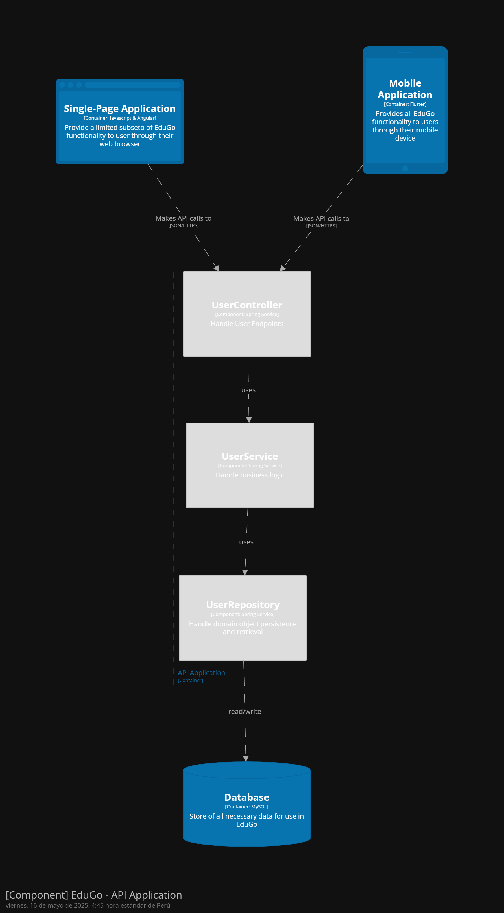

#### 4.2.1.6. Bounded Context Software Architecture Code Level Diagrams.

#### 4.2.1.6.1. Bounded Context Domain Layer Class Diagrams.

#### 4.2.1.6.2. Bounded Context Database Design Diagram.

### 4.2.2. Bounded Context: Identity Assignment

El dominio de Identity Assignment representa una abstracción de los procesos y funciones involucrados en la asignación de identidad de los estudiantes dentro de la plataforma. Este dominio es responsable de la vinculación del código único en la pulsera RFID y el escaneo de la pulsera RFID para la verificación de identidad del estudiante al momento de subir y bajar de la unidad.

###### Diccionario de Clases

El Diccionario de Clases es una herramienta clave en el diseño y desarrollo del sistema de Identity Assignment. En este diccionario se documentan las entidades, sus atributos, métodos y relaciones, lo que facilita la comprensión y garantiza una base sólida para el desarrollo e implementación de Identity Assignment.

#### Student

#### Wristband

#### Sensor

#### SensorScan

#### 4.2.2.1. Domain Layer.

Dentro de la capa de dominio de Identity Assignment, encontramos las entidades clave que permiten la gestión de los procesos de vinculación de la pulsera RFID con el alumno y el escaneo de la pulsera al momento de abordar y bajar de la unidad.

#### 4.2.2.2. Interface Layer.

En esta sección, se presenta la Capa de Interfaz para el Identity Assignment, que actúa como el punto de entrada para las interacciones de los usuarios con el sistema. La Capa de Interfaz incluye controladores que procesan tanto la vinculacion como los escaneos de la pulsera RFID.

#### 4.2.2.3. Application Layer.

En esta sección, se presenta la Capa de Aplicación (Application Layer) dentro del contexto de Identity Assignment siguiendo el enfoque de diseño Domain-Driven Design (DDD). La Capa de Aplicación es responsable de coordinar las acciones y el flujo de datos entre la Capa de Dominio y la Capa de Infraestructura, actuando como intermediario y gestionando las interacciones entre estas capas. Esta capa asegura que la lógica de negocio, representada por la Capa de Dominio, se ejecute de manera eficiente y coherente.

#### 4.2.2.4. Infrastructure Layer.

En esta sección, se presenta la Capa de Infraestructura (Infrastructure Layer) dentro del contexto de Identity Assignment. Esta capa es de vital importancia para proporcionar los componentes técnicos y de soporte necesarios para que las otras capas del sistema funcionen correctamente.

Los repositorios en la Capa de Infraestructura implementan las interfaces definidas en la Capa de Dominio y se encargan de la persistencia y gestión de datos.

#### 4.2.2.5. Bounded Context Software Architecture Component Level Diagrams.

#### 4.2.2.6. Bounded Context Software Architecture Code Level Diagrams.

#### 4.2.2.6.1. Bounded Context Domain Layer Class Diagrams.

#### 4.2.2.6.2. Bounded Context Database Design Diagram.

### 4.2.3. Bounded Context: Vehicle Tracking

###### Diccionario de Clases

El Diccionario de Clases es una herramienta clave en el diseño y desarrollo del sistema de Vehicle Tracking.
Aquí se documentan las entidades, sus atributos, métodos y relaciones, lo que facilita la comprensión y garantiza una base sólida para el desarrollo e implementación de las funcionalidades del seguimiento de vehículos.

#### Vehicule

#### Location

#### 4.2.3.1. Domain Layer.

Dentro de la capa de dominio de Vehicle Tracking, encontramos las entidades clave que permiten la gestión del estado de los vehículos, la actualización de sus ubicaciones, y el control del cumplimiento de las rutas y límites de velocidad.
Esta capa contiene los Aggregates, Entities, Value Objects, Domain Services, y define las interfaces de repositorios que modelan el núcleo del sistema.

#### 4.2.3.2. Interface Layer.

La Capa de Interfaz de Vehicle Tracking actúa como el punto de entrada para las interacciones de los sistemas externos y usuarios con este bounded context.Aquí se encuentra el VehicleController, que expone endpoints para iniciar rutas, actualizar ubicaciones en tiempo real, consultar la ubicación actual del vehículo y recuperar el historial de trayectos.
 

#### 4.2.3.3. Application Layer.

La Capa de Aplicación dentro del contexto de Vehicle Tracking es responsable de coordinar las acciones entre la Capa de Interfaz, la Capa de Dominio y la Capa de Infraestructura.
Aquí residen los Command Handlers que gestionan comandos como el inicio de una ruta, la actualización de la ubicación GPS, el reporte de velocidad y la consulta del historial de ubicaciones, asegurando que la lógica denegocio definida en la Capa de Dominio se ejecute correctamente.
 

#### 4.2.3.4. Infrastructure Layer.

La Capa de Infraestructura dentro del contexto de Vehicle Tracking proporciona los componentes técnicos y de soporte necesarios para persistir y recuperar los datos de vehículos y ubicaciones.
Los repositorios en esta capa se implementan las interfaces de la Capa de Dominio, conectándose a la base de datos PostgreSQL para garantizar la gestión eficiente de la persistencia y el acceso a la información crítica de seguimiento vehicular.
 

#### 4.2.3.5. Bounded Context Software Architecture Component Level Diagrams.

#### 4.2.3.6. Bounded Context Software Architecture Code Level Diagrams.

#### 4.2.3.6.1. Bounded Context Domain Layer Class Diagrams.

#### 4.2.3.6.2. Bounded Context Database Design Diagram.

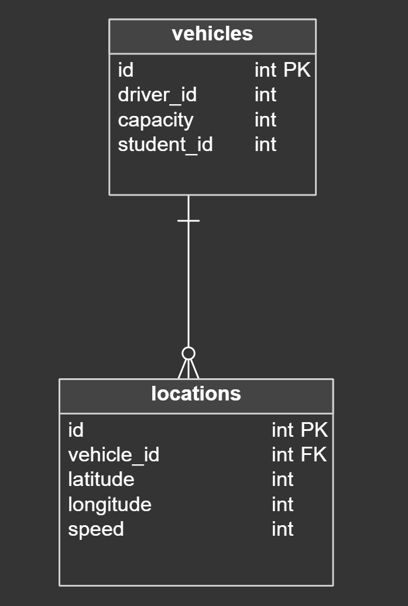

### 4.2.4. Bounded Context: Notification

El dominio de Notification describe de forma detallada las funciones y procesos encargados de la gestión de notificaciones dentro de nuestra plataforma. Este dominio se ocupa de administrar el envío, recepción y seguimiento de notificaciones a los distintos actores del sistema, ya sea por medios electrónicos como correo o notificaciones push. Incluye la lógica para generar notificaciones a partir de eventos del sistema, su almacenamiento, el marcado como leídas y el control del historial. Su objetivo es asegurar que la información crítica llegue a los usuarios correctos en el momento oportuno, facilitando una comunicación clara, oportuna y eficiente entre el sistema y sus usuarios.

###### Diccionario de Clases

El Diccionario de Clases en el contexto de Notification es una herramienta fundamental para el diseño y desarrollo del sistema de notificaciones. Detalla las principales clases del modelo de dominio, incluyendo sus atributos, responsabilidades y relaciones. Esta documentación permite a los desarrolladores tener una comprensión clara del funcionamiento interno del módulo de notificaciones, favoreciendo la coherencia en el desarrollo y la evolución del sistema.

#### Notification

#### 4.2.4.1. Domain Layer.

Dentro del dominio de Notification, existen entidades clave que permiten gestionar eficazmente la generación, envío y seguimiento de notificaciones dentro de nuestra plataforma. Estas entidades desempeñan un rol fundamental en la creación, actualización y control del estado de las notificaciones enviadas a los distintos usuarios del sistema. Incluyen tanto los datos necesarios para construir la notificación (como el tipo, mensaje, destinatario y canal) como la información sobre su estado (por ejemplo, si fue enviada o leída). Estas entidades aseguran que el sistema pueda mantener un registro claro y actualizado de las comunicaciones, facilitando una experiencia informativa, organizada y orientada a la acción para los usuarios.

#### 4.2.4.2. Interface Layer.

En esta sección, presentamos la Capa de Interfaz del dominio de Notification, que constituye el punto de entrada para la interacción entre los usuarios y el sistema de notificaciones. Esta capa está compuesta por un conjunto de controladores que gestionan las solicitudes entrantes relacionadas con las notificaciones y generan las respuestas correspondientes, asegurando una comunicación efectiva y oportuna dentro de la plataforma.

El contexto de esta capa incluye principalmente el NotificationController, encargado de manejar las operaciones relacionadas con la creación, envío, visualización y actualización del estado de las notificaciones.

#### 4.2.4.3. Application Layer.

En esta sección, presentamos la Capa de Aplicación (Application Layer) dentro del contexto de Notification. Esta capa actúa como intermediaria entre la lógica de negocio y la infraestructura del sistema, gestionando el flujo de datos y coordinando las interacciones necesarias para el procesamiento de notificaciones. Los Command Handlers y Event Handlers son responsables de ejecutar acciones de escritura y de reaccionar a eventos relevantes, trabajando en conjunto con los servicios de dominio para realizar sus operaciones.

Cada Handler en esta capa utiliza servicios específicos para gestionar la creación, el envío y la actualización del estado de las notificaciones.

#### 4.2.4.4. Infrastructure Layer.

En esta sección, presentamos la Capa de Infraestructura (Infrastructure Layer) dentro del contexto de Notification. Esta capa es responsable de proporcionar los componentes técnicos y de soporte necesarios para que las demás capas del sistema funcionen correctamente. Incluye la implementación de repositorios y adaptadores que interactúan con sistemas externos para gestionar la persistencia de datos y el envío de notificaciones.

Los repositorios en la Capa de Infraestructura implementan las interfaces definidas en la Capa de Dominio y se encargan de interactuar con la base de datos. Además, los adaptadores permiten la integración con servicios de mensajería externa, como correos electrónicos y notificaciones push. Los componentes clave en este contexto incluyen el NotificationRepository, que maneja la persistencia de las notificaciones, el EmailNotificationSender, que gestiona el envío de correos electrónicos, y el PushNotificationSender, que administra el envío de notificaciones push.

#### 4.2.4.5. Bounded Context Software Architecture Component Level Diagrams.

#### 4.2.4.6. Bounded Context Software Architecture Code Level Diagrams.

#### 4.2.4.6.1. Bounded Context Domain Layer Class Diagrams.

#### 4.2.4.6.2. Bounded Context Database Design Diagram.

### 4.2.5. Bounded Context: Analytics

El dominio de Analytics abarca los datos analíticos generados a partir de los viajes realizados por los buses escolares, incluyendo información como la duración del viaje, la velocidad promedio, las alertas de seguridad y otros indicadores de rendimiento. Este dominio es responsable de procesar y analizar estos datos para proporcionar métricas clave que permitan mejorar la eficiencia, seguridad y monitoreo en tiempo real de los viajes escolares.

###### Diccionario de Clases

El Diccionario de Clases es una herramienta que describe las principales clases del modelo de dominio, incluyendo sus atributos, métodos y relaciones. Facilita la comprensión del sistema y mejora la colaboración entre los desarrolladores, sirviendo como base para el diseño y desarrollo del proyecto.

#### 4.2.5.1. Domain Layer.

Dentro de la capa de dominio de Analytics, encontramos las entidades clave que permiten la recolección, análisis y generación de reportes a partir de los datos de rutas, asistencia de estudiantes y desempeño de conductores. Esta capa contiene los Aggregates, Entities, Value Objects, Domain Services, y define las interfaces de Repositories que modelan el núcleo analítico del sistema.

#### 4.2.5.2. Interface Layer.

En esta sección, presentamos la Capa de Interfaz para el contexto de Analytics, que actúa como el punto de entrada para las interacciones de los usuarios con el sistema de análisis. La Capa de Interfaz incluye controladores que procesan las solicitudes entrantes relacionadas con el monitoreo, análisis y visualización de datos del sistema de transporte escolar, gestionando las respuestas y permitiendo una comunicación eficiente entre la plataforma y los usuarios. Este contexto incluye los siguientes controladores:

#### 4.2.5.3. Application Layer.

La Capa de Aplicación dentro del contexto de Analytics se encarga de coordinar las interacciones entre la Capa de Interfaz, la Capa de Dominio y la Capa de Infraestructura. En esta capa se encuentran los Command Handlers, que gestionan tareas como la recolección de datos relacionados con el rendimiento del transporte, la generación de informes de eficiencia y la consulta de datos históricos, garantizando que la lógica de negocio definida en la Capa de Dominio se ejecute de manera adecuada.

#### 4.2.5.4. Infrastructure Layer.

La Capa de Infraestructura dentro del contexto de Analytics ofrece los recursos técnicos y de soporte esenciales para almacenar y recuperar los datos relacionados con el análisis del transporte escolar.

#### 4.2.5.5. Bounded Context Software Architecture Component Level Diagrams.

#### 4.2.5.6. Bounded Context Software Architecture Code Level Diagrams.

#### 4.2.5.6.1. Bounded Context Domain Layer Class Diagrams.

En este punto, se presentan los diagramas de clases que representan la estructura interna del modelo de dominio del contexto Analytics. Estos diagramas muestran las principales entidades, sus atributos, métodos relevantes y las relaciones entre ellas, proporcionando una visión clara de cómo se organiza y gestiona la lógica de negocio en este contexto.

#### 4.2.5.6.2. Bounded Context Database Design Diagram.

En este punto, presentamos el diseño de la base de datos para el contexto Analytics, detallando las tablas principales, sus atributos y las relaciones entre ellas.

### 4.2.6. Bounded Context: Profile Assignment

Este contexto se encarga de la gestión de los perfiles personales dentro del sistema de transporte escolar. Incluye la creación, actualización, verificación y vinculación de perfiles de padres y administradores, así como la gestión de perfiles de estudiantes como entidades del dominio, sin acceso directo al sistema.

#### 4.2.6.1. Domain Layer.

En esta capa se representa el núcleo del dominio para el bounded context Profile Assignment, modelando las entidades, objetos de valor, agregados, fábricas, servicios de dominio y repositorios que encapsulan la lógica y reglas de negocio relacionadas con la gestión de perfiles y su vinculación en el sistema de transporte escolar.

#### 4.2.6.2. Interface Layer.

La Interface Layer es responsable de recibir las solicitudes del usuario o sistemas externos, procesarlas (validación básica, autorización) y delegar la ejecución de las operaciones al Domain Layer. Contiene controladores que representan puntos de entrada para las funcionalidades del bounded context Profile Assignment.

#### 4.2.6.3. Application Layer.

La Application Layer es responsable de coordinar los flujos de procesos del negocio, gestionando la interacción entre la interfaz de usuario, los servicios del dominio y la infraestructura. En este contexto, se implementan los Command Handlers y Event Handlers que permiten manejar comandos emitidos por la UI o eventos generados internamente, respetando las capacidades de la aplicación.

#### 4.2.6.4. Infrastructure Layer.

Esta capa contiene la implementación técnica que permite la interacción con servicios externos, bases de datos y sistemas de mensajería. Aquí se implementan las interfaces definidas en el Domain Layer, como los repositorios para el acceso a datos y adaptadores para otros servicios externos necesarios.

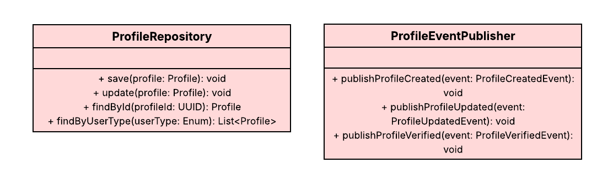

#### 4.2.6.5. Bounded Context Software Architecture Component Level Diagrams.

#### 4.2.6.6. Bounded Context Software Architecture Code Level Diagrams.

#### 4.2.6.6.1. Bounded Context Domain Layer Class Diagrams.

#### 4.2.6.6.2. Bounded Context Database Design Diagram.

