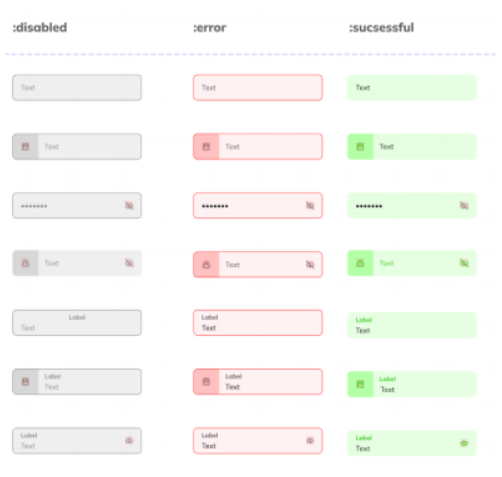

# Capítulo V: Solution UI/UX Design

## 5.1. Style Guidelines.

### 5.1.1. General Style Guidelines.
#### LENGUAJE
El lenguaje utilizado en la aplicación es una mezcla equilibrada entre formal y casual. Por un lado, el tono formal busca transmitir confianza y seguridad, especialmente en funciones críticas como el seguimiento del transporte escolar. Esto se refleja en frases como "Seguridad Inteligente en el Transporte Escolar" o "Mundirá con un tiempo real de la inclusión y seguridad de sus hijos", que destacan profesionalismo y precisión. Por otro lado, el lenguaje casual se incorpora para crear una experiencia amigable y cercana, evitando que el usuario se confunda. Ejemplos de esto son términos sencillos como "Contáctanos" o "Iniciado", que facilitan la interacción diaria.

#### COLORES 
En el siguiente cuadro está la paleta de colores actualizada que se usará en toda la plataforma Edugo, incluyendo la Landing Page,la aplicación web y la aplicacion movil. Hemos seleccionado cuidadosamente esta gama de azules y tonos complementarios para transmitir profesionalismo, confianza y calidez, adaptándose perfectamente a un servicio de transporte escolar donde la seguridad y la claridad son prioritarias.

#### Tabla de la paleta de colores para la implementación del Landing page y Web Application de EduGo

| Código   | Nombre             | Descripción                                                                 |
|----------|--------------------|-----------------------------------------------------------------------------|
| #53B7C9  | Azul Claro         | Tonelada fresca para botones principales. Transmite accesibilidad y amabilidad. |
| #96D8DD  | Turquesa Pastel    | Color secundario para fondos. Da sensación de limpieza y tranquilidad.      |
| #3D4E5D  | Gris Azulado       | Para textos y detalles. Ofrece legibilidad profesional.                    |
| #2C3E50  | Azul Noche         | Color principal para headers. Simboliza seguridad y confiabilidad.         |
| #3F51B5  | Azul Vibrante      | Para llamadas a la acción secundarias. Aporta energía controlada.          |
| #7B8FFF  | Azul Lavanda       | Acentos y efectos hover. Toque moderno y dinámico.                         |
| #FFFFFF  | Blanco             | Base para fondos y textos. Garantiza claridad y orden visual.              |

#### TYPOGRAPHY
Edugo ha seleccionado cuidadosamente la combinación de Inter y Roboto para su identidad visual, buscando equilibrar personalidad y funcionalidad.

Inter, con su estilo moderno y versátil, se utiliza como fuente principal para títulos y encabezados. Su diseño limpio y geométrico transmite profesionalismo al mismo tiempo que mantiene un toque accesible, ideal para conectar con padres, escuelas y usuarios frecuentes. Esta tipografía aporta jerarquía visual a elementos clave como "Seguridad Inteligente en el Transporte Escolar" y otros mensajes importantes de la plataforma.

Para textos largos, descripciones y contenido interactivo, empleamos Roboto. Esta fuente destaca por su excelente legibilidad en pantallas de todos los tamaños, desde smartphones hasta tablets. Su neutralidad y claridad aseguran que la información sobre rutas, horarios y notificaciones sea fácil de leer incluso en uso rápido o con poca luz.

La combinación de ambas tipografías crea un sistema coherente donde Inter atrae la atención hacia los elementos principales, mientras que Roboto garantiza comodidad de lectura en el día a día. Este equilibrio refuerza los valores de Edugo: confiable pero cercano, técnico pero humano.


#### SPACING
Se optó por emplear un espaciado generoso entre los elementos de la interfaz para lograr una experiencia visual más limpia y estructurada. Esta elección tiene como finalidad minimizar la sobrecarga visual, facilitando que cada componente destaque por separado y sea identificado con mayor claridad.<br>

</br>

#### BRANDING  
<center></center>
<br></br>

Se escogió este diseño para el logo de EduGo porque combina elementos visuales que representan movimiento, educación y tecnología de forma clara y moderna. El ícono del autobús escolar, acompañado de un marcador de ubicación, comunica de inmediato el propósito de la marca: un servicio inteligente y accesible de transporte escolar.

El color amarillo vibrante del ícono evoca energía, dinamismo y juventud, asociándose con el entorno escolar y siendo altamente visible, lo cual es ideal para una aplicación móvil o señalética en exteriores. Por su parte, el fondo azul turquesa genera un contraste atractivo y transmite tranquilidad, seguridad y confianza, valores clave cuando se trata del transporte de estudiantes.

La tipografía moderna y amigable utilizada para el nombre “EduGo” refuerza la idea de innovación y cercanía. Además, el nombre mismo sugiere acción (“Go”) en el contexto educativo, lo cual fortalece el concepto de una plataforma activa, confiable y centrada en el bienestar estudiantil.

Este diseño es versátil y funcional en distintos formatos (digital, impresos o material promocional), y mantiene su legibilidad e identidad incluso a escalas pequeñas, gracias a su simplicidad visual y colores distintivos.

### 5.1.2. Web, Mobile and IoT Style Guidelines.

##### Dimensiones
Se consideran dimensiones estándar para asegurar una experiencia de usuario adecuada en distintos dispositivos:
- **Escritorio:** 1280 px de ancho
- **Tablet:** 760 px de ancho
- **Celular:** 480 px de ancho  

##### Navegación
El sistema de navegación web se basa en un diseño minimalista. Para resaltar la sección activa, el nombre se mostrará en **negrita**.

<center></center>

##### Iconos
Para la sección de contacto se utilizarán los siguientes íconos:

<center></center>

##### Formularios
Los formularios siguen un diseño limpio que contempla estados como deshabilitado, correcto o con error.

<center></center>

##### Checkboxes, Radio Buttons, Switches
Se optó por un diseño visualmente atractivo e intuitivo para estos componentes:

<center></center>

##### Colores de Fondo
- **Primario:** Azul oscuro o neutro, para foco en contenido.
- **Secundario:** Azul claro o gris, útil en zonas secundarias.
- **Terciario:** Colores de acento, como llamados a la acción.

##### Estilos de Texto
- **H1:** Títulos principales con fuente sans-serif y tamaño destacado.
- **H2:** Subtítulos con menor jerarquía que H1.
- **Párrafo:** Fuente clara y legible.
- **Enlaces (a):** Color destacado (terciario), con subrayado sutil.

---

#### Aplicación Móvil

La versión móvil sigue los principios visuales del diseño web pero adaptados a pantallas táctiles y menores resoluciones.

- **Dimensiones base:** Adaptativas, enfocadas en anchura mínima de 360 px hasta 480 px.
- **Iconografía:** Se reutilizan los íconos definidos, optimizados para uso en botones y menús móviles.
- **Navegación móvil:** Interfaz compacta, con navegación inferior o tipo hamburguesa, resaltando la sección activa en negrita.
- **Componentes interactivos:** Formularios y botones táctiles adaptados con buen espaciado y retroalimentación visual.

---

#### IoT 

Para la visualización o gestión desde interfaces IoT (pantallas embebidas, dashboards), se tomará como base el diseño web adaptado a resoluciones específicas según el dispositivo:

- **Diseño simplificado:** Menús más grandes, botones de acción destacados.
- **Contraste elevado:** Mejora la legibilidad en condiciones variables.
- **Iconografía clara:** Íconos minimalistas con etiquetas visibles.


## 5.2. Information Architecture.
## 5.2.1. Organization Systems

En nuestras aplicaciones web y móvil para la plataforma **EduGo**, se emplean distintos sistemas de organización de la información que garantizan una experiencia clara, rápida y eficiente para los usuarios, de acuerdo con el rol que desempeñan.

### Sistemas de Organización de la Información

- **Jerarquía Visual (Visual Hierarchy):**  
  Se aplica especialmente en la Landing Page y en las pantallas de inicio de las aplicaciones, destacando elementos críticos como el estado del transporte, alertas importantes, notificaciones de asistencia y mensajes del administrador. Esta jerarquía permite a los usuarios identificar rápidamente la información clave para una acción inmediata.

- **Secuencial (Paso a paso):**  
  Este sistema se aplica en flujos como el registro de usuarios, inicio de sesión, y navegación para los padres, donde deben seguir pasos específicos para visualizar información como: estado del bus en tiempo real, nombre del conductor, y seguimiento del historial de viajes. La presentación guiada reduce errores y mejora la comprensión.

- **Matricial:**  
  Utilizado en los paneles administrativos (tanto en la app móvil como en la versión web), este sistema agrupa múltiples entidades como rutas, estudiantes y vehículos en tarjetas o tablas. Cada grupo contiene datos clave y botones de acción rápida, facilitando decisiones como reasignar rutas, generar reportes o contactar con los conductores.

---

### Esquemas de Categorización de Contenido

- **Alfabético:**  
  Se aplica en listados de estudiantes, rutas y conductores, para facilitar la búsqueda eficiente y organizada de elementos mediante filtros o scroll.

- **Cronológico:**  
  Utilizado en los reportes de asistencia, historial de rutas y notificaciones de eventos (por ejemplo, retrasos o ausencias), donde la información se muestra desde lo más reciente a lo más antiguo.

- **Por tópicos:**  
  La información se clasifica según categorías como:
  - Estado de transporte (activo/inactivo)
  - Control de velocidad
  - Registro RFID
  - Alertas de seguridad
  - Información del conductor

Estos sistemas de organización, adaptados a cada perfil de usuario (padres, administradores y conductores), aseguran que la interacción con EduGo sea clara, intuitiva y alineada con los objetivos de seguridad y eficiencia del transporte escolar.


### 5.2.2. Labeling Systems.
La aplicación web y movil contará con un sistema de etiquetado simple y sencillo para captar el rápido entendimiento del usuario, evitando confusiones y facilitando la navegación.
Las siguientes etiquetas serán utilizadas para ambos contextos de los segmentos objetivos.

Para la aplicacion web
| Etiqueta | Descripción |
|----------|-------------|
| Inicio   | Seccion donde el administrador se logea al sistema |
| Dashboard | Sección donde se visualizan gráficos sobre el desempeño del conductor (tiempos de llegada, número de incidentes y distancia recorrida)  |
| Drivers and students  | Sección donde se visualiza la informacion de los conductores y estudiantes. |
| Report  | Sección donde se visualiza datos escritos sobre las acciones del conductor(Incidentes e historia de recorrido) |

Para la app movil-Padres
| Etiqueta | Descripción |
|----------|-------------|
| Home | Pantalla principal donde se puede visualizar la opcion de ver a sus hijos y notificaiones . |
| Tracking | Sección donde se visualiza un mapa en el cual el padre puede seguir la  ruta de su hijo|
| Notification | Sección donde se registra las notificaciones o alertas al padre. |
| Account | Sección donde se puede ver los datos personales del padre. |

Para la app movil-Conductores
| Etiqueta | Descripción |
|----------|-------------|
| Home | Pantalla principal donde se puede visualizar la opcion de ver sus viajes pasados,la asistencia de cada estudiante y el boton de emergencia en caso de reportar algun incidente . |
| Map | Sección donde se visualiza un mapa en el cual el conductor selecciona la ruta de viaje para ir a su destino|
| Notification | Sección donde se registra las notificaciones o alertas al conductor. |
| Account | Sección donde se puede ver los datos personales del conductore. |

### 5.2.3. SEO Tags and Meta Tags
Meta tags estratégicos se usarán para posicionar la landingpag y aplicacion web, mejorando su visibilidad y acceso
* Title tag: Titulo principal que será visualizado tanto para el landing,mobile y web ```<title> EduGo </title>```
* Meta Description: Descripción que explica de que  trata EduGo ```<meta name = "description" content = "Seguridad Inteligente en el Transporte Escolar | Monitoreo en tiempo real de la ubicación y seguridad de tus hijos"/>```
* Meta Keywords: Palabras clave para que los usuarios encuentren la aplicación web más rápido y sencillo ```<meta name = "keyword" content = "DashBoard,Drivers and students,Reports"/>```
* Author and Copyright: Enmarcar derechos de autor para EduGo ```<meta name = "author" content = "Codeminds"/>```
* Viewport: Sirve para indicar al navegador como ajustar el tamaño de la página en medida al dispositivo ```<meta name = "viewport" content = "width=device-width, initial-scale=1.0"/>```


### 5.2.4. Searching Systems.
En la aplicación web EduGo se busca implementar un sistema facil de usar y efectivo para que los administradores puedan monitorear a los conductores . Se utilizará un sistema de navegacion simple y directo, con la posibilidad de visualizar graficos de la acciones del conductor,los reportes y la lista de todos los conductores y estudiantes

**¿Que se busca?:** El administrador quiere ver un grafico donde se muestre el numero de incidentes,distanciamiento de recorrido y el tiempo de llegada al colegio.<br>
**¿Que resultados se mostrarán?:** Graficos variados. <br>
**Interface de busqueda:** El administrador puede encontrar información de cada conductor mediante un filtro busqueda rapida en el se le mostrara un grafico circular de barras y de lineas.
<br>
<br>
**¿Que se busca?:** El administrador quiere visualizar a todos los conductores y estudiantes registrados.<br>
**¿Que resultados se mostrarán?:** El nombre de conductor o estudiante con su foto correspondiante.<br>
**Interface de busqueda:** El administrador puede visualizar a todos los estudiantes y conductores atraves de un filtro de busqueda rapida donde puede ver tanto a los conductores y estudiantes.
<br>
<br>
**¿Que se busca?:** El administrador busca ver y filtrar registros de incidentes o el historial de rutas de cada conductor. <br>
**¿Que resultados se mostrarán?:** La tabla muestra la lista de incidentes registrados o el historial de rutas. <br>
**Interface de busqueda:** La interfaz de búsqueda ofrece varias opciones para que el administrador encuentre la información deseada donde selecciona al Conductor,el Tipo de Reporte y la Fecha. Finalmente, se incluye un Botón Search, que el administrador debe presionar para aplicar los filtros seleccionados y obtener los resultados correspondientes."


### 5.2.5. Navigation Systems.
Landing Page:

- Menú superior con scroll automático a secciones: Inicio, Beneficios, Funcionamiento, Contacto.

- Botón flotante para cambiar idioma.

- Botón “Solicita una demo” en múltiples ubicaciones.

Aplicación Web:

- Menu al lado izquierdo con secciones diferentes: Dashboard,Drivers and Students,report.

Aplicación Móvil:

- Padres: Menú inferior con íconos → [Home | Tracking | Notification | Account]

- Conductores: Menú inferior con íconos → [Home | Map | Notification | Account]


## 5.3. Landing Page UI Design.
### 5.3.1. Landing Page Wireframe.
**LandingPage Wireframe Inicio**

**LandingPage Wireframe Caracteristicas y beneficios**

**LandingPage Wireframe Team**

**LandingPage Wireframe Full Team**

**LandingPage Wireframe Contacto**

**LandingPage Wireframe Footer**


### 5.3.2. Landing Page Mock-up.
**LandingPage MockUp Inicio**

**LandingPage MockUp Caracteristicas y beneficios**

**LandingPage MockUp Team**

**LandingPage MockUp Full Team**

**LandingPage MockUp Contacto**

**LandingPage MockUp Footer**


## 5.4. Applications UX/UI Design.
### 5.4.1. Applications Wireframes.
**Web Application: **<br>
**Web Application Wireframe Login**

**Web Application Wireframe Dashboard**

**Web Application Wireframe Drivers**

**Web Application Wireframe Students**

**Web Application Wireframe Report**


**AppMovil:** <br>
**AppMovil Wireframe Login/Register** <br>
 <br>
 <br>
 <br>
 <br>
 <br>
 <br>
**AppMovil Wireframe Home Parent** <br>
 <br>
**AppMovil Wireframe Children** <br>
 <br>
 <br>
 <br>
 <br>
 <br>
**AppMovil Wireframe Tracking** <br>
 <br>
 <br>
**AppMovil Wireframe Profile** <br>
 <br>
 <br>
**AppMovil Wireframe Home Driver** <br>
 <br>
**AppMovil Wireframe Past Trip** <br>
 <br>
**AppMovil Wireframe DriverMap** <br>
 <br>
**AppMovil Wireframe Perfil Driver** <br>
 <br>
**AppMovil Wireframe Attendece** <br>
 <br>
 <br>


### 5.4.2. Applications Wireflow Diagrams.
**Web Application:** <br>
**WebApp Wireflow Home**


**AppMovil:** <br>
**AppMovilWireflow Login/Register Driver** <br>
 <br>
**AppMovilWireflow Login/Register Parent** <br>
 <br>
**AppMovilWireflow Error Register** <br>
 <br>
**AppMovilWireflow Home Driver** <br>
 <br>
**AppMovilWireflow PastTrip** <br>
 <br>
**AppMovilWireflow Students** <br>
 <br>
 <br>
**AppMovilWireflow Tracking** <br>
 <br>
**AppMovilWireflow Notification** <br>
 <br>
**AppMovilWireflow Children** <br>
 <br>
 <br>
 <br>
 <br>
**AppMovilWireflow Edit Account** <br>
 <br>

### 5.4.2. Applications Mock-ups.
**Web Application: ** 
<br>
**WebApp MockUp Login** <br>
 <br>
**WebApp MockUp DashBoard** <br>
 <br>
**WebApp MockUp Drivers and students-Drivers** <br>
 <br>
 <br>
**WebApp MockUp Drivers and students-Students** <br>
 <br>
 <br>
**WebApp MockUp Drivers and students-Report** <br>
 <br>
 <br>
 

<br>

**App Movil: **<br>
**AppMovil MockUp Login/Register Driver** <br>
 <br>
 <br>
 <br>
 <br>
 <br>
**AppMovil MockUp Home Driver** <br>
 <br>
**AppMovil MockUp Home Past Trip** <br>
 <br>
 <br>
 <br>
 <br>
**AppMovil MockUp Home Past Attendance** <br>
 <br>
 <br>
 <br>
 <br>

**AppMovil MockUp Login/Register Parent** <br>
 <br>
 <br>
 <br>
 <br>
**AppMovil MockUp Home Parent** <br>
 <br>
**AppMovil MockUp Children** <br>
 <br>
 <br>
 <br>
 <br>
**AppMovil MockUp Tracking** <br>
 <br>

**AppMovil MockUp Notification Parent/Student** <br>
 <br>
 <br>

**AppMovil MockUp Acount Parent/Student** <br>
 <br>
 <br>
 <br>
 <br>


### 5.4.3. Applications User Flow Diagrams.
**Web Application** <br>
**Web Application UserFlow DriversStudents-Details**

**Web Application UserFlow Home**

**Web Application UserFlow Report**


**AppMovil** <br>
**AppMovil User Flow Login/Register Driver**

**AppMovil User Flow Login/Register Parent**

**AppMovil User Flow Home Driver**

**AppMovil User Flow Home Parent**

**AppMovil User Flow Driver PastTrips**

**AppMovil User Flow Driver Attendace**

**AppMovil User Flow Parent Children**

**AppMovil User Flow Driver upload profile Parent/Driver**


## 5.5. Applications Prototyping.
**Web Application :** <br>

<br>
[https://www.figma.com/proto/27YLKQmieuwzcaSKuPucG2/Web?node-id=82-514&p=f&t=gEB7y5RLh908G3lG-0&scaling=contain&content-scaling=fixed&page-id=0%3A1&starting-point-node-id=82%3A514&show-proto-sidebar=1](https://www.figma.com/proto/27YLKQmieuwzcaSKuPucG2/Web?node-id=82-514&p=f&t=gEB7y5RLh908G3lG-0&scaling=contain&content-scaling=fixed&page-id=0%3A1&starting-point-node-id=82%3A514&show-proto-sidebar=1) <br>
**App Movil :** <br>

<br>
[https://www.figma.com/proto/aFhwXAsZUzKZCf7WFTepW5/Mobile?node-id=1-370&p=f&t=gbUbh6U2UpBSJiLp-0&scaling=min-zoom&content-scaling=fixed&page-id=0%3A1&starting-point-node-id=1%3A370&show-proto-sidebar=1](https://www.figma.com/proto/aFhwXAsZUzKZCf7WFTepW5/Mobile?node-id=1-370&p=f&t=gbUbh6U2UpBSJiLp-0&scaling=min-zoom&content-scaling=fixed&page-id=0%3A1&starting-point-node-id=1%3A370&show-proto-sidebar=1)
