# Capítulo VI: Product Implementation, Validation & Deployment

## 6.1. Software Configuration Management.

En esta sección, el equipo establece las decisiones y convenciones que permitirán mantener la consistencia durante todo el ciclo de vida del desarrollo de software. La configuración abarca la gestión del código fuente, la configuración del entorno de desarrollo y el despliegue de las aplicaciones. Estas decisiones garantizan una colaboración eficiente, asegurando que todos los miembros del equipo trabajen de manera coherente y organizada.

### 6.1.1. Software Development Environment Configuration.

En esta sección se especifican y describen las herramientas y productos de software que los miembros del equipo deben utilizar durante el ciclo de vida del desarrollo, para garantizar la colaboración eficiente y la consistencia en el proyecto. Estas herramientas cubren todas las áreas clave, incluyendo la gestión del proyecto, el diseño UX/UI, el desarrollo, las pruebas y el despliegue.

#### Project Management

- Trello:
  Trello es una herramienta web para la gestión de proyectos que funciona en la mayoría de los navegadores. Se utilizó para organizar y registrar las tareas pendientes, en proceso y completadas, lo que permitió mantener un control claro del progreso del proyecto y las responsabilidades de cada miembro del equipo.

#### Product UX/UI Design

- Miro:
  Miro fue empleado para el desarrollo de mapas de escenarios y planificación visual, facilitando la comprensión y comunicación entre los distintos segmentos objetivo.

- Figma:
  Figma jugó un papel fundamental en la creación colaborativa de wireframes, maquetas y prototipos para el landing page, aplicaciones web y moviles. Su acceso es gratuito mediante una cuenta registrada, lo que facilita la colaboración remota entre los miembros del equipo.

#### Software Developement

**Landing Page:**  
El desarrollo de la Landing Page se realizó utilizando las tecnologías fundamentales para el diseño web moderno:
 

- HTML5: Para la estructura semántica del contenido.  
- CSS3: Para el diseño visual, uso de media queries y animaciones básicas.  
- JavaScript: Para la interactividad, validaciones de formularios y manipulación del DOM.
   
  Estas tecnologías permiten una página ligera, responsive y optimizada para dispositivos móviles, garantizando una experiencia de usuario accesible y clara.

 
 

**Frontend Web:**  
Para el desarrollo de la aplicación web se emplearon tecnologías del entorno frontend moderno:

- **HTML5**, **CSS3** y **JavaScript** como fundamentos esenciales.
- **Angular** como framework principal, permitiendo una arquitectura basada en componentes, enrutamiento interno, servicios reutilizables y vinculación bidireccional de datos.

Angular facilitó la creación de una interfaz dinámica y escalable, especialmente útil para usuarios como padres y administradores, quienes requieren acceso en tiempo real a información del transporte escolar.

 

**Aplicacion Movil** : 
La aplicación móvil fue desarrollada de forma **nativa para Android** utilizando:

- **Android Studio** como entorno de desarrollo integrado (IDE).
- **Kotlin** como lenguaje principal, por su interoperabilidad con Java, su sintaxis moderna y su orientación a la seguridad.
   
  Esta aplicación móvil complementa la experiencia web y ofrece a los padres una herramienta confiable para el seguimiento diario de sus hijos en el transporte escolar, directamente desde su smartphone.

#### IDE's de desarrollo

- WebStorm :
  Utilizado para la creación del **Landing Page** y la **aplicación web**. Este IDE, desarrollado por JetBrains, está optimizado para tecnologías web como **HTML5**, **CSS3**, **JavaScript** y frameworks modernos como **Angular**, lo que permite una codificación más eficiente, estructurada y mantenible.
- Android Studio :
  Fue la herramienta principal para el desarrollo de la **aplicación móvil**. Esta se implementó en **Kotlin**, siguiendo las prácticas recomendadas para el desarrollo nativo en Android. Esto garantiza una experiencia de usuario fluida y una compatibilidad robusta con las versiones más recientes del sistema operativo.
- IntelliJ IDEA :
  Se empleó para el desarrollo del **backend** del sistema. Este potente IDE también desarrollado por JetBrains, permite integrar múltiples tecnologías y facilita la implementación de servicios, controladores y lógica de negocio. Además, ofrece herramientas avanzadas como **depuración**, integración con **bases de datos**, y compatibilidad con herramientas de construcción como **Gradle** o **Maven**.

#### Software Testing

- Para verificar el correcto funcionamiento del sistema en cada una de sus partes, se realizaron diversas pruebas utilizando herramientas específicas según el entorno. En el caso de la landing page y la aplicación web, se utilizaron navegadores modernos como Google Chrome, Microsoft Edge y Mozilla Firefox, tanto en sus versiones de escritorio como móviles, lo cual permitió inspeccionar el comportamiento visual, la interacción del usuario y la correcta adaptación del diseño responsivo. Para el backend, se empleó Postman, una herramienta que permitió validar el funcionamiento de cada API desarrollada, comprobando los métodos HTTP, las respuestas recibidas, los códigos de estado y el formato de los datos enviados y recibidos. Finalmente, para la aplicación móvil, se utilizó el emulador integrado en Android Studio, que permitió simular dispositivos con distintas resoluciones y versiones de Android, lo cual facilitó la detección de errores y la comprobación de la experiencia del usuario en diferentes escenarios sin necesidad de usar un dispositivo físico.

#### Software Deployment

- **Firebase** :
  Plataforma en la nube que proporciona un conjunto completo de herramientas para el desarrollo, despliegue y alojamiento de aplicaciones web. Facilita a los desarrolladores la creación y publicación eficiente y escalable de sitios estáticos o dinámicos.

#### Software Documentation

- Markdown :
  Lenguaje de marcado ligero que permite dar formato al texto de forma sencilla utilizando texto plano. Se utiliza para documentar información relevante sobre el contexto, organización, producción y creación del proyecto.
- Structurizr:
  Herramienta para la creación rápida de diagramas C4 mediante una sintaxis similar a un lenguaje de programación. Requiere una cuenta registrada para su uso en la aplicación web.

- Vertabelo:
  Es una aplicación web colaborativa que facilita el diseño e implementación de bases de datos en una amplia variedad de motores.

### 6.1.2. Source Code Management.

En esta sección se detalla cómo el equipo gestionará el código fuente utilizando GitHub como plataforma y sistema de control de versiones. A continuación, se describen los medios y el esquema de organización que se implementarán para el seguimiento de modificaciones. El equipo aplicará el workflow GitFlow para organizar las ramas de desarrollo y mantendrá un seguimiento estricto del versionado y los commits.

## Organización y Gestión del Trabajo

El trabajo colaborativo fue gestionado a través de la plataforma GitHub, utilizando una organización dedicada:

- **Organización:** [Desarrollo-de-Soluciones-IOT-1ASI0572](https://github.com/Desarrollo-de-Soluciones-IOT-1ASI0572)
- **Repositorio de la Landing Page:** [EduGo-landing-page](https://github.com/Desarrollo-de-Soluciones-IOT-1ASI0572/CodeMinds-LandingPage)
- **Repositorio del FrontEnd:** [EduGo-FrontEnd](https://github.com/Desarrollo-de-Soluciones-IOT-1ASI0572/edugo-web-application)

---

### Flujo de Trabajo con GitFlow

Para garantizar un desarrollo ordenado, se adoptó la estrategia de ramas **GitFlow**, que permite un control riguroso del ciclo de vida del software.

#### Ramas Principales

- **`main`**

  - Contiene versiones estables listas para producción.
  - Solo recibe cambios desde ramas `release` o `hotfix`.

- **`development`**
  - Rama de integración para las funcionalidades en desarrollo.
  - Se parte de esta rama para crear nuevas funcionalidades (`feature`).

#### Ramas Secundarias

- **`feature/<nombre_funcionalidad>`**
  - Usadas para implementar nuevas características.
  - Se crean desde `development`.
  - Una vez completadas, se fusionan nuevamente con `development`.
  - Ejemplo: `feature/add-analytics-dashboard`

### 6.1.3. Source Code Style Guide & Conventions.

Para el desarrollo de futuros sprints se utilizarán las siguientes convenciones en el código:

**Idioma:**

- La documentación y elaboración de informes se realizarán en español.
- Los nombres de archivos, variables, clases, funciones y constantes en HTML, CSS, JavaScript, TypeScript y Java estarán en inglés.

**Clases y funciones:**

- Los identificadores para clases y funciones se escribirán en inglés.

**Comentarios y documentación del código:**

- Se promoverá el uso de comentarios claros y breves en español, para explicar el propósito y funcionamiento de las partes relevantes del código, facilitando así la comprensión para todo el equipo de desarrollo.

### 6.1.4. Software Deployment Configuration.

La configuración de despliegue de software para la solución propuesta depende del componente específico que se esté desplegando. A continuación, se detallan las configuraciones de despliegue para cada uno de los componentes principales del proyecto.

#### Landing Page

La landing page fue desplegada utilizando **GitHub Pages**, un servicio gratuito que permite alojar sitios web estáticos directamente desde un repositorio de GitHub. Este servicio es ideal para proyectos de código abierto y proporciona una forma sencilla de compartir el trabajo con el público.
   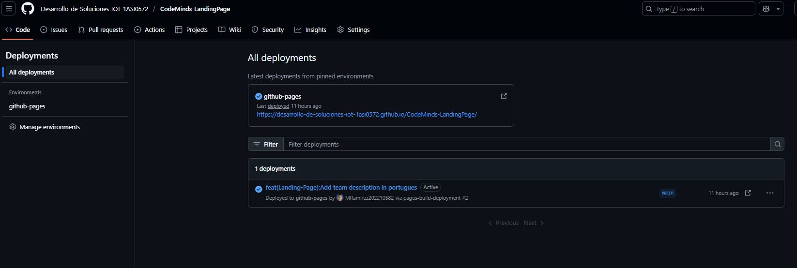

#### Aplicación Web

La aplicación web fue desplegada utilizando **Firebase Hosting**, un servicio de Google que permite alojar aplicaciones web de forma rápida y segura. Firebase Hosting es ideal para aplicaciones de una sola página (SPA) y proporciona características como SSL automático, integración con otras herramientas de Firebase y un CDN global para mejorar la velocidad de carga.
   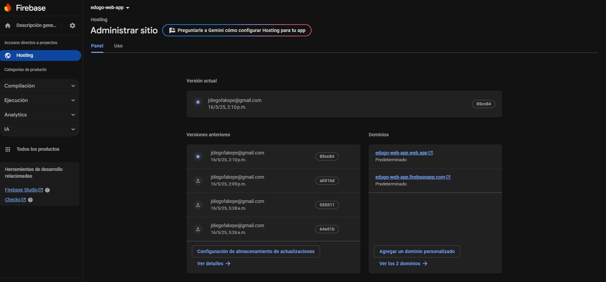

## 6.2. Landing Page, Services & Applications Implementation.

En esta sección, detallamos el proceso completo de implementación, pruebas, documentación y despliegue de los distintos componentes que conforman la solución. Esto incluye el desarrollo de nuestra Landing Page, que sirve como punto de entrada y presentación de nuestro producto al público general, así como la implementación de los Servicios Web, Aplicaciones Web, Aplicaciones Móviles y Aplicaciones Embebidas que constituyen el núcleo funcional de nuestra propuesta.

A lo largo de esta sección, explicamos cómo hemos abordado cada fase del ciclo de vida del desarrollo de software para estos componentes, desde la planificación inicial y el diseño, hasta la ejecución de pruebas y el despliegue en entornos de producción. Detallamos las tecnologías utilizadas, los desafíos enfrentados y las soluciones implementadas para asegurar que cada componente cumpla con los requisitos establecidos y proporcione una experiencia de usuario óptima.

### 6.2.1. Sprint 1

#### 6.2.1.1. Sprint Planning 1.
En esta primera planificación se establecieron los objetivos iniciales del proyecto y se organizaron las tareas prioritarias para iniciar el desarrollo. Se definieron los primeros entregables y se distribuyeron responsabilidades entre los integrantes del equipo.

| Sprint #                                 | Sprint 1                                                                                                                                                                                                                                                                                                                                                                                                                                           |
| ---------------------------------------- | -------------------------------------------------------------------------------------------------------------------------------------------------------------------------------------------------------------------------------------------------------------------------------------------------------------------------------------------------------------------------------------------------------------------------------------------------- |
| **Sprint Planning Background**           |                                                                                                                                                                                                                                                                                                                                                                                                                                                    |
| Date                                     | 2025-05-02                                                                                                                                                                                                                                                                                                                                                                                                                                         |
| Time                                     | 20:00 PM                                                                                                                                                                                                                                                                                                                                                                                                                                           |
| Location                                 | Virtual meeting via Discord                                                                                                                                                                                                                                                                                                                                                                                                                        |
| Prepared By                              | Angel Antonio Cancho Corilla / Juan Diego Cueto Dominguez / Scott Jacobo Huachaca Advincula / Marcelo Sebastian Ramirez Ramirez / Paolo Del Carmen Martinez Villanueva / Xiao Lian Li Zegarra                                                                                                                                                                                                                                                      |
| Attendees (to planning meeting)          | Angel Antonio Cancho Corilla / Juan Diego Cueto Dominguez / Scott Jacobo Huachaca Advincula / Marcelo Sebastian Ramirez Ramirez / Paolo Del Carmen Martinez Villanueva / Xiao Lian Li Zegarra                                                                                                                                                                                                                                                      |
| **Pre-Sprint Review Summary**            | During the preparation phase, the sprint bases were defined, focusing on the development of the Landing Page and the business logic applied to the Front-End design of the web application.                                                                                                                                                                                                                                                        |
| **Initial Sprint Retrospective Summary** | The objectives set in Sprint 1 were met, however, opportunities for improvement in time and task management were identified.                                                                                                                                                                                                                                                                                                                       |
| **Sprint Goal & User Stories**           |                                                                                                                                                                                                                                                                                                                                                                                                                                                    |
| Sprint 1 Goal                            | Our focus is on delivering a clear and simple landing page that communicates the main value of our service. Also an interface, that allows administrators, to visualize business related information and analytics.We believe the mentioned functionalities development will increase the value in the experience for our users.This will be confirmed when new visitors learn more about our service and users are using the implemented features |
| Sprint 1 Velocity                        |                                                                                                                                                                                                                                                                                                                                                                                                                                                    |
| Sum of Story Points                      | 16 Story Points                                                                                                                                                                                                                                                                                                                                                                                                                                    |

#### 6.2.1.2. Aspect Leaders and Collaborators.
Se asignaron responsabilidades según el área de desarrollo, distribuyendo roles de liderazgo (L) y colaboración (C) entre los integrantes del equipo para asegurar el cumplimiento de los entregables priorizados.

# Leadership and Collaboration Matrix (LACX)

| **Team Member (Last Name, First Name)**   | **GitHub Username** | **Landing Page Development (L/C)** | **Business Logic for Front-End (L/C)** | **Administration Interface (L/C)** | **Data Visualization (L/C)** | **Analytics (L/C)** |
| ----------------------------------------- | ------------------- | ---------------------------------- | -------------------------------------- | ---------------------------------- | ---------------------------- | ------------------- |
| **Cancho Corilla, Angel Antonio**         | `angerlessdev`      | **L**                              | **C**                                  | **C**                              | **C**                        | **L**               |
| **Cueto Dominguez, Juan Diego**           | `JDu202012207`      | **C**                              | **L**                                  | **C**                              | **L**                        | **C**               |
| **Huachaca Advincula, Scott Jacobo**      | `Scott-Huachaca`    | **C**                              | **C**                                  | **L**                              | **C**                        | **C**               |
| **Ramirez Ramirez, Marcelo Sebastian**    | `MRamirez202210582` | **C**                              | **C**                                  | **C**                              | **C**                        | **L**               |
| **Del Carmen Martinez Villanueva, Paolo** | `paolomv02`         | **C**                              | **L**                                  | **C**                              | **C**                        | **C**               |
| **Li Zegarra, Xiao Lian**                 | `XLianLZ`           | **C**                              | **C**                                  | **L**                              | **C**                        | **C**               |

#### 6.2.1.3. Sprint Backlog 1.
Este sprint contempló tareas enfocadas en la creación de la Landing Page y en la implementación de la navegación básica de la aplicación web. Todo el trabajo fue gestionado y versionado en los repositorios correspondientes como parte del control del desarrollo.

# Sprint 1

| User Story |                                                      | Work-Item / Task |                                       |                                                                                       |                    |                              |                                                |
| ---------- | ---------------------------------------------------- | ---------------- | ------------------------------------- | ------------------------------------------------------------------------------------- | ------------------ | ---------------------------- | ---------------------------------------------- |
| Id         | Title                                                | Id               | Title                                 | Description                                                                           | Estimation (Hours) | Assigned To                  | Status (To-do / In-Process / To-Review / Done) |
| HU10       | Generación de reportes automáticos                   | TA01             | Lógica para la generacion de reportes | Programacion de la logica vinculada a la generacion de reportes                       | 5 horas            | Angel Cancho- Paolo Martinez | Done                                           |
| HU45       | Visualización del historial de incidentes            | TA02             | Desarrollo del listado de incidentes  | Listado de incidentes recibidos de un endpoint                                        | 2.5 horas          | Juan Diego Cueto             | Done                                           |
|            |                                                      | TA03             | Vista de Incidentes                   | Desarrollo de la vista de que muestra informacion detallada de la lista de incidentes | 2.5 horas          | Scott Huachaca               | Done                                           |
| HU52       | Visualizacion de proposito y beneficios del servicio | TA04             | Navegacion                            | Implementacion de una barra de navegacion                                             | 1 hora             | Xiao Li                      | Done                                           |
|            |                                                      | TA05             | Contenido Principal                   | Insercion de informacion en la landing page                                           | 2 horas            | Xiao Li                      | Done                                           |
| HU53       | Formulario de Contacto                               | TA06             | Formulario                            | Desarrollo de formulario con campos de contacto(nombre, correo, mensaje, etc.)        | 2 horas            | Marcelo Ramirez              | Done                                           |

#### 6.2.1.4. Development Evidence for Sprint Review.
Para este primer sprint se decidió trabajar en una rama diferente para después unirlo todo en develop. Cada miembro ha realizado un commit para luego hacer merge.

| Repository            | Branch                          | Commit ID                                | Commit Message                                                        | Committed on(date)    |
| --------------------- | ------------------------------- | ---------------------------------------- | --------------------------------------------------------------------- | --------------------- |
| CodeMinds-LandingPage | main                            | de87e5cb957edb9c71d78843c64ff5b761060c2b | fix(landing-page): set english as default language                    | 13/05/2025            |
| CodeMinds-LandingPage | main                            | 3bfbb3898b963e1e82bd4551dfaae948e3b1504f | feat(landing-page): add language configuration file                   | 13/05/2025            |
| CodeMinds-LandingPage | main                            | 3b1c3c3320f227ac5f1ab5d909b52c19414b1fcd | feat(landing-page): style sheet initial commit                        | 13/05/2025            |
| CodeMinds-LandingPage | main                            | 0093fdb53adc93987efdc078f1d54d1d49024dd3 | feat(landing-page): script file initial commit                        | 13/05/2025            |
| CodeMinds-LandingPage | main                            | 4cf928b3881c5245f13d654fb9b879f57f2c830c | feat(landing-page): html file initial commit                          | 13/05/2025            |
| CodeMinds-LandingPage | main                            | 67d79de6195f29a88e98b6614db9878c3b22bbd7 | feat(Landing-Page): Add team description in portugues                 | 15/05/2025            |
| CodeMinds-LandingPage | main                            | e4592aab9c36bcfd1e116e55597a408ad2ea5e08 | feat(Landing-Page): add team description translation                  | 15/05/2025            |
| CodeMinds-LandingPage | main                            | 790ce5d99a62f0be973d0fffb3ef3e9738df9553 | feat(Landing-Page): add Team photo                                    | 15/05/2025            |
| CodeMinds-LandingPage | main                            | 8d945be380998242fd8dafe0e6d25f0abe678bb5 | feat(Landing-Page): add team profile images                           | 15/05/2025            |
| CodeMinds-LandingPage | main                            | b93812f67ca125711b99050460703265f26fc929 | chore(landing-page): manage contact and team translations             | 15/05/2025            |
| CodeMinds-LandingPage | main                            | dfc49155d29e9517508dfa4516f63524cc51a9b2 | chore(landing-page): contact and team styles                          | 15/05/2025            |
| CodeMinds-LandingPage | main                            | eb128daedcdf4758eb5710c8751e7770a11aa2cf | chore(landing-page): add contact and team references to the home      | 15/05/2025            |
| CodeMinds-LandingPage | main                            | 2b6750085efaf5a521b69be888e9d8eacf4581f6 | feat(landing-page): add team html file                                | 15/05/2025            |
| CodeMinds-LandingPage | main                            | cfe4749e33cbd6eebd0e3b76ffaf629ee433f2aa | feat(landing-page): add contact html file                             | 15/05/2025            |
| CodeMinds-LandingPage | main                            | 22ef41e8c68294a78d49acae7b62fbd6b90f7bdc | chore(landing-page): set english as default language                  | 15/05/2025            |
| edugo-web-application | develop                         | b8307949e7b3234859c51b4ccf784a6959713c58 | feat(dashboard): add view dashboard                                   | 15/05/25              |
| edugo-web-application | develop                         | 35dd827d518592fdab57c292c46249fa541d1411 | feat(develop): add header component                                   | 15/05/25              |
| edugo-web-application | main                            | 2c4ecee3371b8c08c8944ad06a791beb948494ba | docs: update readme with installation instructions                    | 15/05/25              |
| edugo-web-application | main                            | 117a7e4348fd934cbfac10a7766f4f80cca3ee04 | chore: initial commit                                                 | 15/05/25              |
| edugo-web-application | develop                         | 87a4baf387429c8bd1e8309b153ababfe861d8c3 | refactor: update navigation routes with semantic rules                | 16/05/25              |
| edugo-web-application | develop                         | 025e6e36dd321a23530898339d6ba9ecdca36a82 | feat(profiles): add component for profile                             | 16/05/25              |
| edugo-web-application | develop                         | 2b2888b8dacc6ad889d6e8c6395a66c15187602a | fix(develop): fix merge errors                                        | 16/05/25              |
| edugo-web-application | feature/add-reports-table       | fe48c3d8be5a2120fb85b1ff60610cced0431a57 | feat(add-reports-table): merged in develop branch                     | 16/05/25              |
| edugo-web-application | feature/add-analytics-dashboard | efcd0c7f72f4eddb0aa078419bdeccc544543940 | refactor(analytics): update models and services for new fake API data | 16/05/25              |
| edugo-web-application | develop                         | 79e054aa940d0e0b7cb05354505a92699aa3cde1 | refactor(iam): add logo icon to sign-in and route login to dashboard  | 16/05/25              |
| edugo-web-application | develop                         | f2237a290593f733df798f66e851da39b04dd133 | feat(iam): add sign-in page and set login as principal route          | 16/05/25              |
| edugo-web-application | develop                         | fef1688972539792753109a14dca2df9206c4ee3 | chore(update): update api url                                         | 16/05/25              |
| edugo-web-application | feature/add-reports-table       | 4f3143818ddce8c519eb2ae4c9d625fd11b86fa5 | feat(add-reports-table): add table filter                             | 16/05/25              |
| edugo-web-application | feature/add-reports-table       | ce0fe99ebbdd4f3c38081342f6bcfcce57be3c6d | feat(add-reports-table): add incidents model                          | 16/05/25              |
| edugo-web-application | feature/add-reports-table       | 43f8f6d6c076908c8f2bccd7541ab074417ce025 | feat(add-reports-table): add reports table                            | 16/05/25              |

#### 6.2.1.5. Testing Suite Evidence for Sprint Review.
Durante este sprint se registraron evidencias de pruebas a través de los commits realizados en los repositorios correspondientes. Estas pruebas permitieron verificar el correcto funcionamiento de los componentes desarrollados, como la estructura de la Landing Page y la navegación en la aplicación web. Los cambios fueron documentados y versionados como parte del control de calidad del desarrollo.

| Repository            | Branch | Commit ID                                | Commit Message                                         | Committed on(date) |
| --------------------- | ------ | ---------------------------------------- | ------------------------------------------------------ | ------------------ |
| CodeMinds-LandingPage | main   | 67d79de6195f29a88e98b6614db9878c3b22bbd7 | feat(Landing-Page):Add team description in portugues   | 16/05/25           |
| edugo-web-application | main   | 87a4baf387429c8bd1e8309b153ababfe861d8c3 | refactor: update navigation routes with semantic rules | 16/05/25           |

#### 6.2.1.6. Execution Evidence for Sprint Review.

Para el logro de este proyecto, se realizó el despliegue tanto de la Landing Page, como la primera versión de la aplicación web, las cuales se encuentran en los siguientes enlaces a continuación:

**Para el landing page**
Se muestra la interfaz principal de la página de aterrizaje, diseñada para presentar el servicio de forma clara, accesible y con un enfoque visual enfocado en captar la atención del usuario.

Enlace a la Landing Page: https://shorturl.at/gUWFP

**Para la aplicación web**
Se visualiza la pantalla de inicio de sesión de la aplicación web, como parte del módulo de autenticación desarrollado en esta primera versión funcional.
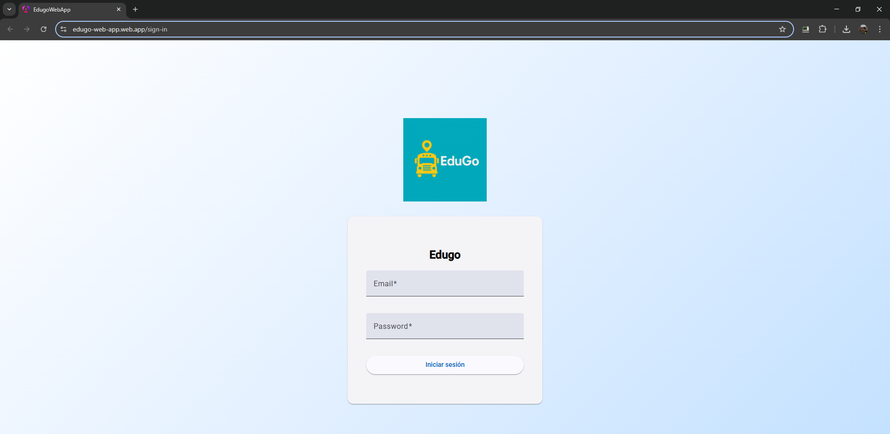
Enlace al FrontEnd: https://edugo-web-app.web.app/sign-in

**Enlace del video de evidencia:** https://shorturl.at/ca4qS

#### 6.2.1.7. Services Documentation Evidence for Sprint Review.

A continuación se presenta la documentación de los servicios de la aplicación web, incluyendo la descripción de los
endpoints disponibles.

| Endpoint                                                          | Http Verb | Accion              | Descripcion                                                                                                                                                                             |
| ----------------------------------------------------------------- | --------- | ------------------- | --------------------------------------------------------------------------------------------------------------------------------------------------------------------------------------- |
| https://jdu202012207.github.io/pruebas-api/drivers.json           | GET       | Obtener conductores | Devuelve información de los conductores registrados, incluyendo datos personales, número de licencia, vehículo asignado y estudiantes a su cargo.                                       |
| https://jdu202012207.github.io/pruebas-api/parents.json           | GET       | Obtener apoderados  | Devuelve información de los padres de familia registrados, incluyendo nombre, DNI, número telefónico, foto y los estudiantes a su cargo                                                 |
| https://jdu202012207.github.io/pruebas-api/students.json          | GET       | Obtener estudiantes | Devuelve información de los estudiantes registrados, incluyendo su nombre, colegio, grado, código RFID, foto y relación con su apoderado y conductor asignado.                          |
| https://jdu202012207.github.io/pruebas-api/analytics-drivers.json | GET       | Obtener analíticas  | Devuelve analíticas de rendimiento de los conductores, incluyendo resumen de incidentes (desvíos, tardanzas, excesos de velocidad), tiempos de llegada y distancias recorridas por día. |

#### 6.2.1.8. Software Deployment Evidence for Sprint Review.

Para el sprint presentado de la landing page y FrontEnd se optó por varias herramientas para su desarrollo.

- _Git_: Se utilizó para el control de versiones del código fuente.
- _GitFlow_: Se utilizó para ver el avance de los integrantes del equipo.
- _GitHub_: Se utilizó para crear el repositorio de la landing page, donde se subió el código fuente.
- _Angular_: Se utilizó para crear el web app funcional con la ayuda de un fakeapi
- _GitHub Pages_: Es la plataforma donde se desplegó la landing page. Se eligió por ser una solución gratuita, rápida y sencilla que permite publicar directamente desde el repositorio de GitHub.

**Despliegue del landing**
Para el despliegue de la landing page, se configuró el servicio de GitHub Pages siguiendo los siguientes pasos:

1. Se accedió al repositorio en la plataforma de GitHub.
2. En la parte superior del repositorio, se hizo clic en la pestaña **"Settings"**.
3. En el menú lateral izquierdo, se seleccionó la opción **"Pages"**.
4. En la sección **"Source"**, se eligió la rama `main` como origen y la carpeta raíz (`/`) como directorio de publicación.
5. Finalmente, se hizo clic en **"Save"** para guardar los cambios y activar el despliegue.

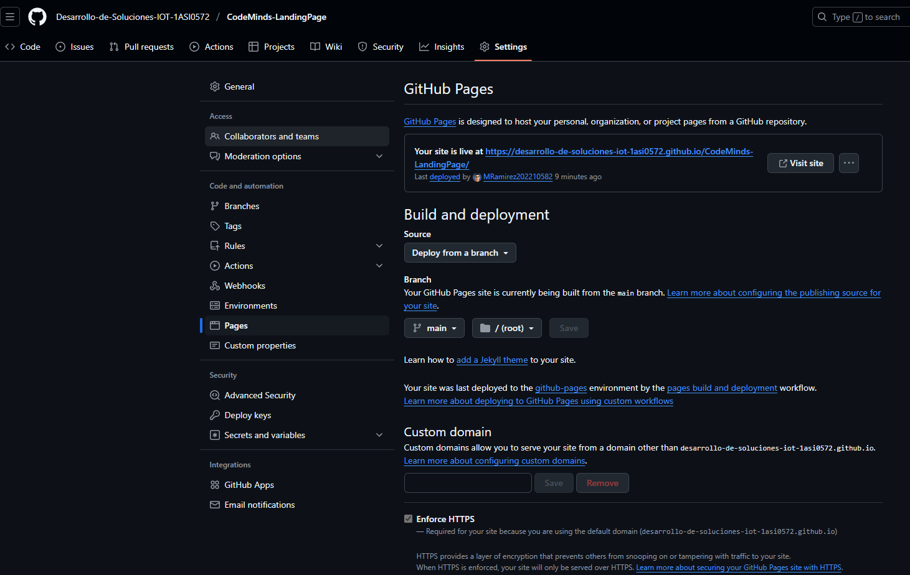

#### 6.2.1.9. Team Collaboration Insights during Sprint.

Para esta sección del documentos, añadimos los insights realizados durante el sprint, tanto de la realización de la aplicación web, como el landing page:

Insights del LandingPage, donde se muestran los commits realizados al repositorio en el ultimo mes

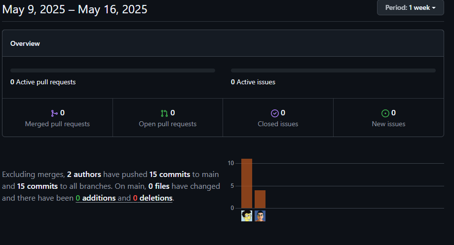
 

Insights del FrontEnd, donde se muestran los commits realizados al repositorio en el ultimo mes

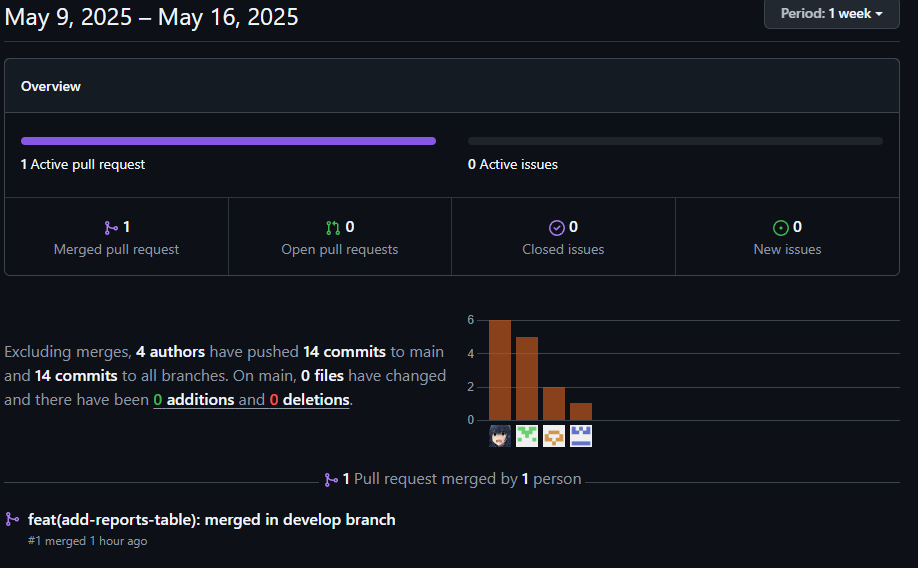

### 6.2.2. Sprint 2

#### 6.2.2.1. Sprint Planning 2.
En esta segunda planificación se definieron nuevos objetivos orientados a expandir las funcionalidades del sistema, incluyendo mejoras en la página web empresarial, el desarrollo inicial de la aplicación embebida, la integración con el nodo Edge, el diseño del backend, y el avance en la aplicación móvil. Se establecieron las tareas clave, se organizó la carga de trabajo entre los integrantes y se proyectaron entregables que consolidan la arquitectura general del proyecto.

| Sprint #                                 | Sprint 2                                                                                                                                                                                                                                                                                                                                                                                                                                                                                                                                                                                                                                                                                                                                                                                                                                                                                                                                                                                                                                                                                                                                                                                                                                                                                                                                                                                                                                                                                                                                                                                                                                                                                                                                                                                                                                                                                                                                                                                                                                                                               |
| ---------------------------------------- | -------------------------------------------------------------------------------------------------------------------------------------------------------------------------------------------------------------------------------------------------------------------------------------------------------------------------------------------------------------------------------------------------------------------------------------------------------------------------------------------------------------------------------------------------------------------------------------------------------------------------------------------------------------------------------------------------------------------------------------------------------------------------------------------------------------------------------------------------------------------------------------------------------------------------------------------------------------------------------------------------------------------------------------------------------------------------------------------------------------------------------------------------------------------------------------------------------------------------------------------------------------------------------------------------------------------------------------------------------------------------------------------------------------------------------------------------------------------------------------------------------------------------------------------------------------------------------------------------------------------------------------------------------------------------------------------------------------------------------------------------------------------------------------------------------------------------------------------------------------------------------------------------------------------------------------------------------------------------------------------------------------------------------------------------------------------------------------- |
| **Sprint Planning Background**           |                                                                                                                                                                                                                                                                                                                                                                                                                                                                                                                                                                                                                                                                                                                                                                                                                                                                                                                                                                                                                                                                                                                                                                                                                                                                                                                                                                                                                                                                                                                                                                                                                                                                                                                                                                                                                                                                                                                                                                                                                                                                                        |
| Date                                     | 2025-05-26                                                                                                                                                                                                                                                                                                                                                                                                                                                                                                                                                                                                                                                                                                                                                                                                                                                                                                                                                                                                                                                                                                                                                                                                                                                                                                                                                                                                                                                                                                                                                                                                                                                                                                                                                                                                                                                                                                                                                                                                                                                                             |
| Time                                     | 20:00 PM                                                                                                                                                                                                                                                                                                                                                                                                                                                                                                                                                                                                                                                                                                                                                                                                                                                                                                                                                                                                                                                                                                                                                                                                                                                                                                                                                                                                                                                                                                                                                                                                                                                                                                                                                                                                                                                                                                                                                                                                                                                                               |
| Location                                 | Virtual meeting via Discord                                                                                                                                                                                                                                                                                                                                                                                                                                                                                                                                                                                                                                                                                                                                                                                                                                                                                                                                                                                                                                                                                                                                                                                                                                                                                                                                                                                                                                                                                                                                                                                                                                                                                                                                                                                                                                                                                                                                                                                                                                                            |
| Prepared By                              | Angel Antonio Cancho Corilla / Juan Diego Cueto Dominguez / Scott Jacobo Huachaca Advincula / Marcelo Sebastian Ramirez Ramirez / Paolo Del Carmen Martinez Villanueva / Xiao Lian Li Zegarra                                                                                                                                                                                                                                                                                                                                                                                                                                                                                                                                                                                                                                                                                                                                                                                                                                                                                                                                                                                                                                                                                                                                                                                                                                                                                                                                                                                                                                                                                                                                                                                                                                                                                                                                                                                                                                                                                          |
| Attendees (to planning meeting)          | Angel Antonio Cancho Corilla / Juan Diego Cueto Dominguez / Scott Jacobo Huachaca Advincula / Marcelo Sebastian Ramirez Ramirez / Paolo Del Carmen Martinez Villanueva / Xiao Lian Li Zegarra                                                                                                                                                                                                                                                                                                                                                                                                                                                                                                                                                                                                                                                                                                                                                                                                                                                                                                                                                                                                                                                                                                                                                                                                                                                                                                                                                                                                                                                                                                                                                                                                                                                                                                                                                                                                                                                                                          |
| **Pre-Sprint Review Summary**            | During the preparation phase, the sprint bases were defined, focusing on the development of the Landing Page and the business logic applied to the Front-End design of the web application.                                                                                                                                                                                                                                                                                                                                                                                                                                                                                                                                                                                                                                                                                                                                                                                                                                                                                                                                                                                                                                                                                                                                                                                                                                                                                                                                                                                                                                                                                                                                                                                                                                                                                                                                                                                                                                                                                            |
| **Initial Sprint Retrospective Summary** | The objectives set in Sprint 1 were met, however, opportunities for improvement in time and task management were identified.                                                                                                                                                                                                                                                                                                                                                                                                                                                                                                                                                                                                                                                                                                                                                                                                                                                                                                                                                                                                                                                                                                                                                                                                                                                                                                                                                                                                                                                                                                                                                                                                                                                                                                                                                                                                                                                                                                                                                           |
| **Sprint Goal & User Stories**           |                                                                                                                                                                                                                                                                                                                                                                                                                                                                                                                                                                                                                                                                                                                                                                                                                                                                                                                                                                                                                                                                                                                                                                                                                                                                                                                                                                                                                                                                                                                                                                                                                                                                                                                                                                                                                                                                                                                                                                                                                                                                                        |
| Sprint 2 Goal                            | Our focus is on the addition of the about the product section and call to action buttons on the Business Website, the development of the first version for the embedded application, which scope includes a simulated prototype emulating the behaviors of the phisical device, the development and integration with the Edge Node for raw data processing, the design and development of the Backend Application that leads to its further implementation in the Web Application for Analytics related functionalities and the Mobile Application for Analytics, Authentication, Tracking and Execution functionalities.  We believe the improvements in the Business Website will enhance the first impressions for potential customers, the development of the first version of the embedded application in a simulated enviroment will allow the platform to test the data Flow, the integration of the Edge node will improve the efficiency in the use of computational resources and reduce the delay in the data transfer, the development and implementation of the Backend Application will enable the users to store, visualize and manage the data collected from the IoT devices. Furthermore, the integration of the backend with the Web Application for Analytics will provide insightful visualizations and reports to stakeholders. Lastly, the Mobile Application will empower users with real-time access to authentication, tracking, analytics, and execution features, thereby improving usability and overall engagement with the platform.  This will be confirmed when the enhanced first impresion manifest in an increment in the number of users, the platform is able to simulate the data harvesting from a physical device, the Edge node is able to proccess the data received from the simulation, the users are able to lively interact with the data in the platform, users are able to visualize and manage statistics the Web Application and are able to authenticate and make full use of the functionalities of the Mobile Application. |
| Sprint 2 Velocity                        |                                                                                                                                                                                                                                                                                                                                                                                                                                                                                                                                                                                                                                                                                                                                                                                                                                                                                                                                                                                                                                                                                                                                                                                                                                                                                                                                                                                                                                                                                                                                                                                                                                                                                                                                                                                                                                                                                                                                                                                                                                                                                        |
| Sum of Story Points                      | 65 Story Points                                                                                                                                                                                                                                                                                                                                                                                                                                                                                                                                                                                                                                                                                                                                                                                                                                                                                                                                                                                                                                                                                                                                                                                                                                                                                                                                                                                                                                                                                                                                                                                                                                                                                                                                                                                                                                                                                                                                                                                                                                                                        |

#### 6.2.2.2. Aspect Leaders and Collaborators.
En este sprint se asignaron roles específicos de liderazgo y colaboración a los miembros del equipo según los componentes clave del sistema. Esta matriz permitió organizar de forma eficiente las responsabilidades técnicas y asegurar el avance coordinado de cada módulo funcional.

# Leadership and Collaboration Matrix (LACX)

| **Team Member (Last Name, First Name)**   | **GitHub Username** | **Landing Page Development (L/C)** | **Business Logic for Front-End (L/C)** | **Administration Interface (L/C)** | **Data Visualization (L/C)** | **Analytics (L/C)** |
| ----------------------------------------- | ------------------- | ---------------------------------- | -------------------------------------- | ---------------------------------- | ---------------------------- | ------------------- |
| **Cancho Corilla, Angel Antonio**         | `angerlessdev`      | **L**                              | **C**                                  | **C**                              | **C**                        | **L**               |
| **Cueto Dominguez, Juan Diego**           | `JDu202012207`      | **C**                              | **L**                                  | **C**                              | **L**                        | **C**               |
| **Huachaca Advincula, Scott Jacobo**      | `Scott-Huachaca`    | **C**                              | **C**                                  | **L**                              | **C**                        | **C**               |
| **Ramirez Ramirez, Marcelo Sebastian**    | `MRamirez202210582` | **C**                              | **C**                                  | **C**                              | **C**                        | **L**               |
| **Del Carmen Martinez Villanueva, Paolo** | `paolomv02`         | **C**                              | **L**                                  | **C**                              | **C**                        | **C**               |
| **Li Zegarra, Xiao Lian**                 | `XLianLZ`           | **C**                              | **C**                                  | **L**                              | **C**                        | **C**               |

#### 6.2.2.3. Sprint Backlog 2.
En este sprint se abordaron múltiples historias de usuario orientadas a la funcionalidad del sistema completo. Las tareas incluyeron el desarrollo de la interfaz móvil, notificaciones, seguimiento en tiempo real, manejo de rutas, seguridad, integración con el backend y visualización de datos. Cada tarea fue asignada a un responsable y gestionada mediante estimaciones horarias, permitiendo un seguimiento detallado del progreso del equipo.

# Sprint 2

| User Story | Title                                                     | Work-Item / Task | Title                          | Description                                                                      | Estimation (Hours) | Assigned To      | Status     |
| ---------- | --------------------------------------------------------- | ---------------- | ------------------------------ | -------------------------------------------------------------------------------- | ------------------ | ---------------- | ---------- |
| US01       | Interfaz de inicio clara y atractiva en la app móvil      | TA01             | Diseño UI                      | Diseño visual y estructura inicial de la pantalla principal                      | 4.5 horas          | Marcelo Ramirez  | Done       |
|            |                                                           | TA02             | Implementación funcional       | Programación de la interfaz usando Flutter                                       | 5 horas            | Scott Huachaca   | Done       |
|            |                                                           | TA27             | Pruebas de usabilidad          | Evaluación de claridad e interacción con la pantalla de inicio                   | 4 horas            | Xiao Li          | To-do      |
| US03       | Notificación a padres al subir y bajar del transporte     | TA03             | Envío de notificaciones        | Implementación de lógica para enviar push al subir/bajar                         | 5 horas            | Juan Diego Cueto | In-Process |
|            |                                                           | TA04             | Integración con backend        | Conexión con eventos y base de datos para detección de subida/bajada             | 4.5 horas          | Paolo Martinez   | To-Review  |
|            |                                                           | TA28             | Pruebas de recepción           | Verificar recepción en distintos dispositivos                                    | 4 horas            | Angel Cancho     | To-do      |
| US04       | Visualización en mapa de la ruta y ubicación del vehículo | TA05             | Mapa en tiempo real            | Visualización en Google Maps o Mapbox                                            | 5 horas            | Xiao Li          | Done       |
|            |                                                           | TA06             | Seguimiento de ubicación       | Uso de GPS del dispositivo para actualizar la posición en el mapa                | 4.5 horas          | Angel Cancho     | Done       |
|            |                                                           | TA29             | Actualización en segundo plano | Garantizar que los datos se actualicen incluso si la app no está en primer plano | 4 horas            | Paolo Martinez   | To-do      |
| US06       | Registro y alerta por exceso de velocidad                 | TA07             | Alerta de velocidad            | Alerta visual o sonora cuando se supera el límite                                | 4.5 horas          | Marcelo Ramirez  | In-Process |
|            |                                                           | TA08             | Registro histórico             | Guardado de los eventos de exceso de velocidad en la base de datos               | 4 horas            | Juan Diego Cueto | To-do      |
|            |                                                           | TA30             | Reporte de excesos             | Generación de listado por unidad con eventos de exceso                           | 4.5 horas          | Scott Huachaca   | To-do      |
| US12       | Comunicación entre app y backend mediante API REST        | TA09             | Endpoints REST                 | Definición y documentación de endpoints para app móvil                           | 4 horas            | Paolo Martinez   | Done       |
|            |                                                           | TA10             | Consumo desde app              | Llamadas desde la app a los servicios REST                                       | 4.5 horas          | Xiao Li          | Done       |
|            |                                                           | TA31             | Manejador de errores de red    | Gestión de errores al perder conexión o recibir errores del backend              | 4 horas            | Angel Cancho     | To-do      |
| US13       | Implementación de seguridad JWT para usuarios             | TA32             | Generación de token            | Crear tokens JWT con claims personalizados                                       | 4.5 horas          | Scott Huachaca   | Done       |
|            |                                                           | TA33             | Validación de token            | Validar tokens en middleware para proteger rutas                                 | 4.5 horas          | Juan Diego Cueto | Done       |
|            |                                                           | TA34             | Expiración y renovación        | Lógica para controlar expiración y renovación de tokens                          | 5 horas            | Paolo Martinez   | Done       |
| US15       | Visualización de rutas predefinidas                       | TA35             | Listado de rutas               | Mostrar rutas disponibles por zona y horario                                     | 4.5 horas          | Marcelo Ramirez  | In-Process |
|            |                                                           | TA36             | Filtro por ubicación           | Filtrar rutas según ubicación actual del usuario                                 | 4 horas            | Angel Cancho     | To-do      |
| US16       | Configuración manual de rutas por el conductor            | TA37             | Interfaz de edición            | Pantalla para editar rutas                                                       | 4.5 horas          | Angel Cancho     | To-do      |
|            |                                                           | TA38             | Guardado de rutas              | Enviar cambios al backend para almacenar ruta personalizada                      | 4 horas            | Marcelo Ramirez  | To-do      |
| US18       | Acceso restringido según rol de usuario en sitio web      | TA39             | Middleware de roles            | Determinar acceso por rol (admin, conductor, padre)                              | 4.5 horas          | Xiao Li          | Done       |
|            |                                                           | TA40             | Pruebas de roles               | Verificar restricciones con usuarios de prueba                                   | 4 horas            | Paolo Martinez   | Done       |
| US21       | Notificación de retraso del transporte                    | TA41             | Cálculo de retraso             | Comparar hora estimada con real                                                  | 4 horas            | Juan Diego Cueto | To-Review  |
|            |                                                           | TA42             | Envío de alerta                | Notificar a padres si hay retraso significativo                                  | 4.5 horas          | Marcelo Ramirez  | To-Review  |
| US22       | Visualización de estudiantes con fotos                    | TA43             | Listado con fotos              | Mostrar nombre y foto en app del conductor                                       | 4.5 horas          | Paolo Martinez   | Done       |
|            |                                                           | TA44             | Actualización dinámica         | Refrescar lista en tiempo real                                                   | 4.5 horas          | Xiao Li          | Done       |
| US23       | Visualización de datos del conductor                      | TA45             | Perfil de conductor            | Mostrar datos como nombre, experiencia y licencia                                | 4.5 horas          | Scott Huachaca   | Done       |
|            |                                                           | TA46             | Enlace con backend             | Obtener datos desde backend para mostrar en la app                               | 4.5 horas          | Juan Diego Cueto | Done       |
| US26       | Historial de velocidad por unidad                         | TA47             | Registro de eventos            | Guardar datos de velocidad por unidad                                            | 4.5 horas          | Xiao Li          | In-Process |
|            |                                                           | TA48             | Visualización de historial     | Mostrar tabla o gráfico con velocidades                                          | 4 horas            | Marcelo Ramirez  | In-Process |
| US27       | Reporte mensual de control de aforo                       | TA49             | Consolidación de datos         | Recopilar eventos mensuales                                                      | 4.5 horas          | Marcelo Ramirez  | To-do      |
|            |                                                           | TA50             | Generación de PDF              | Crear documento con resumen mensual                                              | 4.5 horas          | Xiao Li          | To-do      |
| US28       | Historial detallado de rutas y ubicaciones                | TA51             | Registro de coordenadas        | Guardar GPS con timestamp                                                        | 4.5 horas          | Angel Cancho     | To-do      |
|            |                                                           | TA52             | Reproducción visual            | Mapa con animación de recorrido                                                  | 4.5 horas          | Paolo Martinez   | To-do      |
| US32       | Notificación de llegada próxima del transporte            | TA53             | Lógica de proximidad           | Detectar cercanía al destino                                                     | 4 horas            | Paolo Martinez   | To-do      |
|            |                                                           | TA54             | Activación de alerta           | Enviar notificación a padres                                                     | 4.5 horas          | Marcelo Ramirez  | To-do      |
| US33       | Activación de modo emergencia                             | TA55             | Botón de emergencia            | Botón visible en interfaz del conductor                                          | 4 horas            | Juan Diego Cueto | In-Process |
|            |                                                           | TA56             | Enlace con backend             | Enviar alerta al servidor                                                        | 4.5 horas          | Xiao Li          | To-do      |
| US42       | Personalización de notificaciones                         | TA57             | Filtro de tipos de alerta      | Permitir selección de tipos de alerta                                            | 4.5 horas          | Xiao Li          | To-do      |
|            |                                                           | TA58             | Guardado de configuración      | Registrar preferencias en el backend                                             | 4 horas            | Paolo Martinez   | To-do      |
| US43       | Estado en tiempo real de los estudiantes                  | TA59             | Indicador en vivo              | Mostrar si está en ruta, abordó o bajó                                           | 4.5 horas          | Scott Huachaca   | In-Process |
|            |                                                           | TA60             | Actualización automática       | Refrescar estados en tiempo real                                                 | 4.5 horas          | Marcelo Ramirez  | In-Process |
| US48       | Sistema propio de notificaciones                          | TA61             | Servicio alternativo           | Sistema propio de mensajería push                                                | 5 horas            | Marcelo Ramirez  | To-do      |
|            |                                                           | TA62             | Integración con app            | Reemplazar Firebase por nuevo sistema                                            | 5 horas            | Angel Cancho     | To-do      |
| US49       | Recuperación de contraseña                                | TA63             | Formulario de solicitud        | Ingreso de correo para recuperar clave                                           | 4 horas            | Scott Huachaca   | Done       |
|            |                                                           | TA64             | Enlace y validación            | Lógica para validar token de recuperación                                        | 4.5 horas          | Juan Diego Cueto | Done       |

#### 6.2.2.4. Development Evidence for Sprint Review.

Para este segundo sprint se decidió trabajar en ramas diferente para después unirlo todo en develop. Cada miembro ha realizado un commit para luego hacer merge.

**CodeMinds-Backend**:

| Repository        | Branch                         | Commit ID                                | Commit Message                                                                                                                                                 | Committed on(date) |
| ----------------- | ------------------------------ | ---------------------------------------- | -------------------------------------------------------------------------------------------------------------------------------------------------------------- | ------------------ |
| CodeMinds-Backend | feature/analytics              | d5d79ac6f6d8e069abde9e471c8a08099a055823 | feat(analytics): add analytics                                                                                                                                 | 05/06/2025         |
| CodeMinds-Backend | feature/iam                    | 47bd4e33395c449f916244bf43093054df48c3fa | feat(iam): add user and role management with exception handling                                                                                                | 12/06/2025         |
| CodeMinds-Backend | feature/iam                    | 786b2c3891934e37b08a5af573b2d892ee40d6f3 | feat(iam): implement query and command services for user and role management                                                                                   | 12/06/2025         |
| CodeMinds-Backend | feature/iam                    | 4fd0fe2181ddba12a324cc1bea4151e580025e9d | feat(iam): add implementation of JWT and BCrypt token services with security filters                                                                           | 12/06/2025         |
| CodeMinds-Backend | feature/iam                    | dbf7f23a418d68b8632232b9d0be97e52db6c143 | feat(iam): add authentication and user management endpoints with role seeding                                                                                  | 12/06/2025         |
| CodeMinds-Backend | feature/iam                    | 9ca324d6f49b15bcc57b8db00f74f1e38a153129 | feat(iam): add auditing support with abstract models and open-api configuration                                                                                | 13/05/2025         |
| CodeMinds-Backend | feature/iam                    | a2c8dc5a5e11b6261869bf13811c5ae08d8f4ed4 | feat(iam): add message resource record for standardized message handling                                                                                       | 13/06/2025         |
| CodeMinds-Backend | feature/iam                    | 82414c6979749ea6373dd7f53114ebe8579e42cf | feat: add location and real-time notification handling with new commands and resources                                                                         | 19/06/2025         |
| CodeMinds-Backend | feature/iam                    | 413f4c7f3147c66ce0bc8a3497e55286bc46d1e2 | fix: changes in the commands and implementation services                                                                                                       | 19/06/2025         |
| CodeMinds-Backend | feature/iam                    | fcac0379991403523392ea527fa387f7d43ed970 | Merge branch 'feature/identity-assignment' into develop                                                                                                        | 19/06/2025         |
| CodeMinds-Backend | feature/iam                    | 11bdffee2144ceb233f3e96725d0a04580323b66 | feat: update command and resource structures to use IDs instead of objects for wristbands and parents                                                          | 19/06/2025         |
| CodeMinds-Backend | feature/iam                    | eb65c8883ed64588d9be95e06affe4fb9612ca9b | feat: validate driverUserId exists and is of type driver                                                                                                       | 19/06/2025         |
| CodeMinds-Backend | feature/iam                    | 674a30e859ba238d60c9795728b17bf8ce2e6b7e | feat: add java runtime version configuration to system properties for deploy configurations                                                                    | 21/06/2025         |
| CodeMinds-Backend | feature/iam                    | 64f73ede3f14d433c09feae2a809cc17a68318d5 | feat: add wristband logic                                                                                                                                      | 22/06/2025         |
| CodeMinds-Backend | feature/iam                    | f76c3d3f6442788b9f64558ed42c760845a3de24 | feat: update datasource configuration to use environment variables                                                                                             | 22/06/2025         |
| CodeMinds-Backend | feature/iam                    | 9089ed0313a91475293d26dd6e02947235318d99 | feat: add role field to authenticatedUserResource and update assembler method                                                                                  | 22/06/2025         |
| CodeMinds-Backend | feature/iam                    | 897245c9deb8d446646f9cad1f1f3b76322ac639 | feat(iam): include user role in authenticated user resource response                                                                                           | 22/06/2025         |
| CodeMinds-Backend | feature/profiles               | 0da3d186af2de80578618004fa6a817326077edc | feat(profiles): add profiles bc                                                                                                                                | 09/06/2025         |
| CodeMinds-Backend | feature/profiles               | ce7666060d2838f51baa725a018b14c6d1493410 | fix(profiles): fix profiles services                                                                                                                           | 12/06/2025         |
| CodeMinds-Backend | feature/profiles               | 033f78099cb9e70cf3c30d8b17c519db29086f5a | feat(profiles): add acl with IAM                                                                                                                               | 12/06/2025         |
| CodeMinds-Backend | feature/real-time-notification | 5363f7c9e3d4f5aa5e45208b0e049086f92eacfe | feat: add RealTimeNotification                                                                                                                                 | 06/06/2025         |
| CodeMinds-Backend | feature/real-time-notification | 3c7d7d9bb583b38dbaa259e1adad6913a850f5e0 | feat: add AuditableModel                                                                                                                                       | 06/06/2025         |
| CodeMinds-Backend | feature/real-time-notification | 7c425f6bd5cf96a0dbfffa773bbd48a9c96b163b | feat: add AuditableAbstractAggregateRoot                                                                                                                       | 06/06/2025         |
| CodeMinds-Backend | feature/real-time-notification | c6e330890cabf2e7769944abfade51b439b7d11c | feat: add CorsConfig                                                                                                                                           | 06/06/2025         |
| CodeMinds-Backend | feature/real-time-notification | e1f323265d37f37dfb3ba96a411ef31f145fc45d | feat: add RealTimeNotificationCommandService interface                                                                                                         | 06/06/2025         |
| CodeMinds-Backend | feature/real-time-notification | 7fefc1188807093685010975da686e9933b7aa75 | feat: add SnakeCaseWithPluralizedTablePhysicalNamingStrategy class                                                                                             | 06/06/2025         |
| CodeMinds-Backend | feature/real-time-notification | ea7685bea0b6faa722ced5b5c51f9c5561e53bd3 | feat: add CreateRealTimeNotificationResource record                                                                                                            | 06/06/2025         |
| CodeMinds-Backend | feature/real-time-notification | d4b9b90c0f406bfe6ee8351514b6a5877f0ccfb6 | feat: add GetAllRealTimeNotificationsQuery record                                                                                                              | 06/06/2025         |
| CodeMinds-Backend | feature/real-time-notification | 21c1f032a14ba889acf7e338b6cdb80ad011aa11 | ffeat: add GetRealNotificationsForUserId record                                                                                                                | 06/06/2025         |
| CodeMinds-Backend | feature/real-time-notification | 1cf4ada80e85053469ba4f3ff06628a55662ab99 | feat: add GetRealNotificationsForUserType record                                                                                                               | 06/06/2025         |
| CodeMinds-Backend | feature/real-time-notification | 5aca9faaf9a882c89729eacca0e1748578ae3e44 | feat: add NotificationEvent value object                                                                                                                       | 06/06/2025         |
| CodeMinds-Backend | feature/real-time-notification | 405f7039b4937b100f01e778231f0041ce5357d0 | feat: add OpenApiConfiguration for API documentation                                                                                                           | 06/06/2025         |
| CodeMinds-Backend | feature/real-time-notification | 089956a90d3f7526f6a3e46149644b19c3c6e030 | feat: add RealTimeNotificationCommandServiceImpl implementation                                                                                                | 06/06/2025         |
| CodeMinds-Backend | feature/real-time-notification | 2e0440caa08b37af00379dad7fc2ddcf655aee66 | feat: add NotificationStatus enum                                                                                                                              | 06/06/2025         |
| CodeMinds-Backend | feature/real-time-notification | 4b429657648075441516a6b8e16f1008176b2b78 | feat: add CreateRealTimeNotificationCommandFromResourceAssembler class                                                                                         | 06/06/2025         |
| CodeMinds-Backend | feature/real-time-notification | 23edb522e640703daf7c0eb14af7c209351da9b0 | feat: add RealTimeNotificationController with CRUD endpoints                                                                                                   | 06/06/2025         |
| CodeMinds-Backend | feature/real-time-notification | bea206d0760baa8f722ba35841b96dcf10ea6018 | feat: add tripId and studentId fields to RealTimeNotification class                                                                                            | 12/06/2025         |
| CodeMinds-Backend | feature/real-time-notification | 6b0b06862dac3e00de80b45bc315fe155e00e2c3 | feat: add getters for eventType and description in NotificationEvent class                                                                                     | 12/06/2025         |
| CodeMinds-Backend | feature/real-time-notification | 311488a8625777fc9997a56b4fbd739ebc696a9e | feat: add StudentBoardedEventListener to handle student boarding events                                                                                        | 12/06/2025         |
| CodeMinds-Backend | feature/real-time-notification | 29f1eb6741d43e6786af3759b3a0c48890026634 | feat: enhance RealTimeNotificationResourceFromEntityAssembler to include additional fields                                                                     | 12/06/2025         |
| CodeMinds-Backend | feature/real-time-notification | 353356ef153ff65269e3cda56b8134229a2cfcb0 | feat: expand RealTimeNotificationResource to include eventType, description, timestamp, tripId, and studentId                                                  | 12/06/2025         |
| CodeMinds-Backend | feature/real-time-notification | 7128a5fa223e2fbcb9e8237556a70157a01a1be0 | feat: add methods to RealTimeNotificationRepository for querying by studentId, tripId, and userId with tripId                                                  | 12/06/2025         |
| CodeMinds-Backend | feature/real-time-notification | 937c5bd6059bb70f6c11cfa736a136cb1a05b204 | feat: add query methods in RealTimeNotificationQueryServiceImpl for studentId, tripId, and userId with tripId                                                  | 12/06/2025         |
| CodeMinds-Backend | feature/real-time-notification | 39e918c15c90ce0ba5379cb77ad48ceddc29b905 | feat: add query methods in RealTimeNotificationQueryService for studentId, tripId, and userId with tripId                                                      | 12/06/2025         |
| CodeMinds-Backend | feature/real-time-notification | 7dc1852a16a0ab5a7d2dff48fe35075c8ba98d4d | feat: update RealTimeNotificationCommandServiceImpl to include tripId and studentId in notification creation                                                   | 12/06/2025         |
| CodeMinds-Backend | feature/real-time-notification | ac575434ea5b7f602bcb8faabc48cca06387336f | feat: add GetRealNotificationsForUserAndTrip record for user and trip notification queries                                                                     | 12/06/2025         |
| CodeMinds-Backend | feature/real-time-notification | eba42763b4b3a968447b0b62efd4d84d49405328 | feat: add GetRealNotificationsForTripId record for trip notification queries                                                                                   | 12/06/2025         |
| CodeMinds-Backend | feature/real-time-notification | 9f3cf79f843a41ed3185f99b4276b6f12df96244 | feat: add GetRealNotificationsForStudentId record for student notification queries                                                                             | 12/06/2025         |
| CodeMinds-Backend | feature/real-time-notification | 3e1aa52ff0fd1947d4edadd3a685a763443a3c1b | feat: extend CreateRealTimeNotificationResource to include tripId and studentId                                                                                | 12/06/2025         |
| CodeMinds-Backend | feature/real-time-notification | 9aa67130a856631840c74ea21f911b2ca6f7bec9 | feat: update CreateRealTimeNotificationCommandFromResourceAssembler to include tripId and studentId                                                            | 12/06/2025         |
| CodeMinds-Backend | feature/real-time-notification | 9f189d7e4c6295ac7634d1efd2a6df2ccf48f54e | feat: extend CreateRealTimeNotificationCommand to include tripId and studentId                                                                                 | 12/06/2025         |
| CodeMinds-Backend | feature/real-time-notification | e5b1ec2ba76481a8ec54c79b2ce28967f5ee8bd1 | feat: add endpoints to retrieve notifications by tripId, studentId, and userId with tripId                                                                     | 12/06/2025         |
| CodeMinds-Backend | feature/real-time-notification | 211cfb82fb14ca5e63bf221d75bffc8e4a5f3615 | feat: add StudentExitedEventListener to handle student exit events and create notifications                                                                    | 12/06/2025         |
| CodeMinds-Backend | feature/real-time-notification | a20375e44d5f52a06c9d46cbb3adb0719fb8d4c7 | feat: add TripEndedEventListener to handle trip end events and create notifications                                                                            | 12/06/2025         |
| CodeMinds-Backend | feature/real-time-notification | 53742585c278767ad7745de147f74fa3bc6c064b | feat: add TripStartedEventListener to handle trip start events and create notifications                                                                        | 12/06/2025         |
| CodeMinds-Backend | feature/real-time-notification | 61a58e35f6293dc787b17b0ba11b44dd17d70578 | feat: add SpeedExceededEventListener to handle speed exceeded events and create notifications                                                                  | 12/06/2025         |
| CodeMinds-Backend | feature/real-time-notification | ba574f6ac7827aa2b2a0aed5f2be3b5cb3f72375 | feat: add TripStartedEventListener to handle trip start events and create notifications                                                                        | 12/06/2025         |
| CodeMinds-Backend | feature/real-time-notification | 8bea4add3f44d4af136ba76c57660b5a674b6bea | feat: add additional endpoints to RealTimeNotificationController for filtering notifications by user and trip                                                  | 18/06/2025         |
| CodeMinds-Backend | feature/vehicule-tracking      | 4dcd27170e579388807034d2c43c227a390a9287 | feat: disable Spring Security                                                                                                                                  | 06/06/2025         |
| CodeMinds-Backend | feature/vehicule-tracking      | 3274e8b6ea1514ab32e707b868f8f62b014086e4 | feat: add vehicule commandservices                                                                                                                             | 06/06/2025         |
| CodeMinds-Backend | feature/vehicule-tracking      | 88aef1921378e5cd72eb3fc6063ae584a19659a6 | feat: add vehicule queryservices                                                                                                                               | 06/06/2025         |
| CodeMinds-Backend | feature/vehicule-tracking      | 82d38a567afdbcd3cfe0a693a5b765b444b6514b | feat: add vehicule aggregate                                                                                                                                   | 06/06/2025         |
| CodeMinds-Backend | feature/vehicule-tracking      | 198b8883573d8122e6df5bd38841a784296d5bfa | feat: add vehicule commands                                                                                                                                    | 06/06/2025         |
| CodeMinds-Backend | feature/vehicule-tracking      | 690bde9083c983cb7e22f7821f66cfe23a855f43 | feat: add vehicule entitie                                                                                                                                     | 06/06/2025         |
| CodeMinds-Backend | feature/vehicule-tracking      | 7d5fd313bd4692f0c8ea1262c10fd3099f2fb24b | feat: add vehicule queries                                                                                                                                     | 06/06/2025         |
| CodeMinds-Backend | feature/vehicule-tracking      | a07f58bff3ab19acadd05b719f22742d16ac1e89 | feat: add vehicule value object                                                                                                                                | 06/06/2025         |
| CodeMinds-Backend | feature/vehicule-tracking      | 64aae9e8bad77fabda46f834bb4a0c48a95f2768 | feat: add vehicule services                                                                                                                                    | 06/06/2025         |
| CodeMinds-Backend | feature/vehicule-tracking      | b7fdbf506603dd1cfa2e8003bff77ac5f5125bd0 | feat: add vehicule repositories                                                                                                                                | 06/06/2025         |
| CodeMinds-Backend | feature/vehicule-tracking      | 988af0f6aaf768abdbb41e62aac3df52673a351d | feat: add vehicule resources                                                                                                                                   | 07/06/2025         |
| CodeMinds-Backend | feature/vehicule-tracking      | 4ec390f19b5869882192f66163bb013aeef729b3 | feat: add vehicule transforms                                                                                                                                  | 07/06/2025         |
| CodeMinds-Backend | feature/vehicule-tracking      | b84439c8ee66e92ba263dc87b0a6fd653e493f7d | feat: add vehicule controller                                                                                                                                  | 07/06/2025         |
| CodeMinds-Backend | feature/vehicule-tracking      | 6372c1787b97fdfb7edd9c5caf08bc986ae93758 | feat: add share aggregate                                                                                                                                      | 07/06/2025         |
| CodeMinds-Backend | feature/vehicule-tracking      | bca308157cf69f13fb91f328d598d013d2e5b994 | feat: add share entitie                                                                                                                                        | 07/06/2025         |
| CodeMinds-Backend | feature/vehicule-tracking      | bb3e53bc3d19cc402e692c46165de3e93c254b8a | feat: add openapi configuration                                                                                                                                | 07/06/2025         |
| CodeMinds-Backend | feature/vehicule-tracking      | c0d0428d891583bfac3598cc3b2f1aaca2ac1815 | feat: add shared persistence jpa strategy                                                                                                                      | 07/06/2025         |
| CodeMinds-Backend | feature/vehicule-tracking      | 373ddca06a6c4e608e6c3a1368311310a2d1f8f1 | feat: add shared interfaces                                                                                                                                    | 07/06/2025         |
| CodeMinds-Backend | feature/vehicle-tracking       | 82631519d2229e379a6b0b9e95c94df8ba71833e | feat(vehicle-tracking): add Trip entity                                                                                                                        | 12/06/2025         |
| CodeMinds-Backend | feature/vehicle-tracking       | 43a971e8a4b0f6e66050021c8320234487adbb4d | feat(vehicle-tracking): enhance Vehicle entity with status and trips management                                                                                | 12/06/2025         |
| CodeMinds-Backend | feature/vehicle-tracking       | cb8d11b4f3c85a56c0004338757de74d21aab010 | feat(vehicle-tracking): add VehicleStatus enum for tracking vehicle states                                                                                     | 12/06/2025         |
| CodeMinds-Backend | feature/vehicle-tracking       | 24476eb53a68795262bf1c80260a685767dbcd32 | feat(vehicle-tracking): add vehiclestatus enum for tracking vehicle states                                                                                     | 12/06/2025         |
| CodeMinds-Backend | feature/vehicle-tracking       | 19c2580ec5ead6e39f654a3e4058c2aec4a3edc9 | feat(vehicle-tracking): update Location entity to use Long for vehicleId and id, and add speed limit check                                                     | 12/06/2025         |
| CodeMinds-Backend | feature/vehicle-tracking       | 5c00541e35ca850d3b75bf019d848a949ade914b | feat(vehicle-tracking): add TripRepository for managing trip data                                                                                              | 12/06/2025         |
| CodeMinds-Backend | feature/vehicle-tracking       | 53fc5cb2d60dc199e6c162c41ba880d8347460e9 | feat(vehicle-tracking): update database password for local development                                                                                         | 12/06/2025         |
| CodeMinds-Backend | feature/vehicle-tracking       | 7766f96f0559e7ee326f3dc95203559cc614aacc | feat(vehicle-tracking): add resource and command classes for trip and vehicle creation                                                                         | 12/06/2025         |
| CodeMinds-Backend | feature/vehicle-tracking       | 81849208af272faab27b46615c81b6856315efad | feat(vehicle-tracking): add command classes and assemblers for trip student and vehicle creation                                                               | 12/06/2025         |
| CodeMinds-Backend | feature/vehicle-tracking       | 4d16ae28e484449c8d86c83299bb8aef1b83f2cc | feat(vehicle-tracking): add query classes for active trip, current location, past trips by driver, and trip students                                           | 12/06/2025         |
| CodeMinds-Backend | feature/vehicle-tracking       | 617d50b9d707a49febba6e4385999abf8f7117d9 | feat(vehicle-tracking): add EndRouteCommand and associated resource assembler for ending trips                                                                 | 12/06/2025         |
| CodeMinds-Backend | feature/vehicle-tracking       | 56db269b9cb69d5c1fc3d649d4219ee82e09c1ad | feat(vehicle-tracking): update LocationRepository to support Long vehicleId and add new location query methods                                                 | 12/06/2025         |
| CodeMinds-Backend | feature/vehicle-tracking       | 86438b836d8bb87677a34680c7c5b30b057b5dca | feat(vehicle-tracking): update LocationResource to use Long for id and vehicleId                                                                               | 12/06/2025         |
| CodeMinds-Backend | feature/vehicle-tracking       | 617d50b9d707a49febba6e4385999abf8f7117d9 | feat(vehicle-tracking): simplify LocationResource creation by removing timestamp formatting                                                                    | 12/06/2025         |
| CodeMinds-Backend | feature/vehicle-tracking       | ccec088cdb0873c6f3873248b6c7299105ec500f | feat(vehicle-tracking): update StartRouteCommand to include tripId as Long                                                                                     | 12/06/2025         |
| CodeMinds-Backend | feature/vehicle-tracking       | 51877d860245d1d412a4fc99a59954b3c7e054dc | feat(vehicle-tracking): add tripId to StartRouteResource                                                                                                       | 12/06/2025         |
| CodeMinds-Backend | feature/vehicle-tracking       | fda7c3683a4ffba70bae216cd64968ffd5f0be08 | feat(vehicle-tracking): extend TrackingCommandService with additional command handlers                                                                         | 12/06/2025         |
| CodeMinds-Backend | feature/vehicle-tracking       | 53765e4c20c13173536f525e42c63e6d3392bee3 | feat(vehicle-tracking): enhance TrackingQueryService with trip handlers                                                                                        | 12/06/2025         |
| CodeMinds-Backend | feature/vehicle-tracking       | e333a5737064bcff094ef31d518714a8ce0be886 | feat(vehicle-tracking): implement trip management in TrackingCommandService                                                                                    | 12/06/2025         |
| CodeMinds-Backend | feature/vehicle-tracking       | b93ca84f2e15e4b5d5c19887e93f3a4896608d65 | feat(vehicle-tracking): add timestamp to UpdateLocationCommand and UpdateLocationResource                                                                      | 12/06/2025         |
| CodeMinds-Backend | feature/vehicle-tracking       | cdcd099ded6e93a2619b83a73a432fdb91466865 | feat(vehicle-tracking): refactor VehicleResource and VehicleTrackingController for improved trip management                                                    | 12/06/2025         |
| CodeMinds-Backend | feature/vehicle-tracking       | a55a3c394403adccaa53419e8ef98e69d0693cdf | feat(vehicle-tracking): enhance TrackingQueryServiceImpl with trip and student query handling                                                                  | 12/06/2025         |
| CodeMinds-Backend | feature/vehicle-tracking       | 99c303ecb7ddb2298a0137ca6b2d7ecc92da5ef9 | feat(vehicle-tracking): add DomainEventPublisher interface for event publishing                                                                                | 12/06/2025         |
| CodeMinds-Backend | feature/vehicle-tracking       | f7f25c45fe4df7b30edbf376ed05aaeb8cacdfa7 | feat(vehicle-tracking): add event records for route deviations, speed exceedance, student boarding/exiting, and trip start/end                                 | 12/06/2025         |
| CodeMinds-Backend | feature/vehicle-tracking       | c79e9241be126ca2702b6de6c30b0b081eeec543 | feat(vehicle-tracking): add TripResource record for trip details management                                                                                    | 12/06/2025         |
| CodeMinds-Backend | feature/vehicle-tracking       | ddd171b315be9964639d1a888495594025e51274 | feat(vehicle-tracking): add TripResourceFromEntityAssembler for trip resource transformation                                                                   | 12/06/2025         |
| CodeMinds-Backend | feature/vehicle-tracking       | 2d664be3acdab3f5f513de72d0850341772dfa8a | feat(vehicle-tracking): add TripStudentRepository for managing trip-student associations                                                                       | 12/06/2025         |
| CodeMinds-Backend | feature/vehicle-tracking       | 6804499cdbdcc47807d59602cf13b3f408739d04 | feat(vehicle-tracking): add TripStudentResource record for trip student attendance tracking                                                                    | 12/06/2025         |
| CodeMinds-Backend | feature/vehicle-tracking       | 9189282cd208560a0bc36b7af5ac2f4199a79bc7 | feat(vehicle-tracking): add TripStudentResourceFromEntityAssembler for transforming TripStudent entities to resources                                          | 12/06/2025         |
| CodeMinds-Backend | feature/vehicle-tracking       | 5d3bfa3134f8b278a307d94c9b583d012b7554c6 | feat(vehicle-tracking): implement SpringDomainEventPublisher for event publishing                                                                              | 12/06/2025         |
| CodeMinds-Backend | feature/vehicle-tracking       | 67af40fae7b48f9db6e7bb58d605354eba1cddf1 | feat(vehicle-tracking): add RegisterStudentExitResource for student exit tracking                                                                              | 12/06/2025         |
| CodeMinds-Backend | feature/vehicle-tracking       | cc2d8d2ab12bd27102aa65ba47c8b10f5ee24675 | feat(vehicle-tracking): add RegisterStudentExitCommand for student exit tracking                                                                               | 12/06/2025         |
| CodeMinds-Backend | feature/vehicle-tracking       | 59ff5e705e7f48dd3140dfc066fea78d5dbc6085 | feat(vehicle-tracking): add RegisterStudentBoardingCommand and RegisterStudentBoardingResource for student boarding tracking                                   | 12/06/2025         |
| CodeMinds-Backend | feature/vehicle-tracking       | 76e9542a6a7bd01ae9b8dfe3bc0bbadf71b271de | feat(vehicle-tracking): add RegisterStudentBoardingCommandFromResourceAssembler and RegisterStudentExitCommandFromResourceAssembler for command transformation | 12/06/2025         |
| CodeMinds-Backend | feature/vehicle-tracking       | ad49fbb4421d14f1c6d27c4fca21bfa1f95846cc | feat(vehicle-tracking): rename UpdateLocationCommand to CreateLocationCommand and add tripId for location creation                                             | 14/06/2025         |
| CodeMinds-Backend | feature/vehicle-tracking       | fc82f762eb1ac9fb31e647835d309d07a7ed30b1 | feat(vehicle-tracking): add trip association to Location entity for improved tracking                                                                          | 14/06/2025         |
| CodeMinds-Backend | feature/vehicle-tracking       | f9badee17433672595dbb8e84f2196a4a74d7d4b | feat(vehicle-tracking): add methods to find locations by tripId for enhanced querying                                                                          | 14/06/2025         |
| CodeMinds-Backend | feature/vehicle-tracking       | bea3ef3ab3dab623bcd9fd27efa8f84dd45fad7e | feat(vehicle-tracking): add CreateLocationCommandFromResourceAssembler for command transformation                                                              | 14/06/2025         |
| CodeMinds-Backend | feature/vehicle-tracking       | 615b0189fdcc7e3c12384e18c7f2c6f33744b622 | feat(vehicle-tracking): add CreateLocationResource for location creation data transfer                                                                         | 14/06/2025         |
| CodeMinds-Backend | feature/vehicle-tracking       | d649d6a3bc8a422387f41c3026934d21f254e833 | feat(vehicle-tracking): add GetLocationsByTripIdQuery for querying locations by trip ID                                                                        | 14/06/2025         |
| CodeMinds-Backend | feature/vehicle-tracking       | 8279d03231f07b3f669b26310dc9cdd4ce493179 | feat(vehicle-tracking): update handle method to use CreateLocationCommand and add getCurrentLocation method                                                    | 14/06/2025         |
| CodeMinds-Backend | feature/vehicle-tracking       | 55949bacb77d62c6acf1207ab748ae8520e72e49 | feat(vehicle-tracking): refactor handle method to use CreateLocationCommand and add getCurrentLocation method                                                  | 14/06/2025         |
| CodeMinds-Backend | feature/vehicle-tracking       | 542c9215a48a39ce73cf7cd89ed4d32877c0a79c | feat(vehicle-tracking): add handle method for GetLocationsByTripIdQuery to retrieve locations by trip ID                                                       | 14/06/2025         |
| CodeMinds-Backend | feature/vehicle-tracking       | 9f810521f151d159341dd97d60d6019e87a3e2ae | feat(vehicle-tracking): add handle method for GetLocationsByTripIdQuery to retrieve locations by trip ID                                                       | 14/06/2025         |
| CodeMinds-Backend | feature/vehicle-tracking       | 4ec443ecc2b6e2df11538e9c3cd907f04e87f37b | feat(vehicle-tracking): update updateLocation method and add getCurrentLocation and getLocationsByTripId endpoints                                             | 14/06/2025         |
| CodeMinds-Backend | feature/vehicle-tracking       | f3df968a03be81b5403f8884e38c08a09f985a61 | feat(vehicle-tracking): add DeleteTripCommand for trip deletion functionality                                                                                  | 18/06/2025         |
| CodeMinds-Backend | feature/vehicle-tracking       | 2d37efcf7c6eef04c325d210ea152bd205bb18e5 | feat(vehicle-tracking): add setter for trip in Location class                                                                                                  | 18/06/2025         |
| CodeMinds-Backend | feature/vehicle-tracking       | 23622b5fd850f1031af22a9a4e5284ef10cb155d | feat(vehicle-tracking): add handle method for DeleteTripCommand to manage trip deletions                                                                       | 18/06/2025         |
| CodeMinds-Backend | feature/vehicle-tracking       | a92e9790c89095a332fca4c3753bab9a85e87737 | feat(vehicle-tracking): update updateLocation method and add getCurrentLocation and getLocationsByTripId endpoints                                             | 18/06/2025         |
| CodeMinds-Backend | feature/vehicle-tracking       | 95a04c89c8c1557f1f5eff28e66a9cefab49a83b | fix(vehicle-tracking): add missing newline at end of Vehicle.java                                                                                              | 18/06/2025         |
| CodeMinds-Backend | feature/vehicle-tracking       | 7a83c9b9aaa5f0c1ff822f000de1c0a4f3f848b6 | feat(vehicle-tracking): add deleteTrip endpoint to VehicleTrackingController for trip deletion                                                                 | 18/06/2025         |
| CodeMinds-Backend | feature/vehicle-tracking       | 9a24204efd1861c12e8464de71c51231833b2b46 | feat(vehicle-tracking): enhance handle method in TrackingCommandServiceImpl for trip deletion with transaction management                                      | 18/06/2025         |

**CodeMinds-Mobile-App**:
| Repository | Branch | Commit ID | Commit Message | Committed on(date) |
|-----------------------|---------------------------------|------------------------------------------|-----------------------------------------------------------------------|-----------------------|
| CodeMinds-Mobile-App | feature/PastTrips| e251fcd1045f2b4b3e66b2b15efa628f5393e15d | feat(feature-pasttrip):Add past trips screen | 13/06/2025 |
| CodeMinds-Mobile-App | feature/PastTrips| b4a5edac7730a3ed17f411335fd7b0670b297ec2 | fix(feature-pasttrips):Fix past trips screen | 15/06/2025 |
| CodeMinds-Mobile-App | feature/PastTrips| bff4500b2b92c8451d24fea031455725c2347c4c | feat(past-trips): Refactor PastTripsScreen to use FutureBuilder for dynamic trip loading | 16/06/2025 |
| CodeMinds-Mobile-App | feature/PastTrips| b3e01c46f0a29514c52cfd7480c515b2c8ad3a00 | feat(home-screen): Convert HomeScreen to StatefulWidget for dynamic past trips display | 16/06/2025 |
| CodeMinds-Mobile-App | feature/PastTrips| b0c7f5e9e695826e2ace494b21a4ad8e789c98ef | feat(trip): Add Trip class for trip data management | 16/06/2025 |
| CodeMinds-Mobile-App | feature/PastTrips| 5aad536fe372b4cbd261c79d61fa7b366c6cd919 | feat(trip-repository): Implement TripRepository for trip data management | 16/06/2025 |
| CodeMinds-Mobile-App | feature/PastTrips| 2ff58126d8c2860b272b3e2e1521d243b73e58a0 | feat(trip-service): Add TripService for managing trip data retrieval and deletion | 16/06/2025 |
| CodeMinds-Mobile-App | feature/PastTrips| a93a4f46a4f65a88a29bfb35314bc450f461c37a | feat(trip-dto): Add TripDTO and TripUiDto classes for trip data representation | 16/06/2025 |
| CodeMinds-Mobile-App | feature/PastTrips| 396f1fd88888936af424242762971d47185a622d | fix(app-constants): Correct baseUrl format by adding trailing slash | 16/06/2025 |
| CodeMinds-Mobile-App | feature/PastTrips| 26af753bc5a0cacb4a3f59183e395df941cfa115 | feat(pubspec): Add intl package for internationalization support | 16/06/2025 |
| CodeMinds-Mobile-App | feature/PastTrips| 8464c52fe9ab97d50edcec49285b65b8637cca3b | feat(pubspec): Update intl package to version 0.17.0 with direct dev dependency| 16/06/2025 |
| CodeMinds-Mobile-App | feature/PastTrips| aec87de4063ca12a0567612220c2ec78825eab56 | feat(android-manifest): Add Google Maps API key and location permissions| 18/06/2025 |
| CodeMinds-Mobile-App | feature/PastTrips| 0398c30585ac69f76b64e8085f718699fc1172f7 | feat(pubspec): Update Dart SDK constraint and add google_maps_flutter and permission_handler dependencies| 18/06/2025 |
| CodeMinds-Mobile-App | feature/PastTrips| 120f0a842a3be99b73126c5131befe74807eb509 | feat(pubspec): Update Dart SDK constraint and add google_maps_flutter and permission_handler dependencies| 18/06/2025 |
| CodeMinds-Mobile-App | feature/PastTrips| 8ac6e6d4947a8bfa97010a1ea7ea72077c0d8bfb | feat(trip_map): Add TripMap widget to display routes on Google Maps| 18/06/2025 |
| CodeMinds-Mobile-App | feature/PastTrips| f44d846f042b4cc5972692d9e162396d048f4b7d | feat(past_trips): Enhance PastTripsScreen with trip location caching and average duration calculation| 18/06/2025 |
| CodeMinds-Mobile-App | feature/PastTrips| 2324eb14093c62f1904d453a50b1e4e5d3bca614 | Merge remote-tracking branch 'origin/feature/PastTrips' into feature/PastTrips | 18/06/2025 |
| CodeMinds-Mobile-App | feature/PastTrips| 7c53d4f712d9a25f0ff92220d7d501f646b74c33 | feat(strings): Add Google Maps API key to strings.xml| 18/06/2025 |
| CodeMinds-Mobile-App | feature/PastTrips| fdb88f2aea3772c4c0b4c9fef4470e76c1dbfdc0 | feat(location): Add Location model with JSON serialization| 18/06/2025 |
| CodeMinds-Mobile-App | feature/PastTrips| b1f96bf92cb9b654d8c02e5d563bcf3d88c8c8ad | feat(location_dto): Add LocationDTO class for JSON serialization | 18/06/2025 |
| CodeMinds-Mobile-App | feature/PastTrips| 66f858bdbdcb278c8dfcb536a4fc1a3723eb2ea5 | feat: update past_trips_screen.dart | 18/06/2025 |
| CodeMinds-Mobile-App | feature/account| 76ed4df647e8316c69ade3ed30c80734f778334c| feat(feature-account):Add account screen | 13/06/2025 |
| CodeMinds-Mobile-App | feature/account| 798652c6374c31fd925cfea79c1c835109c3a191| feat(feature-account):Add account update screen | 15/06/2025 |
| CodeMinds-Mobile-App | feature/attendance | 692dbbfbb05a04bd4d4e39e8d7ba39cb3f3cf1bc| feat(feature-attendace):Add attendance screen | 13/06/2025 |
| CodeMinds-Mobile-App | feature/account| 21f5f5c865cb7817e743e28d49917dea3b3c57a8| fix(feature-attedance):Fix attendance screen | 15/06/2025 |
| CodeMinds-Mobile-App | feature/children | b401b260f2488472101a1b725e158140940b32fa| feat(feature-children):Add children screen | 13/06/2025 |
| CodeMinds-Mobile-App | feature/children | 7258bd311491a0ab82b24adc81a4794657ab58ef| feat(feture-children):Add add student screen | 15/06/2025 |
| CodeMinds-Mobile-App | feature/home | ee3a43ff758b3ceff169e6a494c38256d3028739 | feat(feature-home):Add home screens | 13/06/2025 |
| CodeMinds-Mobile-App | feature/children | fe2b58f787632b7ea1ce3b379659d2661e622a16 | fix(feature-home):fix home screens | 15/06/2025 |
| CodeMinds-Mobile-App | feature/register | c5df430f20df260f7e7b40663ef16d901a8c9e69 | feat(feature-register):Add register screens | 13/06/2025 |
| CodeMinds-Mobile-App | feature/tracking | cb9c170d63df10419a09d3850b97d25ea70736c0 | feat(feature-tracking):Add Tracking screen | 12/06/2025 |
| CodeMinds-Mobile-App | feature/tracking | ed5fa9c8b35395c36d70fa7e722baa12a1df057e | feat(feature-tracking):Add Map screen | 13/06/2025 |
| CodeMinds-Mobile-App | feature/tracking | d55d34781579d07f51bdbbe41f8768f696005d84 | fix(feature-tracking):Fix map and tracking screen | 15/06/2025 |
| CodeMinds-Mobile-App | feature/real-time-notifications | cbe9d1c82ccf3ce1dcd9512516d0074bcd1035d4 | feat(develop): add main screen with bottom navigation and screen navigation logic| 06/06/2025 |
| CodeMinds-Mobile-App | feature/real-time-notifications | 1eabf584ef90353bf3155bc65e95f419d1bc340f | feat(develop): add image assets | 06/06/2025 |
| CodeMinds-Mobile-App | feature/real-time-notifications | 133c226a07cea5d068e65a0294a493b18b02883b | feat: add endpoints for notifications by user type and user ID in AppConstants | 06/06/2025 |
| CodeMinds-Mobile-App | feature/real-time-notifications | 53d5583bc9b9e8d268fa46422f3c2c527e31bcf1 | feat: add NotificationDTO for handling API response and mapping to Notification model| 06/06/2025 |
| CodeMinds-Mobile-App | feature/real-time-notifications | 7f72c0b3a3a9c0ab157341e3a2ee32484a8f7dc9 | feat: add Notification model with toJson method for API communication | 06/06/2025 |
| CodeMinds-Mobile-App | feature/real-time-notifications | 359379e21486c93c44102e0a076bf89c3b2c7af1 | feat: add NotificationService for fetching notifications by user type and user ID | 06/06/2025 |
| CodeMinds-Mobile-App | feature/real-time-notifications | a1c1a027504b44427e51b4ecb3599219bf9b205f | feat: add NotificationRepository for mapping DTOs to Notification models | 06/06/2025 |
| CodeMinds-Mobile-App | feature/real-time-notifications | 804978e89c1fb1ddccb578da2a146c2746ff4289 | feat: implement NotificationScreen to fetch and display notifications from API | 06/06/2025 |
| CodeMinds-Mobile-App | feature/real-time-notifications | 11f78b496220cee30424323335739275ae4ce154 | feat: refactor HomeScreen to StatefulWidget and load notifications from API | 06/06/2025 |
| CodeMinds-Mobile-App | feature/real-time-notifications | 4d22f78f7ad1024bec12e8b8c44402f86aec4d9e | feat: refactor notification endpoints to use a base path for improved maintainability | 13/06/2025 |
| CodeMinds-Mobile-App | feature/real-time-notifications | 7adaab9210d48fb9a285e9b6b60a6fb44e556dbf | feat: enhance NotificationDTO to include additional fields and improve JSON serialization | 13/06/2025 |
| CodeMinds-Mobile-App | feature/real-time-notifications | 1bc01605810630d2173db1df8368335589acb11b | feat: expand Notification class to include additional fields and update JSON serialization | 13/06/2025 |

**CodeMinds-EdgeServer**:

Evidencia de desarrollo del EdgeServer, con commits de funcionalidades de rastreo, identidad y autenticación.

| Repository           | Branch                      | Commit ID                                | Commit Message                                                                                                                  | Committed on(date) |
| -------------------- | --------------------------- | ---------------------------------------- | ------------------------------------------------------------------------------------------------------------------------------- | ------------------ |
| CodeMinds-EdgeServer | feature/iam                 | 4c15e26c746e0772e47eaf2a52a6cb04d0851c02 | feat(iam): initialize database setup with sqlite and rfid event model for iam context                                           | 14/06/2025         |
| CodeMinds-EdgeServer | feature/iam                 | 6571170cb2fa918c94a559225ef4608f76cdc768 | feat(iam): add implementation of rfid event model and device registration service                                               | 14/06/2025         |
| CodeMinds-EdgeServer | feature/iam                 | 49d36ee1be8294c15b104c761a6e5639f92cd59c | feat(app): add main application file setting up iam configurations and initialize database on first request                     | 14/06/2025         |
| CodeMinds-EdgeServer | feature/iam                 | 2d692e62a9ff34729e21b5f2de61569f4171c7a8 | feat(database): update database initialization to create device model table and change database name                            | 14/06/2025         |
| CodeMinds-EdgeServer | feature/iam                 | 1e16640a23b46c9b2edefeae137f0d52e6e50fcc | feat(iam): add more endpoints to the services and redefine device model with additional attributes and methods for registration | 14/06/2025         |
| CodeMinds-EdgeServer | feature/tracking            | ea890c0acab9f5572240fa1878ac33c71740e8ac | feat(feature-tracking):Add application services                                                                                 | 14/06/2025         |
| CodeMinds-EdgeServer | feature/tracking            | be81111c41f467a51818dd669413fe31027f595b | feat(feature-tracking):Add domain entities and services                                                                         | 14/06/2025         |
| CodeMinds-EdgeServer | feature/tracking            | 2cb01755f6268d2d4d3a32787f81be8eae13029c | feat(feature-tracking):Add infrastructure model and repositorie                                                                 | 14/06/2025         |
| CodeMinds-EdgeServer | feature/tracking            | 1e05901eb27d2bd52e84c43b18e767c5ae1f5f28 | feat(feature-tracking):Add interfaces services                                                                                  | 14/06/2025         |
| CodeMinds-EdgeServer | feature/tracking            | a5c899123ab7790695c1b74a1e7004328903942a | feat(feature-tracking):Add database                                                                                             | 14/06/2025         |
| CodeMinds-EdgeServer | feature/tracking            | 6fe4c2a5f09afb6725d64cde35536aebe6e4e96b | feat(tracking): add get request                                                                                                 | 21/06/2025         |
| CodeMinds-EdgeServer | feature/identity-assignment | af84353395f25f6bfd6f5642129b94d16475c336 | feat(scan): implement sensor scan API and add student and wristband models                                                      | 21/06/2025         |
| CodeMinds-EdgeServer | feature/identity-assignment | f291a6328c13d138d851fed134f5739feb309b65 | feat(identity-assignment): add validate api key                                                                                 | 21/06/2025         |
| CodeMinds-EdgeServer | feature/identity-assignment | cbfb54a495897881ae49705630581a08578d1b71 | refactor(entities, models, repositories, services): simplify class docstrings and improve code readability                      | 21/06/2025         |
| CodeMinds-EdgeServer | feature/identity-assignment | 9551ae54b8424edbd92be8db8dc48f90ca5c53b0 | feat(scan): add endpoint to retrieve all sensor scan records and update app run configuration                                   | 21/06/2025         |
| CodeMinds-EdgeServer | feature/identity-assignment | 1a1c62ce50066f5b2542764a9f95140911f69c2d | refactor(scan): enhance scan processing service with improved error handling and logging                                        | 21/06/2025         |
| CodeMinds-EdgeServer | feature/identity-assignment | 8623805ef9f5b6e666e604f55ae182a769f20439 | feat(identity-assignment): add jwt authentication                                                                               | 22/06/2025         |

**CodeMinds-Embedded**:

Evidencia de desarrollo del módulo embebido, con commits de simulación de GPS y RFID.

| Repository         | Branch            | Commit ID                                | Commit Message                                                                    | Committed on(date) |
| ------------------ | ----------------- | ---------------------------------------- | --------------------------------------------------------------------------------- | ------------------ |
| CodeMinds-Embedded | feature/gps-chip  | b4e93705200736129b7fe9995bc8aed09e0ba5ad | feat(main): add project files                                                     | 22/06/2025         |
| CodeMinds-Embedded | feature/gps-chip  | 6ea33e53ab1d87a74816a92c3c58d96f47a16c7d | feat(gps-chip): add NEO-6M GPS simulation                                         | 22/06/2025         |
| CodeMinds-Embedded | feature/rfid-chip | d5babbb26c8b93438debe88ff25f7213e4962f54 | feat(rfid-chip): implement RFID simulation                                        | 22/06/2025         |
| CodeMinds-Embedded | feature/rfid-chip | 212b97265a55bd39d73945068d6fbba29491448c | Merge pull request #1 from Desarrollo-de-Soluciones-IOT-1ASI0572/feature/gps-chip | 22/06/2025         |
| CodeMinds-Embedded | feature/rfid-chip | 2504aa583c9b691b54fa5b8f7e7f8311f0107937 | Merge branch 'develop' into feature/rfid-chip                                     | 22/06/2025         |
| CodeMinds-Embedded | feature/rfid-chip | eef26dbcb3104da47a65a965e65dd9f0f8e2f1d5 | fix(rfid-chip): delete gps functions                                              | 22/06/2025         |

#### 6.2.2.5. Testing Suite Evidence for Sprint Review.
Evidencia de pruebas realizadas durante el sprint para verificar la integración, autenticación y funcionamiento de endpoints y módulos embebidos, asegurando la calidad y correcto desempeño del sistema.

| Repository           | Branch                      | Commit ID                                | Commit Message                                                                     | Committed on(date) |
| -------------------- | --------------------------- | ---------------------------------------- | ---------------------------------------------------------------------------------- | ------------------ |
| CodeMinds-Mobile-App | develop                     | b609f3673cd3373b3559fa5621457d45fd834dfc | fix(develop): fix integration                                                      | 22/06/25           |
| CodeMinds-BackEnd    | main                        | 71423d0510e800ab9bd19c5682605187eca70a57 | feat: add endpoint to retrieve completed trips by driver ID                        | 22/06/25           |
| CodeMinds-EdgeServer | feature/identity-assignment | 8623805ef9f5b6e666e604f55ae182a769f20439 | feat(identity-assignment): add jwt authentication                                  | 12/06/25           |
| CodeMinds-Embedded   | develop                     | f01c049cf69a4a6db3f3cac09a4b73c0ca12f9e1 | Merge pull request #2 from Desarrollo-de-Soluciones-IOT-1ASI0572/feature/rfid-chip | 22/06/25           |

#### 6.2.2.6. Execution Evidence for Sprint Review.

Evidencia de la ejecución del sistema desplegado y en funcionamiento, demostrando que los componentes backend y móvil operan correctamente y cumplen con los requisitos del sprint.

**Para el Backend**  
Se muestra la correcta implementación y despliegue del backend, el cual permite gestionar los datos de la plataforma y habilita las funcionalidades centrales como la autenticación, almacenamiento y visualización de información.  
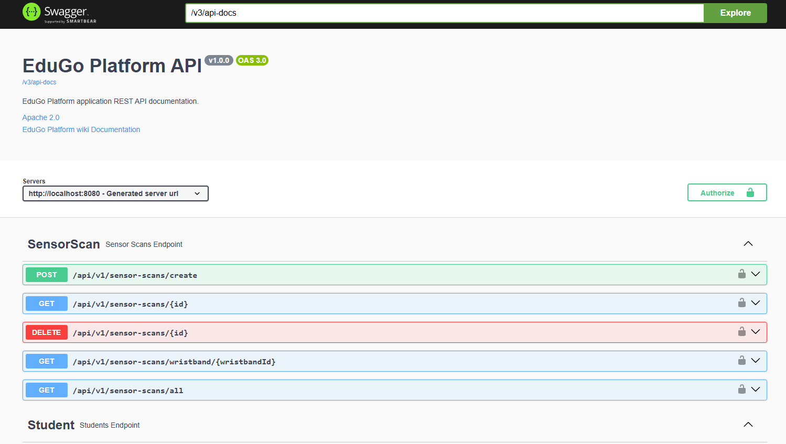  
Enlace al backend: https://rb.gy/3ezqme
 
 
**Para el AppMovil**  
La aplicación móvil fue desarrollada con una interfaz centrada en el usuario padre de familia. Las capturas evidencian las pantallas clave del sistema: inicio, listado de estudiantes, información individual, notificaciones y cuenta. Esto valida la integración con el backend y el correcto funcionamiento de las funcionalidades implementadas.
 

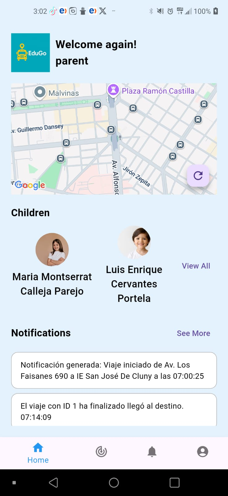  
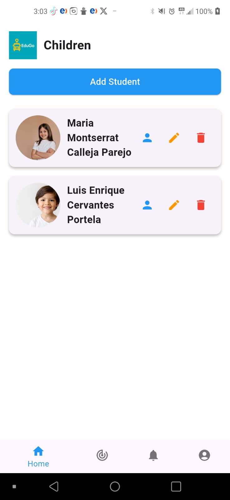  
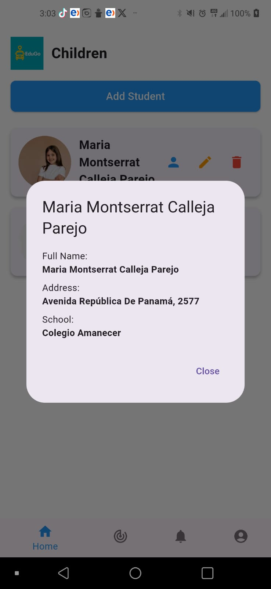  
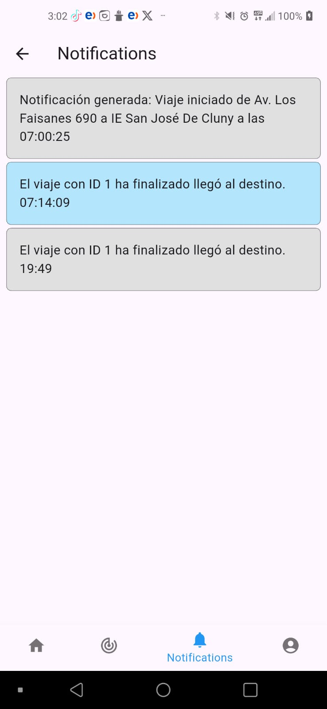  
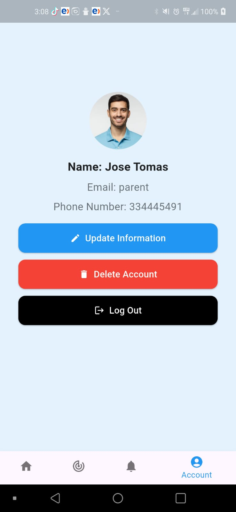  

**Para el Embedded**  
Evidencia del sistema embebido funcional, ejecutado en simulador Wokwi.
 
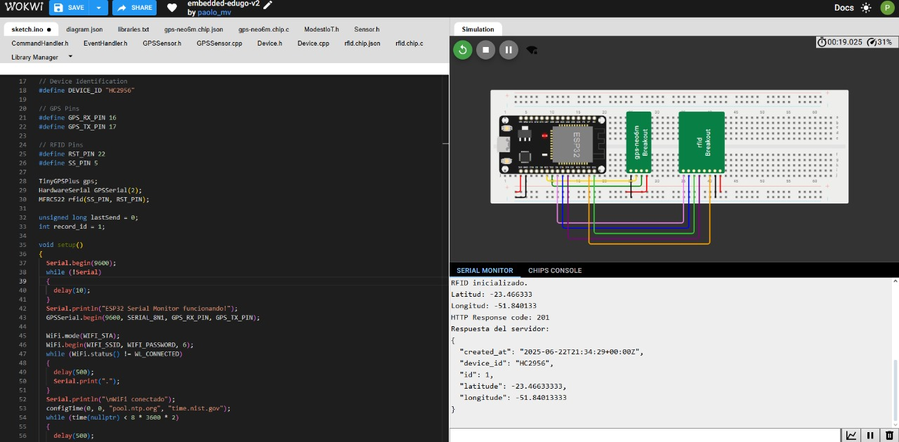  
Enlace al wowki: https://wokwi.com/projects/433959497821051905  
Video demostración: https://shorturl.at/SRwq2

#### 6.2.2.7. Services Documentation Evidence for Sprint Review.

Durante este Sprint, se llevó a cabo la implementación de los servicios del proyecto utilizando el estándar OpenAPI. Como resultado, se logró completar el backend con éxito, incluyendo la definición detallada de los Endpoints que conforman la funcionalidad integral de la aplicación web, app movil y edge server.

### SensorScan

Define los servicios para registrar, consultar y eliminar escaneos de pulseras RFID, facilitando el control de ingresos y salidas de estudiantes.

| Endpoint                                     | Acción                                 | Verbo HTTP | Parámetros                                                              | Ejemplo de Response                                                                                                                                                                           |
| -------------------------------------------- | -------------------------------------- | ---------- | ----------------------------------------------------------------------- | --------------------------------------------------------------------------------------------------------------------------------------------------------------------------------------------- |
| /api/v1/sensor-scans                         | Crear un nuevo escaneo de pulsera      | POST       | Request Body: { "scanType": "ENTRY", "wristbandId": 12, "tripId": 102 } | { "id": 48, "scanTime": "2025-07-05T08:30:00.000Z", "scanType": "ENTRY", "wristbandId": 12 }                                                                                                  |
| /api/v1/sensor-scans/{id}                    | Obtener escaneo por ID                 | GET        | Path Parameter: id (integer)                                            | { "id": 48, "scanTime": "2025-07-05T08:30:00.000Z", "scanType": "ENTRY", "wristbandId": 12 }                                                                                                  |
| /api/v1/sensor-scans/{id}                    | Eliminar escaneo por ID                | DELETE     | Path Parameter: id (integer)                                            | 200 OK (sin contenido)                                                                                                                                                                        |
| /api/v1/sensor-scans/wristband/{wristbandId} | Obtener escaneos por ID de pulsera     | GET        | Path Parameter: wristbandId (integer)                                   | [ { "id": 48, "scanTime": "2025-07-05T08:30:00.000Z", "scanType": "ENTRY", "wristbandId": 12 }, { "id": 49, "scanTime": "2025-07-05T15:45:00.000Z", "scanType": "EXIT", "wristbandId": 12 } ] |
| /api/v1/sensor-scans                         | Obtener todos los escaneos registrados | GET        | Sin parámetros                                                          | [ { "id": 48, "scanTime": "2025-07-05T08:30:00.000Z", "scanType": "ENTRY", "wristbandId": 12 }, { "id": 49, "scanTime": "2025-07-05T15:45:00.000Z", "scanType": "EXIT", "wristbandId": 12 } ] |

### Students

Contiene los servicios para crear, consultar y eliminar información de estudiantes, así como listar estudiantes por conductor asignado.

| Endpoint                                  | Acción                                  | Verbo HTTP | Parámetros                                                                                                                                                                                                                    | Ejemplo de Response                                                                                                                                                                                                                                                                                                                           |
| ----------------------------------------- | --------------------------------------- | ---------- | ----------------------------------------------------------------------------------------------------------------------------------------------------------------------------------------------------------------------------- | --------------------------------------------------------------------------------------------------------------------------------------------------------------------------------------------------------------------------------------------------------------------------------------------------------------------------------------------- |
| /api/v1/students                          | Crear un nuevo estudiante               | POST       | Request Body: { "name": "Lucía", "lastName": "Ramírez", "homeAddress": "Av. Los Álamos 123", "schoolAddress": "Colegio San José", "studentPhotoUrl": "https://edugo.com/img/lucia.jpg", "parentProfileId": 5, "driverId": 8 } | { "id": 21, "name": "Lucía", "lastName": "Ramírez", "homeAddress": "Av. Los Álamos 123", "schoolAddress": "Colegio San José", "studentPhotoUrl": "https://edugo.com/img/lucia.jpg", "wristband": null, "parentProfile": { "id": 5, "fullName": "Jorge Ramírez" }, "driverId": 8 }                                                             |
| /api/v1/students/{id}                     | Obtener estudiante por ID               | GET        | Path Parameter: id (integer)                                                                                                                                                                                                  | { "id": 21, "name": "Lucía", "lastName": "Ramírez", "homeAddress": "Av. Los Álamos 123", "schoolAddress": "Colegio San José", "studentPhotoUrl": "https://edugo.com/img/lucia.jpg", "wristband": { "id": 7, "rfidCode": "ABC12345", "wristbandStatus": "ACTIVE" }, "parentProfile": { "id": 5, "fullName": "Jorge Ramírez" }, "driverId": 8 } |
| /api/v1/students/{id}                     | Eliminar estudiante por ID              | DELETE     | Path Parameter: id (integer)                                                                                                                                                                                                  | Respuesta: 200 OK (sin contenido)                                                                                                                                                                                                                                                                                                             |
| /api/v1/students                          | Obtener todos los estudiantes           | GET        | Sin parámetros                                                                                                                                                                                                                | [ { "id": 21, "name": "Lucía", "lastName": "Ramírez", "homeAddress": "Av. Los Álamos 123", "schoolAddress": "Colegio San José", "studentPhotoUrl": "https://edugo.com/img/lucia.jpg", "driverId": 8 } ]                                                                                                                                       |
| /api/v1/students/driver/{driverProfileId} | Obtener estudiantes por ID de conductor | GET        | Path Parameter: driverProfileId (integer)                                                                                                                                                                                     | [ { "id": 21, "name": "Lucía", "lastName": "Ramírez", "homeAddress": "Av. Los Álamos 123", "schoolAddress": "Colegio San José", "studentPhotoUrl": "https://edugo.com/img/lucia.jpg", "driverId": 8 } ]                                                                                                                                       |

### Authentication

Incluye los endpoints para registrar nuevos usuarios y gestionar la autenticación mediante inicio de sesión.

| Endpoint                       | Acción                     | Verbo HTTP | Parámetros                                                                                | Ejemplo de Response                                                                        |
| ------------------------------ | -------------------------- | ---------- | ----------------------------------------------------------------------------------------- | ------------------------------------------------------------------------------------------ |
| /api/v1/authentication/sign-up | Registrar un nuevo usuario | POST       | Request Body: { "username": "juanperez", "password": "MiClave123!", "roles": ["PARENT"] } | { "id": 101, "username": "juanperez", "roles": ["PARENT"] }                                |
| /api/v1/authentication/sign-in | Iniciar sesión             | POST       | Request Body: { "username": "juanperez", "password": "MiClave123!" }                      | { "id": 101, "username": "juanperez", "token": "eyJhbGciOiJIUzI1NiIsInR5cCI6IkpXVCJ9..." } |

### Vehicle Tracking

Reúne los servicios para gestionar vehículos, viajes, rutas, ubicaciones y la asistencia de estudiantes durante los trayectos.

| Endpoint                                                               | Action                                 | HTTP Verb | Parameters                                                                                                      | Example Response                                                                                                 |
| ---------------------------------------------------------------------- | -------------------------------------- | --------- | --------------------------------------------------------------------------------------------------------------- | ---------------------------------------------------------------------------------------------------------------- |
| /api/v1/vehicle-tracking/vehicles                                      | Get vehicle list                       | GET       | No parameters                                                                                                   | [{ "id": 0, "driverId": 0, "capacity": 0, "status": "string" }]                                                  |
| /api/v1/vehicle-tracking/vehicles                                      | Create vehicle                         | POST      | Request Body: { "driverId": 0, "capacity": 0 }                                                               | { "id": 0, "driverId": 0, "capacity": 0, "status": "string" }                                                    |
| /api/v1/vehicle-tracking/trips                                         | Get all trips                          | GET       | No parameters                                                                                                   | [{ "id": 0, "vehicleId": 0, "origin": "string", "destination": "string", "startTime": "...", "endTime": "..." }] |
| /api/v1/vehicle-tracking/trips                                         | Create trip                            | POST      | Request Body: { "vehicleId": 0, "origin": "string", "destination": "string" }                                | { "id": 0, "vehicleId": 0, "origin": "string", "destination": "string", "startTime": "...", "endTime": "..." }   |
| /api/v1/vehicle-tracking/trip-students                                 | Assign student to trip                 | POST      | Request Body: { "tripId": 0, "studentId": 0 }                                                                | { "id": 0, "studentId": 0, "attended": true, "boardedAt": "...", "exitedAt": "..." }                             |
| /api/v1/vehicle-tracking/routes/start                                  | Start trip route                       | POST      | Request Body: { "tripId": 0 }                                                                                | { "id": 0, "driverId": 0, "capacity": 0, "status": "string" }                                                    |
| /api/v1/vehicle-tracking/routes/end                                    | End trip route                         | POST      | Request Body: { "tripId": 0 }                                                                                | Code 200 OK                                                                                                      |
| /api/v1/vehicle-tracking/locations                                     | Get all registered locations           | GET       | No parameters                                                                                                   | [{ "id": 0, "vehicleId": 0, "latitude": 0, "longitude": 0, "speed": 0 }]                                         |
| /api/v1/vehicle-tracking/locations                                     | Register vehicle location              | POST      | Request Body: { "vehicleId": 0, "tripId": 0, "latitude": 0, "longitude": 0, "speed": 0, "timestamp": "..." } | { "id": 0, "vehicleId": 0, "latitude": 0, "longitude": 0, "speed": 0 }                                           |
| /api/v1/vehicle-tracking/exit                                          | Register student exit                  | POST      | Request Body: { "tripId": 0, "studentId": 0, "exitedAt": "..." }                                             | Code 200 OK                                                                                                      |
| /api/v1/vehicle-tracking/boarding                                      | Register student boarding              | POST      | Request Body: { "tripId": 0, "studentId": 0, "boardedAt": "..." }                                            | Code 200 OK                                                                                                      |
| /api/v1/vehicle-tracking/trips/{tripId}/students                       | Get trip students                      | GET       | Path Parameters: - tripId (integer)                                                                          | [{ "id": 0, "studentId": 0, "attended": true, "boardedAt": "...", "exitedAt": "..." }]                           |
| /api/v1/vehicle-tracking/trips/{tripId}/students/{studentId}           | Get student attendance in trip         | GET       | Path Parameters: - tripId (integer) - studentId (integer)                                                 | { "id": 0, "studentId": 0, "attended": true, "boardedAt": "...", "exitedAt": "..." }                             |
| /api/v1/vehicle-tracking/trips/{id}                                    | Get trip by ID                         | GET       | Path Parameters: - id (integer)                                                                              | { "id": 0, "vehicleId": 0, "origin": "string", "destination": "string", "startTime": "...", "endTime": "..." }   |
| /api/v1/vehicle-tracking/trips/{id}                                    | Delete trip by ID                      | DELETE    | Path Parameters: - id (integer)                                                                              | string                                                                                                           |
| /api/v1/vehicle-tracking/trips/completed                               | Get completed trips                    | GET       | No parameters                                                                                                   | [{ "id": 0, "vehicleId": 0, "origin": "string", "destination": "string", "startTime": "...", "endTime": "..." }] |
| /api/v1/vehicle-tracking/students/{studentId}/current-vehicle-location | Get student's current vehicle location | GET       | Path Parameters: - studentId (integer)                                                                       | {}                                                                                                               |
| /api/v1/vehicle-tracking/locations/trip/{tripId}                       | Get trip locations                     | GET       | Path Parameters: - tripId (integer)                                                                          | [{ "id": 0, "vehicleId": 0, "latitude": 0, "longitude": 0, "speed": 0 }]                                         |
| /api/v1/vehicle-tracking/locations/current?vehicleId={id}              | Get current vehicle location           | GET       | Query Parameters: - vehicleId (integer)                                                                      | { "id": 0, "vehicleId": 0, "latitude": 0, "longitude": 0, "speed": 0 }                                           |

### Profiles

Documenta los servicios para crear, consultar y filtrar perfiles de usuario por rol, ID de usuario o ID de perfil.

| Endpoint                               | Acción                           | Verbo HTTP | Parámetros                                                                                                                                         | Ejemplo de Response                                                                                                                                                              |
| -------------------------------------- | -------------------------------- | ---------- | -------------------------------------------------------------------------------------------------------------------------------------------------- | -------------------------------------------------------------------------------------------------------------------------------------------------------------------------------- |
| /api/v1/profiles                       | Obtener todos los perfiles       | GET        | Sin parámetros                                                                                                                                     | [ { "id": 0, "userId": 0, "fullName": "string", "email": "string", "mobileNumber": "string", "address": "string", "gender": "string", "photoUrl": "string", "role": "string" } ] |
| /api/v1/profiles                       | Crear un nuevo perfil            | POST       | Request Body: { "fullName": "string", "email": "string", "mobileNumber": "string", "address": "string", "gender": "string", "photoUrl": "string" } | { "id": 0, "userId": 0, "fullName": "string", "email": "string", "mobileNumber": "string", "address": "string", "gender": "string", "photoUrl": "string", "role": "string" }     |
| /api/v1/profiles/user/{userId}         | Obtener perfil por ID de usuario | GET        | Path Parameters: userId (integer)                                                                                                                  | { "id": 0, "userId": 0, "fullName": "string", "email": "string", "mobileNumber": "string", "address": "string", "gender": "string", "photoUrl": "string", "role": "string" }     |
| /api/v1/profiles/role/{role}           | Obtener perfiles por rol         | GET        | Path Parameters: role (string)                                                                                                                     | [ { "id": 0, "userId": 0, "fullName": "string", "email": "string", "mobileNumber": "string", "address": "string", "gender": "string", "photoUrl": "string", "role": "string" } ] |
| /api/v1/profiles/profileId/{profileId} | Obtener perfil por ID de perfil  | GET        | Path Parameters: profileId (integer)                                                                                                               | { "id": 0, "userId": 0, "fullName": "string", "email": "string", "mobileNumber": "string", "address": "string", "gender": "string", "photoUrl": "string", "role": "string" }     |

### Notification

Detalla los endpoints para registrar y consultar notificaciones generadas en tiempo real según usuario y tipo de evento.

| Endpoint                                                   | Acción                                     | Verbo HTTP | Parámetros                                                                                                                       | Ejemplo de Response                                                                                                                                                                                               |
| ---------------------------------------------------------- | ------------------------------------------ | ---------- | -------------------------------------------------------------------------------------------------------------------------------- | ----------------------------------------------------------------------------------------------------------------------------------------------------------------------------------------------------------------- |
| /api/v1/notifications                                      | Obtener todas las notificaciones           | GET        | Sin parámetros                                                                                                                   | [ { "id": 0, "message": "string", "status": "string", "userType": "string", "userId": 0, "eventType": "string", "description": "string", "timestamp": "2025-06-22T05:08:00.639Z", "tripId": 0, "studentId": 0 } ] |
| /api/v1/notifications                                      | Crear una nueva notificación               | POST       | Request Body: { "eventType": "string", "description": "string", "userType": "string", "userId": 0, "tripId": 0, "studentId": 0 } | { "id": 0, "message": "string", "status": "string", "userType": "string", "userId": 0, "eventType": "string", "description": "string", "timestamp": "2025-06-22T05:08:00.641Z", "tripId": 0, "studentId": 0 }     |
| /api/v1/notifications/user-type/{notificationsForUserType} | Obtener notificaciones por tipo de usuario | GET        | Path Parameters: notificationsForUserType (string)                                                                               | [ { "id": 0, "message": "string", "status": "string", "userType": "string", "userId": 0, "eventType": "string", "description": "string", "timestamp": "2025-06-22T05:08:00.642Z", "tripId": 0, "studentId": 0 } ] |
| /api/v1/notifications/user-id/{notificationsForUserId}     | Obtener notificaciones por ID de usuario   | GET        | Path Parameters: notificationsForUserId (integer)                                                                                | [ { "id": 0, "message": "string", "status": "string", "userType": "string", "userId": 0, "eventType": "string", "description": "string", "timestamp": "2025-06-22T05:08:00.644Z", "tripId": 0, "studentId": 0 } ] |

### Wristband

Describe los servicios para administrar pulseras RFID, incluyendo su creación, consulta por ID, estado o código RFID.

| Endpoint                               | Acción                                | Verbo HTTP | Parámetros                                                                       | Ejemplo de Response                                                                                                                                                                                                                                                                                                                |
| -------------------------------------- | ------------------------------------- | ---------- | -------------------------------------------------------------------------------- | ---------------------------------------------------------------------------------------------------------------------------------------------------------------------------------------------------------------------------------------------------------------------------------------------------------------------------------- |
| /api/v1/wristbands                     | Obtener todas las pulseras            | GET        | Ninguno                                                                          | [ { "id": 0, "rfidCode": "string", "wristbandStatus": "ACTIVE", "student": { "id": 0, "name": "string", "lastName": "string", "homeAddress": "string", "schoolAddress": "string", "studentPhotoUrl": "string" }, "sensorScans": [ { "id": 0, "scanTime": "2025-07-05T03:43:31.737Z", "scanType": "ENTRY", "wristbandId": 0 } ] } ] |
| /api/v1/wristbands                     | Crear una nueva pulsera               | POST       | Body JSON: { "rfidCode": "string", "wristbandStatus": "string", "studentId": 0 } | [ { "id": 0, "rfidCode": "string", "wristbandStatus": "ACTIVE", "student": { "id": 0, "name": "string", "lastName": "string", "homeAddress": "string", "schoolAddress": "string", "studentPhotoUrl": "string" }, "sensorScans": [ { "id": 0, "scanTime": "2025-07-05T03:43:31.739Z", "scanType": "ENTRY", "wristbandId": 0 } ] } ] |
| /api/v1/wristbands/{id}                | Obtener pulsera por ID                | GET        | Path: id (entero)                                                                | { "id": 0, "rfidCode": "string", "wristbandStatus": "ACTIVE", "student": { "id": 0, "name": "string", "lastName": "string", "homeAddress": "string", "schoolAddress": "string", "studentPhotoUrl": "string" }, "sensorScans": [ { "id": 0, "scanTime": "2025-07-05T03:43:31.741Z", "scanType": "ENTRY", "wristbandId": 0 } ] }     |
| /api/v1/wristbands/{id}                | Eliminar pulsera por ID               | DELETE     | Path: id (entero)                                                                | 200 OK                                                                                                                                                                                                                                                                                                                             |
| /api/v1/wristbands/student/{studentId} | Obtener pulseras por ID de estudiante | GET        | Path: studentId (entero)                                                         | [ { "id": 0, "rfidCode": "string", "wristbandStatus": "ACTIVE", "student": { "id": 0, "name": "string", "lastName": "string", "homeAddress": "string", "schoolAddress": "string", "studentPhotoUrl": "string" }, "sensorScans": [ { "id": 0, "scanTime": "2025-07-05T03:43:31.743Z", "scanType": "ENTRY", "wristbandId": 0 } ] } ] |
| /api/v1/wristbands/status/{status}     | Obtener pulseras por estado           | GET        | Path: status (string)                                                            | [ { "id": 0, "rfidCode": "string", "wristbandStatus": "ACTIVE", "student": { "id": 0, "name": "string", "lastName": "string", "homeAddress": "string", "schoolAddress": "string", "studentPhotoUrl": "string" }, "sensorScans": [ { "id": 0, "scanTime": "2025-07-05T03:43:31.745Z", "scanType": "ENTRY", "wristbandId": 0 } ] } ] |
| /api/v1/wristbands/rfid/{rfidCode}     | Obtener pulsera por código RFID       | GET        | Path: rfidCode (string)                                                          | { "id": 0, "rfidCode": "string", "wristbandStatus": "ACTIVE", "student": { "id": 0, "name": "string", "lastName": "string", "homeAddress": "string", "schoolAddress": "string", "studentPhotoUrl": "string" }, "sensorScans": [ { "id": 0, "scanTime": "2025-07-05T03:43:31.747Z", "scanType": "ENTRY", "wristbandId": 0 } ] }     |

### Users

Muestra los endpoints para consultar usuarios registrados y obtener detalles por ID.

| Endpoint           | Acción                     | Verbo HTTP | Parámetros        | Ejemplo de Response                                                                                                                      |
| ------------------ | -------------------------- | ---------- | ----------------- | ---------------------------------------------------------------------------------------------------------------------------------------- |
| /api/v1/users      | Obtener todos los usuarios | GET        | Sin parámetros    | [ { "id": 1, "username": "admin_user", "roles": [ "ADMIN", "USER" ] }, { "id": 2, "username": "student_john", "roles": [ "STUDENT" ] } ] |
| /api/v1/users/{id} | Obtener usuario por ID     | GET        | Path: id (entero) | { "id": 1, "username": "admin_user", "roles": [ "ADMIN", "USER" ] }                                                                      |

### Analytics

Define los servicios para registrar, consultar y resumir datos de analíticas de conducción de los conductores.

| Endpoint                            | Acción                                    | Verbo HTTP | Parámetros                                                                                                                                                                        | Ejemplo de Response                                                                                                                                                                                                                                                                                                |
| ----------------------------------- | ----------------------------------------- | ---------- | --------------------------------------------------------------------------------------------------------------------------------------------------------------------------------- | ------------------------------------------------------------------------------------------------------------------------------------------------------------------------------------------------------------------------------------------------------------------------------------------------------------------ |
| /api/analytics                      | Registrar analítica de conducción         | POST       | Body JSON: { "driverUserId": 0, "date": "2025-06-05", "arrivalTimeAtSchool": "07:30", "returnTimeHome": "15:45", "speed": 0, "detour": true, "lateness": true, "speeding": true } | { "id": 0, "driverUserId": 0, "date": "2025-06-05", "arrivalTimeAtSchool": "07:30", "returnTimeHome": "15:45", "speed": 0, "incident": { "detour": true, "lateness": true, "speeding": true } }                                                                                                                    |
| /api/analytics/logs                 | Obtener historial de analíticas           | GET        | Sin parámetros                                                                                                                                                                    | [ { "id": 0, "driverUserId": 0, "date": "2025-06-05", "arrivalTimeAtSchool": "07:30", "returnTimeHome": "15:45", "speed": 0, "incident": { "detour": true, "lateness": true, "speeding": true } } ]                                                                                                                |
| /api/analytics/dashboard/{driverId} | Obtener resumen semanal para un conductor | GET        | Path: driverId (entero)                                                                                                                                                           | { "driverUserId": 0, "week": "2025-W23", "speedPerDay": [ { "day": "Monday", "averageSpeed": 35 }, { "day": "Tuesday", "averageSpeed": 40 } ], "arrivalTimes": [ { "day": "Monday", "time": "07:28" }, { "day": "Tuesday", "time": "07:35" } ], "incidentSummary": { "detour": 1, "lateness": 2, "speeding": 3 } } |

#### 6.2.2.8. Software Deployment Evidence for Sprint Review.

Para el sprint presentado del Backend,AppMovil,EdgeServer y Embedded se optó por varias herramientas para su desarrollo.

- _Git_: Se utilizó para el control de versiones del código fuente.
- _GitFlow_: Se utilizó para ver el avance de los integrantes del equipo.
- _GitHub_: Se utilizó para crear el repositorio del Backend,AppMovil,EdgeServer y Embedded, donde se subió el código fuente.
- _GitHub Pages_: Es la plataforma donde se desplegó el Backend,AppMovil,EdgeServer y Embedded. Se eligió por ser una solución gratuita, rápida y sencilla que permite publicar directamente desde el repositorio de GitHub.
- _Android Studio_: Se utilizó para el desarrollo de la aplicación móvil nativa, permitiendo diseñar y programar funcionalidades específicas para dispositivos Android.
- _Wokwi_: Se empleó para la creación y simulación del sistema embebido, facilitando el desarrollo y prueba del código para el hardware sin necesidad de componentes físicos.
- _CLion_: Se utilizó para el desarrollo de la lógica del servidor Edge, permitiendo implementar y depurar el software en C++ con integración a herramientas embebidas.

**Despliegue del Backend** 
Para este Sprint se desplego la aplicacion Backend en heroku, el despliegue de este producto permite el acceso y modificacion de la informacion en la base de datos.
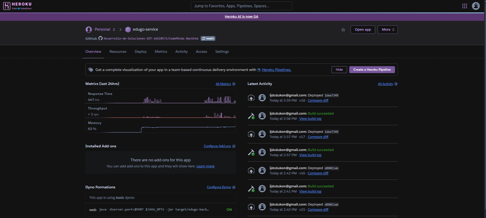
 

**Despliegue del Mobile App** 
El alcance definido para este producto dentro de este Sprint comprende ejecucion local 

**Despliegue del Edge Server** 
El alcance definido para este producto dentro de este Sprint comprende ejecucion local 

#### 6.2.2.9. Team Collaboration Insights during Sprint.

Para esta sección del documentos, añadimos los insights realizados durante el sprint, tanto de la realización del backend,app movil,edge server y embedded :

Insights del AppMovil, donde se muestran los commits realizados al repositorio en el ultimo mes
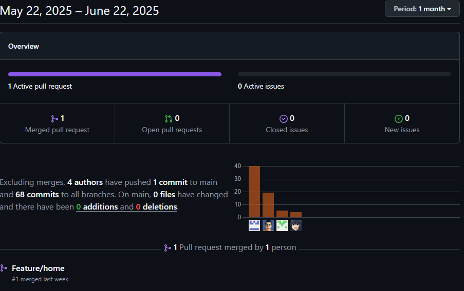
 

Insights del Backend, donde se muestran los commits realizados al repositorio en el ultimo mes
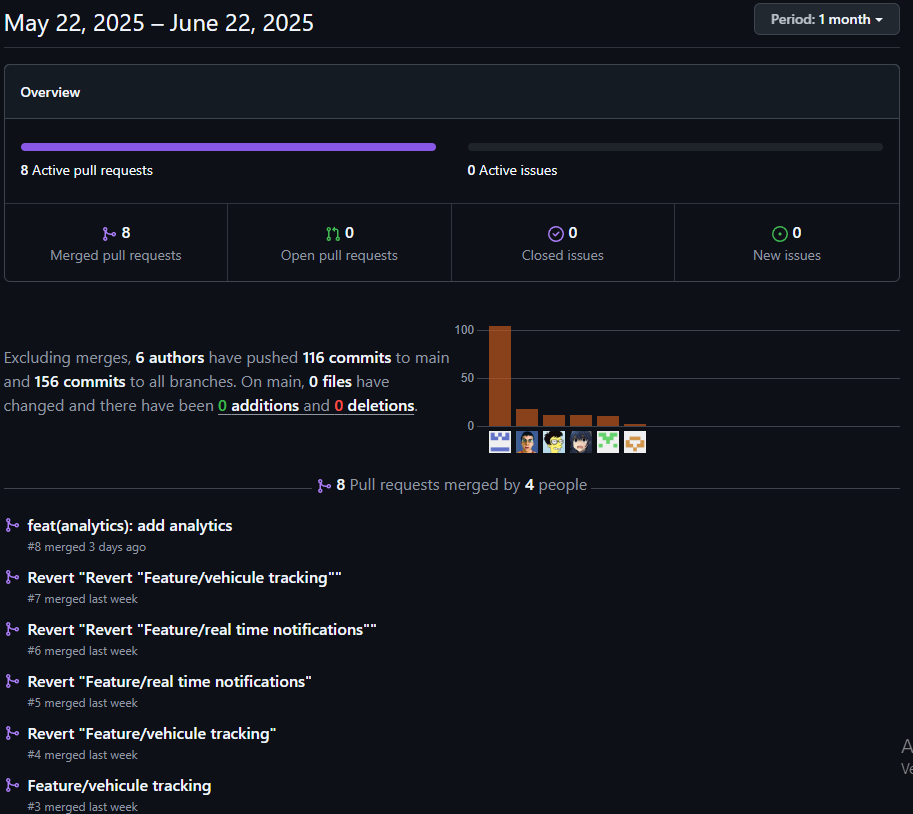
 

Insights del EdgeServer, donde se muestran los commits realizados al repositorio en el ultimo mes
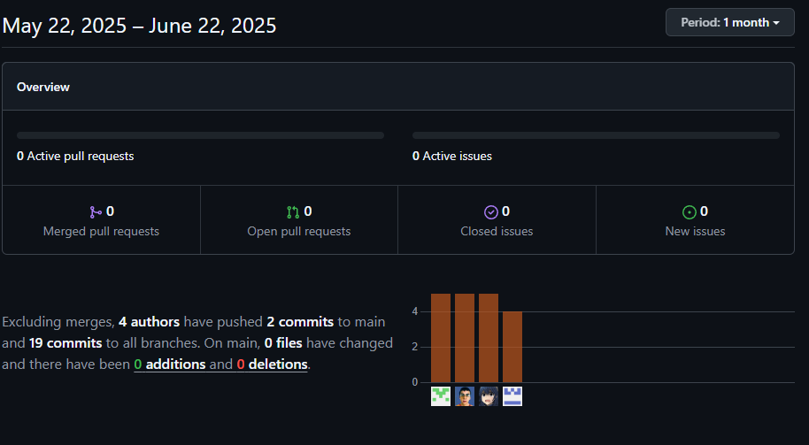
 

Insights del Embedded, donde se muestran los commits realizados al repositorio en el ultimo mes
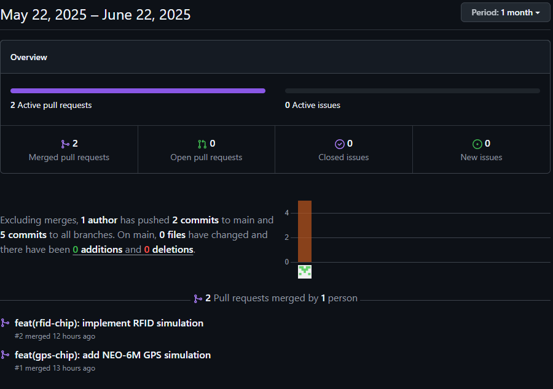

## 6.3. Validation Interviews.

Evidencia del proceso de validación del producto mediante entrevistas estructuradas con usuarios clave, para recoger opiniones sobre la experiencia, funcionalidades y posibles mejoras de la solución.

### 6.3.1. Diseño de Entrevistas.

Detalla la planificación de las entrevistas, definiendo el perfil de los participantes y las preguntas guía para padres de familia y conductores escolares.

## Información General

Conjunto de preguntas básicas para identificar datos demográficos de cada entrevistado y contextualizar sus respuestas.

1. ¿Cuál es su nombre?
2. ¿Qué edad tiene?
3. ¿En qué distrito reside?
4. ¿Cuál es su ocupación actual?

## Entrevista a Padres de Familia

Preguntas diseñadas para conocer la experiencia de los padres usando la app móvil y pulseras RFID, evaluando utilidad, claridad y sugerencias de mejora.

1. **¿Qué le pareció la experiencia de usar la aplicación móvil para seguir a su hijo en tiempo real?**
2. **¿La función de visualización en el mapa le resultó clara y fácil de usar?**
3. **¿Cómo califica la utilidad de las notificaciones automáticas al subir o bajar del bus?**
4. **¿Cree que la combinación de la app móvil con la pulsera RFID le brinda más tranquilidad? ¿Por qué?**
5. **¿Hubo alguna parte de la app que le resultó confusa o difícil de entender?**
6. **¿Qué funcionalidades nuevas le gustaría ver en próximas versiones de la app?**
7. **¿Sentiría mayor confianza al contratar un transporte escolar que usa esta tecnología?**
8. **En una escala del 1 al 10, ¿cuán probable es que recomiende esta aplicación a otros padres?**

## Entrevista a Conductores Escolares

Preguntas enfocadas en validar la usabilidad de la app desde la perspectiva de los conductores, identificando puntos fuertes, dificultades y oportunidades de optimización.

1. **¿Qué tan intuitiva le pareció la aplicación móvil para registrar estudiantes con pulseras RFID?**
2. **¿Pudo verificar fácilmente desde la app cuántos estudiantes hay a bordo durante el trayecto?**
3. **¿Las notificaciones automáticas (como alertas de velocidad o eventos) le resultaron útiles mientras conducía?**
4. **¿Le pareció cómodo y seguro usar la app mientras realizaba su ruta diaria?**
5. **¿Tuvo alguna dificultad con el uso de la app durante el registro de estudiantes o la ruta?**
6. **¿Qué mejoras sugeriría para hacer la app más práctica para los conductores escolares?**
7. **¿Considera que esta tecnología mejora la comunicación entre usted y los padres de familia?**
8. **¿Estaría dispuesto a seguir utilizando esta aplicación en su unidad de transporte? ¿Por qué?**

### 6.3.2. Registro de Entrevistas.

#### Entrevista 1

**Identificación del entrevistado**

- **Nombre completo:** Arturo Villavicencio Samanés
- **Edad:** 37 años
- **Distrito de residencia:** Callao
- **Ocupación:** Ingeniero industrial

**Referencia audiovisual**

- **Screenshot:**

- **Timecode inicio / duración:** `00:03:11 /00:22:50`

Arturo, ingeniero industrial de 37 años del Callao, es padre de familia y valora mucho la seguridad de su hijo durante el transporte escolar. Tras ver la app, destacó su utilidad, facilidad de uso y claridad para seguir el recorrido en tiempo real. Considera que la combinación con la pulsera RFID brinda más tranquilidad. Sugiere mejorar el sistema incorporando alertas de tráfico o rutas cerradas, como hace Waze. Aunque al inicio tuvo dudas sobre el rol de conductores en la app, cree que debería centrarse en los padres. Califica el sistema con un 10 y propone su implementación a nivel nacional.

#### Entrevista 2

**Identificación del entrevistado**

- **Nombre completo:** Eduardo Chero
- **Edad:** 23 años
- **Distrito de residencia:** Chorrillos
- **Ocupación:** Practicante de ingenieria y encargado de su hermano menor

**Referencia audiovisual**

- **Screenshot:**

- **Timecode inicio / duración:** `00:09:20 /00:22:50`

Eduardo, practicante de Ingenieria de Software de 23 años de Chorrillos, esta a cargo de mandar a su hermano menor al colegio y valora mucho la seguridad durante el transporte escolar. Tras ver la aplicacion, destaco el diseño simple, las funcionalidades clave y la facilidad de uso. Considera que la combinación de la plataforma movil con la tecnologia RFID brinda más tranquilidad. Sugiere mejorar el sistema incorporando un sistema de comunicacion directa con el menor o con el conductor. Califica el sistema con un 8.

#### Entrevista 3

**Identificación del entrevistado**

- **Nombre completo:** Augusto Alcarraz Altamirano
- **Edad:** 27 años
- **Distrito de residencia:** Chorrillos
- **Ocupación:** Transportista escolar

**Referencia audiovisual**

- **Screenshot:**

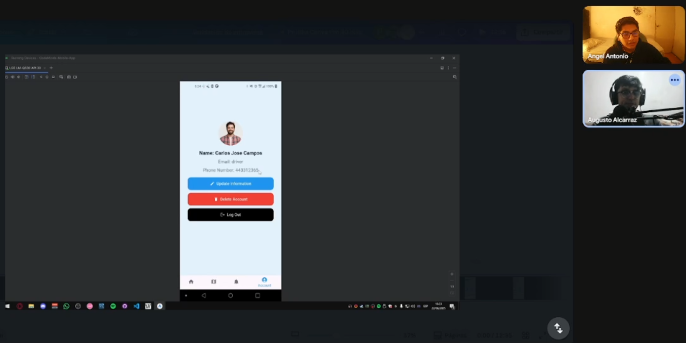

- **Timecode inicio / duración:** `00:12:31 /00:22:50`

Augusto encontró la app móvil intuitiva y eficiente, destacando el registro automático con RFID y el contador de estudiantes en tiempo real. Valoró las alertas de seguridad durante la conducción y la interfaz sencilla. Sugirió mejoras como modo offline para zonas sin conexión y botón de emergencia más accesible. Resaltó que la app mejora la comunicación con padres al notificarles sobre sus hijos en tiempo real. Concluyó que adoptaría el sistema por su practicidad y seguridad, requiriendo mínima capacitación.

#### Entrevista 4

**Identificación del entrevistado**

- **Nombre completo:** Nicole Pomacaja
- **Edad:** 42 años
- **Distrito de residencia:** Villa maria del triunfo
- **Ocupación:** Ama de casa

**Referencia audiovisual**

- **Screenshot:**

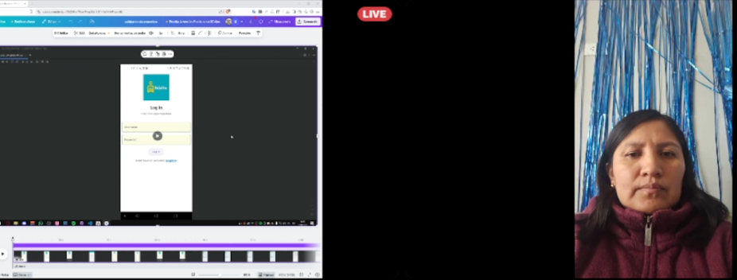

- **Timecode inicio / duración:** `00:17:15/00:22:50`

Nicole, ama de casa de 42 años de edad, valora especialmente la seguridad y comunicación con respecto al traslado de sus hijos al colegio. Tras conocer la app, resaltó lo útil que le resulta recibir notificaciones en tiempo real sobre el embarque y llegada de los niños. Destacó la facilidad de uso de la interfaz, incluso para personas con poca experiencia tecnológica. Considera que el uso de pulseras RFID brinda tranquilidad al confirmar que su hijo subió al transporte. Le parecio que no hay mucho que agregar en la app y califica el sistema de manera positiva, afirmando que lo usaría sin dudarlo por la seguridad y el control que ofrece como madre.

### 6.3.3. Evaluaciones según heurísticas.

Evidencia de la evaluación heurística realizada para identificar problemas de usabilidad en la aplicación móvil y el sistema RFID, basada en principios de diseño de interfaces y retroalimentación de usuarios reales.

## Evaluación Heurística – Aplicación de Transporte Escolar Inteligente

Contexto general de la evaluación realizada por el equipo auditor, especificando el perfil del sistema, la app evaluada y los usuarios participantes.

**Carrera:** Ingeniería de Software  
**Curso:** Desarrollo de Soluciones IoT  
**Sección:** 2956  
**Cliente:** Sistema de Transporte Escolar Inteligente  
**Auditor:** CodeMinds  
**App evaluada:** Aplicativo móvil + Pulsera RFID  
**Usuarios entrevistados:**

- **Eduardo**: practicante de Ingeniería de Software, 23 años, usuario cuidador.
- **Arturo**: padre de familia, 37 años, ingeniero industrial.
- **Augusto**: conductor escolar, usuario operador.

---

## Escala de severidad

Define los niveles de gravedad asignados a cada problema detectado, facilitando la priorización de correcciones antes de la siguiente entrega.

| Nivel | Descripción                                                                                                                                                                                    |
| ----- | ---------------------------------------------------------------------------------------------------------------------------------------------------------------------------------------------- |
| 1     | Problema superficial: puede ser fácilmente superador por el usuario ó ocurre con muy poco frecuencia. No necesita ser arreglado a no ser que exista disponibilidad de tiempo.                  |
| 2     | Problema menor: puede ocurrir un poco más frecuentemente o es un poco más difícil de superar para el usuario. Se le debería asignar una prioridad baja resolverlo de cara al siguiente reléase |
| 3     | Problema mayor: ocurre frecuentemente o los usuarios no son capaces de resolverlos. Es importante que sean corregidos y se les debe asignar una prioridad alta.                                |
| 4     | Problema muy grave: un error de gran impacto que impide al usuario continuar con el uso de la herramienta. Es imperativo que sea corregido antes del lanzamiento.                              |

---

## Tabla resumen de problemas detectados

Resumen organizado de los principales problemas de usabilidad encontrados, su severidad, la heurística afectada y recomendaciones específicas de mejora.

| #   | Problema detectado                                                                  | Severidad | Heurística violada                                         | Recomendación                                                               |
| --- | ----------------------------------------------------------------------------------- | --------- | ---------------------------------------------------------- | --------------------------------------------------------------------------- |
| 1   | Confusión por registro conjunto de padres y conductores                             | 3         | Correspondencia con el mundo real / Claridad de roles      | Separar claramente el flujo y perfil de usuario: padres vs conductores      |
| 2   | No hay sistema de comunicación directa con el menor o conductor                     | 3         | Flexibilidad y eficiencia de uso / Control del usuario     | Integrar un canal directo (chat o botón rápido de contacto)                 |
| 3   | No se detecta el estado del tráfico en tiempo real                                  | 2         | Visibilidad del estado del sistema                         | Incluir alertas de tráfico como Waze: calles cerradas, accidentes o demoras |
| 4   | El botón de emergencia no es lo suficientemente visible                             | 3         | Prevención de errores / Visibilidad                        | Rediseñar con un color distintivo y ubicación prioritaria                   |
| 5   | No hay modo offline para zonas sin conexión                                         | 2         | Robustez / Flexibilidad de uso                             | Implementar un modo offline con sincronización posterior                    |
| 6   | No queda claro cuándo se activa la RFID o si fue exitosa la lectura                 | 2         | Feedback inmediato                                         | Añadir mensajes de confirmación sonora y visual al registrar al estudiante  |
| 7   | El contador de estudiantes no muestra errores si hay duplicados o fallos de lectura | 2         | Prevención de errores / Visibilidad del estado del sistema | Mostrar alertas cuando hay lecturas inconsistentes o duplicadas             |

---

## Descripción de problemas

Detalle individual de cada problema identificado durante la evaluación heurística, con explicación clara, heurística violada, nivel de severidad y recomendación puntual.

### PROBLEMA #1

**Severidad:** 3  
**Heurística violada:** Correspondencia con el mundo real / Claridad de roles  
**Problema:**  
Varios usuarios manifestaron confusión sobre si tanto padres como conductores deben usar la misma interfaz. Esto puede generar malentendidos o acciones inadecuadas.  
**Recomendación:**  
Crear flujos diferenciados para conductores y padres, asegurando que cada perfil tenga solo las funcionalidades necesarias y una experiencia adaptada.

---

### PROBLEMA #2

**Severidad:** 3  
**Heurística violada:** Flexibilidad y eficiencia de uso / Control del usuario  
**Problema:**  
Eduardo sugirió que no hay un canal claro de comunicación directa con el menor o el conductor en caso de emergencia o consulta rápida.  
**Recomendación:**  
Incluir un botón de contacto directo (llamada o chat seguro) desde la interfaz del padre.

---

### PROBLEMA #3

**Severidad:** 2  
**Heurística violada:** Visibilidad del estado del sistema  
**Problema:**  
Arturo comentó que no hay una alerta temprana sobre calles cerradas, tráfico o accidentes, lo que podría mejorar la planificación de rutas.  
**Recomendación:**  
Conectar la app a servicios de tráfico en tiempo real (como Waze o Google Maps) para mostrar condiciones de ruta.

---

### PROBLEMA #4

**Severidad:** 3  
**Heurística violada:** Prevención de errores / Visibilidad  
**Problema:**  
Augusto indicó que el botón de emergencia no es fácilmente visible mientras conduce.  
**Recomendación:**  
Colocar el botón en un lugar destacado, con colores intensos y accesibilidad táctil sencilla.

---

### PROBLEMA #5

**Severidad:** 2  
**Heurística violada:** Flexibilidad y eficiencia de uso  
**Problema:**  
Augusto sugirió que en zonas sin conexión, el sistema no responde adecuadamente.  
**Recomendación:**  
Habilitar un modo offline temporal que registre la información y la sincronice una vez vuelva la señal.

---

### PROBLEMA #6

**Severidad:** 2  
**Heurística violada:** Feedback inmediato  
**Problema:**  
No es claro cuándo el RFID ha sido leído con éxito al subir o bajar del bus.  
**Recomendación:**  
Incluir confirmaciones sonoras o visuales inmediatas al leer el dispositivo.

---

### PROBLEMA #7

**Severidad:** 2  
**Heurística violada:** Prevención de errores / Visibilidad del estado del sistema  
**Problema:**  
El sistema no alerta si hay un error de conteo (duplicado o falta de lectura) en el número de estudiantes.  
**Recomendación:**  
Mostrar advertencias visuales si hay inconsistencias en el conteo automático de estudiantes abordo.

## 6.4. Video About-the-Product.

Video explicativo que muestra el funcionamiento general del producto, sus principales características, la experiencia de uso y los beneficios clave para padres, conductores y estudiantes.

Enlace: https://acortar.link/TXcxWV

## 6.5 Sprint 3

Resumen general de la planificación, objetivos, resultados y organización de roles durante el tercer sprint, enfocado en la expansión y refinamiento de todos los módulos clave del proyecto.

### 6.5.1. Sprint Planning 3.

Detalla la sesión de planificación del Sprint 3, estableciendo metas, alcance, historias de usuario, resultados esperados y responsables clave para garantizar el cumplimiento de los objetivos.

| Sprint #                                 | Sprint 3                                                                                                                                                                                                                                                                                                                                                                                                                                                                                                                                                                                                                                                                                                                                                                                                                                                                                                                                                                                                                                                                                                                                                                                                                                                                                                                                                                                                                                                                                                                                                                                                                                                                                                                                                                                                                                                                                                                                                                                                                                                                                                                                                                                                                                                                                                                                                                                                                                                                                                                                                                                                                                                                                                                                                                                                                                                                                                                                                                                              |
| ---------------------------------------- | ----------------------------------------------------------------------------------------------------------------------------------------------------------------------------------------------------------------------------------------------------------------------------------------------------------------------------------------------------------------------------------------------------------------------------------------------------------------------------------------------------------------------------------------------------------------------------------------------------------------------------------------------------------------------------------------------------------------------------------------------------------------------------------------------------------------------------------------------------------------------------------------------------------------------------------------------------------------------------------------------------------------------------------------------------------------------------------------------------------------------------------------------------------------------------------------------------------------------------------------------------------------------------------------------------------------------------------------------------------------------------------------------------------------------------------------------------------------------------------------------------------------------------------------------------------------------------------------------------------------------------------------------------------------------------------------------------------------------------------------------------------------------------------------------------------------------------------------------------------------------------------------------------------------------------------------------------------------------------------------------------------------------------------------------------------------------------------------------------------------------------------------------------------------------------------------------------------------------------------------------------------------------------------------------------------------------------------------------------------------------------------------------------------------------------------------------------------------------------------------------------------------------------------------------------------------------------------------------------------------------------------------------------------------------------------------------------------------------------------------------------------------------------------------------------------------------------------------------------------------------------------------------------------------------------------------------------------------------------------------------------- |
| **Sprint Planning Background**           |                                                                                                                                                                                                                                                                                                                                                                                                                                                                                                                                                                                                                                                                                                                                                                                                                                                                                                                                                                                                                                                                                                                                                                                                                                                                                                                                                                                                                                                                                                                                                                                                                                                                                                                                                                                                                                                                                                                                                                                                                                                                                                                                                                                                                                                                                                                                                                                                                                                                                                                                                                                                                                                                                                                                                                                                                                                                                                                                                                                                       |
| Date                                     | 2025-06-23                                                                                                                                                                                                                                                                                                                                                                                                                                                                                                                                                                                                                                                                                                                                                                                                                                                                                                                                                                                                                                                                                                                                                                                                                                                                                                                                                                                                                                                                                                                                                                                                                                                                                                                                                                                                                                                                                                                                                                                                                                                                                                                                                                                                                                                                                                                                                                                                                                                                                                                                                                                                                                                                                                                                                                                                                                                                                                                                                                                            |
| Time                                     | 20:00 PM                                                                                                                                                                                                                                                                                                                                                                                                                                                                                                                                                                                                                                                                                                                                                                                                                                                                                                                                                                                                                                                                                                                                                                                                                                                                                                                                                                                                                                                                                                                                                                                                                                                                                                                                                                                                                                                                                                                                                                                                                                                                                                                                                                                                                                                                                                                                                                                                                                                                                                                                                                                                                                                                                                                                                                                                                                                                                                                                                                                              |
| Location                                 | Virtual meeting via Discord                                                                                                                                                                                                                                                                                                                                                                                                                                                                                                                                                                                                                                                                                                                                                                                                                                                                                                                                                                                                                                                                                                                                                                                                                                                                                                                                                                                                                                                                                                                                                                                                                                                                                                                                                                                                                                                                                                                                                                                                                                                                                                                                                                                                                                                                                                                                                                                                                                                                                                                                                                                                                                                                                                                                                                                                                                                                                                                                                                           |
| Prepared By                              | Angel Antonio Cancho Corilla / Juan Diego Cueto Dominguez / Scott Jacobo Huachaca Advincula / Marcelo Sebastian Ramirez Ramirez / Paolo Del Carmen Martinez Villanueva / Xiao Lian Li Zegarra                                                                                                                                                                                                                                                                                                                                                                                                                                                                                                                                                                                                                                                                                                                                                                                                                                                                                                                                                                                                                                                                                                                                                                                                                                                                                                                                                                                                                                                                                                                                                                                                                                                                                                                                                                                                                                                                                                                                                                                                                                                                                                                                                                                                                                                                                                                                                                                                                                                                                                                                                                                                                                                                                                                                                                                                         |
| Attendees (to planning meeting)          | Angel Antonio Cancho Corilla / Juan Diego Cueto Dominguez / Scott Jacobo Huachaca Advincula / Marcelo Sebastian Ramirez Ramirez / Paolo Del Carmen Martinez Villanueva / Xiao Lian Li Zegarra                                                                                                                                                                                                                                                                                                                                                                                                                                                                                                                                                                                                                                                                                                                                                                                                                                                                                                                                                                                                                                                                                                                                                                                                                                                                                                                                                                                                                                                                                                                                                                                                                                                                                                                                                                                                                                                                                                                                                                                                                                                                                                                                                                                                                                                                                                                                                                                                                                                                                                                                                                                                                                                                                                                                                                                                         |
| **Pre-Sprint Review Summary**            | During the preparation phase, the sprint bases were defined, focusing on the development of the Embedded, Backend and Edge Applications.                                                                                                                                                                                                                                                                                                                                                                                                                                                                                                                                                                                                                                                                                                                                                                                                                                                                                                                                                                                                                                                                                                                                                                                                                                                                                                                                                                                                                                                                                                                                                                                                                                                                                                                                                                                                                                                                                                                                                                                                                                                                                                                                                                                                                                                                                                                                                                                                                                                                                                                                                                                                                                                                                                                                                                                                                                                              |
| **Initial Sprint Retrospective Summary** | The objectives set in Sprint 3 were met, however, opportunities for new features implementation were identified.                                                                                                                                                                                                                                                                                                                                                                                                                                                                                                                                                                                                                                                                                                                                                                                                                                                                                                                                                                                                                                                                                                                                                                                                                                                                                                                                                                                                                                                                                                                                                                                                                                                                                                                                                                                                                                                                                                                                                                                                                                                                                                                                                                                                                                                                                                                                                                                                                                                                                                                                                                                                                                                                                                                                                                                                                                                                                      |
| **Sprint Goal & User Stories**           |                                                                                                                                                                                                                                                                                                                                                                                                                                                                                                                                                                                                                                                                                                                                                                                                                                                                                                                                                                                                                                                                                                                                                                                                                                                                                                                                                                                                                                                                                                                                                                                                                                                                                                                                                                                                                                                                                                                                                                                                                                                                                                                                                                                                                                                                                                                                                                                                                                                                                                                                                                                                                                                                                                                                                                                                                                                                                                                                                                                                       |
| Sprint 3 Goal                            | Our focus is on expanding and refining several components of the platform the addition of the about the team section to the Business Website, the development and implementation of the parent view to the Web Application which includes calendar, children and account management features as well as the implementation of student-wristband pairing feature for the platform administrator view; the refínement to the CRUD endpoints for the second version of the backend application, the development of the Edge Application for device authentication, tracking and identity assignment features and the synchronization to the backend, the second version of the embedded application includes improvements to the simulated model by applying object-oriented programming principles, the development of the program for the physical device, and the integration of both the simulation and the phhysical device with the edge application. In addition, we enhanced the mobile application by improving features related to student information visualization and management, vehicle tracking and attendance management.  We believe the addition of the About the Team section to the Business Website will enhance customer trust in the product by displaying the people and values behind the design and development of the platform. The improvements in the Web Application will allow parents and administrators to manage key information more efficiently and intuitively. Enhancing the backend endpoints will lead to a more robust and scalable system that can better support the platform’s growing functionalities. The development of the Edge Application will optimize the processing of data collected by the IoT devices reducing latency and improving responsiveness in Tracking and Attendance related features, as well as device authentication features. The upgraded Embedded Application, both simulated and physical, will allow for accurate testing and real-world deployment of identity and tracking features. Enhancements to the Mobile Application will ensure that users can access authentication, tracking, analytics, and attendance functionalities in real time in a integrated mobile enviroment, improving overall engagement and usability.   These will be confirmed as user trust increases, reflected in higher platform ratings and more frequent recommendations. Successful data transmission from both simulated and physical devices to the Edge Application will demonstrate proper authentication and preliminary data processing, with seamless synchronization to the backend for storage and management. Additionally, the ability of parents and administrators to effectively interact with specific data in the Web Application, along with the full integration and practical use of the Mobile Application’s core features by parents and drivers, will validate the effectiveness and usability of the platform. |
| Sprint 3 Velocity                        |                                                                                                                                                                                                                                                                                                                                                                                                                                                                                                                                                                                                                                                                                                                                                                                                                                                                                                                                                                                                                                                                                                                                                                                                                                                                                                                                                                                                                                                                                                                                                                                                                                                                                                                                                                                                                                                                                                                                                                                                                                                                                                                                                                                                                                                                                                                                                                                                                                                                                                                                                                                                                                                                                                                                                                                                                                                                                                                                                                                                       |
| Sum of Story Points                      | 65 Story Points                                                                                                                                                                                                                                                                                                                                                                                                                                                                                                                                                                                                                                                                                                                                                                                                                                                                                                                                                                                                                                                                                                                                                                                                                                                                                                                                                                                                                                                                                                                                                                                                                                                                                                                                                                                                                                                                                                                                                                                                                                                                                                                                                                                                                                                                                                                                                                                                                                                                                                                                                                                                                                                                                                                                                                                                                                                                                                                                                                                       |

### 6.5.2. Aspect Leaders and Collaborators.

Identifica a los líderes y colaboradores asignados a cada aspecto del proyecto, asegurando una distribución clara de responsabilidades técnicas y de integración.

## Leadership and Collaboration Matrix (LACX)

Matriz que muestra la relación entre cada miembro del equipo y sus roles como líder (L) o colaborador (C) en cada área funcional, facilitando la coordinación y el seguimiento de tareas durante el sprint.

| **Team Member (Last Name, First Name)**   | **GitHub Username** | **Tracking (L/C)** | **Identity Assignment (L/C)** | **IAM (L/C)** | **Profiles Management (L/C)** | **Analytics (L/C)** | **Notifications (L/C)** |
| ----------------------------------------- | ------------------- | ------------------ | ----------------------------- | ------------- | ----------------------------- | ------------------- | ----------------------- |
| **Cancho Corilla, Angel Antonio**         | `angerlessdev`      | **C**              | **C**                         | **C**         | **C**                         | **C**               | **L**                   |
| **Cueto Dominguez, Juan Diego**           | `JDu202012207`      | **C**              | **C**                         | **L**         | **C**                         | **C**               | **C**                   |
| **Huachaca Advincula, Scott Jacobo**      | `Scott-Huachaca`    | **C**              | **C**                         | **C**         | **C**                         | **L**               | **C**                   |
| **Ramirez Ramirez, Marcelo Sebastian**    | `MRamirez202210582` | **L**              | **C**                         | **C**         | **C**                         | **C**               | **C**                   |
| **Del Carmen Martinez Villanueva, Paolo** | `paolomv02`         | **C**              | **C**                         | **C**         | **L**                         | **C**               | **C**                   |
| **Li Zegarra, Xiao Lian**                 | `XLianLZ`           | **C**              | **L**                         | **C**         | **C**                         | **C**               | **C**                   |

### 6.5.3. Sprint Backlog 3.

Resumen detallado de todas las historias de usuario y tareas planificadas para el Sprint 3, incluyendo estimaciones, responsables y estado de avance para asegurar el cumplimiento de los objetivos.

## Sprint 3

Lista priorizada de funcionalidades y mejoras clave abordadas durante el Sprint 3, con enfoque en la implementación de nuevas características, refinamiento de módulos existentes y pruebas de integración.

| User Story | Title                                                     | Work-Item / Task | Title                          | Description                                                                      | Estimation (Hours) | Assigned To      | Status     |
| ---------- | --------------------------------------------------------- | ---------------- | ------------------------------ | -------------------------------------------------------------------------------- | ------------------ | ---------------- | ---------- |
| US01       | Interfaz de inicio clara y atractiva en la app móvil      | TA01             | Diseño UI                      | Diseño visual y estructura inicial de la pantalla principal                      | 4.5 horas          | Marcelo Ramirez  | Done       |
|            |                                                           | TA02             | Implementación funcional       | Programación de la interfaz usando Flutter                                       | 5 horas            | Scott Huachaca   | Done       |
|            |                                                           | TA27             | Pruebas de usabilidad          | Evaluación de claridad e interacción con la pantalla de inicio                   | 4 horas            | Xiao Li          | To-do      |
| US03       | Notificación a padres al subir y bajar del transporte     | TA03             | Envío de notificaciones        | Implementación de lógica para enviar push al subir/bajar                         | 5 horas            | Juan Diego Cueto | In-Process |
|            |                                                           | TA04             | Integración con backend        | Conexión con eventos y base de datos para detección de subida/bajada             | 4.5 horas          | Paolo Martinez   | To-Review  |
|            |                                                           | TA28             | Pruebas de recepción           | Verificar recepción en distintos dispositivos                                    | 4 horas            | Angel Cancho     | To-do      |
| US04       | Visualización en mapa de la ruta y ubicación del vehículo | TA05             | Mapa en tiempo real            | Visualización en Google Maps o Mapbox                                            | 5 horas            | Xiao Li          | Done       |
|            |                                                           | TA06             | Seguimiento de ubicación       | Uso de GPS del dispositivo para actualizar la posición en el mapa                | 4.5 horas          | Angel Cancho     | Done       |
|            |                                                           | TA29             | Actualización en segundo plano | Garantizar que los datos se actualicen incluso si la app no está en primer plano | 4 horas            | Paolo Martinez   | To-do      |
| US06       | Registro y alerta por exceso de velocidad                 | TA07             | Alerta de velocidad            | Alerta visual o sonora cuando se supera el límite                                | 4.5 horas          | Marcelo Ramirez  | In-Process |
|            |                                                           | TA08             | Registro histórico             | Guardado de los eventos de exceso de velocidad en la base de datos               | 4 horas            | Juan Diego Cueto | To-do      |
|            |                                                           | TA30             | Reporte de excesos             | Generación de listado por unidad con eventos de exceso                           | 4.5 horas          | Scott Huachaca   | To-do      |
| US12       | Comunicación entre app y backend mediante API REST        | TA09             | Endpoints REST                 | Definición y documentación de endpoints para app móvil                           | 4 horas            | Paolo Martinez   | Done       |
|            |                                                           | TA10             | Consumo desde app              | Llamadas desde la app a los servicios REST                                       | 4.5 horas          | Xiao Li          | Done       |
|            |                                                           | TA31             | Manejador de errores de red    | Gestión de errores al perder conexión o recibir errores del backend              | 4 horas            | Angel Cancho     | To-do      |
| US13       | Implementación de seguridad JWT para usuarios             | TA32             | Generación de token            | Crear tokens JWT con claims personalizados                                       | 4.5 horas          | Scott Huachaca   | Done       |
|            |                                                           | TA33             | Validación de token            | Validar tokens en middleware para proteger rutas                                 | 4.5 horas          | Juan Diego Cueto | Done       |
|            |                                                           | TA34             | Expiración y renovación        | Lógica para controlar expiración y renovación de tokens                          | 5 horas            | Paolo Martinez   | Done       |
| US15       | Visualización de rutas predefinidas                       | TA35             | Listado de rutas               | Mostrar rutas disponibles por zona y horario                                     | 4.5 horas          | Marcelo Ramirez  | In-Process |
|            |                                                           | TA36             | Filtro por ubicación           | Filtrar rutas según ubicación actual del usuario                                 | 4 horas            | Angel Cancho     | To-do      |
| US16       | Configuración manual de rutas por el conductor            | TA37             | Interfaz de edición            | Pantalla para editar rutas                                                       | 4.5 horas          | Angel Cancho     | To-do      |
|            |                                                           | TA38             | Guardado de rutas              | Enviar cambios al backend para almacenar ruta personalizada                      | 4 horas            | Marcelo Ramirez  | To-do      |
| US18       | Acceso restringido según rol de usuario en sitio web      | TA39             | Middleware de roles            | Determinar acceso por rol (admin, conductor, padre)                              | 4.5 horas          | Xiao Li          | Done       |
|            |                                                           | TA40             | Pruebas de roles               | Verificar restricciones con usuarios de prueba                                   | 4 horas            | Paolo Martinez   | Done       |
| US21       | Notificación de retraso del transporte                    | TA41             | Cálculo de retraso             | Comparar hora estimada con real                                                  | 4 horas            | Juan Diego Cueto | To-Review  |
|            |                                                           | TA42             | Envío de alerta                | Notificar a padres si hay retraso significativo                                  | 4.5 horas          | Marcelo Ramirez  | To-Review  |
| US22       | Visualización de estudiantes con fotos                    | TA43             | Listado con fotos              | Mostrar nombre y foto en app del conductor                                       | 4.5 horas          | Paolo Martinez   | Done       |
|            |                                                           | TA44             | Actualización dinámica         | Refrescar lista en tiempo real                                                   | 4.5 horas          | Xiao Li          | Done       |
| US23       | Visualización de datos del conductor                      | TA45             | Perfil de conductor            | Mostrar datos como nombre, experiencia y licencia                                | 4.5 horas          | Scott Huachaca   | Done       |
|            |                                                           | TA46             | Enlace con backend             | Obtener datos desde backend para mostrar en la app                               | 4.5 horas          | Juan Diego Cueto | Done       |
| US26       | Historial de velocidad por unidad                         | TA47             | Registro de eventos            | Guardar datos de velocidad por unidad                                            | 4.5 horas          | Xiao Li          | In-Process |
|            |                                                           | TA48             | Visualización de historial     | Mostrar tabla o gráfico con velocidades                                          | 4 horas            | Marcelo Ramirez  | In-Process |
| US27       | Reporte mensual de control de aforo                       | TA49             | Consolidación de datos         | Recopilar eventos mensuales                                                      | 4.5 horas          | Marcelo Ramirez  | To-do      |
|            |                                                           | TA50             | Generación de PDF              | Crear documento con resumen mensual                                              | 4.5 horas          | Xiao Li          | To-do      |
| US28       | Historial detallado de rutas y ubicaciones                | TA51             | Registro de coordenadas        | Guardar GPS con timestamp                                                        | 4.5 horas          | Angel Cancho     | To-do      |
|            |                                                           | TA52             | Reproducción visual            | Mapa con animación de recorrido                                                  | 4.5 horas          | Paolo Martinez   | To-do      |
| US32       | Notificación de llegada próxima del transporte            | TA53             | Lógica de proximidad           | Detectar cercanía al destino                                                     | 4 horas            | Paolo Martinez   | To-do      |
|            |                                                           | TA54             | Activación de alerta           | Enviar notificación a padres                                                     | 4.5 horas          | Marcelo Ramirez  | To-do      |
| US33       | Activación de modo emergencia                             | TA55             | Botón de emergencia            | Botón visible en interfaz del conductor                                          | 4 horas            | Juan Diego Cueto | In-Process |
|            |                                                           | TA56             | Enlace con backend             | Enviar alerta al servidor                                                        | 4.5 horas          | Xiao Li          | To-do      |
| US42       | Personalización de notificaciones                         | TA57             | Filtro de tipos de alerta      | Permitir selección de tipos de alerta                                            | 4.5 horas          | Xiao Li          | To-do      |
|            |                                                           | TA58             | Guardado de configuración      | Registrar preferencias en el backend                                             | 4 horas            | Paolo Martinez   | To-do      |
| US43       | Estado en tiempo real de los estudiantes                  | TA59             | Indicador en vivo              | Mostrar si está en ruta, abordó o bajó                                           | 4.5 horas          | Scott Huachaca   | In-Process |
|            |                                                           | TA60             | Actualización automática       | Refrescar estados en tiempo real                                                 | 4.5 horas          | Marcelo Ramirez  | In-Process |
| US48       | Sistema propio de notificaciones                          | TA61             | Servicio alternativo           | Sistema propio de mensajería push                                                | 5 horas            | Marcelo Ramirez  | To-do      |
|            |                                                           | TA62             | Integración con app            | Reemplazar Firebase por nuevo sistema                                            | 5 horas            | Angel Cancho     | To-do      |
| US49       | Recuperación de contraseña                                | TA63             | Formulario de solicitud        | Ingreso de correo para recuperar clave                                           | 4 horas            | Scott Huachaca   | Done       |
|            |                                                           | TA64             | Enlace y validación            | Lógica para validar token de recuperación                                        | 4.5 horas          | Juan Diego Cueto | Done       |

### 6.5.4. Development Evidence for Sprint Review.

Evidencia de desarrollo para el Sprint 3. Se trabajó en múltiples ramas por módulo y funcionalidad, asegurando la integración progresiva en la rama develop mediante commits claros y merges bien controlados.

**CodeMinds-Backend**:

Commits que demuestran avances en la implementación de endpoints, queries, comandos y mejoras de estructura para el módulo backend del sistema.

| Repository        | Branch                         | Commit ID                                | Commit Message                                                                                            | Committed on(date) |
| ----------------- | ------------------------------ | ---------------------------------------- | --------------------------------------------------------------------------------------------------------- | ------------------ |
| CodeMinds-Backend | feature/get-students-by-driver | 3e71b4fdab3312ef04ec4e6d86e50735232af7ad | feat: add getlogsbydriverid endpoint and get studentbyparentid                                            | 03/06/2025         |
| CodeMinds-Backend | feature/vehicle-tracking       | 28e202ce9836786a5e10dfe6bd8e4a054edd827f | feat(vehicle-tracking): add various query and command records for user, profile, and wristband management | 28/06/2025         |
| CodeMinds-Backend | feature/vehicle-tracking       | 28e202ce9836786a5e10dfe6bd8e4a054edd827f | feat(vehicle-tracking): add trip ID to sensor scan command and related resources                          | 30/06/2025         |
| CodeMinds-Backend | feature/vehicle-tracking       | 2b532c5a8314da527cbbad3afe418a09ef63addb | feat(vehicle-tracking): enhance trip creation with student validation and duplicate scan checks           | 30/06/2025         |
| CodeMinds-Backend | feature/vehicle-tracking       | c2b5c2f800a12ab3780bc4d2ebe3545a2fd02c98 | feat(vehicle-tracking): refactor getActiveTripByDriver method to handle empty trips gracefully            | 01/07/2025         |
| CodeMinds-Backend | feature/vehicle-tracking       | ee81df63b3557f69b91383379de90b62154d46fa | feat(vehicle-tracking): update findActiveTripByDriverId query to filter by driver ID                      | 01/07/2025         |
| CodeMinds-Backend | feature/vehicle-tracking       | 7dfd471cacfccd424929d7c89c4502a91527c22a | feat(vehicle-tracking): implement Location and Route controllers for vehicle tracking management          | 01/07/2025         |
| CodeMinds-Backend | feature/vehicle-tracking       | 0876996e2c37ec520e987a8466c7cc8a44ea6166 | feat(vehicle-tracking): simplify endpoint mappings in SensorScanController                                | 04/07/2025         |
| CodeMinds-Backend | feature/vehicle-tracking       | 244b7199c10e954553ae5fbc5895fd3878376562 | feat(student-controller): simplify endpoint mappings in StudentController                                 | 04/07/2025         |
| CodeMinds-Backend | feature/vehicle-tracking       | 0556dc1339900140d76603231c6defcdba95fa89 | feat(vehicle-tracking): add start and end route endpoints in TripController                               | 04/07/2025         |
| CodeMinds-Backend | feature/vehicle-tracking       | 5a4697cc09775a769f71c481b25a04b8484493a1 | feat(wristband-controller): simplify endpoint mappings in WristbandController                             | 04/07/2025         |
| CodeMinds-Backend | feature/home-driver            | 4f5a4094b69e8327e458e2db06da59bd5260bea4 | feat: reorganize imports and rename screen files for better structure                                     | 05/07/2025         |
| CodeMinds-Backend | develop                        | 1a8b1aa94c1624419995437dbfdf63f554ba1df7 | refactor: update datasource configuration to use environment variables                                    | 04/07/2025         |
| CodeMinds-Backend | develop                        | c1d7fb4cbbb4d68e8216181b9c95729dbcb871d5 | refactor: update package structure to unify assignment domain models                                      | 06/07/2025         |
| CodeMinds-Backend | develop                        | 1546ac3c71c86e5cf11c5e5a5982a4985671d0b3 | refactor: rename package structure to unify tracking domain models                                        | 06/07/2025         |
| CodeMinds-Backend | develop                        | 595cca25e9d2922f59c0142d554ebdce9fe54159 | refactor: update package structure to unify assignments domain models                                     | 06/07/2025         |
| CodeMinds-Backend | develop                        | 1b4cb9107785c77fbbc8fde2d4f4582f89872238 | feat: add student lookup methods to AssignmentsContextFacade                                              | 06/07/2025         |
| CodeMinds-Backend | develop                        | b96ccf67fc1dc4a10e6250740c24c5a6e27cd120 | refactor(route-controller): replace request body with path variable for start and end route endpoints     | 06/07/2025         |
| CodeMinds-Backend | develop                        | c3fa8efb067b945790f991537bd9bfa063f7a86e | refactor(assembler): update StartRouteCommandFromResourceAssembler to accept tripId directly              | 06/07/2025         |
| CodeMinds-Backend | develop                        | ec1d66c745d8cd4002dd0360d9010d4e0823b574 | refactor(assembler): update EndRouteCommandFromResourceAssembler to use tripId directly                   | 06/07/2025         |
| CodeMinds-Backend | develop                        | 51600fdb30464f0cae6792937782c772e13decaf | feat(trip): add status enum                                                                               | 07/07/2025         |
| CodeMinds-Backend | develop                        | 18c5df3ef2d8186c12a287d7f42a16699074c72c | feat(trip): include trips with status CREATED and IN_PROGRESS for active trips                            | 07/07/2025         |
| CodeMinds-Backend | develop                        | 04f36313ea8f06ff2d7c7dedc68a5dc6a3795bdd | refactor: restructure project folders                                                                     | 07/07/2025         |
| CodeMinds-Backend | develop                        | 4294fcfcfe7009a8df613dbae60f44f77af8168d | feat(config): enable custom physical naming strategy for Hibernate                                        | 07/07/2025         |

**CodeMinds-Mobile-App**:

Evidencia de commits de desarrollo de la aplicación móvil, centrados en la integración de pantallas, manejo de rutas, seguimiento en tiempo real y mejoras de estructura.

| Repository           | Branch              | Commit ID                                | Commit Message                                                                                            | Committed on(date) |
| -------------------- | ------------------- | ---------------------------------------- | --------------------------------------------------------------------------------------------------------- | ------------------ |
| CodeMinds-Mobile-App | feature/home-driver | 6810e399dd800bf6823f2065d4182520d00f6bdc | feat(app_constants): add endpoints for trip management and student tracking                               | 30/06/2025         |
| CodeMinds-Mobile-App | feature/home-driver | 2482fe5a68e5c32ac54d0f708ef47818613ac661 | feat(trip_service): add methods for trip creation, starting, ending, and student attendance updates       | 30/06/2025         |
| CodeMinds-Mobile-App | feature/home-driver | 2549f170afa74644e404f73477c12a03fa18f8f0 | feat(home_driver): implement trip creation, starting, and ending functionality                            | 30/06/2025         |
| CodeMinds-Mobile-App | feature/home-driver | fd8ca9bb2a343e703b7938a9c9296dc9a496dc86 | feat(attendance_screen): refactor active trip fetching and student loading logic                          | 30/06/2025         |
| CodeMinds-Mobile-App | feature/home-driver | 137898b500d5391337c79ddcbe580ee5b3155501 | feat(trip_service): enhance vehicle location fetching with error handling and logging                     | 01/07/2025         |
| CodeMinds-Mobile-App | feature/home-driver | 128eeffcc545819720f9147fb2e9065ab14efe8d | feat(tracking_screen): implement vehicle tracking with child selection and location updates               | 01/07/2025         |
| CodeMinds-Mobile-App | feature/home-driver | 8ce19685dbb7240169896d882edb38fd24a29240 | feat(tracking_screen): implement vehicle tracking with child selection and location updates               | 01/07/2025         |
| CodeMinds-Mobile-App | feature/home-driver | f571a1730a8bfc2d55b14070348401790fa7b01e | feat(pubspec): add provider package for state management                                                  | 01/07/2025         |
| CodeMinds-Mobile-App | feature/home-driver | 2d554e9ece2abbbb4516ac9a4bf660f5ee581196 | feat(main): integrate provider for trip management and enhance app structure                              | 01/07/2025         |
| CodeMinds-Mobile-App | feature/home-driver | 5e8b7844c8423740987642228437accb3349bbab | feat(trip_provider): implement TripProvider for managing trip state and driver association                | 01/07/2025         |
| CodeMinds-Mobile-App | feature/home-driver | adc337fbf417ff5810a85fdc3082145e6b9b5b85 | feat(home_driver): integrate TripProvider for driver trip management and enhance trip controls            | 01/07/2025         |
| CodeMinds-Mobile-App | feature/home-driver | 090a9dc8a91616a2fc6527079b2eecfebccd88eb | feat(trip_management): refactor TripProvider and endpoints for improved trip handling and notifications   | 02/07/2025         |
| CodeMinds-Mobile-App | feature/home-driver | 9816ff4d38f76d412c53ab4cd979fd8f327f1461 | feat(home_driver): make startTime nullable in ActiveTripDTO and improve loading logic in AttendanceScreen | 03/07/2025         |
| CodeMinds-Mobile-App | feature/home-driver | 2f1e287162e9145224d1bcb974802890f3b29ce7 | feat(trip_provider): add origin and destination addresses to TripState and update trip creation method    | 03/07/2025         |
| CodeMinds-Mobile-App | feature/home-driver | c5aa11940c41375b62db608d210eef3bef09fc37 | feat(map_screen): integrate Google Maps for trip visualization and enhance route management               | 03/07/2025         |
| CodeMinds-Mobile-App | feature/home-driver | a71702c8611fc01d9b9eff20f81fe409111911f9 | feat(home_driver): pass origin and destination to createNewTrip method in trip creation                   | 03/07/2025         |
| CodeMinds-Mobile-App | feature/home-driver | 9358933edc8fb130661008c16a5c09608de66531 | feat(dependencies): add geocoding package for address handling                                            | 03/07/2025         |
| CodeMinds-Mobile-App | feature/home-driver | 94b790c7b33ff2f46516872340567f30b421eec9 | fix(app_constants): update trip endpoint paths for consistency                                            | 04/07/2025         |
| CodeMinds-Mobile-App | feature/home-driver | 0dffa6fda7b49569746be4864e9b2c1f7fa7bee8 | fix(trip_service): update HTTP method and endpoint for starting and ending trips                          | 04/07/2025         |
| CodeMinds-Mobile-App | feature/home-driver | 6834367db9cf1535a06a407d9058ca76e74c2d5f | fix(student_service): update student endpoint to remove redundant path segments                           | 04/07/2025         |
| CodeMinds-Mobile-App | feature/home-driver | 4f5a4094b69e8327e458e2db06da59bd5260bea4 | refactor(home_driver): clean up comments and improve code readability in home_driver_screen               | 04/07/2025         |
| CodeMinds-Mobile-App | develop             | 2c8bcc82b8ea68364a4067e7ba8b1e7e53b888c9 | feat: reorganize imports and rename screen files for better structure                                     | 05/07/2025         |
| CodeMinds-Mobile-App | develop             | c9a66f3fe40f047beccda5e398063811b84066b0 | refactor(attendance_screen): rename attendance_screen.dart for improved structure                         | 05/07/2025         |
| CodeMinds-Mobile-App | develop             | bf3c0f8bc5c00d3eb28abb507cc49ffd705a882f | refactor(children_screen): rename file and update import paths for better organization                    | 05/07/2025         |
| CodeMinds-Mobile-App | develop             | bd89cad818bfa91e21b15c84cc96d6e546eab583 | refactor(home_parent_screen): update import paths for student and notification modules                    | 05/07/2025         |
| CodeMinds-Mobile-App | develop             | d3c7f23af2743651d93f3f100c0c57e87ad47d4d | fix(main_screen): update import path for children_screen to reflect new location                          | 05/07/2025         |
| CodeMinds-Mobile-App | develop             | 40cfeacbb39d334f280e9e5908128c7eac1d4ed7 | refactor(notification): rename notification.dart for improved organization                                | 05/07/2025         |
| CodeMinds-Mobile-App | develop             | 7740e3d8a44f255523e8fbee854fc0f8d070c2d2 | refactor(notification): rename notification_dto.dart for improved organization                            | 05/07/2025         |
| CodeMinds-Mobile-App | develop             | 24f2d786fd1fc6c7b495ada70f1fa2c1d219698e | refactor(notification): rename notification_repository.dart for improved organization                     | 05/07/2025         |
| CodeMinds-Mobile-App | develop             | 3fad4efc70237317553135e6735ed2b338e2e74a | fix(notification_screen): update import paths to reflect new directory structure                          | 05/07/2025         |
| CodeMinds-Mobile-App | develop             | b3be0574deecb94e52ec7215d5b6b1b41a6e990f | fix: update import paths to reflect new directory structure                                               | 05/07/2025         |
| CodeMinds-Mobile-App | develop             | 062b381a9be0d472a826cb84b2e4d529172f2cad | fix: update import paths to reflect new directory structure                                               | 06/07/2025         |

**edugo-web-application**:

Commits que evidencian la construcción y ampliación de vistas clave como calendario y panel de padres en la aplicación web.

| Repository            | Branch              | Commit ID                                | Commit Message                                                    | Committed on(date) |
| --------------------- | ------------------- | ---------------------------------------- | ----------------------------------------------------------------- | ------------------ |
| edugo-web-application | feature/home-driver | a08f7957cac0a402a7a1b85ef18ee32ee8c4e3c9 | feat: add calendar and parent view                                | 01/07/2025         |
| edugo-web-application | feature/home-driver | e5a50c3d17c2aca81b6cb3839f2a5c2b1ffd4cbe | feat(feature-add-parents):Add children account and sidebar parent | 02/07/2025         |
| edugo-web-application | feature/home-driver | 98ae7c607a44ac1147f7bc5ec89023f0d9bc910b | feat: add calendar by driverid                                    | 03/07/2025         |

**CodeMinds-Embedded**:

Evidencia de commits relacionados con la programación del dispositivo embebido, mostrando la evolución desde sketches básicos hasta la implementación de principios OOP.

| Repository         | Branch                     | Commit ID                                | Commit Message                                    | Committed on(date) |
| ------------------ | -------------------------- | ---------------------------------------- | ------------------------------------------------- | ------------------ |
| CodeMinds-Embedded | deploy                     | b717e342ce21429b43118ad9752ae48f90621fbd | feat(deploy): add deploy sketch.ino               | 24/06/2025         |
| CodeMinds-Embedded | deploy                     | b67b6f5cb6dcfb9852bbe5d7ad26e8d2534c6baa | feat(deploy): add deployment sketch for device    | 24/06/2025         |
| CodeMinds-Embedded | deploy                     | ca6bb5aa54884712fd89ec9e09b4f68ada0fa33d | fix(deploy): implement oop on sketch.ino file     | 05/07/2025         |
| CodeMinds-Embedded | feature/oop-implementation | aa19e9a9141110dbd0eb0f435d9e79553d2842a4 | feat(oop-implementation): implement oop structure | 05/07/2025         |

**CodeMinds-EdgeServer**:

Commits que reflejan la integración de funcionalidades de tracking, IAM y assignments, junto con tareas de despliegue como contenedorización y configuración de servidor.

| Repository           | Branch                      | Commit ID                                | Commit Message                                                                            | Committed on(date) |
| -------------------- | --------------------------- | ---------------------------------------- | ----------------------------------------------------------------------------------------- | ------------------ |
| CodeMinds-EdgeServer | feature/develop             | 033cedf219fd4d926acf45c9e6e7865ef6b4d3f4 | feat(deployment): add dockerfile for application containerization                         | 24/06/2025         |
| CodeMinds-EdgeServer | feature/develop             | 7f0c4a9d80a662980606b05c5cbd41dd51f3f6a1 | feat(deployment): add procfile and update requirements for gunicorn and heroku deployment | 24/06/2025         |
| CodeMinds-EdgeServer | feature/tracking            | 5e14beb9d40d4dc036e00f08aa1c0f58bebbb3b5 | fix(tracking): fix tracking implementation                                                | 07/07/2025         |
| CodeMinds-EdgeServer | feature/identity-assignment | fa9df737173d6aaeba052a6da2925847eb148d79 | fix(assignments): fix assignments implementation                                          | 07/07/2025         |
| CodeMinds-EdgeServer | feature/iam                 | 498ee04af41aabdd11283beb7e53d9a4a2ab53a0 | fix(iam): fix iam implementation                                                          | 07/07/2025         |
| CodeMinds-EdgeServer | feature/develop             | 8f3ef719230264ea996fcd040595234d9f6c9e82 | Merge branch 'feature/iam' into develop                                                   | 07/07/2025         |
| CodeMinds-EdgeServer | feature/develop             | 438772924c5c163fe149a5c4b4992f0b43b1e526 | Merge branch 'feature/tracking' into develop                                              | 07/07/2025         |
| CodeMinds-EdgeServer | feature/develop             | 17c8e154df0d17e8e5814035db13aa48b98e2ab8 | Merge branch 'feature/assignments' into develop                                           | 07/07/2025         |

#### 6.5.5. Testing Suite Evidence for Sprint Review.

Evidencia de las pruebas realizadas para validar las nuevas funcionalidades y la correcta integración entre módulos, demostrando consistencia en la estructura y comportamiento del sistema en cada repositorio.

| Repository           | Branch                     | Commit ID                                | Commit Message                                                     | Committed on(date) |
| -------------------- | -------------------------- | ---------------------------------------- | ------------------------------------------------------------------ | ------------------ |
| CodeMinds-Backend    | develop                    | 4294fcfcfe7009a8df613dbae60f44f77af8168d | feat(config): enable custom physical naming strategy for Hibernate | 07/07/2025         |
| CodeMinds-Mobile-App | develop                    | 062b381a9be0d472a826cb84b2e4d529172f2cad | fix: update import paths to reflect new directory structure        | 06/07/2025         |
| CodeMinds-Embedded   | feature/oop-implementation | aa19e9a9141110dbd0eb0f435d9e79553d2842a4 | feat(oop-implementation): implement oop structure                  | 05/07/2025         |
| CodeMinds-EdgeServer | feature/develop            | 17c8e154df0d17e8e5814035db13aa48b98e2ab8 | Merge branch 'feature/assignments' into develop                    | 07/07/2025         |

#### 6.5.6. Execution Evidence for Sprint Review.

Evidencia de la ejecución del producto desplegado en este sprint, demostrando que el frontend funciona correctamente y cumple con los objetivos definidos para la revisión.

**Para el Frontend**  
Visualización del frontend desplegado correctamente.  
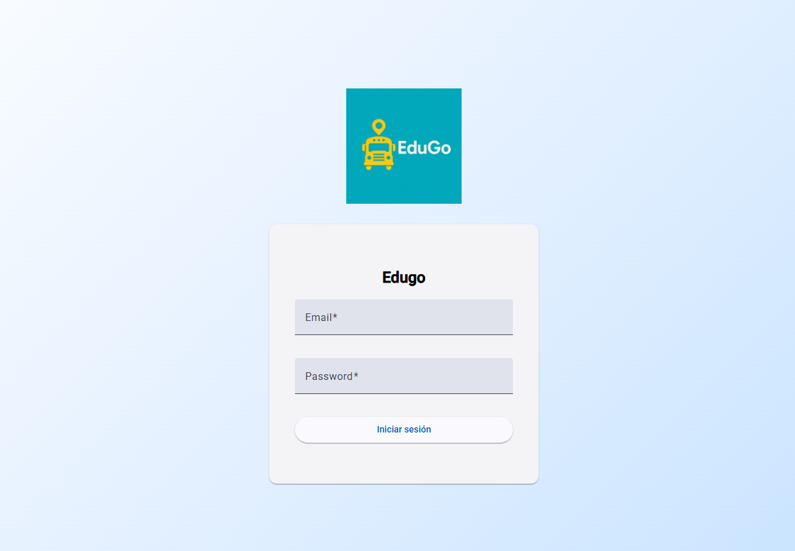  
Enlace al front: https://edugo-frontend.web.app/sign-in
 
**Para el Backend**  
Visualización del back desplegado correctamente.  
  
Enlace al backend: https://rb.gy/3ezqme
 
 
**Para el AppMovil**  
Capturas de la aplicación móvil en funcionamiento, mostrando la interfaz para padres y funcionalidades clave.
 
  
  
  
  
  

**Para el Embedded**  
Evidencia del sistema embebido funcional, ejecutado en simulador Wokwi.
 
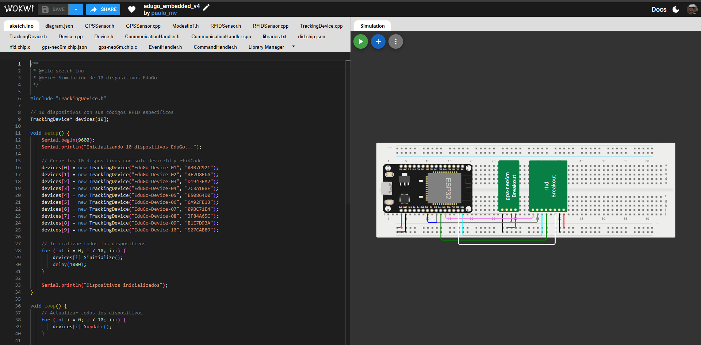  
Enlace al wowki: https://wokwi.com/projects/435410335813464065  
Video demostración dispositivo IoT: https://acortar.link/scHIKJ

#### 6.5.7. Services Documentation Evidence for Sprint Review.

Durante este ultimo Sprint, se llevó a cabo cambios y mejoras para los servicios del proyecto utilizando el estándar OpenAPI. Como resultado, se logró completar y mejorar el backend con éxito, incluyendo la definición detallada de los Endpoints que conforman la funcionalidad integral de la aplicación web, app movil y edge server.  

Visualización del backend desplegado correctamente, con acceso a la documentación Swagger.  
  
Enlace al backend: https://rb.gy/3ezqme
 

La siguiente tabla muestra la relación de los Endpoints documentados, las acciones implementadas, los verbos HTTP utilizados y los enlaces a la documentación correspondiente. Para cada acción, se especifican la sintaxis de llamada, los posibles parámetros, ejemplos de requests/responses y una explicación detallada.

### SensorScan

Documenta los servicios para registrar, consultar y eliminar escaneos de pulseras RFID, asegurando el control de acceso de estudiantes.

| Endpoint                                     | Acción                                 | Verbo HTTP | Parámetros                                                              | Ejemplo de Response                                                                                                                                                                           |
| -------------------------------------------- | -------------------------------------- | ---------- | ----------------------------------------------------------------------- | --------------------------------------------------------------------------------------------------------------------------------------------------------------------------------------------- |
| /api/v1/sensor-scans                         | Crear un nuevo escaneo de pulsera      | POST       | Request Body: { "scanType": "ENTRY", "wristbandId": 12, "tripId": 102 } | { "id": 48, "scanTime": "2025-07-05T08:30:00.000Z", "scanType": "ENTRY", "wristbandId": 12 }                                                                                                  |
| /api/v1/sensor-scans/{id}                    | Obtener escaneo por ID                 | GET        | Path Parameter: id (integer)                                            | { "id": 48, "scanTime": "2025-07-05T08:30:00.000Z", "scanType": "ENTRY", "wristbandId": 12 }                                                                                                  |
| /api/v1/sensor-scans/{id}                    | Eliminar escaneo por ID                | DELETE     | Path Parameter: id (integer)                                            | 200 OK (sin contenido)                                                                                                                                                                        |
| /api/v1/sensor-scans/wristband/{wristbandId} | Obtener escaneos por ID de pulsera     | GET        | Path Parameter: wristbandId (integer)                                   | [ { "id": 48, "scanTime": "2025-07-05T08:30:00.000Z", "scanType": "ENTRY", "wristbandId": 12 }, { "id": 49, "scanTime": "2025-07-05T15:45:00.000Z", "scanType": "EXIT", "wristbandId": 12 } ] |
| /api/v1/sensor-scans                         | Obtener todos los escaneos registrados | GET        | Sin parámetros                                                          | [ { "id": 48, "scanTime": "2025-07-05T08:30:00.000Z", "scanType": "ENTRY", "wristbandId": 12 }, { "id": 49, "scanTime": "2025-07-05T15:45:00.000Z", "scanType": "EXIT", "wristbandId": 12 } ] |

### Students

Incluye los endpoints para gestionar la información de estudiantes: creación, consulta individual y por conductor, y eliminación.

| Endpoint                                  | Acción                                  | Verbo HTTP | Parámetros                                                                                                                                                                                                                    | Ejemplo de Response                                                                                                                                                                                                                                                                                                                           |
| ----------------------------------------- | --------------------------------------- | ---------- | ----------------------------------------------------------------------------------------------------------------------------------------------------------------------------------------------------------------------------- | --------------------------------------------------------------------------------------------------------------------------------------------------------------------------------------------------------------------------------------------------------------------------------------------------------------------------------------------- |
| /api/v1/students                          | Crear un nuevo estudiante               | POST       | Request Body: { "name": "Lucía", "lastName": "Ramírez", "homeAddress": "Av. Los Álamos 123", "schoolAddress": "Colegio San José", "studentPhotoUrl": "https://edugo.com/img/lucia.jpg", "parentProfileId": 5, "driverId": 8 } | { "id": 21, "name": "Lucía", "lastName": "Ramírez", "homeAddress": "Av. Los Álamos 123", "schoolAddress": "Colegio San José", "studentPhotoUrl": "https://edugo.com/img/lucia.jpg", "wristband": null, "parentProfile": { "id": 5, "fullName": "Jorge Ramírez" }, "driverId": 8 }                                                             |
| /api/v1/students/{id}                     | Obtener estudiante por ID               | GET        | Path Parameter: id (integer)                                                                                                                                                                                                  | { "id": 21, "name": "Lucía", "lastName": "Ramírez", "homeAddress": "Av. Los Álamos 123", "schoolAddress": "Colegio San José", "studentPhotoUrl": "https://edugo.com/img/lucia.jpg", "wristband": { "id": 7, "rfidCode": "ABC12345", "wristbandStatus": "ACTIVE" }, "parentProfile": { "id": 5, "fullName": "Jorge Ramírez" }, "driverId": 8 } |
| /api/v1/students/{id}                     | Eliminar estudiante por ID              | DELETE     | Path Parameter: id (integer)                                                                                                                                                                                                  | Respuesta: 200 OK (sin contenido)                                                                                                                                                                                                                                                                                                             |
| /api/v1/students                          | Obtener todos los estudiantes           | GET        | Sin parámetros                                                                                                                                                                                                                | [ { "id": 21, "name": "Lucía", "lastName": "Ramírez", "homeAddress": "Av. Los Álamos 123", "schoolAddress": "Colegio San José", "studentPhotoUrl": "https://edugo.com/img/lucia.jpg", "driverId": 8 } ]                                                                                                                                       |
| /api/v1/students/driver/{driverProfileId} | Obtener estudiantes por ID de conductor | GET        | Path Parameter: driverProfileId (integer)                                                                                                                                                                                     | [ { "id": 21, "name": "Lucía", "lastName": "Ramírez", "homeAddress": "Av. Los Álamos 123", "schoolAddress": "Colegio San José", "studentPhotoUrl": "https://edugo.com/img/lucia.jpg", "driverId": 8 } ]                                                                                                                                       |

### Authentication

Define los servicios de registro e inicio de sesión de usuarios con autenticación segura mediante JWT.

| Endpoint                       | Acción                     | Verbo HTTP | Parámetros                                                                                | Ejemplo de Response                                                                        |
| ------------------------------ | -------------------------- | ---------- | ----------------------------------------------------------------------------------------- | ------------------------------------------------------------------------------------------ |
| /api/v1/authentication/sign-up | Registrar un nuevo usuario | POST       | Request Body: { "username": "juanperez", "password": "MiClave123!", "roles": ["PARENT"] } | { "id": 101, "username": "juanperez", "roles": ["PARENT"] }                                |
| /api/v1/authentication/sign-in | Iniciar sesión             | POST       | Request Body: { "username": "juanperez", "password": "MiClave123!" }                      | { "id": 101, "username": "juanperez", "token": "eyJhbGciOiJIUzI1NiIsInR5cCI6IkpXVCJ9..." } |

### Trip Management

Describe los servicios para iniciar, finalizar, consultar y gestionar viajes y la asistencia de estudiantes durante los trayectos.

| Endpoint                                    | Acción                                     | Verbo HTTP | Parámetros                                                                                   | Ejemplo de Response                                                                                                                                                                                                                                                 |
| ------------------------------------------- | ------------------------------------------ | ---------- | -------------------------------------------------------------------------------------------- | ------------------------------------------------------------------------------------------------------------------------------------------------------------------------------------------------------------------------------------------------------------------- |
| /api/v1/trips/start                         | Iniciar un viaje                           | PUT        | Request Body: { "tripId": 0 }                                                                | { "id": 0, "driverId": 0, "capacity": 0, "status": "string" }                                                                                                                                                                                                       |
| /api/v1/trips/end                           | Finalizar un viaje                         | PUT        | Request Body: { "tripId": 0 }                                                                | Respuesta: 200 OK                                                                                                                                                                                                                                                   |
| /api/v1/trips                               | Obtener todos los viajes                   | GET        | Sin parámetros                                                                               | [ { "id": 0, "vehicleId": 0, "driverId": 0, "origin": "string", "destination": "string", "startTime": "2025-07-05T03:38:52.255Z", "endTime": "2025-07-05T03:38:52.255Z" } ]                                                                                         |
| /api/v1/trips                               | Crear un nuevo viaje                       | POST       | Request Body: { "vehicleId": 0, "driverId": 0, "origin": "string", "destination": "string" } | { "id": 0, "vehicleId": 0, "driverId": 0, "origin": "string", "destination": "string", "startTime": "2025-07-05T03:38:52.257Z", "endTime": "2025-07-05T03:38:52.257Z" }                                                                                             |
| /api/v1/trips/trip-students                 | Registrar estudiante en un viaje           | POST       | Request Body: { "tripId": 0, "studentId": 0 }                                                | { "id": 0, "student": { "id": 0, "name": "string", "lastName": "string", "homeAddress": "string", "schoolAddress": "string", "studentPhotoUrl": "string" }, "attended": true, "boardedAt": "2025-07-05T03:38:52.258Z", "exitedAt": "2025-07-05T03:38:52.258Z" }     |
| /api/v1/trips/{tripId}/students             | Obtener estudiantes de un viaje            | GET        | Path Parameter: tripId (integer)                                                             | [ { "id": 0, "student": { "id": 0, "name": "string", "lastName": "string", "homeAddress": "string", "schoolAddress": "string", "studentPhotoUrl": "string" }, "attended": true, "boardedAt": "2025-07-05T03:38:52.260Z", "exitedAt": "2025-07-05T03:38:52.260Z" } ] |
| /api/v1/trips/{tripId}/students/{studentId} | Obtener datos de un estudiante en un viaje | GET        | Path Parameters: tripId (integer), studentId (integer)                                       | { "id": 0, "student": { "id": 0, "name": "string", "lastName": "string", "homeAddress": "string", "schoolAddress": "string", "studentPhotoUrl": "string" }, "attended": true, "boardedAt": "2025-07-05T03:38:52.263Z", "exitedAt": "2025-07-05T03:38:52.263Z" }     |
| /api/v1/trips/{id}                          | Obtener viaje por ID                       | GET        | Path Parameter: id (integer)                                                                 | { "id": 0, "vehicleId": 0, "driverId": 0, "origin": "string", "destination": "string", "startTime": "2025-07-05T03:38:52.265Z", "endTime": "2025-07-05T03:38:52.265Z" }                                                                                             |
| /api/v1/trips/{id}                          | Eliminar viaje por ID                      | DELETE     | Path Parameter: id (integer)                                                                 | Respuesta: 200 OK                                                                                                                                                                                                                                                   |
| /api/v1/trips/completed                     | Obtener viajes completados                 | GET        | Sin parámetros                                                                               | [ { "id": 0, "vehicleId": 0, "driverId": 0, "origin": "string", "destination": "string", "startTime": "2025-07-05T03:38:52.267Z", "endTime": "2025-07-05T03:38:52.267Z" } ]                                                                                         |
| /api/v1/trips/completed/driver/{driverId}   | Obtener viajes completados por conductor   | GET        | Path Parameter: driverId (integer)                                                           | [ { "id": 0, "vehicleId": 0, "driverId": 0, "origin": "string", "destination": "string", "startTime": "2025-07-05T03:38:52.268Z", "endTime": "2025-07-05T03:38:52.268Z" } ]                                                                                         |
| /api/v1/trips/active/driver/{driverId}      | Obtener viaje activo por conductor         | GET        | Path Parameter: driverId (integer)                                                           | [ { "id": 0, "startTime": "2025-07-05T03:38:52.269Z", "students": [ { "id": 0, "name": "string", "lastName": "string", "homeAddress": "string", "schoolAddress": "string", "studentPhotoUrl": "string" } ] } ]                                                      |

### Vehicle Management

Contiene los endpoints para registrar vehículos, consultar información y obtener ubicaciones en tiempo real asociadas a estudiantes.

| Endpoint                                                       | Acción                                              | Verbo HTTP | Parámetros                                     | Ejemplo de Response                                               |
| -------------------------------------------------------------- | --------------------------------------------------- | ---------- | ---------------------------------------------- | ----------------------------------------------------------------- |
| /api/v1/vehicles                                               | Obtener todos los vehículos                         | GET        | Sin parámetros                                 | [ { "id": 0, "driverId": 0, "capacity": 0, "status": "string" } ] |
| /api/v1/vehicles                                               | Registrar un nuevo vehículo                         | POST       | Request Body: { "driverId": 0, "capacity": 0 } | { "id": 0, "driverId": 0, "capacity": 0, "status": "string" }     |
| /api/v1/vehicles/students/{studentId}/current-vehicle-location | Obtener ubicación actual del vehículo de estudiante | GET        | Path Parameter: studentId (integer)            | {}                                                                |

### Profiles

Documenta la creación, consulta y filtrado de perfiles de usuario por ID o rol, facilitando la administración de roles.

| Endpoint                               | Acción                           | Verbo HTTP | Parámetros                                                                                                                                         | Ejemplo de Response                                                                                                                                                              |
| -------------------------------------- | -------------------------------- | ---------- | -------------------------------------------------------------------------------------------------------------------------------------------------- | -------------------------------------------------------------------------------------------------------------------------------------------------------------------------------- |
| /api/v1/profiles                       | Obtener todos los perfiles       | GET        | Sin parámetros                                                                                                                                     | [ { "id": 0, "userId": 0, "fullName": "string", "email": "string", "mobileNumber": "string", "address": "string", "gender": "string", "photoUrl": "string", "role": "string" } ] |
| /api/v1/profiles                       | Crear un nuevo perfil            | POST       | Request Body: { "fullName": "string", "email": "string", "mobileNumber": "string", "address": "string", "gender": "string", "photoUrl": "string" } | { "id": 0, "userId": 0, "fullName": "string", "email": "string", "mobileNumber": "string", "address": "string", "gender": "string", "photoUrl": "string", "role": "string" }     |
| /api/v1/profiles/user/{userId}         | Obtener perfil por ID de usuario | GET        | Path Parameters: userId (integer)                                                                                                                  | { "id": 0, "userId": 0, "fullName": "string", "email": "string", "mobileNumber": "string", "address": "string", "gender": "string", "photoUrl": "string", "role": "string" }     |
| /api/v1/profiles/role/{role}           | Obtener perfiles por rol         | GET        | Path Parameters: role (string)                                                                                                                     | [ { "id": 0, "userId": 0, "fullName": "string", "email": "string", "mobileNumber": "string", "address": "string", "gender": "string", "photoUrl": "string", "role": "string" } ] |
| /api/v1/profiles/profileId/{profileId} | Obtener perfil por ID de perfil  | GET        | Path Parameters: profileId (integer)                                                                                                               | { "id": 0, "userId": 0, "fullName": "string", "email": "string", "mobileNumber": "string", "address": "string", "gender": "string", "photoUrl": "string", "role": "string" }     |

### Notification

Presenta los servicios para crear y consultar notificaciones automáticas según usuario, tipo de evento o ID.

| Endpoint                                                   | Acción                                     | Verbo HTTP | Parámetros                                                                                                                       | Ejemplo de Response                                                                                                                                                                                               |
| ---------------------------------------------------------- | ------------------------------------------ | ---------- | -------------------------------------------------------------------------------------------------------------------------------- | ----------------------------------------------------------------------------------------------------------------------------------------------------------------------------------------------------------------- |
| /api/v1/notifications                                      | Obtener todas las notificaciones           | GET        | Sin parámetros                                                                                                                   | [ { "id": 0, "message": "string", "status": "string", "userType": "string", "userId": 0, "eventType": "string", "description": "string", "timestamp": "2025-06-22T05:08:00.639Z", "tripId": 0, "studentId": 0 } ] |
| /api/v1/notifications                                      | Crear una nueva notificación               | POST       | Request Body: { "eventType": "string", "description": "string", "userType": "string", "userId": 0, "tripId": 0, "studentId": 0 } | { "id": 0, "message": "string", "status": "string", "userType": "string", "userId": 0, "eventType": "string", "description": "string", "timestamp": "2025-06-22T05:08:00.641Z", "tripId": 0, "studentId": 0 }     |
| /api/v1/notifications/user-type/{notificationsForUserType} | Obtener notificaciones por tipo de usuario | GET        | Path Parameters: notificationsForUserType (string)                                                                               | [ { "id": 0, "message": "string", "status": "string", "userType": "string", "userId": 0, "eventType": "string", "description": "string", "timestamp": "2025-06-22T05:08:00.642Z", "tripId": 0, "studentId": 0 } ] |
| /api/v1/notifications/user-id/{notificationsForUserId}     | Obtener notificaciones por ID de usuario   | GET        | Path Parameters: notificationsForUserId (integer)                                                                                | [ { "id": 0, "message": "string", "status": "string", "userType": "string", "userId": 0, "eventType": "string", "description": "string", "timestamp": "2025-06-22T05:08:00.644Z", "tripId": 0, "studentId": 0 } ] |

### Wristband

Incluye los servicios para administrar pulseras RFID: registrar, consultar por ID, estado o código RFID y eliminar registros.

| Endpoint                               | Acción                                | Verbo HTTP | Parámetros                                                                       | Ejemplo de Response                                                                                                                                                                                                                                                                                                                |
| -------------------------------------- | ------------------------------------- | ---------- | -------------------------------------------------------------------------------- | ---------------------------------------------------------------------------------------------------------------------------------------------------------------------------------------------------------------------------------------------------------------------------------------------------------------------------------- |
| /api/v1/wristbands                     | Obtener todas las pulseras            | GET        | Ninguno                                                                          | [ { "id": 0, "rfidCode": "string", "wristbandStatus": "ACTIVE", "student": { "id": 0, "name": "string", "lastName": "string", "homeAddress": "string", "schoolAddress": "string", "studentPhotoUrl": "string" }, "sensorScans": [ { "id": 0, "scanTime": "2025-07-05T03:43:31.737Z", "scanType": "ENTRY", "wristbandId": 0 } ] } ] |
| /api/v1/wristbands                     | Crear una nueva pulsera               | POST       | Body JSON: { "rfidCode": "string", "wristbandStatus": "string", "studentId": 0 } | [ { "id": 0, "rfidCode": "string", "wristbandStatus": "ACTIVE", "student": { "id": 0, "name": "string", "lastName": "string", "homeAddress": "string", "schoolAddress": "string", "studentPhotoUrl": "string" }, "sensorScans": [ { "id": 0, "scanTime": "2025-07-05T03:43:31.739Z", "scanType": "ENTRY", "wristbandId": 0 } ] } ] |
| /api/v1/wristbands/{id}                | Obtener pulsera por ID                | GET        | Path: id (entero)                                                                | { "id": 0, "rfidCode": "string", "wristbandStatus": "ACTIVE", "student": { "id": 0, "name": "string", "lastName": "string", "homeAddress": "string", "schoolAddress": "string", "studentPhotoUrl": "string" }, "sensorScans": [ { "id": 0, "scanTime": "2025-07-05T03:43:31.741Z", "scanType": "ENTRY", "wristbandId": 0 } ] }     |
| /api/v1/wristbands/{id}                | Eliminar pulsera por ID               | DELETE     | Path: id (entero)                                                                | 200 OK                                                                                                                                                                                                                                                                                                                             |
| /api/v1/wristbands/student/{studentId} | Obtener pulseras por ID de estudiante | GET        | Path: studentId (entero)                                                         | [ { "id": 0, "rfidCode": "string", "wristbandStatus": "ACTIVE", "student": { "id": 0, "name": "string", "lastName": "string", "homeAddress": "string", "schoolAddress": "string", "studentPhotoUrl": "string" }, "sensorScans": [ { "id": 0, "scanTime": "2025-07-05T03:43:31.743Z", "scanType": "ENTRY", "wristbandId": 0 } ] } ] |
| /api/v1/wristbands/status/{status}     | Obtener pulseras por estado           | GET        | Path: status (string)                                                            | [ { "id": 0, "rfidCode": "string", "wristbandStatus": "ACTIVE", "student": { "id": 0, "name": "string", "lastName": "string", "homeAddress": "string", "schoolAddress": "string", "studentPhotoUrl": "string" }, "sensorScans": [ { "id": 0, "scanTime": "2025-07-05T03:43:31.745Z", "scanType": "ENTRY", "wristbandId": 0 } ] } ] |
| /api/v1/wristbands/rfid/{rfidCode}     | Obtener pulsera por código RFID       | GET        | Path: rfidCode (string)                                                          | { "id": 0, "rfidCode": "string", "wristbandStatus": "ACTIVE", "student": { "id": 0, "name": "string", "lastName": "string", "homeAddress": "string", "schoolAddress": "string", "studentPhotoUrl": "string" }, "sensorScans": [ { "id": 0, "scanTime": "2025-07-05T03:43:31.747Z", "scanType": "ENTRY", "wristbandId": 0 } ] }     |

### Location Management

Reúne los endpoints para registrar ubicaciones, consultar historiales por viaje y obtener posiciones actuales de vehículos.

| Endpoint                                 | Acción                                       | Verbo HTTP | Parámetros                                                                                                                     | Ejemplo de Response                                                        |
| ---------------------------------------- | -------------------------------------------- | ---------- | ------------------------------------------------------------------------------------------------------------------------------ | -------------------------------------------------------------------------- |
| /api/v1/locations                        | Obtener todas las ubicaciones registradas    | GET        | Ninguno                                                                                                                        | [ { "id": 0, "vehicleId": 0, "latitude": 0, "longitude": 0, "speed": 0 } ] |
| /api/v1/locations                        | Registrar una nueva ubicación                | POST       | Body JSON: { "vehicleId": 0, "tripId": 0, "latitude": 0, "longitude": 0, "speed": 0, "timestamp": "2025-07-05T03:50:22.043Z" } | { "id": 0, "vehicleId": 0, "latitude": 0, "longitude": 0, "speed": 0 }     |
| /api/v1/locations/trip/{tripId}          | Obtener historial de ubicaciones de un viaje | GET        | Path: tripId (entero)                                                                                                          | [ { "id": 0, "vehicleId": 0, "latitude": 0, "longitude": 0, "speed": 0 } ] |
| /api/v1/locations/current?vehicleId={id} | Obtener ubicación actual de un vehículo      | GET        | Query: vehicleId (entero)                                                                                                      | { "id": 0, "vehicleId": 0, "latitude": 0, "longitude": 0, "speed": 0 }     |

### Users

Muestra los servicios para listar todos los usuarios y consultar información detallada por ID.

| Endpoint           | Acción                     | Verbo HTTP | Parámetros        | Ejemplo de Response                                                                                                                      |
| ------------------ | -------------------------- | ---------- | ----------------- | ---------------------------------------------------------------------------------------------------------------------------------------- |
| /api/v1/users      | Obtener todos los usuarios | GET        | Sin parámetros    | [ { "id": 1, "username": "admin_user", "roles": [ "ADMIN", "USER" ] }, { "id": 2, "username": "student_john", "roles": [ "STUDENT" ] } ] |
| /api/v1/users/{id} | Obtener usuario por ID     | GET        | Path: id (entero) | { "id": 1, "username": "admin_user", "roles": [ "ADMIN", "USER" ] }                                                                      |

### Analytics

Define los servicios para registrar datos de conducción, consultar historiales y generar dashboards semanales por conductor.

| Endpoint                            | Acción                                    | Verbo HTTP | Parámetros                                                                                                                                                                        | Ejemplo de Response                                                                                                                                                                                                                                                                                                |
| ----------------------------------- | ----------------------------------------- | ---------- | --------------------------------------------------------------------------------------------------------------------------------------------------------------------------------- | ------------------------------------------------------------------------------------------------------------------------------------------------------------------------------------------------------------------------------------------------------------------------------------------------------------------ |
| /api/analytics                      | Registrar analítica de conducción         | POST       | Body JSON: { "driverUserId": 0, "date": "2025-06-05", "arrivalTimeAtSchool": "07:30", "returnTimeHome": "15:45", "speed": 0, "detour": true, "lateness": true, "speeding": true } | { "id": 0, "driverUserId": 0, "date": "2025-06-05", "arrivalTimeAtSchool": "07:30", "returnTimeHome": "15:45", "speed": 0, "incident": { "detour": true, "lateness": true, "speeding": true } }                                                                                                                    |
| /api/analytics/logs                 | Obtener historial de analíticas           | GET        | Sin parámetros                                                                                                                                                                    | [ { "id": 0, "driverUserId": 0, "date": "2025-06-05", "arrivalTimeAtSchool": "07:30", "returnTimeHome": "15:45", "speed": 0, "incident": { "detour": true, "lateness": true, "speeding": true } } ]                                                                                                                |
| /api/analytics/dashboard/{driverId} | Obtener resumen semanal para un conductor | GET        | Path: driverId (entero)                                                                                                                                                           | { "driverUserId": 0, "week": "2025-W23", "speedPerDay": [ { "day": "Monday", "averageSpeed": 35 }, { "day": "Tuesday", "averageSpeed": 40 } ], "arrivalTimes": [ { "day": "Monday", "time": "07:28" }, { "day": "Tuesday", "time": "07:35" } ], "incidentSummary": { "detour": 1, "lateness": 2, "speeding": 3 } } |

#### 6.5.8. Software Deployment Evidence for Sprint Review.

Para el ultimo sprint presentado del Backend,AppMovil,EdgeServer y Embedded se optó por el uso de las misma herramientas de desarrollo.

- _Git_: Se utilizó para el control de versiones del código fuente.
- _GitFlow_: Se utilizó para ver el avance de los integrantes del equipo.
- _GitHub_: Se utilizó para crear el repositorio del Backend,AppMovil,EdgeServer y Embedded, donde se subió el código fuente.
- _GitHub Pages_: Es la plataforma donde se desplegó el Backend,AppMovil,EdgeServer y Embedded. Se eligió por ser una solución gratuita, rápida y sencilla que permite publicar directamente desde el repositorio de GitHub.
- _Android Studio_: Se utilizó para el desarrollo de la aplicación móvil nativa, permitiendo diseñar y programar funcionalidades específicas para dispositivos Android.
- _Wokwi_: Se empleó para la creación y simulación del sistema embebido, facilitando el desarrollo y prueba del código para el hardware sin necesidad de componentes físicos.
- _CLion_: Se utilizó para el desarrollo de la lógica del servidor Edge, permitiendo implementar y depurar el software en C++ con integración a herramientas embebidas.

**Despliegue del Backend** 
Para este Sprint se desplego la aplicacion Backend en heroku, el despliegue de este producto permite el acceso y modificacion de la informacion en la base de datos.

#### 6.5.9. Team Collaboration Insights during Sprint.

Para esta sección del documentos, añadimos los insights realizados durante el sprint, tanto de la realización y mejoras del backend,app movil,edge server y embedded :

Insights del FrontEnd, donde se muestran los commits realizados al repositorio en el ultimo mes

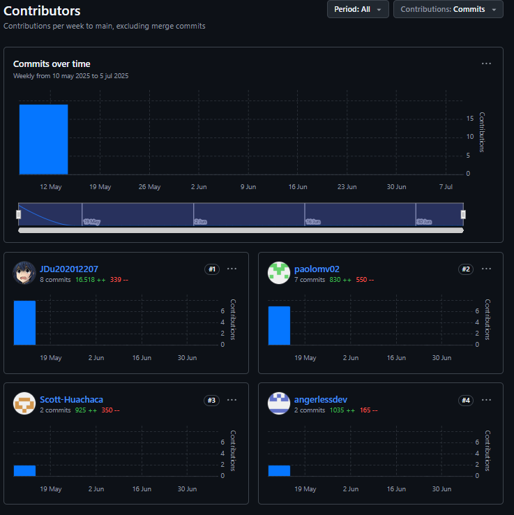
 

Insights del AppMovil, donde se muestran los commits realizados al repositorio en el ultimo mes

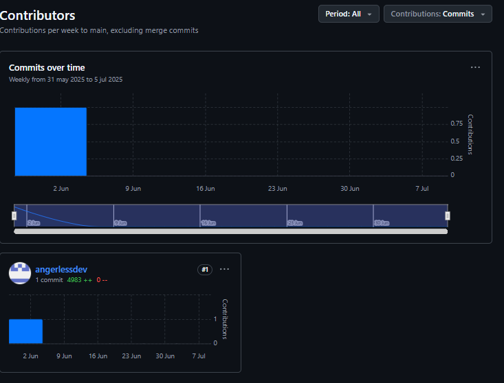
 

Insights del Backend, donde se muestran los commits realizados al repositorio en el ultimo mes

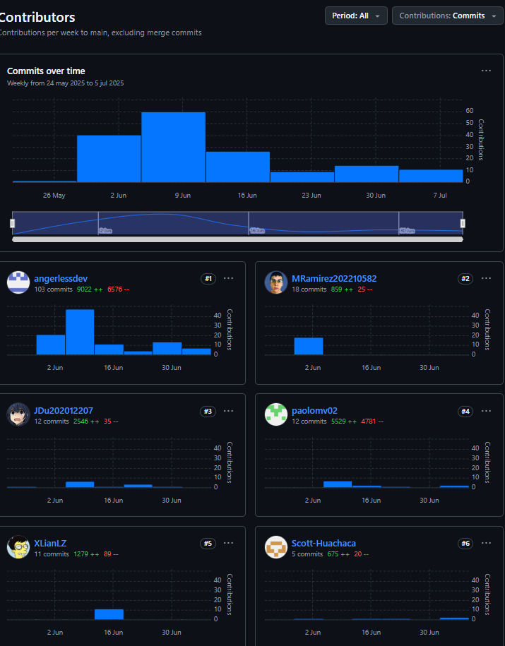
 

Insights del EdgeServer, donde se muestran los commits realizados al repositorio en el ultimo mes

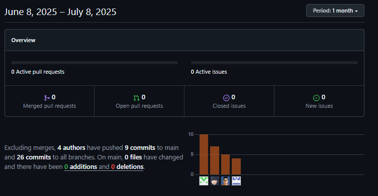
 

Insights del Embedded, donde se muestran los commits realizados al repositorio en el ultimo mes

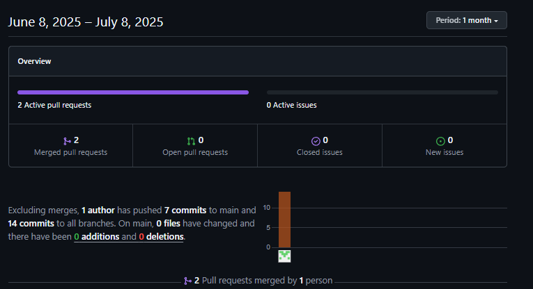
